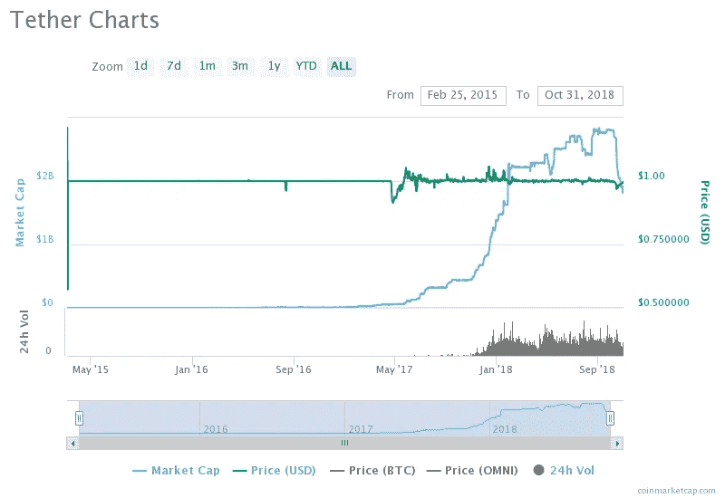
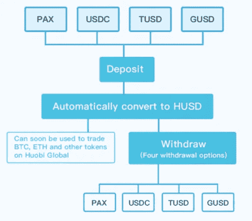

# Crypto 的小黑裙:Stablecoins(上)

> 原文：<https://medium.datadriveninvestor.com/the-little-black-dress-of-crypto-stablecoins-part-1-cb8f10d29a8?source=collection_archive---------8----------------------->

加密货币市场最近几个月的动荡和不稳定启发了加密货币的作者设计和部署了许多工具，旨在抑制加密市场的波动并保持价格稳定。在这些稳定资产的设计中有创造力——在资产如何发行的方式和应该保持其价格稳定的机制方面。本系列旨在识别和描述一些概念，对“加密精神”特别感兴趣——分散化和稳定性的消耗。大约有 60 个预发布或正在进行的项目(这个数字每天都在增加)似乎稳定币正在成为加密货币市场的一部分，就像一件小黑裙对于一个女人一样。

Image retrieved from [Clipart Library](http://clipart-library.com/)

对 stablecoin 项目(包括现场项目和处于不同预发布阶段的项目)的深入研究表明，在实现 stablecoin 价格稳定性方面，有几种设计方法。每种不同的方法都有一定的代价——这反映在新硬币的管理方法以及发行和维护它的实际财务成本上。

就实现价格稳定的方法而言，可以确定以下类型的稳定商品:

*   由法定货币支持的加密货币
*   交易所交易商品支持的加密货币
*   加密货币支持的加密货币
*   算法/铸币税稳定账户，以及
*   系留加密货币资产

鉴于菲亚特支持的加密货币是目前最受欢迎的稳定货币，本系列的第一部分将专门介绍它们。

## 菲亚特支持 stablecoins

法定支持的加密货币是最古老和最常见的稳定货币类型。它们最重要的特征是由固定比率的法定货币(通常是美元、欧元和瑞士法郎)支持。挂钩是在链外实现的，通过将维持挂钩所需的法定货币数量(即稳定的价格)存放在银行或其他类型的受监管金融机构。这种稳定货币的主要风险是支持法定货币的价值损失。由于治理高度集中，对发行人和保管人的信任也是维持价格稳定的一个重要因素。

根据定义，stablecoins 不是投资工具，因此用途有限——大多数发行者的目标是机构投资者，他们不在乎满足合规要求，希望使用加密空间作为绕过传统银行系统的手段，以更低的延迟和费用执行法定交易。

法定支持稳定货币是根据存放在发行人处的支持货币的金额发行的，其流通供应量应始终反映指定托管人持有的法定存款金额。大多数发行者通过向需要稳定币的持有人支付其支持法定货币的价值来保证稳定币的赎回，这些持有人愿意接受监管机构要求的 KYC/反洗钱程序。

这些 stablecoins 在一些加密交易所交易，也由经营它们的商业实体发行(如比特币基地和 Circle 发行的比特币基地/波洛涅克斯——USDC，或 Tether 发行的 Bitfinex——USDT)。

## 系绳争议

如果不提到最初的稳定币——USD Tether(USDT ),就不可能考虑菲亚特支持的 cryptos。它从 2014 年开始存在，从 2015 年开始交易。尽管发行人有义务对其拥有的存款支持菲亚特的数量进行定期审计，但管理系绳的企业未能做到这一点。它最接近被“审计”的一次是发布了一份法律公司 [Freeh，Sporkin & Sullivan LLP](https://tether.to/fss-report-transparency-update/) 的声明，该公司在 2018 年 6 月 1 日确实有足够的美元存在未披露银行的两个账户中，以支持 USDT 代币的流通供应。该报告中也给出了这充其量是一次“审计”的原因——在“关于业务约定范围的进一步细节”部分——FSS·LLP 不是一家会计事务所，也没有使用公认会计原则编制报告，因此，该报告不符合公认审计标准。众所周知，秘密媒体对所有发生在联系汇率上的事情进行了密集报道，这就很奇怪了，USDT 在维持其与美元的联系汇率上没有遇到什么问题。除了几次低于挂钩价值的更强推动，USDT 还没有因为稳定币或其管理实体的估价缺乏透明度而受到加密市场的相当大的制裁(这本身是加密货币市场的一种异常现象，不在本文的范围之内)。

USDT Market capitalization and price historic values. Source: [CoinMarketCap](https://coinmarketcap.com/currencies/tether/)

在 10 月(1 日至 31 日)期间，USDT 的市值减少了 31.42%，而发行者“烧掉”了约 5 亿 USDT 代币，从而减少了流通供应量。这一举动可能表明，由同级别的新 stablecoins 所代表的竞争正在抢占他们的市场份额，或者是 Tether 正在准备实际的审计。

## 治理和监管

由于菲亚特支持的 stablecoins 的设计，它们的治理高度集中，并依赖于信任。Paxos Standard 更进一步，引入了第三方执法干预 PAX 币流通供应的可能性，可以冻结甚至没收账户中的 PAX 币。根据 PAX 发行者的声明，这是为了[“保持代币 KYC 友好”](https://siliconangle.com/2018/09/20/prominent-stablecoin-found-backdoor-allows-tokens-seized/)。

在一般情况下，这类密码的规则并不延伸到交易所中稳定密码的使用。只有当代币持有人使用法定货币(从发行人处)购买代币或兑换代币时，才需要 KYC/反洗钱程序。

在这种情况下，除了法定存款成本之外，维持法定存款价格稳定的成本还包括经营合法业务的成本。

## 霍比稳定溶液

10 月中旬，第三大加密货币交易所火币宣布推出他们自己的“稳定货币解决方案”third。HUSD 可以通过将四个支持的 stablecoins 中的任何一个存入 Huobi 来获得:PAX、USDC、TUSD 或 GUSD，它们会自动转换为 HUSD。HUSD 可以在其本地交易所交易 BTC、ETH 和 Huobi Global 上提供的其他密码。当客户希望从 HUSD 提款时，他们可以从四个账户中选择一个存入账户:帕克斯、USDC、TUSD 或 GUSD。HUSD 对这四种稳定币的比价是 1:1(对于 1 笔存入的 PAX，客户获得 1 HUSD，他们可以在以后提取，因为 1 GUSD-Houbi Global 费用适用于所有交易)。这个解决方案的另一个奇怪之处是 USDT(系绳)将与 HUSD 交易。

[Image obtained from Huobi HUSD announcement](https://huobiglobal.zendesk.com/hc/en-us/articles/360000170601-Announcement-on-Launching-HUSD-solution-on-Huobi-Global)

关于 HUSD 的问题，就本文介绍的稳定货币的分类而言，是 HUSD 是法定支持的加密货币还是加密货币支持的加密货币。最好的答案可能是——两者皆是。法律上的*由用于获得 HUSD 的四种稳定债券支持，而事实上的*由上述四种稳定债券发行人持有的美元存款支持。**

当存入的稳定币和用户希望提取的稳定币的值不完全匹配时，这种解决方案可能会引入这种情况，这种情况的处理将是一个有趣的话题。

法定支持的加密货币与标志性的 Satoshi 论文中宣称的区块链-加密货币范式的价值观相去甚远:它们既不是分散的，也不是不可信的。作为对集中化和信任期望的交换，历史上他们还没有给予透明度和完全的合规性和披露。

现在，USDT 已经在 GUSD、TUSD、CUSD 和 PAX 遇到了一些竞争——所有这些国家都以同样的方式运营(CUSD 计划在未来转向算法价格目标)，加密货币市场应该能够通过这类稳定货币的发行者及时、勤奋和透明地披露相关信息来获得一些新的价值，然后我们可以称之为某种程度上的公平交易。

*本文表达的观点不是投资建议，也不是推荐。本文包含的事实不一定完整，本文的读者应该在投资前做好自己的尽职调查，包括寻求独立的财务建议。这篇文章不是一个要约，也不是要约邀请，购买或出售这里提到的任何资产。*

这篇文章的文本可以在[爆发区块链](https://www.burst-coin.org/download-wallet)上获得，并且可以使用 CLOUD-V286-YD8Z-6EWH-3JT6A [爆发 ID](https://burstwiki.org/wiki/Burst_Software#CloudBurst) 进行检索。