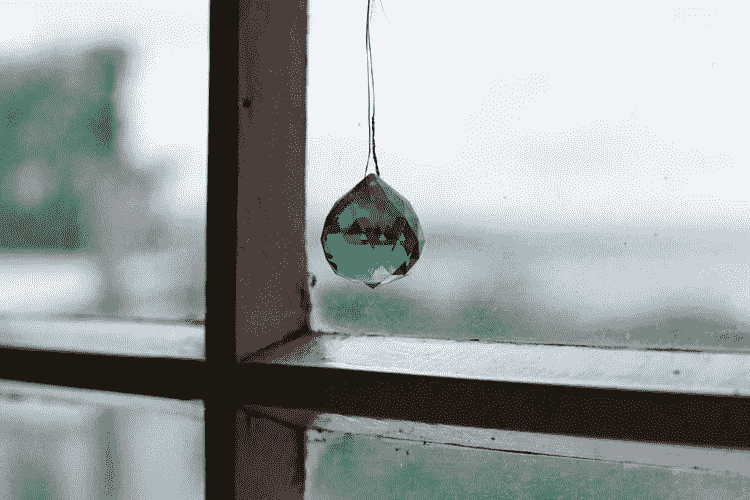

# 对哥伦比亚祖母绿的渴望依然强烈

> 原文：<https://medium.datadriveninvestor.com/the-lust-for-colombian-emeralds-continues-to-remain-strong-d272fedb5382?source=collection_archive---------2----------------------->

哥伦比亚的翡翠产业很强大，有着悠久的历史和令人自豪的传统。祖母绿被认为是该国的国家象征之一，其历史可以追溯到 16 世纪晚期，今天，哥伦比亚祖母绿行业对于有合适经验的企业家来说是最难以捉摸但利润丰厚的行业之一，他们可以利用这种最具视觉冲击力和利润最大的自然资源来实现各种目的，无论是在采矿、旅游还是消费品领域。考虑到祖母绿可以卖到每克拉 9 万美元的价格，企业家们涌向该地区的原因就显而易见了。

 [## 2019 年需要关注的 20 个数字营销趋势和技术——数据驱动的投资者

### 展示本周的电子学习模块。做一个终身学习者！关于技术、金融、工作场所的每日剂量…

www.datadriveninvestor.com](https://www.datadriveninvestor.com/2019/02/04/20-digital-marketing-trends-techniques-to-watch-out-for-in-2019/) 

下面，我将考察哥伦比亚祖母绿行业的吸引力，这个市场将继续在多个领域大放异彩，并概述全球企业家的机遇…

**对彩色宝石的需求增加**

除了钻石，祖母绿被认为是世界上最有价值的宝石，也是最稀有的。祖母绿宝石与优雅、浪漫、欲望和皇室联系在一起，因其令人惊叹的深绿色和讲述自身故事的独特特征而闻名——事实上，没有两块祖母绿宝石是相同的。据估计，哥伦比亚约占世界祖母绿资源的 70-90 %,该国与赞比亚和巴西并列为世界上最大的祖母绿产区，矿山小心翼翼地从地球上提取珍贵的宝石。去年，世界上最大的祖母绿矿在赞比亚[发现了一颗 5655 克拉的祖母绿，具有“非凡的透明度和完美平衡的金绿色调”](https://www.rt.com/news/442753-enormous-emerald-discovery-zambia/)——这颗宝石的价值约为 250 万美元，凸显了该行业的巨大规模和祖母绿开采业务的巨大潜在利润。

根据 CARAT+的说法，由于亚洲国家对制造业慷慨的税收制度，以及世界经济的改善，消费者愿意在昂贵的商品上花费更多，如宝石，世界各地对彩色宝石的需求正在上升。

在全球范围内，对祖母绿的需求持续攀升，祖母绿经常被用作订婚戒指中钻石的替代品，因为它们复杂而丰富的颜色，还因为祖母绿宝石比钻石更稀有，象征着爱情、承诺和激情。特别是在亚洲市场，祖母绿正成为人们的最爱，[总部位于瑞士的奢侈珠宝商 Mouawad](https://www.cnbc.com/2014/10/08/asian-buyers-want-more-than-just-diamonds.html) 展示了这一点，他设计了一件价值 1450 万美元的祖母绿珠宝，以“抓住亚洲对高端珠宝不断变化的需求”，在亚洲，人们经常会竞争谁能获得最好的珠宝，谁能做出最大的声明。事实上，钻石的魅力已经不够了——高端买家想要一件独一无二的杰作，而祖母绿的色调通常足以完成交易。

珠宝行业的企业确实应该考虑[在哥伦比亚](https://www.bizlatinhub.com/how-set-up-emerald-mining-company-colombia/)建立一家祖母绿矿业公司的好处，这不仅能以低于市场的成本开采出令人惊叹的原材料，还能在其他公司涉足并主导市场之前巩固自己在该行业的地位。由美国和加拿大企业家创立的祖母绿公司(T5)等公司利用哥伦比亚的祖母绿采矿业为自己谋利，并在哥伦比亚的博亚卡省等地区开店。通过有效的营销和精心采购来自哥伦比亚的优质祖母绿，像 Emerald Company 这样的公司可以通过电子商务向世界各地的买家提供“最好的黄金和祖母绿珠宝”，并在很短的时间内产生巨大的投资回报。

**矿业中的机遇**

哪里有珍贵的宝石，哪里就有等待开采的矿业公司，尽管几大矿业公司在哥伦比亚占据主导地位(如 Fura Gems，该公司最近在博亚卡的 Coscuez 完成了首次核心钻探)，但这个拉丁美洲国家拥有巨大的未开发潜力。例如，Green Gem Investments (GGI)是该市场的新参与者，但由于等待的机会，它已经宣布了雄心勃勃的计划。在一个年轻而充满活力的团队的带领下，GGI 成为了人们对哥伦比亚祖母绿矿业越来越感兴趣的一个例子，强调了各种规模和背景的企业都可以利用对祖母绿日益增长的需求。

诚然，希望利用祖母绿采矿机会的企业家需要以前的采矿专业知识和大量资本才能引起轰动，尽管当与哥伦比亚新的和现有的采矿企业合作时，酒店、招聘和物流等行业的企业可以取得成功，而营销和制造企业将是那些为原始祖母绿增加最大价值的企业，特别是当作为珠宝出口时。

**旅游业:一个不断增长的行业**

尽管祖母绿的开采和销售持续增长，但其他行业的企业也可以从对这种宝石的兴趣中受益。哥伦比亚的旅游业不发达，部分原因是该国的武装冲突。然而，由于和平进程，国际社会对该国的兴趣正在上升，2006 年至 2018 年间，游客人数增长了 300%以上，游客人数攀升至 330 万。波哥大是最受游客欢迎的目的地，尽管沿海的卡塔赫纳和麦德林也越来越受欢迎。例如，祖母绿公司在哥伦比亚拥有一座矿山，最近[开始涉足祖母绿旅游](https://www.airbnb.co.uk/experiences/388775)，创始人 Blake 带领客人体验祖母绿开采和交易，展示世界上最好的祖母绿的切割、抛光、交易和贸易，取得了巨大成功。2015 年，体验旅游占全球旅游总支出的 76.6%，预计在未来十年，这一比例将比商务旅游支出增长更快，这意味着拥有正确价值主张和专业知识的旅游投资者有巨大的增长潜力，但快速行动很重要。

*简而言之，* [*哥伦比亚祖母绿代表着对各行各业企业的巨大投资*](https://www.bizlatinhub.com/why-are-colombian-emeralds-a-good-investment/) *，但关键是你要找到市场中的一个缺口，以正确感受绿色宝石的增长力量。无论你选择做什么，我祝你好运。*