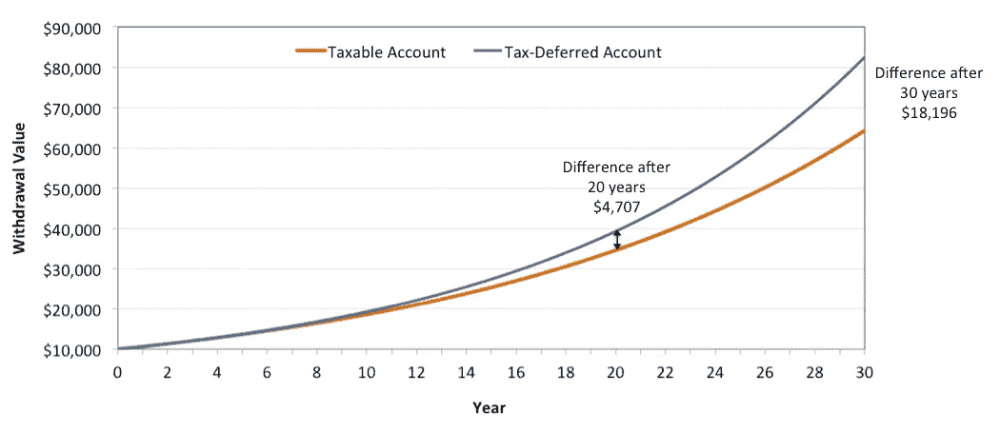
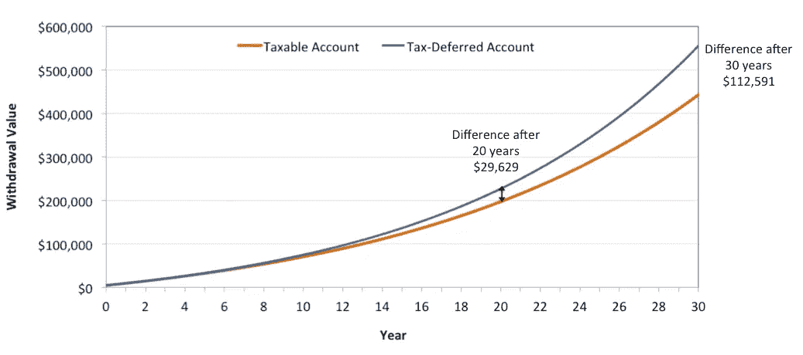

# 延税账户复利的魔力

> 原文：<https://medium.datadriveninvestor.com/the-magic-of-compounding-in-a-tax-deferred-account-9a9ca08e856e?source=collection_archive---------0----------------------->

Photo by [Jeremy Bishop](https://unsplash.com/@jeremybishop?utm_source=unsplash&utm_medium=referral&utm_content=creditCopyText) on [Unsplash](https://unsplash.com/search/photos/growth?utm_source=unsplash&utm_medium=referral&utm_content=creditCopyText)

大多数金融网站，甚至美国劳工部都在谈论复利的魔力。你可能在某个时候遇到过。这个想法是，只要有足够的时间和，即使很小的投资也能显著增长**和*。***

复利之所以有效，是因为你在获得原始投资利息的同时，也获得了长期利息。例如，假设你以每年 8%的复利投资 10，000 美元。第一年后，你的投资增长到 10，800 美元，因为你获得 800 美元的利息(10，000 美元的 8%)。

 [## 算法交易的机器学习-数据驱动的投资者

### 当你的一个朋友在脸书上传你的新海滩照，平台建议给你的脸加上标签，这是…

www.datadriveninvestor.com](https://www.datadriveninvestor.com/2019/01/30/machine-learning-for-stock-market-investing/) 

第二年后，你又赚了 800 美元。加上 64 美元，这是上一年的利息(800 美元的 8%)。所以你现在的投资是 11664 美元。

继续这样做(或者相信我的话)，10 年后投资会增长到 21，589 美元。还不错。但是如果你把它再投资 20 年，原来的 10，000 美元会变成 100，627 美元！

这就是为什么你经常听到“早点开始存钱”的消息。这样你就给了你的储蓄足够的时间来增长。

这是一个简单的信息，但很多人没有利用这一点。生活会碍事，不管是偿还信用卡债务、学生贷款债务、新房子、孩子等等。

**但是税收**

要记住的一点是，初始投资的收益将被政府征税(除非它在免税账户中)。要么连续不断，即年复一年，要么推迟到你开始取钱的时候。

延期纳税提供了一个额外的机会，通过美国税法利用复利，这就是我想在这里谈论的。

**延期纳税如何利用复利**

那么我所说的延期纳税是什么意思呢？你不用每年为当年产生的收入缴税，而是只在你最终从账户中取钱的时候才缴税。

这里有一个简单的例子。假设你有 10，000 美元以 8%的利率投资。一种选择是应税账户，你必须为每年赚取的利息支付 20%的税。

另一个选择是将 10，000 美元存入延税账户，该账户也支付 8%的利息。你仍然需要为所有收入缴纳 20%的税，但只是在你从账户中取钱的时候。

让我们回顾一下第一年后会发生什么。你在两个账户中都赚了 800 美元，如果你从延税账户中取钱，你要为此支付 20%的税。这算起来是 160 美元。这与你在应税账户中支付的金额完全相同，所以在这两种情况下，你都得到 10，640 美元。没有区别。

但是，如果你再等一年，再从延税账户中取出你的投资，会怎么样呢？这是两种情况下发生的情况。如果数学太复杂，可以跳过这一步。

应税账户:

*第二年年初余额= 10，640 美元*

*第二年赚取的利息:10，640 美元的 8% = 851 美元*

*第二年收入缴纳的税款:851 美元的 20% = 170 美元*

*第二年末余额= 11，321 美元*

延税账户:

*第二年年初余额= 10，800 美元*

*第 2 年赚取的利息:10，800 美元的 8% = 864 美元*

*两年内获得的总利息:800 美元+864 美元= 1，664 美元*

*取款时缴纳的税款:1664 美元的 20% = 333 美元*

*第二年末余额= 11，331 美元*

哇哦！10 美元的差额。那么这是无事生非吗？

号码

如此持续几年，复利开始生效，如下图所示。如果你等 20 年再从延税账户中取钱，你最终会多 4707 美元(缴税后)，几乎是你原始投资的一半。

Hypothetical growth of $10,000 at 8% per year in a taxable account and a tax-deferred account. Earnings are assumed to be taxed at 20%.

等 30 年后从延税账户中取出，你最终会有 82，501 美元的余额。这将比应税帐户中的 64，306 美元多出 18，196 美元。

复利在应税账户中发挥其魔力，但在延税账户中，它也在延税收益中发挥魔力。

**贡献更重要**

让我们考虑一个稍微现实一点的场景，至少在税率方面。此外，初始固定投资不会随着时间的推移而增长，假设您每年从您的总收入(即税前收入)中缴纳 6000 美元。假设你的联邦所得税税率为 25%，收入以每年 8%的速度增长。

如果投资是在一个应税账户中进行的，你实际上每年只投入 4500 美元——最初的 6000 美元中的 1500 美元(25%)作为税收流失了。我还假设这个账户中的年收入按 15%的“资本利得”税率征税。

另一方面，你可以每年将全部 6000 美元存入延税账户。在这种情况下，只有当你最终把钱取出来时，你才需要为最初的投资和任何收益缴税。为简单起见，假设税率也是 25%。

概括地说，我们看到，在这两个账户中，年度存款的税率都是 25%(对于延税账户，这只是后来发生的情况)。然而，两个账户中的收入被不同地征税:在应税账户中，它们被征收 15%的税，而在延税账户中，收入被征收相同的 25%的所得税。

你可能会认为这给了应税账户一个明显的优势，但事实并非如此。即使两年后，延税账户中的提款价值也比应税账户中的金额高出 170 美元。20 年后，这一差额攀升至近 3 万美元。

Hypothetical growth of annual $6,000 contributions (pre-tax) in a taxable and tax-deferred account. Taxable account earnings are assumed to be taxed at a 15%

如果你允许复利在 30 年内起作用，那么在支付所有税款后，你将能够从延税账户中提取 555，056 美元，相比之下，在应税账户中只能提取 442，466 美元。相差超过 112，000 美元。

因此，你可以看到延期纳税是如何进一步提高复合回报率的。如果有足够的时间，差别会很大。

好消息是，美国税法允许延期纳税的方式多种多样。尽管它附带了一个条件，那就是你必须把钱存到 59 岁半。如果你在那之前取款，你必须支付所有的税款，外加 10%的提前取款罚款。

如果你的雇主给你一个 401(k)计划，这可能是最容易的，特别是如果他们也为你的贡献提供美元(通常高达你工资的特定百分比)。如果你没有 401(k)计划，你可以选择使用传统的个人退休帐户，如果你是自雇人士，甚至可以选择 SEP 个人退休帐户。

和你的财务顾问或会计谈谈这个，从今天开始复利！