# 魔术师最好的朋友

> 原文：<https://medium.datadriveninvestor.com/the-magicians-best-friend-6e005eeebde1?source=collection_archive---------1----------------------->

## 这是一首歌颂魔法武器库中最有用的道具的颂歌。

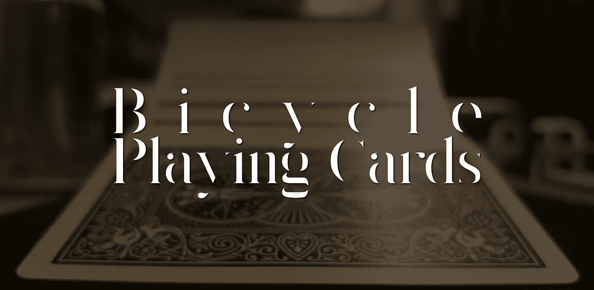

我是一名职业魔术师。人们期望我去的任何地方，任何时间，我都可以表演魔术。如果我不能，我显然不太擅长我的工作。我最不想做的事就是失望。因此，当我离开家时，我几乎总是带着一包扑克牌。是的，我可以并且经常用其他道具表演魔术，或者根本不用，但是扑克牌是一种在口袋里携带数小时魔术效果的便捷方式。扑克牌是魔术道具的瑞士军刀。

特定的扑克牌对魔术师很有吸引力，因为它们印刷的纸张、从纸张上切割下来的过程(赋予边缘一定的质量)以及扑克牌正面和背面的设计。一些甲板甚至来在花式，铝箔压花盒。这些品质都不能使一副牌成为魔术牌，但是牌的制作质量会严重影响牌的魔力。

从我记事起，魔术师就迷恋某些牌。当我 15 岁时，我只使用[牌，因为在我看瑞奇·杰在他的节目](https://www.bicyclecards.com/product/tally-ho-circle-back-playing-cards/) [*【瑞奇·杰】和他的 52 个助手*](https://www.youtube.com/watch?v=FtgUSUHnzLI) 中使用过，之后我从舞台底部拿了一张。Tally Ho 牌制作精良，很有吸引力，但像贵族和蜜蜂一样，不是所有的外行人(阅读:普通人)都知道它们是什么，因为它们不像标准的牌组设计那样容易识别。它们也比公认的替代品贵得多。

除了魔术，我学了七年艺术，又学了四年电影制作。虽然魔术是一种无形的精细工作，但我工作过的其他媒体却恰恰相反。电影和艺术特别关注如何吸引人们的注意力，这与魔术师如何运用他或她的技巧正好相反。

最终，我开始相信魔术道具一点也不有趣。这有两个原因。首先，兴趣招致怀疑。其次，观众应该记住的是你这个魔术师，而不是纸牌，尽管这听起来很奇怪，但不是你表演的效果。

# 为什么是卡片？

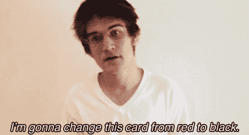

摆牌是魔术师最有价值的工具。他们是他或她最有用的支柱，最公认的伴侣，最可靠的朋友。不像其他一些道具，TSA 会让我随身包里有一包。

世界上最广为人知的扑克牌品牌是[自行车扑克牌](https://www.bicyclecards.com/)。人们认可现代自行车设计，并且信任它。美国扑克牌公司(USPCC)将自行车作为严肃扑克牌玩家的*牌组进行销售。这对一个魔术师有什么关系？从艺术上讲，[魔法不是混乱，不是技巧，也不是小玩意](https://movietime.guru/what-is-magic-4e118ef9a1fd)。*

**

*[Michael Cuddyer is a magician.](https://www.nj.com/mets/index.ssf/2015/02/that_time_mets_michael_cuddyers_magic_trick_scared.html)*

*如果这些牌看起来甚至有点不寻常，它们就会招致被指责为一副骗人的牌。如果你想利用一个定制的卡片设计来获得繁荣，你可以展示你的灵巧，从而揭示出一个卡片戏法是如何实现的。这两种情况都消除了你的所作所为是超自然的印象。隐含前提很重要。*

*如果你正在做的是“魔术”，而不是“技巧”或“器械”，那么你坚持使用与普通人最熟悉的卡片相似的卡片是很重要的。就像即兴喜剧一样，魔术是关于在一个正常的世界里发生的一件不寻常的事情。“奇怪的道具做奇怪的事情”并不奇怪，这只是一个 iPhone。*

*魔术不是混乱，它是观众确信他们看到了他们所看到的，但除了魔术之外，对他们所看到的缺乏任何解释。如果对这个效果有一个解释，比如灵巧或者一个装置，那不是*魔法*，而是*解释*。*

*A good example of cardistry.*

*有些纸牌处理者不是魔术师，而是执行所谓的“纸牌游戏”纸牌戏是一种用扑克牌玩的杂耍；灵巧的公开展示。这很好，如果你正在做心脏手术，使用一副古怪的、设计精美的、独一无二的卡片没有任何问题。如果一个卡迪西亚人(我不知道他们叫自己什么)被指控使用一副诡计牌，他们可以解释他们在做什么，消除指控，因为在卡迪西亚没有“秘密”。*

*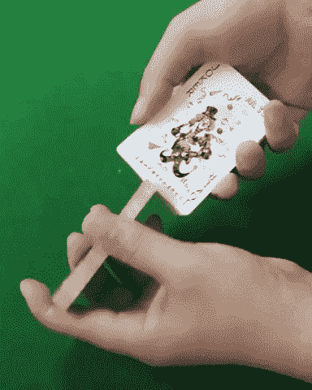*

*A card flourish that begins with a faro shuffle, and then becomes a matter of dexterity. The playing cards’ lack of a border means it has an “all over back design” or “borderless back design”.*

*魔法和技能是矛盾的。如果你是一个魔术师，你不想被指责技巧。如果你是一个卡迪斯人，你会想得到来之不易的、非常真实的技能的荣誉，而不是想象中的黑暗力量。试图将技巧和魔法的概念结合起来会引起混乱，并伤害到两者的前提。*

## *缩略扑克牌词典*

***背面**指一整包卡片背面重复的图案。对于传统的自行车，后背是指蓝色或红色的设计，描绘了一对骑自行车的天使，他们身后有一个自行车车轮，曲柄从他们的脚下伸出。*

***正面**指牌的一面，表示牌的花色和价值(如梅花 10)。*

***点数**是牌面上的任何符号，例如“角点”，它包括作为符号和数字或字母的花色和数值(例如 K 和梅花符号将是梅花之王)，以及牌上的其他小图标，如红桃 7 上的红桃 7。*

***宫廷牌**是杰克、皇后和国王。*

***号码牌**是编号为 a 到 10 的牌(a 被认为是 1)。*

*In this close up shot of some bicycle playing cards, you can see the grain of the paper which gives the cards their friction qualities. On the right side of the frame, you can even make out irregularities on the edges of the cards, however, these are from my use of the cards, not their manufacturing process. These cards are a well-worn deck of Turner Bicycles (see below).*

# *自行车扑克牌*

*B icycle 扑克牌是[美国扑克牌公司](http://www.usplayingcard.com/)的招牌产品。自行车的背面和正面都有简单、经典的设计，如果你从亚马逊 T10 买到它们，你会发现它们的价格(散装)约为每包 1.29 美元至 1.70 美元(这个价格是浮动的)。这听起来像是一个小细节，但是当你以一周几次的速度经历这些事情时，它就会累积起来。*

*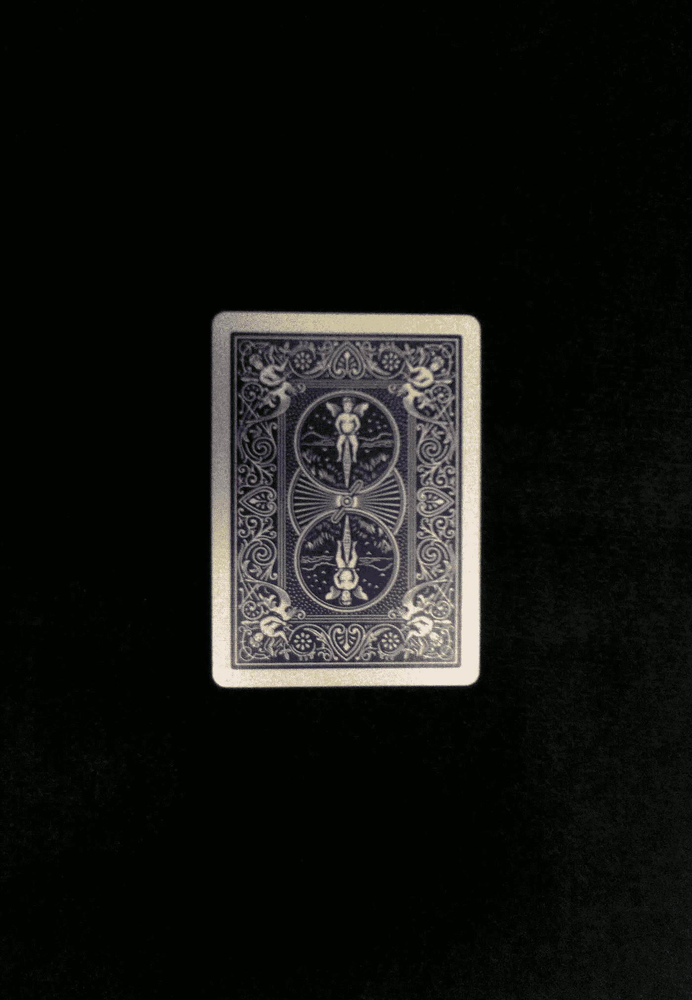*

*A contemporary Bicycle card back design, featuring angels riding bicycles.*

*USPCC 绝不是唯一的扑克牌制造商。然而，由于许多 USPCC 公司的收购，它仍然是最好的扑克牌制造商。直到最近被欧洲扑克牌制造商 Cartamundi 收购之前，它一直属于 Newell Brands Inc .大多数其他制造商(我正看着你呢，GEMACO)生产的卡片在劣质卡片上印出了严重的缺陷。这些对于玩纸牌游戏来说很好，但是对于魔术师喜欢的一副牌来说，它们很糟糕。USPCC，缺点和所有，是游戏中最好的，这是伟大的，同时也是可怕的。*

*甚至许多魔术师都不知道的是，USPCC 不会自己造纸。因此，有时 USPCC 有一个伟大的印刷运行(与特纳甲板，下面)，你永远不会再看到，因为纸字面上不再存在，USPCC 没有办法再次制造它。这一点各不相同，甚至在单背面设计的卡片中也是如此，比如自行车。*

*事实上，用于制造扑克牌的纸张来源属于工业秘密的范畴，因为扑克牌制造商已经面临来自赌场的巨大压力，而赌场是他们业务的重要组成部分。*

## *旧与新*

*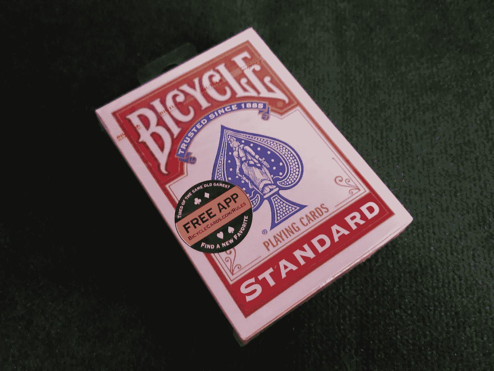*

*A regular deck of Bikes, purchased at a drug store. This is the modern box design’s front side, complete with a sticker, and a retail hanger stuck to the cellophane wrapper.*

*re-2000ish 牌被印刷在高质量的纸张上，有良好的质量控制——他们需要质量控制，因为在那时，卡片是在(以今天的标准)非常老式的机器上生产的，每天生产的卡片较少。结果，每副牌代表更多的生产时间，因此，一副坏牌在当时比现在是更大的资源浪费。*

*这些情况产生了美丽的甲板，今天，可以卖出荒谬的价格(后面会有更多)。在 20 世纪 70 年代，这个质量标准被认为是正常的。*

*用于制作扑克牌的卡片原料(纸张)在到达卡片工厂时没有经过上光，将由工厂进行印刷和上光，这一过程使用碳氢化合物在 21 世纪初成为非法，并被放弃，转而使用预先上光的纸张，然后用大豆基颜料在上光层上印刷，这导致色彩不太鲜艳。*

*卡片本身是两层固定在一起的纸，因此它是根据将它固定在一起的芯和纸的重量来分类的。核心类别包括蓝色、黑色或无芯。当魔术师谈论“扑克牌的三层”时，他们实际上是在描述核心和两层纸。*

*你通常需要撕开一张扑克牌来看它有什么样的核心，有时核心是类别的混合。蓝核是典型的蓝色，因此得名。奇怪的是，黑色核心更像灰色，但它是不透明的，足以确保卡片不会被看穿。在很大程度上，USPCC 在他们的产品中使用黑芯。重量类别(我喜欢把它们看作重量等级)通常被描述为 240 gsm(克每平方米)到 360 gsm 之间的值。*

*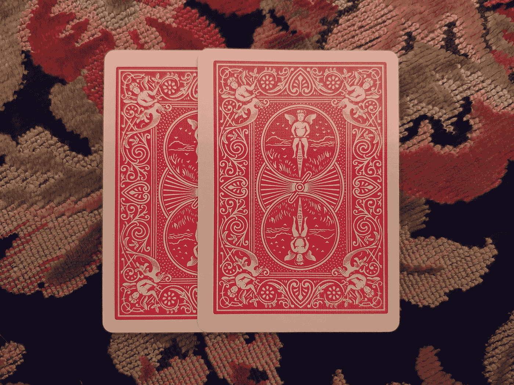*

*Two cards from the same deck of red back Bicycles, one turned 180 degrees. This is a horrendous, and common printing error.*

*在过去的一百多年里，USPCC 多次改变了他们的整个制造流程，最近一次是在 2008 年左右。今天常见的自行车…并不神奇。他们似乎保留了旧卡的许多缺陷，并有自己新的令人兴奋的缺陷。*

*有一点没有改变:卡片经常印刷错误，设计稍微偏离中心。虽然 USPCC 曾经有一个保证，如果一副牌做错了，一个人可以送黑桃 a 和一个小丑来完全替换一副牌，但这个保证不再出现在他们所有的牌上。这并没有激发太多的信心。*

*据我所知，用于印刷卡片的机器是以施乐品牌制造的，但这可能是一个许可协议。它们可能是…复印机的复制品。*

*为了保持兴奋，现代自行车有一个新的慢性问题。今天的 USPCC 牌的边缘经常是粗糙和不均匀的，不仅在单张牌上，而且在一副牌中的牌之间，有时甚至在单张扑克牌的边缘上也会有变化。这意味着某些洗牌会比它们应该破坏的更快，或者它们可能根本不起作用。在拆牌的过程中，有很多方法可以改善这种情况，但是为什么我要花十分钟去摆弄一副牌来让它没事呢？*

*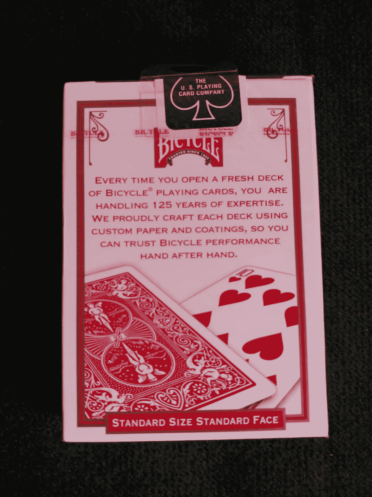*

*The back of the bike box design. Some people hate it. I happen to think it’s fine.*

*有人告诉我，一些甲板特别破旧的原因是 USPCC 每天早上磨一次刀片。如果这是准确的，这意味着人们实际上可以通过卡片边缘的粗糙感来判断一副牌是在上午还是下午生产的。值得注意的是，新自行车的价格大约是以前的一半(经通胀调整)，但这是我能说出的唯一改进。*

*有一件事是肯定的:自从他们搬迁工厂和更换设备以来，USPCC 的基础产品质量一直在走下坡路。我说不准为什么会这样，只能说是这样。*

*然而……这种廉价的制造工艺确实有它的好处。*

*定制一副卡片比以前便宜了(尽管很难说“便宜”，因为你必须花大约 6000 美元才能把价格降到不算离谱的水平)，而且它创造了对更好卡片库存、更好质量控制的更好卡片的需求。*

*你可能不知道这一点，但是有一个为心脏指数制作古怪扑克牌的家庭手工业。一些甲板声称是高级货(通常不是)，而另一些则有“酷”的设计，有头骨、龙和其他对 15 岁男孩有吸引力的东西。*

*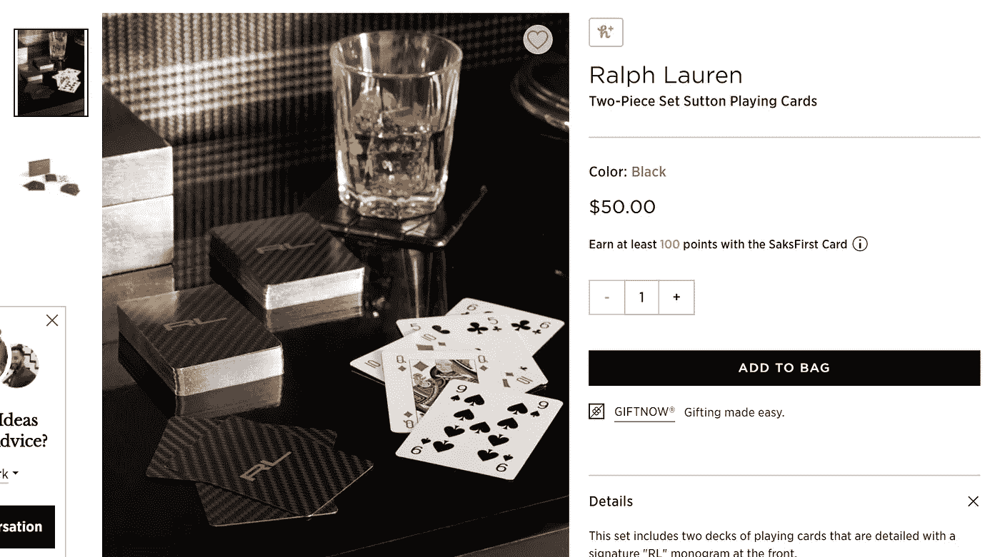*

*Ralph Lauren designer playing cards: $50.*

*有些真的是魔术牌，它们大声地叫着“魔术牌”，以至于用它们来变魔术是愚蠢的。其他的只是印在同一张纸上的新设计，USPCC 在亚马逊上要价 1.7 美元，除了你要为这些小型扑克牌支付[每副 50*。他们很受白痴们的欢迎。*](https://www.saksfifthavenue.com/ralph-lauren-two-piece-set-sutton-playing-cards/product/0400092007927?site_refer=CSE_GGLPLA:Home:Ralph+Lauren&gclid=Cj0KCQiArqPgBRCRARIsAPwlHoUvdQCtrI5DO2tU2puQKw_7lbLBIVUgN9mYb6c4xE-PXG12ayfFxvIaAnYwEALw_wcB&gclsrc=aw.ds)*

*然而，也有一些零星的宝石。这些甲板看起来完全像普通自行车，但制造了更高的标准。这些套牌是对普通自行车的改进，因为它们印在优质卡片上，有时它们是用特殊方法从纸上剪下的。高质量的纸张和更好的质量控制为表演者提供了更大程度的轻松感。*

## *质量*

*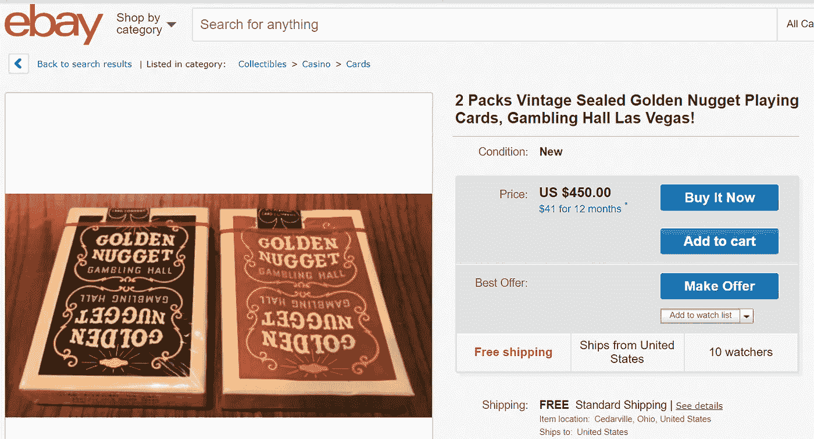*

*1970s Golden Nuggets (USPCC) playing cards, for sale for only $225 per deck. This is actually a bargain.*

*赌场甲板曾经是品质的标杆。赌场需要高质量的纸张。它很坚硬，经得起惩罚。如果你幸运的话，甚至有一些现代类型的纸牌，它们的行为就像 20 世纪 70 年代的赌场纸牌一样。如果你想把它们和那些旧的套牌相比，其中一些在易趣上以数百美元的价格卖给了收藏家，所以请便，如果你喜欢就去买吧。*

*知道这一点很重要，因为这是魔术师们向往的品质标杆。*

# *豪华自行车扑克牌*

*H ardcore 纸牌魔术师可以发展对某些类型的纸牌的偏好。这通常意味着他们将坚持使用[蜜蜂](https://www.bicyclecards.com/product/bee-standard-playing-cards/)或[自行车](https://www.bicyclecards.com/product/bicycle-standard-index-playing-cards/#filter)，或者一些印在专业卡片上的豪华变种。下面详述的甲板是豪华自行车品种；普通的自行车扑克牌图案印在不寻常的高级牌料上。这样做是为了让自行车表现得更像蜜蜂，或者像 Tally Ho 牌，或者魔术师喜欢的任何其他牌。一些纸使某些动作更容易，而另一些纸只是承受更多的惩罚，使甲板上持续更长时间。*

*一些魔术师，包括道格·爱德华兹和韦斯利·詹姆斯，建议适应各种各样的卡片库存，不要对“好东西”感到太舒服，因为我们不能总是保证我们喜欢的卡片会到手。他们建议在各种身体条件下使用各种牌子的牌来练习。其他像达尔文·奥尔蒂斯这样的人建议每天打开一包新烟，就像烟鬼一样。*

*我的哲学是这样的:可以使用任何旧的甲板，但当一个人在专业表演时，使用真正制作精良的东西没有任何错。如果你得到了报酬，你如何交付并不重要，重要的是你做到了。*

## *专业提示*

**

*Wesley James at practice.*

*我在我的卡片上使用了一种由我的魔术师兼慷慨的导师韦斯利·詹姆斯设计的处理方法。这使得一副普通的自行车可以持续更长的时间，并且操控更好。值得注意的是，这种准备是在 2000 年代初出版的，但由于它被放在一本书而不是视频下载中，所以很少有人知道它。如果有机会的话，我强烈建议你问问他。更好的是，买这本书。里面有很多东西。*

## *货物出门概不退换*

*这篇文章将只检查“标准”自行车设计。*

*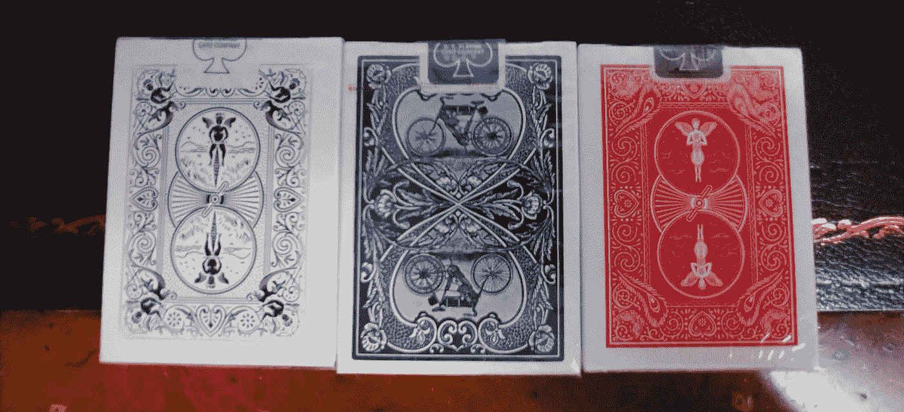*

*From left: Ghost Edition Bikes, Autobikes, and Mandolin Back Bikes.*

*除了复古设计，还有“自行车扑克牌”，不是普通的自行车扑克牌。我非常欣赏鬼版自行车，曼陀林自行车，少女背等。这些都不是普通的自行车。它们相似，但不相同。我特别排除的另一种“自行车”是所谓的[自行车 807 甲板](https://www.bicyclecards.com/product/bicycle-807-playing-cards/#filter)，据我所知，这只是一个老式的折叠箱中的标准甲板。我喝过一些，它们都有点令人失望。*

*有许多传统自行车甲板设计的旧版本，在现代纸上重印。当我发表这篇文章时，只有摩托车品种(从 1900 年代早期)目前还在印刷中，并且在沃尔格林可以买到，普通人可能会在那里买到。事实上，这种设计并不完全怪异，但最好使用常规的现代设计，而不是古董设计。*

*与传统自行车相比，摩托车的设计印刷在质量控制更好的好纸上。然而，它在关键方面有所不同，包括背面设计周围的白色边框更薄，以及卡片正面的复古设计。这些品质使它的性能不太理想，因为它看起来很奇怪，我不会在这里包括一个评论。*

*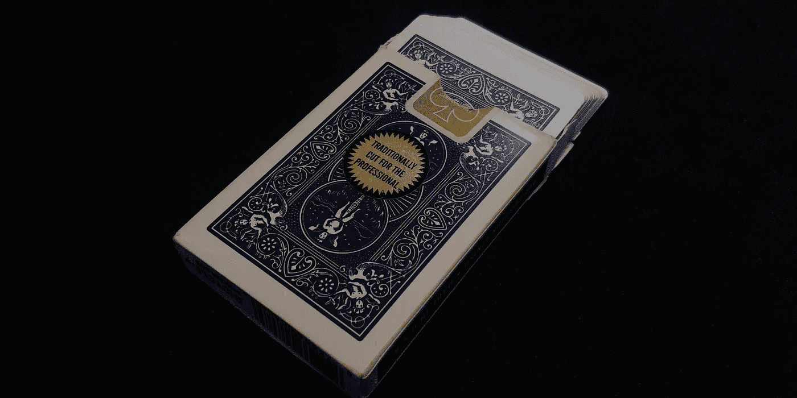*

*This is a Turner Deck, the very cards I had in my pocket at the time I wrote this.*

## *特纳甲板*

*2008 年，USPCC 与专业纸牌技师[理查德·特纳](https://richardturner52.com/)合作，印制了一批“金印”牌，俗称“特纳牌”。我买了几十个，喜欢在工作时用它们来表演。成批购买时，每包大约 3 美元。*

*特纳是扑克牌中的斯特拉迪瓦里。*

**

*Richard Turner, from the film *Dealt, seen holding two Bee decks.**

*特纳牌被印在一种更老的 Bee cardstock 牌上(2000 年代中期用于更高质量、无边界赌场牌的那种)，但除了盒子上的金色印章和 2008 年前的盒子设计之外，其他方面看起来都是普通的自行车。*

*一个人可以像一个赌徒一样，在其中投入大量的“工作”,而且由于卡片的性质，一个有知识的魔术师可以随意地重新设置卡片组。卡片是在老式机器上切割的，质量控制非常好。*

*USPCC 称这种切割为“传统的”，意思是刀片从与普通卡片相反的一侧切割印刷好的卡片，产生的卡片边缘，由于它们的形状，使某些困难的、以赌博为导向的洗牌变得更容易。之所以称之为“传统”，是因为从前所有的卡片都是这样制作的。由于良好的卡片库存和良好的质量控制，特纳甲板是防弹的，比普通自行车甲板持续数周以上。*

*特纳套牌的批发商一年多前就卖光了，如果你想要这些卡片，你最好去一个有现货的经销商那里，因为市场上有的就是全部。别担心我，我至少还有几年的时间。*

***更正:**特纳套牌的批发商没有卖光！他还剩几毛钱，现在只按毛钱卖。我已经订购了足够我维持至少四五年的东西，你也可以，每批 527 美元。*

## *精英甲板*

*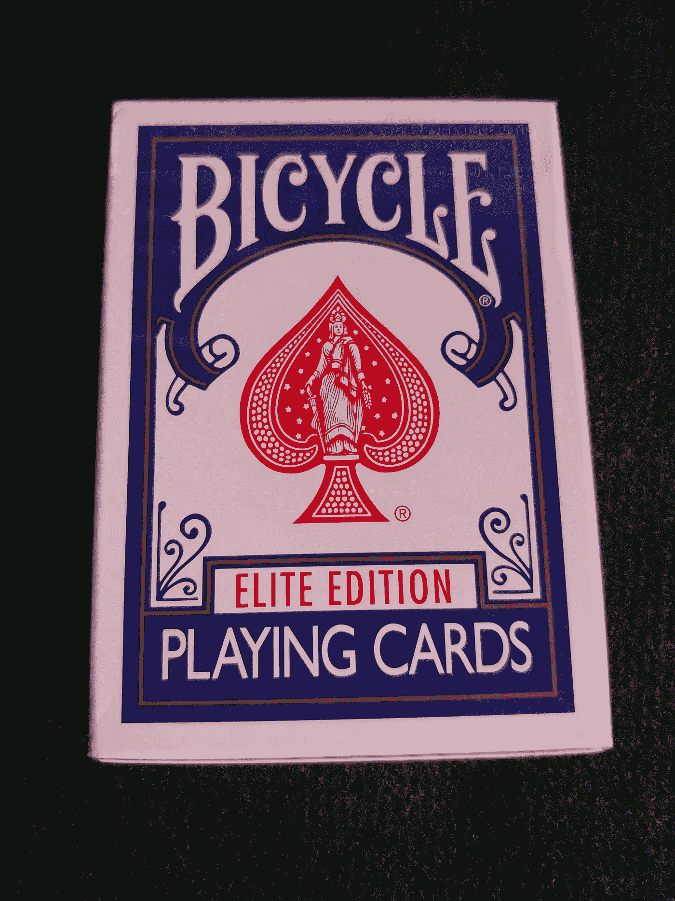*

*P 魔法经销商 enguin 在 2017 年推出了精英套牌。它很容易买到，要么是单层的，要么是 12 块的，这被认为是散装的。我不知道还有比企鹅的 12 层砖更便宜的散装价格。这是一个普通的自行车甲板设计，印在“精英”牌纸上，这是一种更薄、更柔韧的卡片纸。这副牌有利有弊。*

*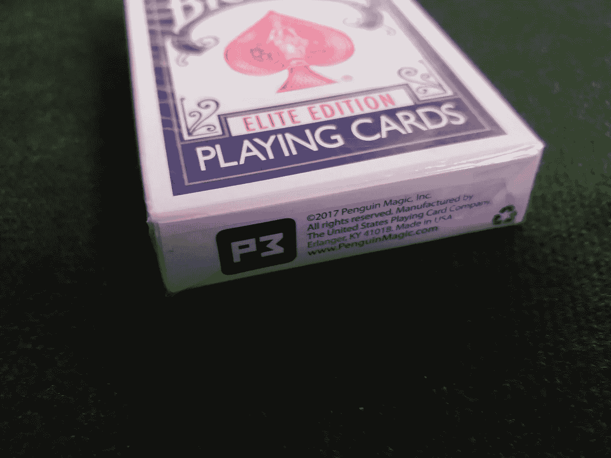*

*A look at the bottom of the box of Elites features the Penguin “P3” logo.*

*散装的话，它们的价格是 3 美元一副，就像特纳牌一样，只是你只需要买 12 副就可以达到这个价格，而特纳牌的话，你需要订购至少 100 美元的卡片才能把价格降到同样的水平。它们非常灵活，允许各种移动方式，通常需要卡机械师使牌组受到牢固的握持和高压力，握持不牢固和压力较小。*

*另一方面，根据我的经验，它们比普通的自行车更容易因使用和潮湿而变形。我猜它们实际上以同样的速度吸收湿气，但是湿度对它们的影响更大，因为它们没有厚度。*

*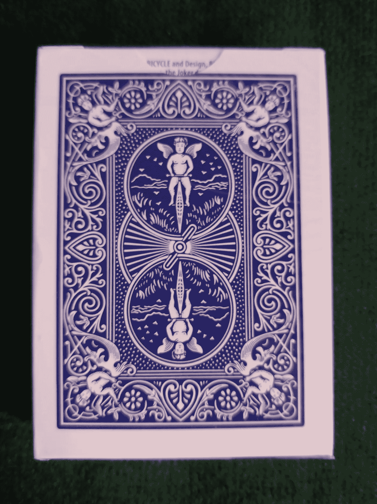*

*A unique feature of the box is that it does not have a deck seal, which is a vestige of when playing cards were shown to have been taxed by placing a paper seal over the closure of the tuck case.*

*通常魔术师可以通过将卡片插入所谓的卡片夹(一种不使用时将卡片压平的机械加工金属夹，将其恢复到“工厂设置”)来解决这一问题，但由于他们薄的卡片库存，如果你将精英卡片放在没有所有通常扔掉的多余卡片的卡片夹中，你会压碎卡盒，对卡片没有任何作用。如果不是这最后一个细节，它们将是我目前最喜欢的一副牌，尽管还有其他缺点。我爱他们，但这是一种虐待关系。*

*然后就是前面提到的习惯某些卡股的问题。虽然所有不寻常的卡片库存都可能导致人们对普通卡片的感觉有点下滑，但精英们是如此柔韧，以至于长期使用这些卡片会让普通自行车感觉特别奇怪。这会使处理借来的牌变得更加困难，因为你失去了对牌的感觉。从精英切换到特纳甲板(赌场股票)感觉就像从处理丝绸到处理金属板。*

## *专业甲板*

*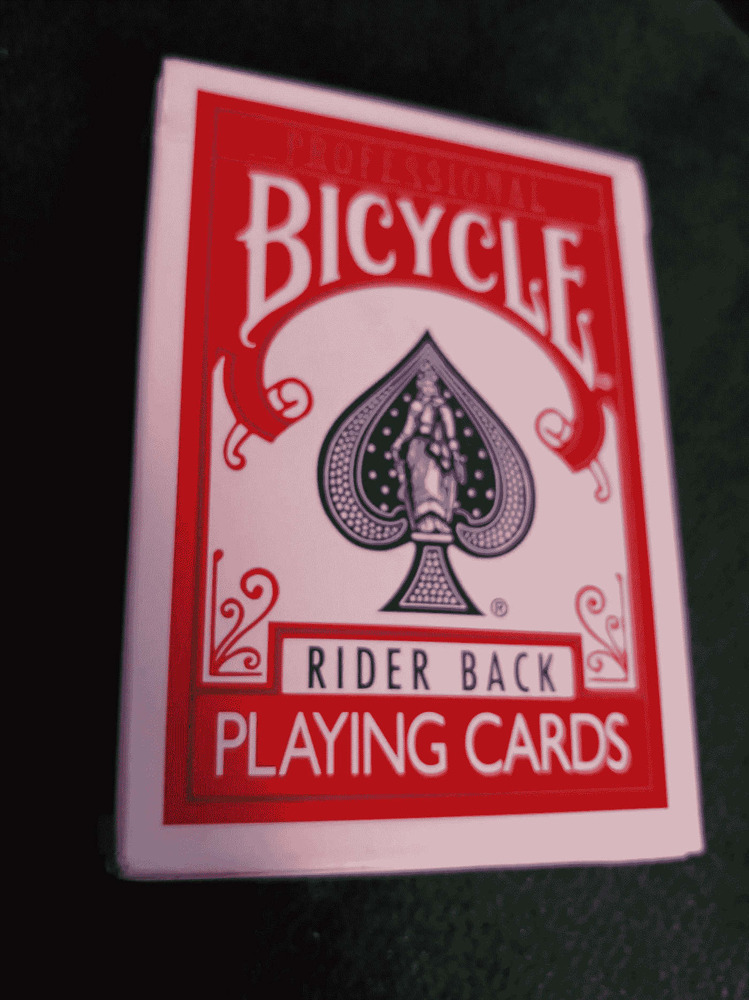*

*One small quibble with the design of the Professional Deck was that the box has the word “Professional” printed at the top in gold. Look closely, because in this photo, it tends to blend into the red.*

*何变戏法艺术研究中心前段时间把这些卡片拿出来了。他们在发牌员中两极分化。它们被印在硬挺度与 Bee stock 相似的卡片上，但滑溜得多，这是一种短时间内使用的表面处理，专门面向魔术师销售，但当它不流行时就被放弃了。有些人喜欢它们的表面，但显然还不够。*

*我没有被说服。我发现对于我所熟悉的大多数老式操作来说，它们有点不可预测。这里的所有其他牌都或多或少感觉像普通自行车，就它们之间的卡摩擦而言。与 20 世纪早期的牌相比，即使是这些牌也很滑，那时许多纸牌“移动”都是第一次被发明出来。*

*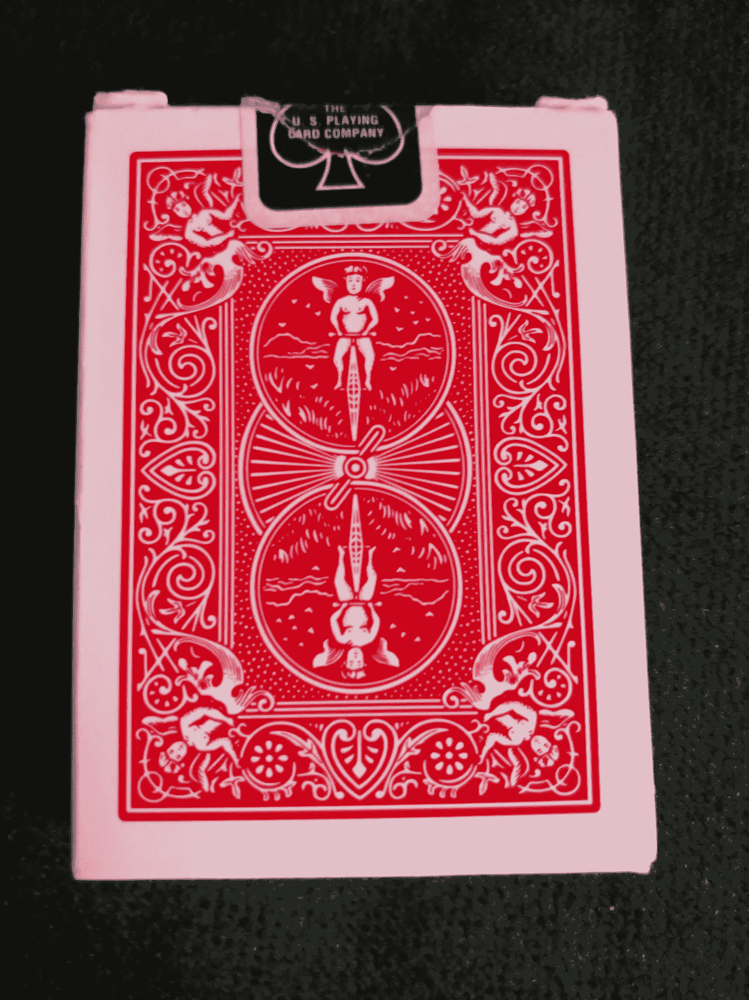*

*The Professional Deck box featured the old-fashioned design with the full back design on the box, and a contrasting deck seal.*

*在 21 世纪初，宝马决定他们的指示器杆应该以完全不同于世界上所有其他汽车的方式工作，当你租了一辆车时，你会发现这一点，当你在高速公路上以 70 英里/小时的速度变道时，你不知道如何关闭你的转向灯。同样，为了好玩而让扑克牌变得光滑似乎是一个奇怪的选择。打牌的赌注是不一样的，但是无论在什么情况下，发现你一直以一种方式做的事情突然不像它应该的那样工作是令人愤怒的。*

*此外，我使用的所有专业套牌在打开时都变形了。这种翘曲表现为在甲板中间弯曲，就像一座桥。这意味着整个甲板上有一种拱形，所以如果你把它放在桌子上，从桌面的高度看，你可以看到甲板下面和穿过甲板。如果我在沃尔格林买了一副 3 美元的标准自行车，而它们像这些精美的卡片一样弯曲，我会很不高兴。是的，这是一个可以解决的问题。这些卡太贵了，根本不会有任何问题，所以我很生气。*

*我不知道他们为什么会这样。有些牌是别人给我的，有些是我自己买的。他们都有这个问题。也许发生在制造业，也许发生在经销商储存或运输它们的方式上。无论哪种方式，对从业者来说，都无所谓。他们非常失望。*

*然后就是价格了。当这些产品出售时，即使是批量购买也不会使它们比竞争对手更便宜，而且它们与特纳牌大约同时出售。当然，由于魔术艺术公司对他们所有定制的纸牌收取极高的赎金，这是意料之中的事。无论哪种方式，这些都不再销售，所以 MSRP 并不重要。*

## *主甲板*

*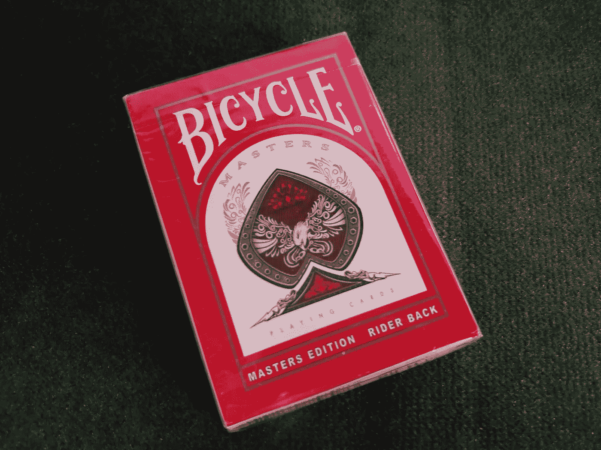*

*The Master Deck box, which I’d hide as quickly as possible, as it would raise some eyebrows. The ace design on the box is the same as on the ace of spades.*

*他的自行车甲板是我见过的第一个“外观普通、改良过的”自行车甲板。“大师”印刷在明显较重的卡片上，于 2005 年或 2006 年左右问世，由 Ellusionist 出售，Ellusionist 是一家针对年轻魔术师的“酷”魔术经销商。*

*这些卡片使得某些事情，像[法鲁洗牌](https://www.youtube.com/watch?v=SbfJ7oTh5qA)，比它们应该的要容易得多。与精英一样，用一副主牌练习足够多，使用普通牌变得很难，因为你会失去对它们的感觉。就像精英卡牌因为薄而奇怪一样，大师卡牌因为厚而奇怪。*

*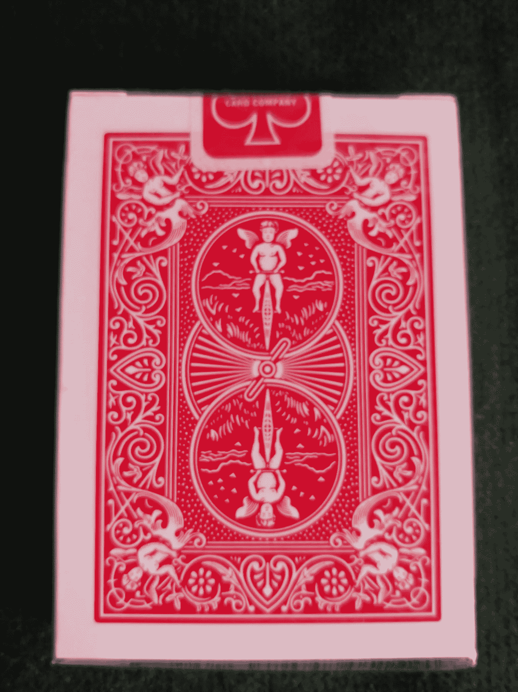*

*The Masters’ tuck case was the old design, and had a non-contrasting deck seal.*

*尽管如此，这些卡片在出售时还是充满了乐趣。如果你是批量购买的话，价格不会太贵，它们与精英牌相反，但却是一样的:制作结实、僵硬，但不知何故，仍然与普通牌相差太远，无法用于练习。*

*他们历久弥新，这一点我对精英们不敢说。我仍然有几副这样的牌，所以我可以用它们来练习，就像我多年来处理的许多奇怪的牌一样。毕竟，你希望能够拿起任何甲板和表演。*

*关于这些的一个设计抱怨是他们的黑桃 a 有一个奇怪的设计，上面写着“大师”，这又一次引起了观众的怀疑。当然，这是一个非常小的细节，只影响一张卡，不值得大惊小怪。如果你喜欢这些东西的手感，但不喜欢它的外观，经销商甚至出售被称为“阴影大师”的黑色版本，它们功能相同，但看起来非常粗略，因为它们是颠倒的(白色应该是黑色的，等等。)而且看起来不像正常的扑克牌。阴影大师仍然在 Ellusionist 网站上出售。*

## *旧自行车*

*当然，每隔一段时间，我都会在一家药店里发现一些旧盒子设计的自行车，这有时意味着它们来自旧工厂。有时这只是意味着卡来自新工厂，但盒子来自旧工厂，就像所谓的 807。*

*如果我看到这些，我通常会得到它们。要么我挖到金子，要么我有一副多余的廉价牌，现在还能用。对于一个魔术师来说，这些 2009 年以前的卡片还不错。很遗憾你不再经常见到他们了。除非你运气好。*

## *T 何诗的魔力*

*现在你对现代魔术师最传统的道具有所了解了。你也知道魔术师对细节的关注程度。就像魔术方法、魔术效果和魔术师本身一样，扑克牌会出现，接受一些惩罚，然后消失。也许扑克牌像魔术一样转瞬即逝是恰当的，因为这是我们所做的事情的本质，也是我们的全部。*

*[戴弗农](https://www.youtube.com/watch?v=YLVzRCFa7mc)称扑克牌为神奇的诗歌。他没有错。*

**

## *这是我的[推特](https://twitter.com/MrLichtenstein)，和我的[网站](http://magician.nyc)。对彼此好。*