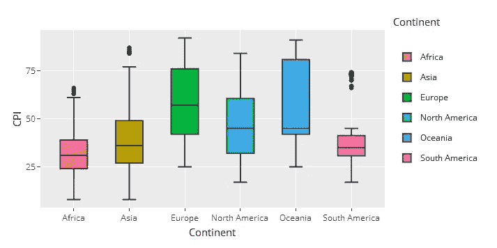
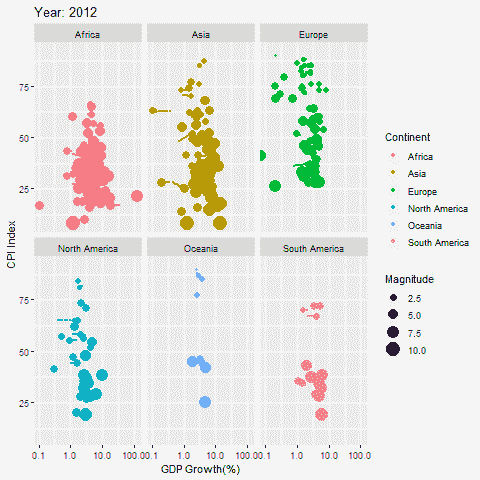

# 腐败的宽宏大量和倒退性质:全球视角

> 原文：<https://medium.datadriveninvestor.com/the-magnanimity-and-retrogressive-nature-of-corruption-a-global-perspective-25b7983426f4?source=collection_archive---------6----------------------->

当警察腐败的时候，谁能监督腐败？
当政府腐败时，谁能治理腐败？当总统们腐败的时候，谁能主持这个问题？
如果我们自己都不能给腐败下一个合适的定义，我们怎么能给腐败下一个定义呢？

*免责声明:尊敬的读者以下分析是(1)以* [*数据为后盾*](https://www.transparency.org/cpi2018) *假设准确无误，非捏造抹黑政敌(国家)。(2)分析仅关注 2012 年至 2018 年期间，这可能不会显著证明一些已知的内部腐败维度。*

 [## 保护主义、政治和经济动荡|数据驱动的投资者

### 美国股市昨日出现 400 多点的大幅反转，为未来的事情发出了警告信号。市场…

www.datadriveninvestor.com](https://www.datadriveninvestor.com/2018/06/28/protectionism-politics-economic-turmoil/) 

至少可以说，对腐败的资助者来说，腐败是宽宏大量的，而这种恶习的受害者认为腐败是倒退的。在某些方面，当一个人帮助家庭成员或朋友时，腐败往往被忽视。不管我们如何粉饰，腐败通常被认为是恶意的。考虑以下 2012-2018 年期间的大陆分析。

# **非洲**

事实上，腐败是糟糕和错误管理实践的一个症状。在非洲地区，这种做法在大多数情况下都很明显。腐败在非洲的一些国家仍然很明显，比如 T2、苏丹、T4、索马里和令人失望的津巴布韦。纳米比亚的腐败案件有所减少，而博茨瓦纳、毛里求斯和卢旺达等国家仍处于腐败程度较低国家的分界线之上。箱形图巩固了调查结果，即非洲是世界上最腐败的地区。这种恶行的其他参与者包括接受贿赂并严重参与招标操纵的公职人员。政府为打击腐败而建立的结构已经失败，并且仍然未能遏制这一祸害。

# **亚洲**

亚洲的腐败案例与非洲有点相似，其中 75%的国家都低于 50 分。然而，不同之处在于，与非洲相比，大多数国家的消费物价指数较高。值得注意的是，腐败案件较少的亚洲国家有以色列、日本和阿拉伯联合酋长国(UAE)。然而，朝鲜被认为是最腐败的。有观点认为，外国直接投资(FDI)与腐败可以遵循一个[*假说，即随着腐败的增加，不确定性增加，从而形成 FDI 障碍。或者，这种关系遵循*](https://dergipark.org.tr/en/pub/ijefi/issue/31962/351994) *[***润滑手*** 假设](https://dergipark.org.tr/en/pub/ijefi/issue/31962/351994)，该假设暗示，从长远来看，高腐败水平会导致薄弱的政策框架被淘汰。其中后者在[亚洲边境](https://dergipark.org.tr/en/pub/ijefi/issue/31962/351994)没有实现。腐败对亚洲金融市场产生了负面影响，无疑也影响了全世界。值得注意的是，腐败之所以成为可能，是因为那些愿意腐败并且有能力腐败的个人。在该地区，人们注意到[高教育程度、英美教会大学的影响、接触媒体的机会和高工资导致了较低的腐败水平](https://www.sciencedirect.com/science/article/pii/S1043951X12000995)。*

# ***欧洲&大洋洲***

*在其他国家中，塞浦路斯的腐败案件明显增加。虽然比利时一直在努力，而丹麦和冰岛在反腐败斗争中的领先地位似乎有所削弱。欧洲的分裂在[反腐](https://onlinelibrary.wiley.com/doi/full/10.1111/j.1748-5991.2011.01125.x)中面临挑战。在这里，腐败是诸如[裙带关系、任人唯亲、裙带关系和](https://onlinelibrary.wiley.com/doi/full/10.1111/j.1748-5991.2011.01125.x)[企业与政府之间的负面关系](https://link.springer.com/article/10.1007/s10611-013-9482-6)等词汇的同义词。人为什么会腐败？这是因为穷人/缺乏对腐败的积极和消极的激励，缺乏立法知识，社会规范原谅它，以及由于合法性问题。与其他地区相比，大洋洲和欧洲边境地区的 CPI 指数更高。可以从这些地区吸取经验教训。*

# ***北美***

*有趣的是，北美的腐败与其他地区不同，似乎更加微妙。高度腐败地区的腐败分子年龄越大，现金越少(以避免书面记录)。与其他公司相比，来自高度腐败国家的公司所有者被认为在美国逃税。还观察到政府支出项目似乎倾向于产生贿赂的项目。在北美地区，加拿大的腐败案件最少，其次是美国，而海地是最腐败的。*

**

*CPI versus GDP Growth*

*腐败程度与经济增长之间的关系已经得到了相当详尽的研究。对一些国家来说，腐败是经济增长的格兰杰原因，而在某些情况下，腐败不是格兰杰原因。从上面的动画图可以看出，随着国内生产总值增长率的增加，消费物价指数也在增加，在某些情况下相反，在其他前沿，国内生产总值发生变化，而消费物价指数保持不变。随着所有这些关系的发生，腐败程度的范围和普遍性也发生了变化。*

*从上面的分析来看，很明显，腐败存在于每个国家。另一位作者[总结道，“大腐败”发生在政府最高层，涉及重大政府项目和计划、采购合同和特许权授予。我们面临着一个秘密的恶性问题。要解决这个长期存在的问题，需要付出比现在更多的努力。](https://books.google.co.zw/books?id=XBA1cZlB5AoC&pg=PA27&lpg=PA27&dq=%22Grand+corruption%22+occurs+at+the+highest+levels+of+government+and+involves+major+government+projects+and+programs,+procurement+contracts+and+the+award+of+concessions.&source=bl&ots=fE-QZyIkTY&sig=ACfU3U3_0bVz1PNGgWqFr_OmuWD1TymXRg&hl=en&sa=X&ved=2ahUKEwiO7-Cdx8zmAhXGb1AKHZCpC6MQ6AEwAHoECAoQAQ)*

*学习著名歌曲“我们是世界……”
*这是响应反腐号召的时候了，
人们的生活，特别是他们的储蓄正在被粉碎，
我们不能继续假装别人必须解决问题，
我们是世界，我们是那些能使世界变得更美好的人，* ***世界的变化从你我做起！停止腐败！****