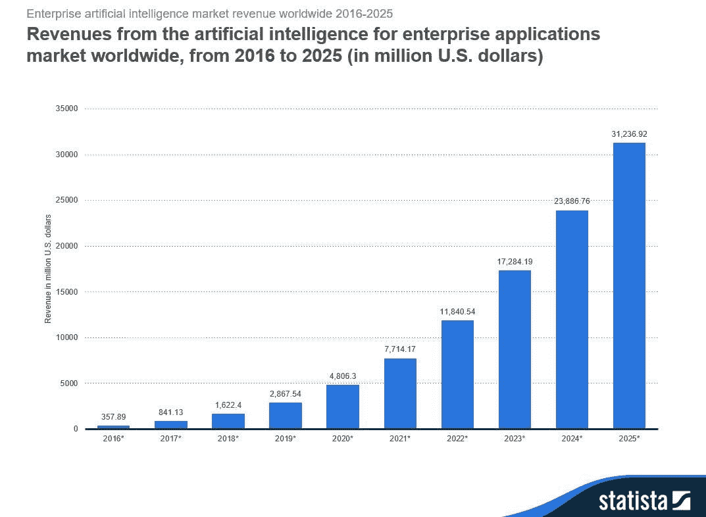
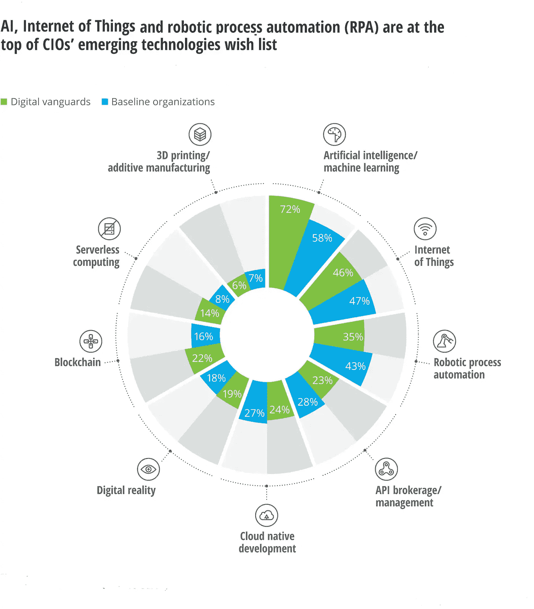
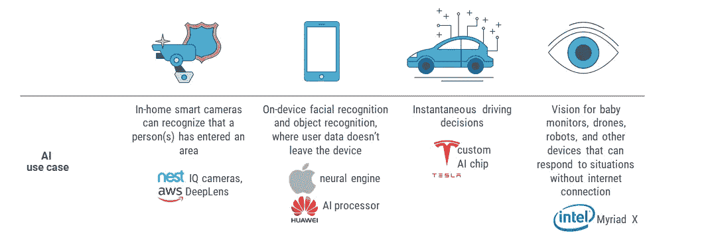
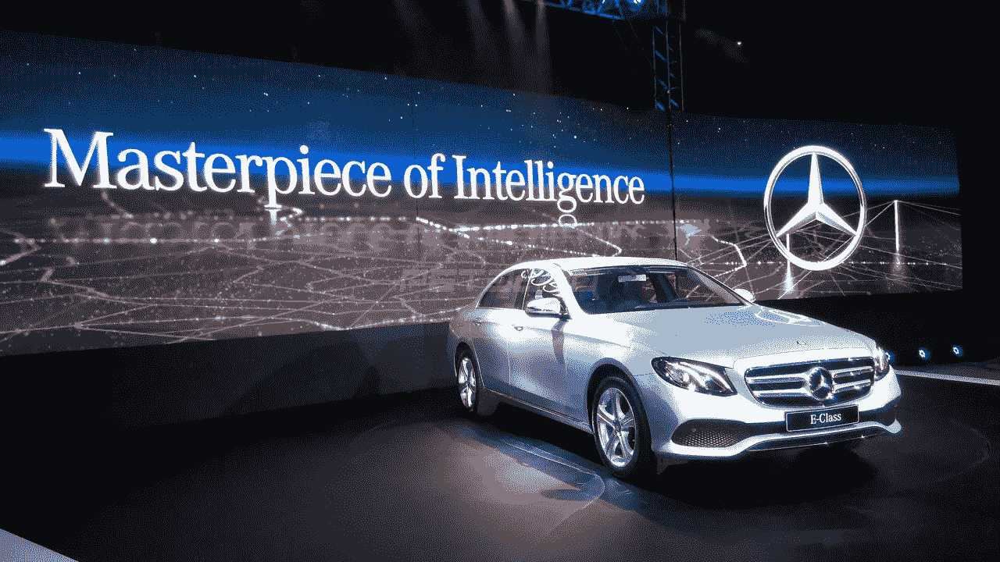
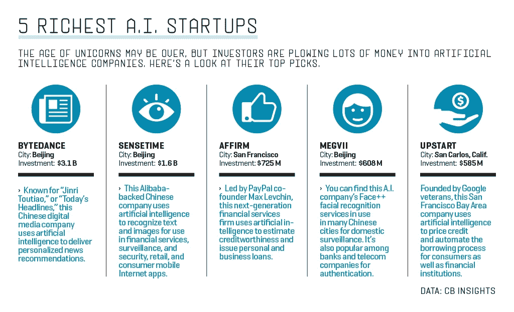

# 如何用人工智能做得更好的咒语

> 原文：<https://medium.datadriveninvestor.com/the-mantra-of-how-to-be-better-in-your-business-with-ai-11ec36163fac?source=collection_archive---------1----------------------->

## 商业人工智能不是一个新概念，但在未来，它将在许多方面影响你的业务。这就是为什么我给你记下了这个故事，让你可以看到今天的企业如何使用人工智能处理各种任务和操作。

今天，你可能听到了很多关于人工智能(AI)以及它如何改变你的业务的事情。远离市场炒作，你需要从不同的角度看 AI。

市场炒作围绕着缺乏信息和不清楚人工智能对企业的实际意义。为了避免你的困惑，我将向你提供更多关于人工智能对今天的企业意味着什么以及它将如何影响你的业务流程的具体细节。

 [## 值得购买的 4 大人工智能股票及其原因——数据驱动型投资者

### 人工智能(AI)在 2019 年继续进入大众意识。通过应用程序…

www.datadriveninvestor.com](https://www.datadriveninvestor.com/2019/03/06/top-4-artificial-intelligence-stocks-to-buy-and-why/) 

## 【2019 年人工智能统计:衡量对企业的影响&消费者

***在斯坦福德公司的 2019 年首席信息官调查中，他们发现人工智能实施在过去四年中以 270%的惊人速度增长。***

根据 Salesforce 的数据，自 2017 年以来，人工智能的市场采用率增长了 44%。

今天的企业正在意识到使用人工智能和机器学习开发来制定引人注目的商业战略、智能产品和服务的力量。

CIO’s Rated AI and Robotics Process Automation as the top emerging technologies in 2018–19

埃森哲预测，人工智能可以在未来几年将美国的劳动生产率提高 35%。

***随着大多数领先公司使用人工智能技术来改善业务，约 51%的客户表示，他们对接受服务和产品的期望正在受到人工智能的影响。***

> 毫无疑问，人工智能的变革性质最终将帮助公司以更个性化的方式更接近客户，分享信息和知识。

也许你读了这个故事，心里想，AI 与我的服装设计或 B2B 服务业务无关。如果是这样，那么我建议你再考虑一下。

相信我，人工智能今天会影响你的公司，即使不是今天，也会影响未来。每个企业都需要人工智能战略。

## 让我们看看企业是如何使用人工智能的

> 如果你想从人工智能中获得更多，你需要建立一个策略来更加专注于你的人工智能实现的核心目标。

**人工智能打开了大量机会的大门，有助于为企业创造新的洞察力:**

> ***创造智能产品和服务***
> 
> ***设计智能业务流程***

是的，今天的人工智能可以像人类一样行动和工作，因为智能设备可以根据用户行为进行调整，聊天机器人具有预测能力，等等。

所以，难怪 AI 无处不在，让机器智能化。这就是为什么企业越来越多地寻找新的方法，通过人工智能使他们的产品和服务更加智能。雇佣软件开发服务来简化你在 AI 和 ML 等技术上的软件开发需求。

# **用人工智能创造产品和服务**

Examples of AI in Products and Services

人工智能现在正被用来生产更智能的产品版本，让我们以今天的车辆为例，这些车辆比十年前好得多，也更智能。

有些车辆可以自动驾驶，创建位置地图，支持导航和兴趣点，实现实时天气和交通监控。

## **AI 先锋的例子**

[***梅赛德斯-奔驰***](https://www.mercedes-benz.com/en/mercedes-benz/vehicles/passenger-cars/e-class/the-new-e-class-the-most-intelligent-business-saloon/) 凭借其新系列的 E 级汽车，正在树立汽车行业的新标准，这些汽车配备了大量智能人工智能功能——以多种方式支持驾驶员，并通过方向盘上的触摸控制使驾驶更加愉快。

> 人工智能技术使梅赛德斯-奔驰汽车能够以 210 公里/小时的速度与道路上的其他车辆保持适当的距离。驾驶员不再需要控制速度限制，刹车和油门踏板，该系统使驾驶员的一切都变得更容易，特别是在严重堵塞和交通拥堵的情况下。

***人工智能产品创新的另一个例子是*** [***芭比娃娃***](https://www.bernardmarr.com/default.asp?contentID=730) ***，它进行了改头换面，并使用自然语言处理来回应和倾听他人的话。玩具行业的制造商正致力于将人工智能集成到他们的玩具中。***

> 人工智能最令人兴奋的用例之一是预测你最喜欢的电影和电视节目的结果。《权力的游戏》是为数不多的如此受欢迎的电视剧之一，它让观众对预测未来的故事感到极度焦虑。回到 2016 年，人工智能算法在预测未来故事的结局方面做得非常好。

Game of Thrones Predictions With AI

来自慕尼黑工业大学的一群学生采用 ML 算法处理来自该剧所有可靠信息来源的关于《权力的游戏》 的数据，如维基百科和其他。在收集了所有这些数据后，人工智能技术在《GOT》第六季上映前正确地预测了琼恩·雪诺的复活。

***更多详情请继续阅读:*** [***AI 现在可以告诉你谁将坐上铁王座！***](https://hackernoon.com/ai-can-now-tell-you-who-will-sit-on-the-iron-throne-6aa1e5e1baf7)

因此，人工智能的未来很有吸引力，因为它响应了企业主的需求，他们能够在不确定的商业世界中看到更多的机会。这只是一个开始，在未来你会看到最意想不到的产品变得更加智能。

# **业务流程中的人工智能**

Top Richest Startups Leveraging the Power of AI

在人力资源领域，人类的技能、创造力和同理心是机器无法取代的。但是，我们必须学会在人工智能驱动的环境中有效地合作。这就是为什么今天的公司都在努力重新评估他们的工作流程和业务发展战略。公司更专注于重新思考他们在业务流程中实施人工智能的方法。

> 2019 年的人工智能正被用来帮助各行各业的企业优化业务流程，这些流程可以简单到向客户推荐产品，也可以复杂到自动化整个技术体系和业务设置。

为你的公司找到合适的人工智能技术将取决于你试图实现的目标。如果你想把人工智能添加到你的业务流程中，首先要优先考虑你的员工的思维模式。是的，你的组织中需要全面的信任，这意味着你必须确保并鼓励你的员工尝试人工智能模型。

例如，今天机器与人类交流，这在电子商务、银行和旅游行业中至关重要。事实上，像美国国家铁路客运公司的 Julie 和 Hipmunk Chatbot 这样的虚拟助理利用人工智能的力量与他们的客户进行实时交流。

> ***阅读:*** [***顶级旅游品牌 Hipmunk &美国国家铁路客运公司如何借助聊天机器人的力量***](https://hackernoon.com/https-hackernoon-com-how-hipmunk-amtrak-leveraging-the-power-of-chatbots-success-story-23691fa3f8ef)

## 机器人技术是人工智能优化商业流程的另一个好例子。

Sophia by Hanson Robotics

> **[**汉森机器人公司创造的具有人工智能的索菲亚**](https://www.hansonrobotics.com/sophia/) **是高级社会机器人的一个不可思议的例子。****
> 
> **[**IRobot Roomba 980**](https://store.irobot.com/default/roomba-vacuuming-robot-vacuum-irobot-roomba-980/R980020.html)**一款智能家用机器人吸尘器，使用 AI 扫描房间大小，记住清洁路线，并识别障碍物。****

**还有更多像[美国运通](https://www.americanexpress.com/us/foreign-exchange/articles/payment-services-fraud-detection-using-AI/)正在使用人工智能来制定商业战略，检测欺诈性支付交易，并整理大量数据以获得客户信用评分。**

**由于人工智能的预测能力，它还可以帮助监控机械零件的工作，并预测哪个零件可能会出现故障。所以，你可以使用人工智能来预测零件更换，并提前更换，这也将节省你的时间和成本。**

**我希望你非常清楚人工智能在商业流程中的应用。确定最适合你的业务的人工智能技术的最佳方式是根据你的业务目标和目的，通过[人工智能用例模板](https://appliedai.com/use-cases/1)。**

> *****也可阅读:*** [***用认知 AI 技术将你的企业改造成现代企业？***](https://hackernoon.com/how-to-turn-your-business-into-a-cognitive-enterprise-with-ai-technologies-83cd7621bcc8)**

**人工智能可能是有史以来最先进的技术，但它应该被负责任和公平地使用。然后，只有你会看到它如何更有可能成为业务增长中更有用的工具，并通过创新的应用程序和软件解决方案创造一个更好的机会世界。**

**此外，如果你正在寻找开发你的下一个商业应用程序，联系或雇佣业内最好的机器学习开发人员，他们可以给你的业务带来急需的改变。**