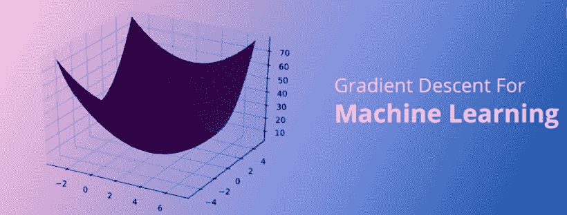
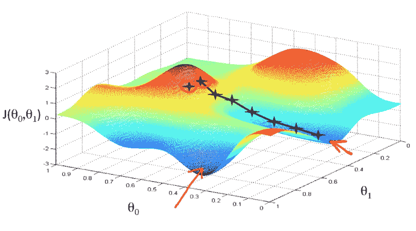
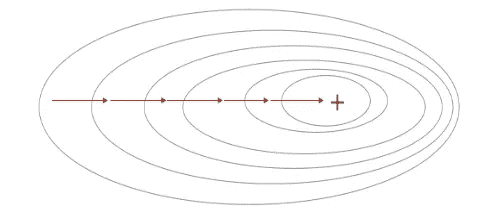
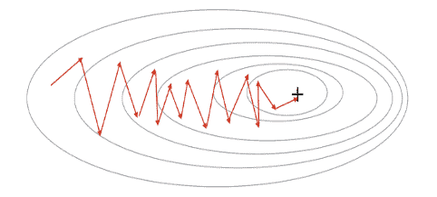
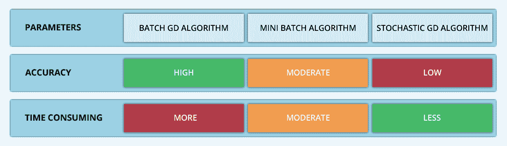
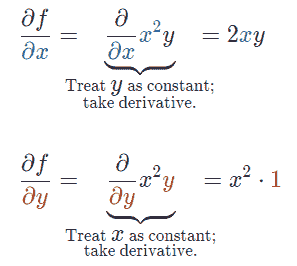
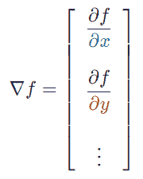
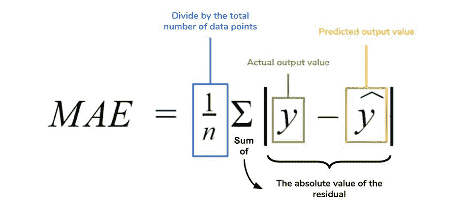
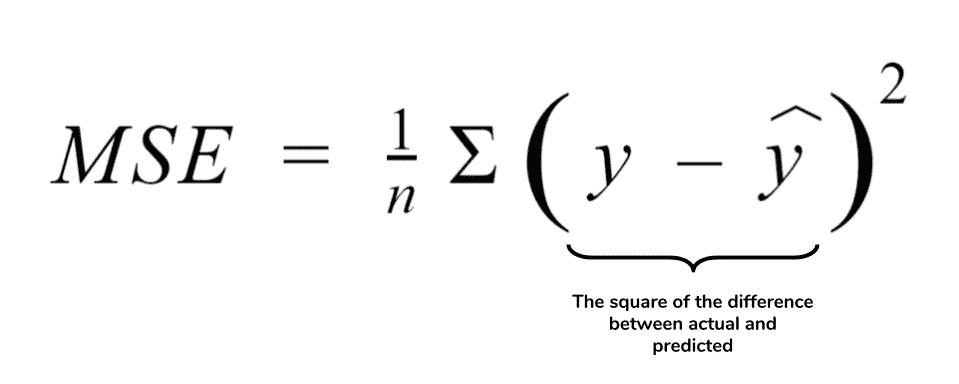
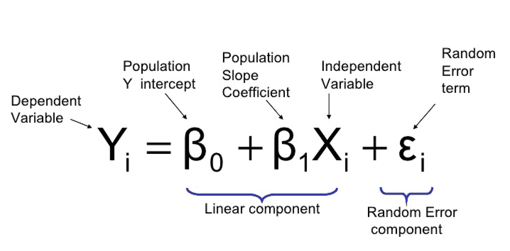

# 梯度下降背后的数学和直觉

> 原文：<https://medium.datadriveninvestor.com/the-math-and-intuition-behind-gradient-descent-13c45f367a11?source=collection_archive---------0----------------------->

**敏捷软件开发**定义了迭代产品开发过程，通过该过程执行以下步骤。

> *1)在进行市场调查后构建产品
> 2)将产品商业化并进入市场
> 3)衡量消费者满意度和市场渗透率
> 4)响应反馈并重复产品
> 5)R E P E A T💱 💱 💱*

这个过程本质上是*测试*市场，*收集*反馈，*迭代*产品，直到你以最小的误差达到最大的市场渗透率。这个循环重复多次，并确保消费者可以在每一步提供输入，以影响应该做出什么样的改变。

这种看似简单的不断迭代的过程，实际上体现在**梯度下降**的原理中。梯度下降可以通过首先计算成本函数的梯度，然后响应于梯度更新现有参数以最小化成本函数来实现。

梯度是把有许多变量的函数转换成一个向量，但我们将在后面讨论😉

*WOAHHHHHHHHH* 😵😵😵等等，这看起来超级复杂

你实际上会感到惊讶，但不要担心。

理解梯度下降背后的多元微积分可能是极其令人生畏的——我将解释梯度下降背后的**直觉**,并且只交流你理解所必需的数学概念。强烈推荐访问我的关于机器学习的 [**文章**](https://medium.com/datadriveninvestor/machine-learning-making-ai-way-less-artificial-and-even-more-intelligent-cc2d5cf11ac0) 或 [**视频**](https://www.youtube.com/watch?v=yvouUpxIqts&t=145s) 先复习一下基础知识！

# 梯度下降变体——不止一个

有三种用机器学习算法实现的主要变体——每一种在计算效率上不同，并显示出它们自己独特的优势。

## 1️⃣号

也许最简单的类型是**批量梯度下降**。这个整个过程可以被视为训练时期，其说明了训练向量被用于更新模型权重的次数。

在*一个历元*中所有训练点通过机器学习算法后，为训练集的**每个单独实例**计算批量梯度下降中的误差，并更新模型参数。

 [## DDI 编辑推荐:5 本让你从新手变成专家的机器学习书籍|数据驱动…

### 机器学习行业的蓬勃发展重新引起了人们对人工智能的兴趣

www.datadriveninvestor.com](https://www.datadriveninvestor.com/2019/03/03/editors-pick-5-machine-learning-books/) 

这种方法的误差梯度和收敛速度是稳定的，计算效率达到了足够的水平。然而，由于该模型仅在分析了整个训练集之后才迭代权重，因此收敛状态可能不是最佳状态——该模型可以实现更精确的状态！

## 2️⃣号

输入… **随机梯度下降**！这两种方法的根本区别在于，随机梯度下降使整个数据集随机化，并更新关于每个**个体训练示例**的权重和参数，而批处理方法在分析了*整个*训练集之后更新参数。

对模型的持续更新提供了更精确的改进率和更快的计算速度。然而，频繁的变化导致*噪声梯度*——这意味着它在**最小值**(成本函数最低的点)的一般区域内振荡。因此，每次测试都会存在一些差异。

好吧，这两种方法都有一些明显的优点和缺点——哪种方法更适合实现您的机器学习模型？恶作剧问题-都不是！

## 第三次是魅力 3️⃣🏅

进入… **小批量梯度下降**！这实质上结合了批量梯度下降的效率和随机梯度下降的整体稳健特性。

这种方法的工作原理是将数据集聚类成**个更小的批次**，通常在 30-500 个训练点之间，并为每个单独的批次执行模型迭代。这通过使用高度优化的矩阵来提高**效率**和**精度** ⭐️ ⭐️ ⭐️，从而减少了参数更新的差异

任何梯度下降变量都将使用以下公式进行建模。在每次模型经历**反向传播**之后执行该迭代，直到成本函数达到其**收敛点**。

> *其中权重向量存在于 x-y 平面中，并且关于每个权重的损失函数的梯度乘以学习率，并从向量中减去。*

**偏导数**是用于更新θ*o*θ*1*的**梯度**，α代表**学习率**，本质上是用户必须指定的超参数。m 表示更新应该停止的数字，I 表示起始点。

# **一些快速数学运算**

## ***偏导数***

我们知道多维输入的函数有**偏导数**，其中多变量函数找到*的一个变量*相对于其他变量*的导数作为常数*——但是所述函数的整个导数呢🤔

> *我们先来理解偏导数背后的数学。计算* ***多变量函数*** *像* f(x，y)=x y *可以分解成这样:*

好吧，我知道你在想什么——衍生品本身就已经很乏味和困难了；为什么要用偏导数而不是全导数！

嗯，函数输入由多个变量组成，因此有了多元微积分的概念。偏导数用于评估*每个独立变量相对于其他常量如何变化*。

## 梯度

梯度本质上是标量值多变量函数的*多维输入*的一维输出值。梯度表示指向函数最大增长率的**方向**的图形切线的斜率。这个导数代表我们的成本函数的倾斜度或斜率值。

本质上，任意给定函数 *f* 的梯度，一般用∇ *f* 来表示，是解释为一个 ***向量*** *的所有偏导数的*集合。**

> *想象站在* f *的间隔输入中的* (x0，y0 …) *点。向量∇* f(x0，yo …) *将识别哪个* ***方向*** *行进增加了*f*最快*的值。趣事* *📍梯度向量* ∇f (x0，yo …) *也垂直于* f *的轮廓线！**

*是的，多元计算绝对令人望而生畏😅我们总结一下。*

*偏导数是第 n 次的导数，它有 n 个偏导数，这些偏导数将每个单独的变量与其他的常量分开。梯度只是**把**每一个偏导数组合成 1 个向量。*

# ***学习率***

*梯度能够确定*方向*移动。学习率将决定我们所走的步的**大小。学习率本质上是超参数，*根据损失梯度下降定义神经网络权重的调整*。***

*该参数决定了当**在*的每一步*最小化成本函数**时，我们向最优权重移动的快慢。**高学习率**可以覆盖每步更多的区域，但会有超过最小值的风险；**低学习率**几乎永远无法到达马敏。*

**

*不管怎样，这种现象可以通过我的小侄子 Arnav 和他对狗的迷恋得到例证🐶 🐶 🐶*

*假设阿纳最疯狂的梦想实现了，他看到了华丽的拉布拉多猎犬——每只都是黑色的。很自然地，Arnav 会识别出一致的黑色，并将其作为他识别狗时寻找的主要特征。*

**

*假设他突然看到一只白色的狗，我告诉 Arnav 那确实是一只狗。由于学习率低(T21)，阿诺夫会继续相信所有的狗都有黑色的特征，这只狗只是个例外🐼*

*高学习率意味着 Arnav 会突然相信所有的狗都必须是白色的，任何与他的新假设不一致的地方都是不正确的——即使他之前说了 25 只黑狗。*

*理想的学习率意味着 Arnav 意识到颜色并不是给狗分类的一个重要属性，并开始发现其他特征。理想的学习率会比*好得多，因为它在**精确度和所需时间**之间找到了平衡。**

# ***成本函数***

*成本函数衡量**模型的性能**——通过*训练*我们的神经网络的过程，我们希望确保这个成本函数已经降低，直到它达到一个**最小值**。*

*成本函数本质上是**通过像平均绝对误差和均方误差这样的回归度量来量化*预测值*和*期望值*之间的总误差**。*

## ***平均绝对误差***

*平均绝对误差测量一大组预测中的**平均误差幅度**，而不评估它们的方向或向量。这可以通过下面的等式来建模。*

**

## ***均方误差***

*均方误差找出预测值和实际值之间的平均差平方。MAE 的相同原理，除了这些值是平方而不是绝对值。此度量标准不是表示坐标系内点与点之间距离的部分误差值，而是找到等于由测量点之间的距离产生的形状(通常为正方形)面积的部分误差。*

**

# ***梯度下降介绍(再次)***

*我们来探讨一个类比，进一步理解梯度下降的直观原理！*

**

***想象一下**你被困在珠穆朗玛峰顶，你的任务是到达底部——听起来相对简单，对吗？*

**好吧，有一个小信息要考虑——***你完全是瞎子** *。**

*这无疑增加了任务的难度，但并非不可能。你必须一小步一小步地前进，直到你开始向更高的倾斜方向前进。这种方法需要**无数次的迭代**直到你到达底部，但是你最终会到达那里。*

*这基本上模拟了梯度下降的概念，其中您的模型反向传播，最终到达山的最低点。*

*山类似于在空间中绘制的数据，步长类似于学习速率，感觉周围地形的倾斜类似于计算数据集参数值的梯度的算法。*

*假设正确，所选方向降低成本函数。山的底部代表机器重量的最佳值(成本函数已最小化)。*

****

# ***线性回归***

*对于那些不熟悉的人来说，回归分析在所有**统计建模**学科中使用，以调查预测分析的多变量函数之间的关系。*

*代表预期值和实验值之间的误差的线称为**回归线** -每个*残差*可以通过将它们的方差连接到最佳拟合线的垂直线来描绘。*

> **下面的等式显示* x *为假设监督学习的数据的* ***输入训练数据*** *(单变量和单输入变量-参数)和* y *为* ***标签*** *。**

**

*让我们用下面的例子来看这个问题。*

*Elon 在 salex 兼职担任营销总监，并收集了过去一年促销活动的支付金额与销售额的数据，以验证未来的销售和促销提案💡*

*Elon 的结论是，数据应该是线性的，并将信息解释为散点图，配有轴、新客户和支出金额。Elon 建立了回归线，以便更好地了解 salesx 将通过其新的营销理念获得多少客户。*

# ***多项式回归***

*线性回归很好地显示了数据集中两个相关变量的结构和趋势。然而，考虑到线性函数的行为，它们将不能准确地反映仍然明显表现出一些相关性的*非线性关系*的回归。*

***多项式回归**能够模拟*n 次*函数之间的关系，并且能够拟合某些数据集，其误差函数值**比线性回归线**低。*

*虽然多项式回归提供了更好的曲率拟合，并提供了两个变量之间关系的最准确表示，但它们对异常值非常敏感，很容易扭曲数据。*

****

> **感谢阅读我的文章，我希望你了解更多关于* ***梯度下降*** *以及这一原理如何推动机器学习和人工智能🙏如果你能做到以下几点，你将是我的一切！**

1.  *给我的文章发些**掌声**👏*
2.  ***在 [LinkedIn](https://www.linkedin.com/in/suraj-bansal/) 上连接**和我👈*
3.  *跟着我去✍️*
4.  ***查看**我的[作品集](https://tks.life/profile/suraj.bansal)了解我的最新作品💪*
5.  *关注我的旅程，订阅我的每月简讯🦄*