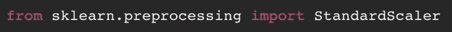
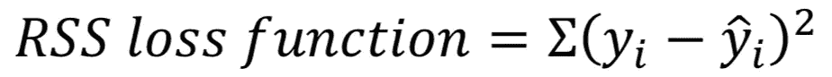
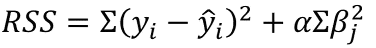
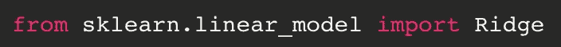
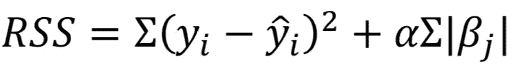
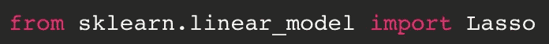

# 山脊正则化和套索正则化背后的数学原理

> 原文：<https://medium.datadriveninvestor.com/the-math-behind-ridge-regularization-and-lasso-regularization-c4473332dbda?source=collection_archive---------5----------------------->

“white printing paper with numbers” by [Mika Baumeister](https://unsplash.com/@mbaumi?utm_source=medium&utm_medium=referral) on [Unsplash](https://unsplash.com?utm_source=medium&utm_medium=referral)

这篇博客文章是一系列关于为监督机器学习模型选择和设计质量特征的策略的第一部分。

“你做什么就是什么。”“你吃什么就是什么。”这是我全心全意信奉的几个成语中的两个。作为一名新的数据科学家，这是我现在相信的另一句话:“垃圾进来，垃圾出去。”如果你的模型输入缺乏质量，你的模型输出将会很差。

特征选择和特征工程是数据科学过程中非常重要的方面；在选择(或创建)特征以输入机器学习模型时，深思熟虑是至关重要的。

对于任何预测模型，您都需要在偏差和方差之间寻求平衡。如果你的模型特征太少或者过于简化现实，你的算法将会使你的训练数据不足，并且可能不会在你的坚持集合中表现得更好。如果您的模型具有太多的要素或具有多重共线性的要素，您的算法将会过度拟合您的训练数据，并且不能很好地进行概化。

正则化是处理过度拟合或高偏差的有效工具。

当拟合一个模型时，你想要最小化你的损失函数，但是如果你的损失函数非常接近零，你就有过度拟合的危险。如果你的损失函数离零太远，你就有欠拟合的危险。正则化在损失函数中增加了一个惩罚项，以帮助处理这两种情况。

正则化的两种形式是脊和套索。

岭正则化，也称为 L2 惩罚，将平方你的系数。套索正则化，或 L1 惩罚，将采取你的系数的绝对值。L1 惩罚可以作为内置的特征选择(下面将详细介绍)。

**警告:**在使用任何一种正则化方法之前，您必须标准化您的所有数据(甚至是被屏蔽掉的特征)。正则化会影响系数的大小，因此所有预测变量必须在相同的范围内。缩放数据的一个快速方法是使用 Scikit-learn 的预处理库。

Importing Standard Scalar from Scikit-learn’s Preprocessing library.

一旦你的数据都是 z 分数，你就可以进行正规化。

让我们看一个例子…

使用监督学习，您可以进行线性回归，并选择残差平方和(RSS)作为损失函数。

Loss function for Residual Sum of Squares (RSS)

具有脊正则化的 RSS 看起来像这样:

RSS loss function with L2 penalty term.

山脊**平方**系数(𝛽j^2).阿尔法(𝛼)是缩放函数，确定正则化将产生的影响。如果您使用 Scikit-learn，alpha 通常设置在 0 和 1 之间(这是一个超参数，用于调整以找到最佳的惩罚项)。如果 alpha 等于 0，这将导致正则化损失为零，这意味着您在没有正则化的情况下进行回归。

Importing Ridge from Scikit-learn’s Linear Model library.

带有 Lasso 正则化的 RSS 看起来像这样:

RSS loss function with L1 penalty term.

注意，这个公式与上面的公式相匹配，但是现在罚项是系数的绝对值之和(|𝛽j|).如果您的模型正遭受高方差，套索正则化可能比岭正则化更有帮助，因为前者实际上会使系数为零。这使得 Lasso 成为一个内置的特征选择器。

Importing Lasso from Scikit-learn’s Linear Model library.

有兴趣了解有关特征工程和特征选择的更多信息吗？如果有，请关注我的简介，敬请期待！