# 超级商店的麦当劳化

> 原文：<https://medium.datadriveninvestor.com/the-mcdonaldization-of-superb-stores-20cbf9ccba34?source=collection_archive---------1----------------------->

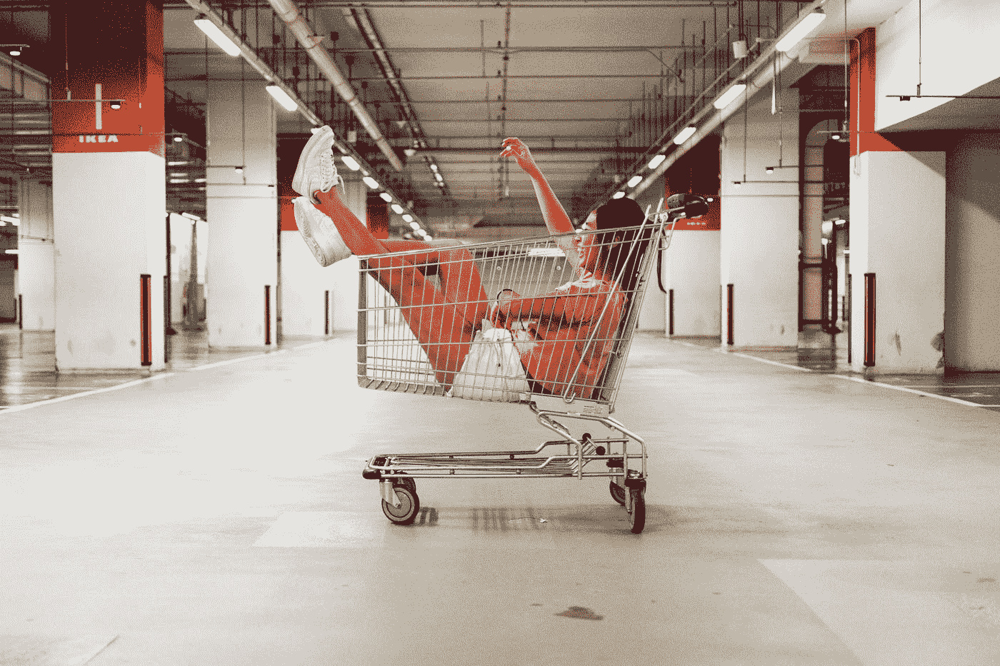

Photo by [Hanson Lu](https://unsplash.com/@hansonlujx?utm_source=medium&utm_medium=referral) on [Unsplash](https://unsplash.com?utm_source=medium&utm_medium=referral)

该商店于 1986 年在内华达州的斯帕克斯成立。对于我们这些住在丹佛的人来说，这个仓库位于怀俄明州夏延的一个大型设施中，提供了一天颓废的车程和时间，让我们在闲暇时仔细阅读各种户外装备和服装。它的减价区充满了交易、优步交易和荒谬的优步交易。虽然该公司涉足休闲服装和家居用品，但其核心产品从潜水服到迷彩狩猎装备，再到各种帐篷和靴子。这是一个齿轮猪的天堂，我是一个奉献者。

对于我们这些喜欢好交易的人来说，塞拉交易站是一个圣地。除此之外，还有……的退货政策。嗯，算是永远吧。如果你不满意，把它带回来。我很少做这样的事。我在那里买的大多数东西质量都很好，所以我不想退货。

早在 2000 年，我买了一件双层 7 毫米潜水服，带我进入南非 40 度的严寒水域，潜水传说中的沙丁鱼群。多年来，夏延之旅一直是那些可爱的全天游览之一，它不仅提供了一个穿越美丽的落基山脉乡村的机会，而且还提供了一个带着值得吹嘘的分数回家的机会。人们训练有素，员工敬业，质量有保证。

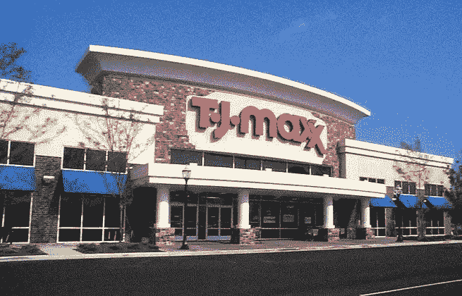

Glassdoor

## 零售世界之道

不幸的是，很多美好的事物都会走到尽头。Sierra Trading Post 在 2012 年以据称 2 亿美元的价格出售给了 TJMaxx 商店集团。慷慨的退货政策已经不复存在。突然，STP 开始到处出现。

一方面，它使齿轮更容易接近。另一方面，事情开始发生变化，而且不总是向好的方面发展。

在丹佛这里有几个 STP。原物离一个巨大的家庭用品商店大约五个门，现在是同一个家庭的一部分。第一家于 2014 年 8 月 28 日开业。最初，当我开始购物时，他们坚持原来的主题:户外装备，只有几个其他系列。目录保持不变，有许许多多的优惠券和优惠。乍一看，这似乎是一个伟大的想法，因为它使同样伟大的交易和商品提供给更广泛的公众。虽然我们中的许多人错过了悠闲地驱车向北进入怀俄明州牧场的借口，但在这里，我们可以缩短车程，找到几乎相同的东西。

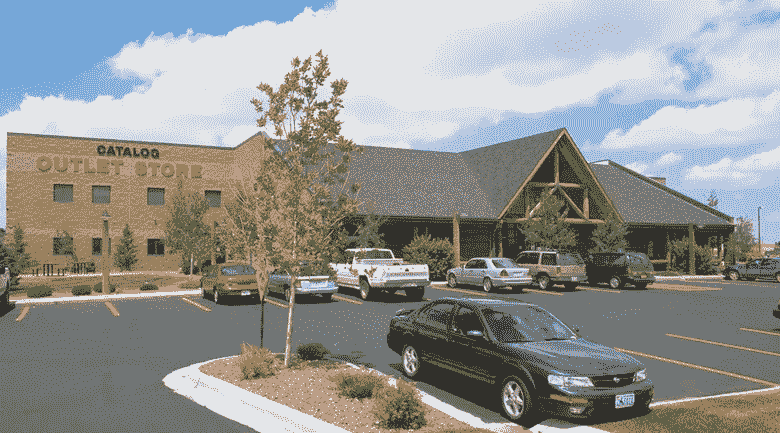

STP Headquarters Cheyenne

**企业品牌杀手**

去年秋天，为了让你了解是什么吸引我来到这家商店，我走近前门，被陈列的手工木制独木舟吸引住了。太棒了。半价时它仍然是 2500 美元，我不得不勒紧缰绳不去买它。我是一名皮划艇运动员；我肯定不需要沉重的木制独木舟。但它美得惊人。这种发现让我成为了一个长期忠诚的顾客。这是一件艺术品，差点被我的本田车撞上。有趣的是，当你在爱达荷州 Coeur d'Alene(另一个以时尚精品店闻名的小镇)的某个画廊购物时，挂在墙上的一件作品是一只几乎相同的独木舟。它们就是那么可爱。对于我们这些欣赏精致手工制品的人来说，这是最高级别的雕塑。

不幸的是，TJX 总部的买家就是不能放过好货。随着时间的推移，愚蠢的狗屎(在我看来)开始出现在“我的”齿轮商店。儿童服装，明确无误的 TJX 家居用品。尽管这种东西在同一家购物中心的五个门外就能买到。当一个全新的 STP 在城镇的最北端开放时，我去看看有什么可用的。当然，TJ Maxx 就在几个门之外，许多可用的产品在不同的商店之间难以区分。虽然 STP 仍然有很多装备，但越来越多的食品、家居用品、婴儿用品和与装备无关的垃圾已经像致命病毒一样渗入了我们心爱的麦加。

STP 不再是它自己的品牌。商店的部分区域看起来就像是一个垃圾场，不管无脑的买家说什么，“哦，去把它塞进 STP。”这就是被大公司收购的个体优质商店的方式。它变成了质量较低的 TJ Maxx。或者，换句话说，另一个沃尔玛，在那里你可以得到任何东西和一切，不一定很好，但嘿，它都在这里。我把这比作去自助餐，那里的食物很糟糕，但是，嘿，这是你能吃的全部！

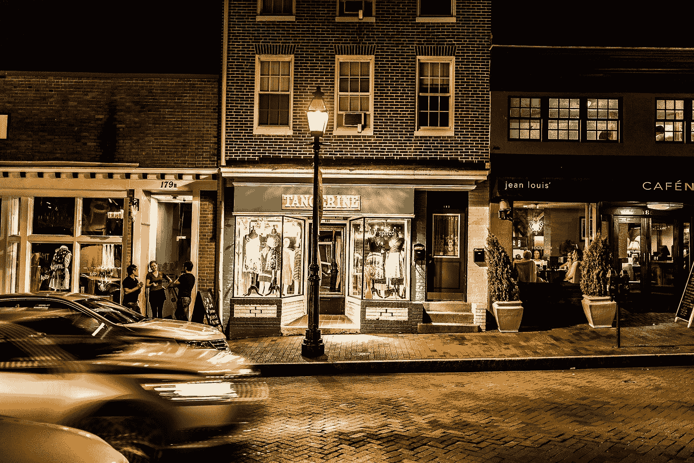

by [Mac Glassford](https://unsplash.com/@macglassford?utm_source=medium&utm_medium=referral) on [Unsplash](https://unsplash.com?utm_source=medium&utm_medium=referral)

## 性格的丧失

对于我们这些在超级商场和美国零售体验的沃尔玛化之前很久就在小城镇长大的人来说，购物就是细读那些反映主人情感和个性的独特小店。在我所在的佛罗里达州温特黑文小镇，我们有一家叫“蜜蜂巢”的令人愉快的礼品店，里面点缀着最迷人的小雕像和装饰品。它早已不复存在，成为沃尔玛、凯马特、梅西百货和其他大型便利店消灭地方色彩的众多牺牲品之一。

在一些城镇，比如我生活了大约三年的斯波坎，曾经有一些迷人的服装精品店，提供活泼的选择。当河滨公园广场购物中心搬进来时，所有的连锁店也搬了进来。独特的精品店消失了。大规模生产的服装和产品使我们所有的衣柜和房子看起来像乏味的浴室，没有兴趣和特色。

## *奇妙的商店依然存在*

斯波坎，像许多城市一样，有一个神奇的保留地:世界奇观([http://wondersoftheworldinc . com)/](http://wondersoftheworldinc.com/)，它已经成为一个机构很多年了。这家商店几十年来一直是一个里程碑，为购物者提供了难得的体验:来自世界各地的如此多的品种。每次走进去，都有新的东西。他们有霸王龙(名叫谢尔登)、熊和其他化石的巨大骨架，以及从龙、精灵和象牙海岸面具到最华丽的宝石和珠宝的一切。在我最后一次去那里时，我买了一对古色古香的中国古铜色马，这是马的长期主人帕米拉在一次房产拍卖中淘来的。如果你碰巧渴望阅读这种令人难以置信的收藏——我认为价格非常合理——这可能会激发你跳上飞机，那么访问他们的网站。我不能冒险去那里，否则我会喝得烂醉如泥。

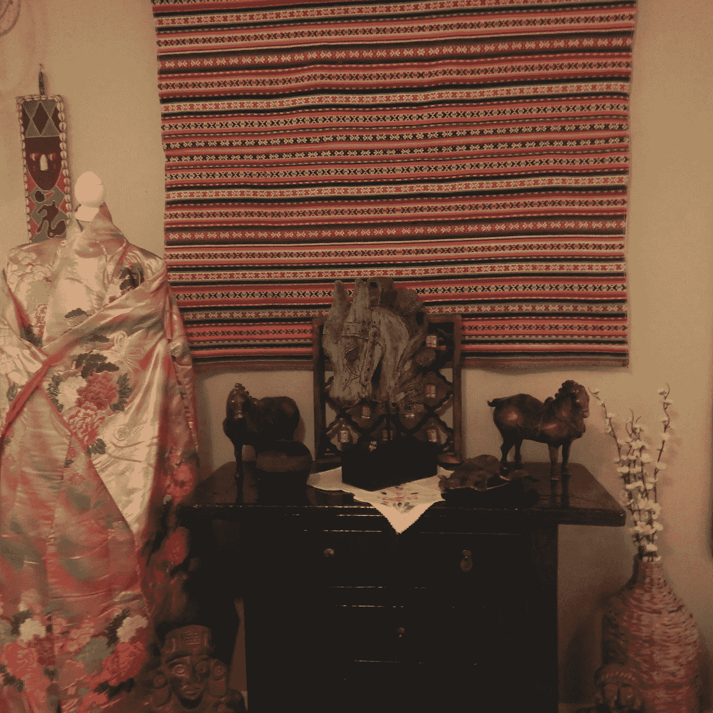

From my living room: the two Chinese horses, a Peruvian weaving, an Asian horse and an a genuine Japanese wedding gown. To the left, a Yaruba beaded belt from Africa. The dresser is an antique Asian piece from Indochine, another wondrous store in Boulder, CO.

这个地方的美妙之处在于它反映了帕姆的个性和她不拘一格的品味。这正是我的观点。正是店主的个性和独特性造就了如此迷人的商店，也让他们在这里闲逛成为一种享受。

现在承认，逛商店的乐趣让我变老了。我的高中朋友帕蒂强烈希望在购买之前能够触摸、感受、看到和试穿，但我们是婴儿潮一代。我们都不喜欢运费。甚至那些付钱给你的商店也剥夺了你视觉和触觉上的快乐，以及橱窗设计人员的精致创意。我那个年代的人仍然享受着看到、触摸、试穿和探索能带来一系列感官享受的产品的乐趣。

向任何一个纽约人询问圣诞节的奇妙之处，以及在上东区的商店里逛逛，看着令人瞠目结舌的展示是什么感觉。世界上没有一个城市比曼哈顿过得更好。这就是*艺术*，也是伟大的零售。如果你是纽约人或季节性游客，你会漫步于每年精心策划的最佳展览——仅仅是因为它们如此有创意和诱人。太神奇了。对我来说，零售应该是这样的:赏心悦目，有创意，吸引人。你想让我们买？提供诱惑。

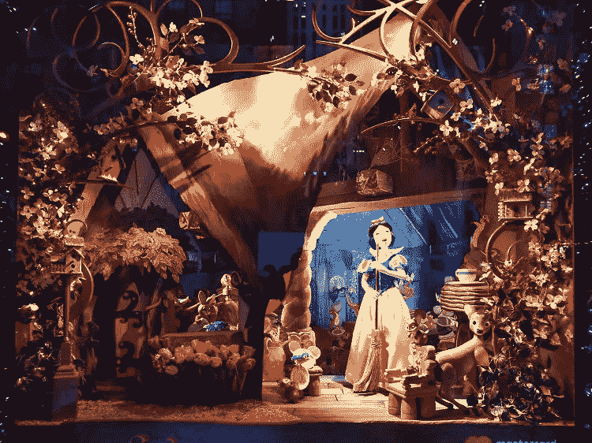

Saks Fifth Avenue window display for Christmas

在离我不远的博尔德，一家名为 Indochine([https://indochinehomeimport.com/](https://indochinehomeimport.com/))的亚洲主题商店出售从古代佛像到寺庙狗的古董。如果你想与众不同，它们也不便宜，这是问题的一部分。为了在大型零售商的冲击下生存下来，这些精品店有时不得不收取额外费用，因为租金上涨，而且我们中的许多人都在主流中游泳。然而，除非你像我一样周游世界，带回家你自己独特的宝贝，否则像 Indochine 这样的商店会让你的环境充满个性。

20 世纪 70 年代，我住在曼哈顿的住宅区，只要走另一条路回家，到东 58 街，就有上百个机会享受文化多样性、巨大的创造力和视觉自助餐的丰富混合。这是美国巨大魅力的一部分:我们的个性，我们独特的风格和品味。相信我，我在军队呆过一段时间，在那里我们在编队时看起来确实很像，当我有自己的时间时，我想看起来有创意。

## **我们失去了什么**

全美国有太多像 Wonders 和 Indochine 这样的商店正在关闭、消亡或被更大的公司收购，这些公司的买家拥有潮水般的创造性智慧。企业似乎认为我们作为一个普通的社会喜欢可预测的、安全的和*相似的*。这种美国品味的同质化也体现在我们的服装上。随着精品店老板退休，他们为了享受应得的退休生活而出售(我不怪他们)。不利的一面是，我们失去了他们给我们生活带来的个性和社区。

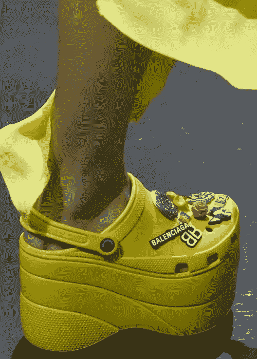

## 至于时尚…

有趣的是，时尚是我们真正可以尝试的少数领域之一。几年来，我写了一些关于时尚的文章，因此，我对这个话题的了解可能比一般人多一点点。然而，我已经倾向于阶级和清醒，这在许多情况下是遥远过去的时尚特征。如今，发现有吸引力的、赞美的和奉承的时尚是一个笑话。设计师不仅已经堕落到彻头彻尾的丑陋，他们也为你的与众不同付出了更多的代价(同时也向全世界宣传你的低级趣味和空空如也的银行账户)。与 80 年代的垃圾主题(也以巨大的垫肩和极度的过度为特征)没有什么不同，这种对美丽的侮辱感觉就像是对与众不同的绝望。是的——以任何常识或美感为代价。

要快速浏览这些极具侮辱性的选择，请参见[http://www . business insider . com/ugly-clothes-is-in-style-2018-2 # moschino-cape-sheer-overlay-dress-895-8](http://www.businessinsider.com/ugly-clothes-are-in-style-2018-2#moschino-cape-sheer-overlay-dress-895-8)。如果你真的想娱乐一下(比如，花 400 美元买一条牛仔裤，让你看起来像是真的把手弄脏了，而实际上你并没有)。

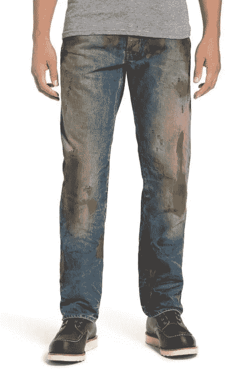

Buzzfeed

有很长一段时间，我从 J. Peterman 公司购买非常棒、非常酷、制作精良的服装，该公司在 heydey 购买了《走出非洲的 T2》和《T4》泰坦尼克号的服装复制权。我仍然保留着一套梅丽尔·斯特里普在非洲*拍的婚纱的完美复制品*，它是一件艺术品。这条裙子，除了帽子:

Biltmore

是啊。穿像这样的衣服去参加一个晚上的活动。这是一件丝绸雕塑品——时尚就应该如此——优雅而华丽。还有*好玩的*。

无可挑剔的阿玛尼夹克是我在舞台上专业演讲的主要内容，彼得曼有时古怪但总是精致的衣服给我的衣柜增加了额外的冲劲和勇气。我仍然拥有一件飘逸的天鹅绒礼服，它是仿照俄罗斯公主 ca。20 世纪早期。它不仅仅是华丽的，而且是一个表演秀。

这里有一个彼得曼全盛时期的完美例子:

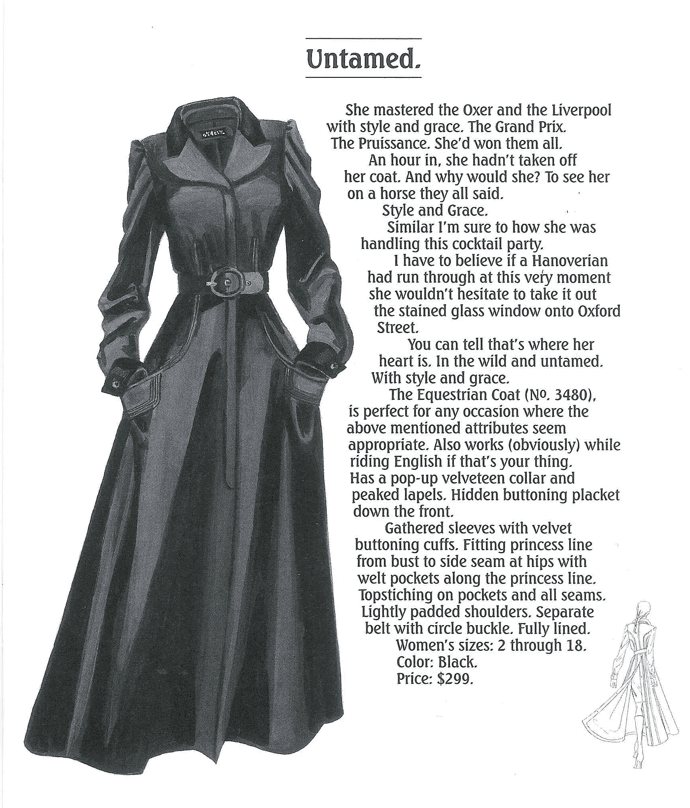

这是彼得曼的一部分，现在已经不复存在。我简直想哭。

## 美国设计师的丧钟:企业贪婪

不幸的是，彼得曼破产了，因为他扩张得太快了。虽然彼得曼买回了他的公司，细长的目录仍然以诙谐的文字为特色，使他们的作品几乎无法抗拒，但我已经多年没有从他们那里买过东西了。他们的服装就像你在梅西百货看到的任何东西一样乏味、可预测、单调。相同的基础年复一年地出现。这不是赞美。写作仍然很棒，但服装就像走进今天没有血的香蕉共和国一样无聊，一家在 Gap 接手后就失去了灵魂的商店。这种差距让这个曾经非常酷的品牌失去了所有的个性。不再是了。事实上，人们是这样回应的:Gap 已经关闭了大约 200 家商店。

这就是所谓的*反馈。*

另外两位美国偶像也落败了:汤米·席尔菲格和拉尔夫·劳伦([https://www . fast company . com/3062474/the-decay-of-premium-American-fashion-brands-what-happen-Ralph-tommy](https://www.fastcompany.com/3062474/the-decline-of-premium-american-fashion-brands-what-happened-ralph-tommy))。两家公司都迅速扩张到工厂直销店，削弱了它们的品牌价值和声望。他们并不孤单。我年纪大了，还记得卡尔文·克莱恩和安妮·克莱恩是比较高端的品牌的时候。现在你可以在几乎任何地方*买到他们的东西(仅此而已，质量低劣，大量生产的普通*东西】*。*当想穿 Ralph 的消费者意识到其他人也可以穿的时候，为什么还要费事呢？曾经的帝国现在只是一般。香草味。这些系列中有许多都有奢侈品，但当企业利益淡化了这个品牌，让它以平淡无奇的版本出售，与你在凯马特(KMart)能买到的任何东西没有区别时，那么即使花几千美元购买其中一件，也感觉像是蓝光特价。美国人喜欢便宜货，所以假的所谓“设计师”工厂直销店像粉刺一样在美国遍地开花。这些商品通常是为工厂商店提供的，这些商店的目的是——并成功地——愚弄美国消费者，让他们相信他们以更低的价格买到了好产品。不，你仍然在为一件垃圾商品支付额外费用，不管是耐克鞋还是餐具。

在过去的几年里，当我还在逛我当地的内曼·马库斯商店时，我注意到阿玛尼曾经辉煌的产品已经呈现出大规模生产的外观和感觉，你可以在塔吉特百货买到任何东西。如果是这样的话，那么请告诉我为什么我们要为一个缝在平庸垃圾上的曾经受人尊敬的名字支付一大笔钱？

## 你为不同的付出昂贵的代价

如果你想要制作精良但又有创意的东西，那就准备好花一大笔钱吧。我最喜欢的服装设计师包括 Jacquemus，Monse 和 A.W.A.K.E .然而，我所能做的就是看。请注意，一件典型的棉质蒙塞女衬衫很容易就要花掉你 1200 美元。因为我们喜欢折扣，而且几乎所有这些非常昂贵的商品最终都会出现在“仓库”网站上(也就是说，Net-a-Porter 商品最终会出现在 Outnet 网站上)，设计师们将它们的价格定得如此之高，以至于即使是 90%的折扣也太贵了。想象一下，一双零售价为 7900 美元的高筒靴，你可以以 90%的价格买到。那仍然是一千美元的大部分。我不能为其他人说话，但因为我知道这些鞋子会磨损，就像我的 39.00 美元 TJ Maxx Vince Camutos 一样，不值得。

一件 Monse 罩衫比你的抵押贷款还贵(我最喜欢的一件 Monse 罩衫售价 2112 美元，是棉质的，非常感谢)。这是今天创造力的成本:

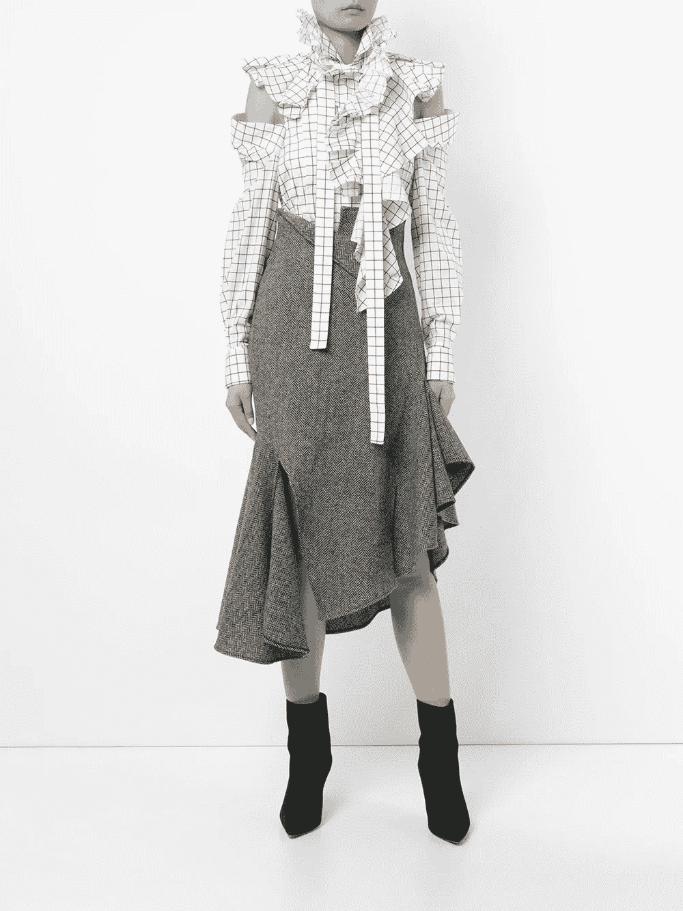

Farfetch.com

最终，像许多其他东西一样，它只是以一种有趣的方式扔在一起的几块棉花。嘿，如果你有这些资源，那就好好利用吧。我们大多数人都不知道，因为我们的医疗费用。我喜欢前卫、古怪的样子。我只是不能支付相当于两笔抵押贷款的金额来显得有趣。

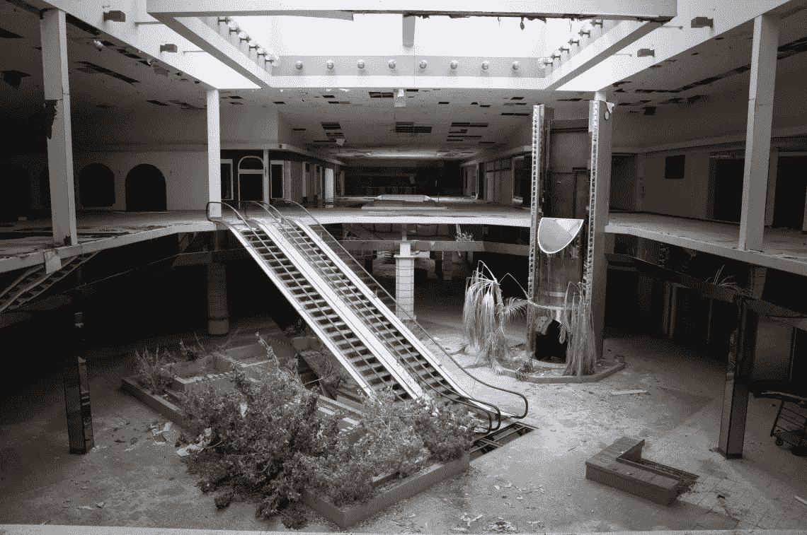

Thought Catalog

## 美国购物中心的演变/转移

美国购物中心现在已经正式死亡，巨大的废弃地产空间曾经拥有数百家迎合年轻一代的商店。贪婪造就了这些帝国，糟糕的战略决策导致提供我们不再想要的垃圾。如果你喜欢，你可以责怪亚马逊，但对于我的零售美元，我认为美国零售业的公司化从如此多的创新品牌中抽走了创造性的血液，这与它有更多的关系。我们厌倦了，与此同时，我们也厌倦了混乱的停车场、没完没了地走路去看同样的垃圾，以及把购物作为我们主要的娱乐来源。我们集体开始反对——通过呆在家里、在网上购物和其他各种方式来表达我们对食物的不满。

## 样式图标

我们不是没有灵感。几乎没有。如果说现在有什么不同的话，那就是越来越多的例子展示了酷和创造性。只是成本和有趣的装备的耐磨性的结合使得这很难。

Lady Gaga 重新定义了创意，她重新定义了一代人的品味。不幸的是，我们中没有多少人能穿上(或买得起，或走进)她的作品，它们在美国企业界也不受欢迎，这个帝国铲平了他们为挖掘潜力而购买的服装店的创意巅峰。谈谈杀鸡取卵。

至于男士时装，虽然我可以欣赏一点创意，但这是男士设计师的创意，只是简单的*愚蠢的*:

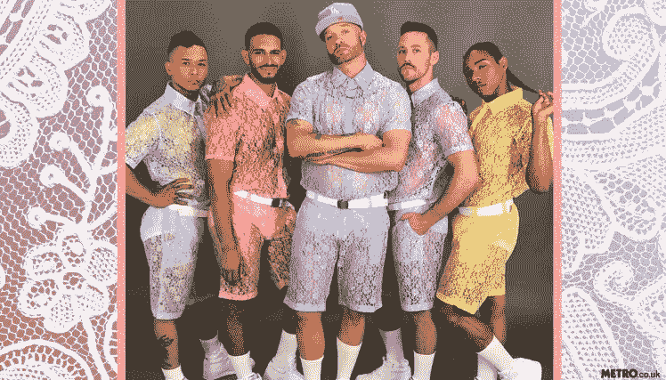

Metro

现在看，我可以看到 LGBT 群体的成员为这一趋势喝彩，对此我没有任何问题。然而，我很难看到瘸子们穿着这件衣服与血族对抗。血会笑死。游戏结束。

虽然一方面我理解为你的工作场所着装的需要，为你的客户着装(阅读，在许多情况下很保守)这并不意味着一个军队…

## 一样一样一样

开车到附近的城镇和城市，其他州曾经是一个有趣的冒险，看看可能存在的各种个性驱动的商店。我们现在生活在一个到处都是相同的旧的同质化垃圾的零售荒地，无论是零售商店还是娱乐场所。这种同质化从我们的城镇偷走了创造力、快乐、生活和多样性，在那里找到一个蹩脚的米奇 Ds 比找到一个仍然知道如何制作美味烤奶酪的餐馆要容易得多。好消息是，部分由于我们丰富的移民遗产，我们可以享受埃塞俄比亚食物，souvlaki，印度咖喱或上千种菜肴来挑逗味觉，即使我们的零售选择变得愚蠢。然而，在我们的零售选择中缺乏类似的多样性——让我重新表述一下——可获得、可负担的零售选择——导致了美国购物中心的消亡，零售工作的流失(这对妇女和少数族裔的打击最大)[http://www . career arc . com/blog/2017/06/retail-启示录-裁员-2017-facts-stats/](http://www.careerarc.com/blog/2017/06/retail-apocalypse-layoffs-2017-facts-stats/) 。

在 2002 年汤姆克鲁斯的惊悚片*《少数派报告》*中，故事发生在 2054 年，描述了 20 世纪 80 年代一个大型购物中心的场景。好莱坞只是假设购物中心将永远是美国生活的主要部分，从逛购物中心的老年人到穿着腰包和 LED 照明运动鞋在购物中心爬行的孩子。

*并非如此*。

在 20 世纪 90 年代，美国有 1500 家购物中心。今天，我们减少到 1000 家，部分原因是百货公司的大规模离开(和消亡)。几十年后，典型的美国购物中心将成为遗迹。它们现在被重新用作轻轨站、老年生活区、教堂、医疗诊所、健身中心([http://www . business insider . com/what-will-happen-to-closed-malls-2017-5 # before-the-department-store-1](http://www.businessinsider.com/what-will-happen-to-closed-malls-2017-5#before-the-department-store-1))。我觉得不错。

那么，我们为多样化做些什么呢？我们需要变得更有创造力，这就是原因。

## 走民族风

想要一些想法吗？一方面，民族时尚提供了丰富的种类和色彩，而不会花光所有的钱。这条裙子不到 32 美元，如果搭配稍微保守一点的上衣/夹克，会让你在办公室里大吃一惊。

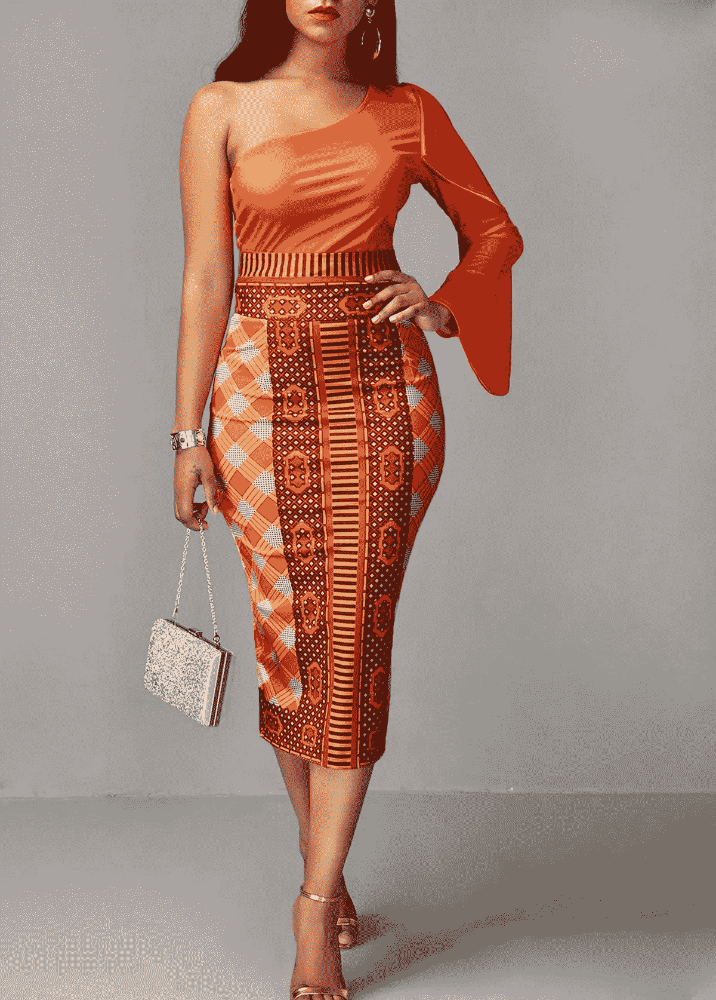

Rotita.com

好消息是，像这样的产品无处不在，包括网上。你不必花你孩子的大学基金来让自己看起来有创造力和有趣。许多优秀的零售商努力工作——同时对抗在线趋势——以提供这样的产品。因为我周游世界，所以我只花很少的钱就能买到当地民族和部落的服装。我从来没有预见到自己的到来，而且只需要很少的调整或完成这些作品就可以穿了。有很多人，比如我在斯波坎的朋友帕梅拉，他们不仅在世界各地寻找灵感，还在从工厂商店、大规模生产的企业垃圾思维中跳出来时，寻找这些既能取悦眼睛又能取悦身体的相同作品。此外，我非常难过地注意到，如今几乎任何带有劳伦标签的东西都会很快分崩离析。这就是美国企业如何侮辱我们对品牌的投资。

Photo by [Alexandre Godreau](https://unsplash.com/@alexandre_godreau?utm_source=medium&utm_medium=referral) on [Unsplash](https://unsplash.com?utm_source=medium&utm_medium=referral)

**请光顾你当地的激进派**

所有最好的美国品牌的公司收购和吸血鬼般的吸血，那些以合理的价格为我们提供酷的选择的商店，在很大程度上已经死亡。目前仍有少数人坚持己见。我的建议，值得一提的是，*资助你当地的激进分子。*满怀热情地去世界奇迹、印度支那和其他商店购物，这些商店提供了其他人没有的选择。奖励和重视发明、创造和*合理的定价。*随着我们进入未知的关税水域，这将直接影响由廉价(和童工/奴隶)劳动力在海外制造的服装成本，价格将会发生变化。也许这是件好事。也许到那时，我们会再次投资于制作精良、质量上乘、能穿几十年的衣服，而不是 H & M 那种只穿一次就扔掉的衣服，这种衣服加剧了世界上第二大污染问题([https://www . eco watch . com/fast-fashion-is-second-dirty-industry-in-the-world-next-big-1882083445.html](https://www.ecowatch.com/fast-fashion-is-the-second-dirtiest-industry-in-the-world-next-to-big--1882083445.html))。需要考虑的事情。

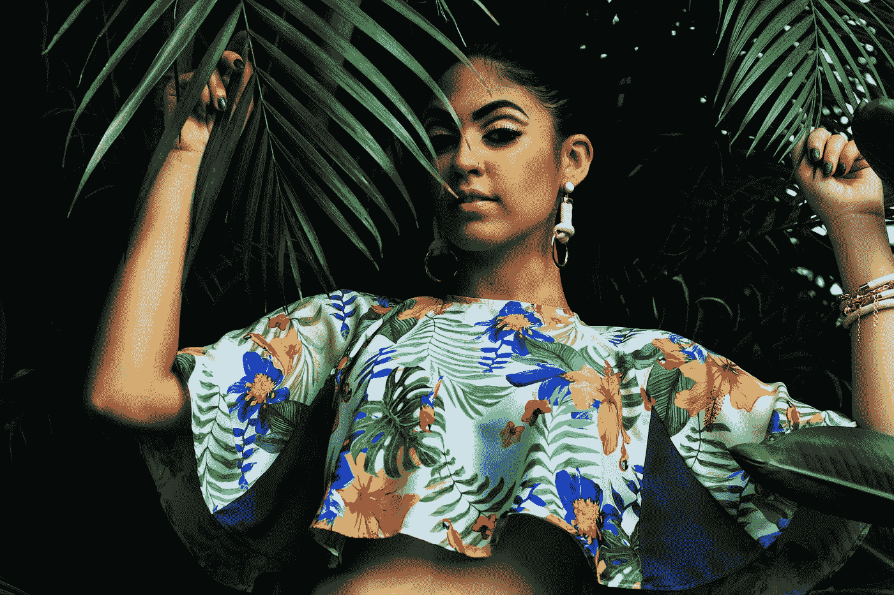

by [Caroline Veronez](https://unsplash.com/@veronezcaroline?utm_source=medium&utm_medium=referral) on [Unsplash](https://unsplash.com?utm_source=medium&utm_medium=referral)

## *获得创意*

走复古路线(重新发现真正制作精良的服装)。扔掉你的垃圾。租一个壁橱清理器。那么从现在开始，只买你能负担得起的最好的东西(这是一个非常好的建议，可以买衣服、汽车和其他任何东西)，不要穿耗水量大的 t 恤。选择阶级，而不是粗俗、可笑、设计无礼、制作拙劣的所谓“时装设计师”我知道我要求很多。然而，这些选择对我们的环境有着巨大的影响，它们也反映了我们所有人内心新生的个性。

让我们迎合勇敢的零售商，他们为我们所有人提供小商店，激起我们的好奇心，吸引我们的感官，增加我们环境的丰富多样性。收回你的城镇，你自己的个性，奖励那些不会出卖给公司化的无名沙漠的无畏者。