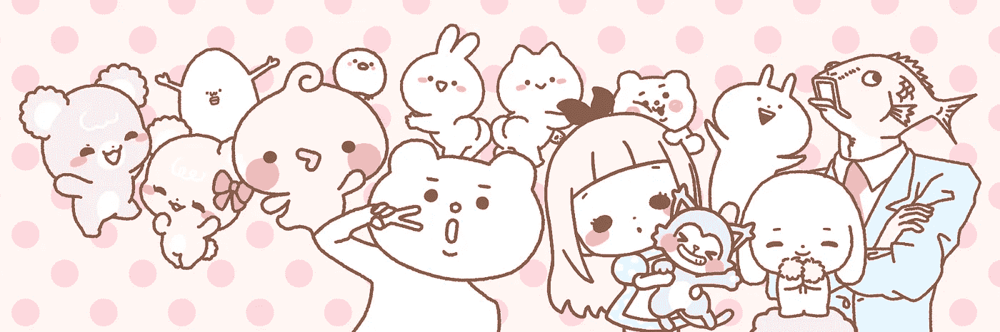
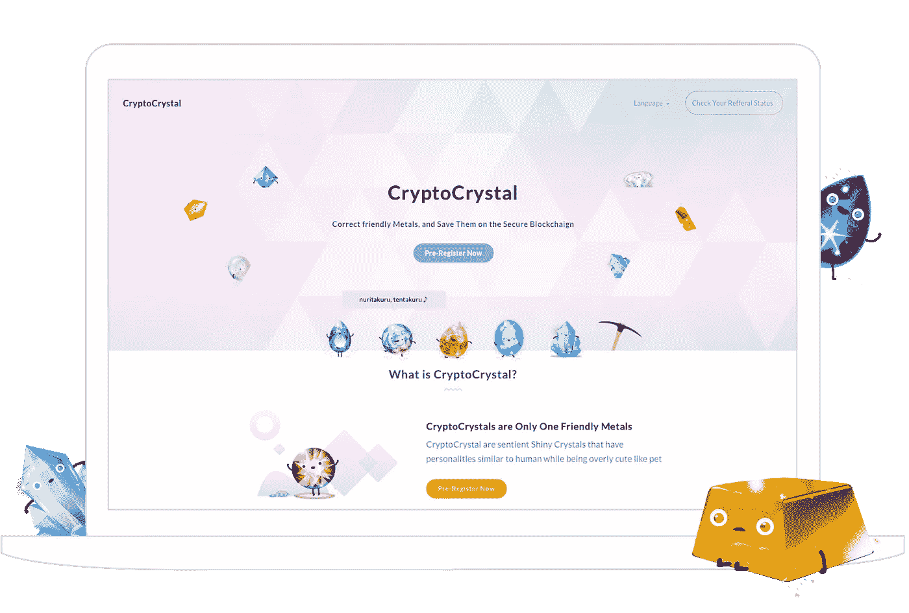

# 区块链上创造的人物的意义

> 原文：<https://medium.datadriveninvestor.com/the-meaning-of-characters-created-on-blockchain-d557b81bcd74?source=collection_archive---------17----------------------->

总而言之，我开始为手机制作内容已经超过 10 年了。在过去的几年里，我一直专注于塑造角色。为什么是人物？为什么是区块链？我总结过为什么；谁有三分钟时间，请读一读。

10 多年来，我一直在策划和制作各种内容。在那段时间的某个时候，我开始想知道当你分解内容的组成部分时，最小的单位是什么。

以游戏和电影为例，其内容的组成部分是像人物、演员(配音演员)、世界观、剧本、视觉表达、音乐、游戏方法(规则)和社区(根据具体内容有多有少)。

这些组成部分的含义/意义和相互关系随着时代不断变化。

从几年前开始，当我决定要把全打造成第一，也是世界上唯一的一家公司时，我开始想，也许我应该在这些组件中完善一个。

http://quan-inc.jp/en/

***为什么人物？***

全专注于内容的“性格”部分。这是因为角色是内容的组成部分，有机会利用互联网的力量在世界范围内传播意识，而不依赖于语言。此外，日本有很多有才华的角色创作者。我相信这将是最有意义的。

因此，全在过去五年中创作的人物数量已超过 300 个，并通过与 LINE、、微信、等平台合作，以聊天贴的形式在全球范围内获得了超过 24 亿次下载。我认为，我们之所以能够在短短五年内让来自世界各地的这么多人了解我们的角色，完全是因为我们生活的这个时代——互联网。

[https://cryptocrystal.io/](https://cryptocrystal.io/)

***为什么是区块链？***

我们用 CryptoCrystal 制作的角色与传统互联网有很大不同。在 CryptoCrystal 上，当用户收集了晶体并将这些数据记录在区块链上时，这些字符首先被创建。在这一瞬间，使用该应用程序的用户以及区块链上的任何人都可以看到这些角色的数据，并使用它们。

换句话说，我们不是简单地提供角色，角色是诞生在区块链上的公共存在。

这使得区块链上的角色在公共场合与技术专家、制作专家和为他们加油的粉丝一起演变成新的内容成为可能。

同样，作为结果，基于所发行的代币，在通过该过程参与的用户之间可以产生新的经济(代币经济)。我觉得这样的节约是不可避免的。

***人物商业模式同区块链***

在某一点上，当迪士尼创建其风格指南(其角色和标志的使用手册)时，允许其合作伙伴(被许可方)创建基于角色的产品，角色业务迅速增长。

然而，50 多年来，角色许可证的基本商业模式一直没有改变。许可方(角色开发)、被许可方(产品的创建、模拟请求/同意/报告)，以及购买商品的粉丝。

我们相信，随着这种包括新角色开发在内的代币经济的出现，自主许可系统和粉丝/社区将通过区块链得以创建，角色许可业务的模式将发生重大转变。

当然，离彻底革命还有一段时间，但是我现在写这个决议，使全成为一个可以打开通往这个革命时期本身的道路的东西。

当然，这种变化也会发生在角色行业之外的所有其他行业。