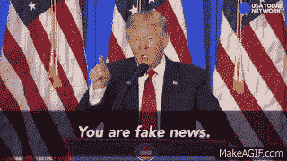
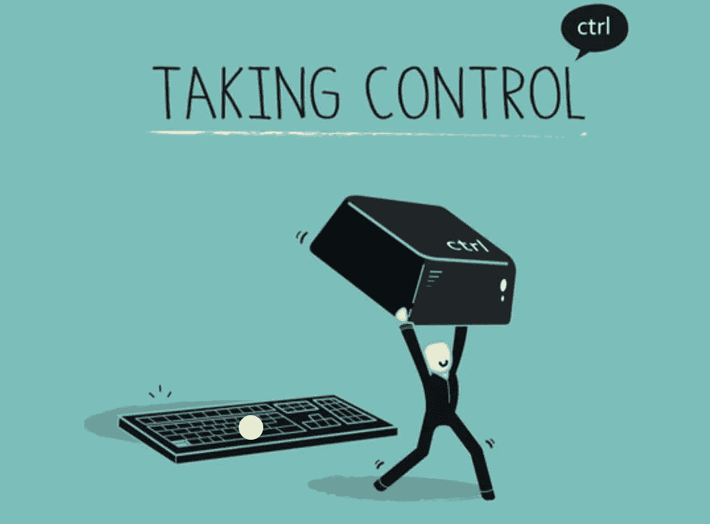

# 媒体:我们将何去何从？

> 原文：<https://medium.datadriveninvestor.com/the-media-where-do-we-go-from-here-5b631cfe0f6f?source=collection_archive---------37----------------------->

作者:阿朗德拉·希门尼斯

Photo Courtesy of brafton.com

今天，媒体被技术所控制。通过使用各种技术进步，媒体已经能够扩展其平台。近年来，媒体产生了大量的信息。新闻的涌入导致了人工智能等事物的发展，在人工智能中，互联网根据读者的兴趣分享信息。这种新闻的大众消费也导致了像机器人这样的互联网程序的产生，这导致了虚假叙述的传播，或者正如总统所说的“假新闻”。

Photo Courtesy of reddit.com

通过使用人工智能，脸书和谷歌等网站已经采用了这种新的算法来帮助改变搜索结果，以匹配用户的喜好。例如，基于用户可能点击的内容，互联网能够为用户提供服务。据我所知，这个新算法对用户来说似乎是个好主意。在人工智能的使用中发现的潜在问题是，用户被剥夺了接收可能挑战他们的想法或加深他们对某些事情的理解的新闻的权利。这体现在脸书创始人马克·扎克伯格的声明中，他说"[死在你家门前的松鼠可能比死在非洲的人更与你的利益相关"](https://www.ted.com/talks/eli_pariser_beware_online_filter_bubbles?language=en)。这表明，这个新系统将迫使我们的新闻供稿透露信息，这将使我们处于一个泡沫中，在这个泡沫中，我们不会暴露于外部世界。

技术不仅鼓励一种狭隘的获取信息的方式，而且也可能为“假新闻”提供平台。像机器人这种可以像真人一样与用户互动的互联网程序的引入会在媒体内部造成严重伤害。这在 twitter 中非常普遍，自动 Twitter 账户能够发送推文。通过使用机器人，虚假信息被创建，目的是“[操纵股票市场，让人们选择危险的医疗保健选项，并操纵选举，包括去年的美国总统选举](https://www.technologyreview.com/s/608561/first-evidence-that-social-bots-play-a-major-role-in-spreading-fake-news/)”。在这种情况下，当这些项目开始对总统选举和其他决定我们社会福祉的问题产生负面影响时，它们就会成为一种威胁。

这对媒体的未来意味着什么？技术不是威胁，但是，当用于错误的目的时，它可能是危险的。对媒体如何使用技术进行某种形式的监督是很重要的。在这种情况下，它将防止像机器人这样的东西传播“假新闻”，防止人工智能限制我们可以访问的内容。如果不采取行动纠正这些技术进步的缺陷，那么媒体将成为实现自己秘密议程的工具。此外，如果技术被赋予了自己的思想，它可能会通过媒体渗透到消费者的思想中。我们应该控制技术，而不是技术控制我们。

Photo Courtesy of weheartit.com