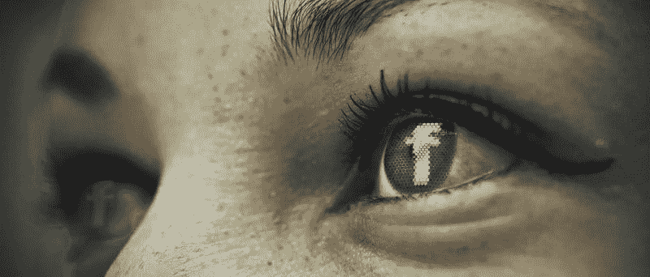
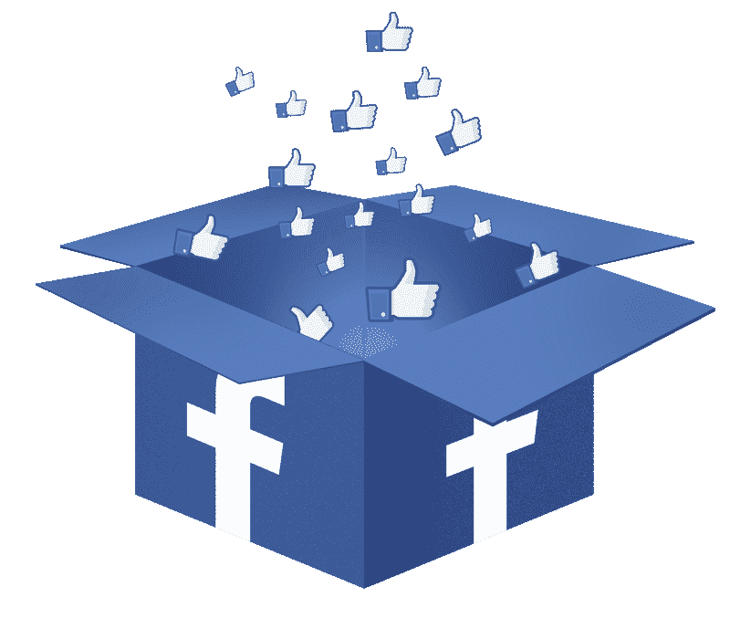
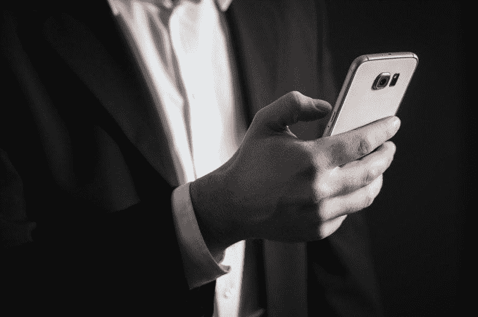
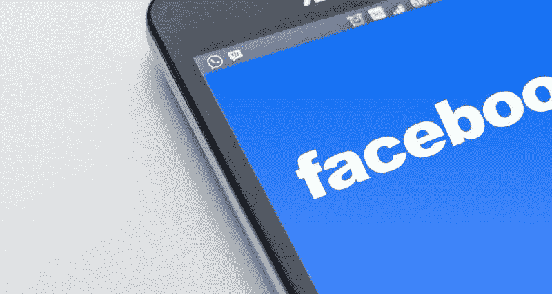
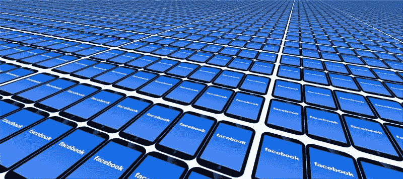
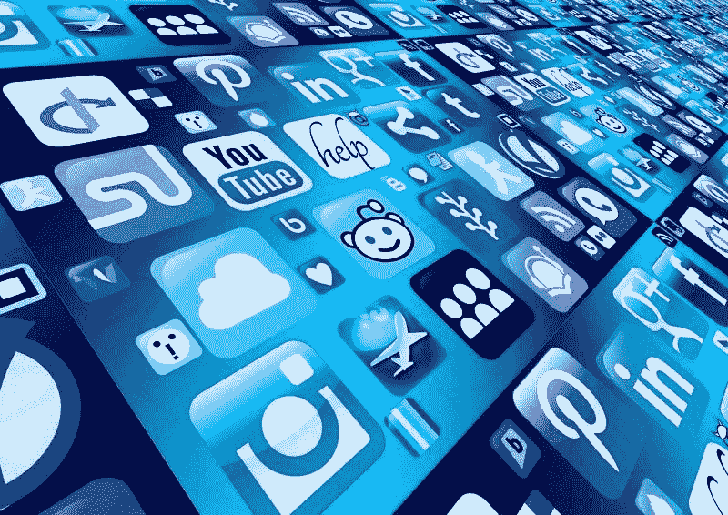

# 媒体为川普寻找新的替罪羊:脸书和扎克伯格——市场狂人

> 原文：<https://medium.datadriveninvestor.com/the-medias-new-scapegoats-for-trump-facebook-and-zuckerberg-market-mad-house-2a5fc0f1dc55?source=collection_archive---------10----------------------->

媒体和民主党机构为唐纳德·j·特朗普总统(纽约州共和党)的成功找到了新的替罪羊。那些替罪羊是脸书；其创始人兼首席执行官马克·扎克伯格和社交媒体。

这种替罪羊背后的理论是，普通人是扎克伯格和特朗普可以通过按键控制的无脑野兽。因此，扎克伯格可以通过挥舞魔杖来保证特朗普连任。

 [## 社交媒体收听让您随时了解|数据驱动型投资者

### 虽然社交媒体倾听是一种顶级趋势，但它应该是每个现代营销策略的一部分。保持和谐…

www.datadriveninvestor.com](https://www.datadriveninvestor.com/2019/02/26/social-media-listening-keeps-you-plugged-in/) 

最近的头条新闻显示了这种病态的想法。例如:

[*“脸书和推特散布川普的谎言，所以我们必须拆散他们*](https://www.theguardian.com/commentisfree/2019/nov/02/facebook-twitter-donald-trump-lies) *，*美国前财长罗伯特·赖克在*《卫报》*，2019 年 11 月 3 日。

[*“对脸书发号施令的共和党政治老江湖*](https://popular.info/p/the-republican-political-operatives) *。**热门资讯*快讯 2019 年 10 月 17 日。

此外，“ [*脸书如何改变川普 2020 年连任竞选*](https://markets.businessinsider.com/news/stocks/how-facebook-could-change-trumps-2020-re-election-bid-2019-11-1028653099) *，*”Gina Heeb 于 *Markets Insider* ，2019 年 11 月 2 日。

还是这个宝石:“ [*马克·扎克伯格是恐怖秀*](https://www.washingtonpost.com/lifestyle/style/mark-zuckerberg-is-a-horror-show-but-theres-a-glimmer-of-truth-hidden-in-his-latest-blunder/2018/07/20/023c46da-8c1b-11e8-8aea-86e88ae760d8_story.html)”2019 年 7 月 20 日*华盛顿邮报*。

令人不安的是，脸书的罪行出现在*流行信息中；在赖克看来，拒绝审查政治广告是尊重美国宪法第一修正案的权利。赖克担心川普可能赢得明年的总统大选，因为脸书尊重川普的言论自由。*

此外，总统候选人杨安泽的第一个电视广告是扎克伯格的照片和挑战大型科技的承诺。我有一种感觉其他政客；包括川普本人在内，都将追随杨的脚步，加入到痛击的行列中来。

# 新的特朗普阴谋论:归咎于脸书

特朗普/脸书的阴谋很简单，扎克伯格以某种方式操纵脸书的帖子或新闻源，只显示支持特朗普的宣传，让无知的雅虎投票给特朗普。

这个理论是荒谬的，因为大多数美国人；其中大多数人可能是脸书用户，在 2016 年投票给希拉里·r·克林顿(纽约州民主党人)。详细来看，希拉里获得 6584.5 万张选票(48.2%)对川普 2016 年的 6298.0 万张选票 46.1%，CNN [估计](https://www.cnn.com/2016/12/21/politics/donald-trump-hillary-clinton-popular-vote-final-count/index.html)。

此外，据美国人口普查局[估计](https://www.census.gov/library/stories/2019/04/behind-2018-united-states-midterm-election-turnout.html)，参与 2018 年两年一度选举的 18 至 29 岁年轻人的社交媒体数量从 20%上升至 36%，增幅为 79%。在那次选举中，民主党在一场竞选中赢得了美国众议院的控制权，被广泛视为对特朗普的指责。

此外，民调显示，大量使用社交媒体的年轻人反对特朗普。例如，哈里斯-X 民意调查显示，2019 年 3 月，35 岁以下的美国人只有 39%支持特朗普，*《国会山报》* [报道](https://thehill.com/hilltv/what-americas-thinking/435159-poll-shows-trumps-approval-rating-among-millennials-in-decline)。

因此，社交媒体和脸书可能对民主党有利。然而，纽约媒体永远不会承认这种可能性。其中一个原因是年轻的社交媒体选民更喜欢美国参议员伯尼·桑德斯(佛蒙特州)和杨安泽(纽约州)这样的左翼分子，而不是乔·拜登(特拉华州)这样的“温和派”。

然而，脸书对选民的操纵；像俄罗斯门一样，是民主体制的福音。因此，我们将得到一年；或者更多，对民主党人扎克伯格和他的公司越来越荒谬的民主党攻击。

不可思议的是，扎克伯格本人是一名自由主义者，提倡诸如基本收入这样的极左观点。此外，彭博[报道](https://www.bloomberg.com/news/articles/2019-10-21/zuckerberg-offered-advice-in-hiring-to-buttigieg-in-rare-move)，扎克伯格在初选中公开支持民主党总统候选人皮特·布蒂吉格。

此外，脸书首席运营官(首席运营官)和二把手雪莉·桑德伯格曾在民主党政府的美国财政部任职。因此，一个民主的公司；曾经[邀请](https://mashable.com/2011/04/20/obama-facebook-photos/)总统巴拉克·欧巴马(D-Illinois)在其校园演讲，现在是民主党政客的目标。

# 为什么建制派民主党人要指责脸书？

当权派民主党人对脸书的攻击有几个动机。

首先，民主党当权派永远不会承认希拉里·r·克林顿(纽约州民主党人)是一个糟糕的候选人，他进行了一场糟糕的竞选。第二，当权派民主党人永远不会承认他们的议程在 CNN 演播室之外得不到支持。

责备不受欢迎的演员；像脸书和俄国一样，允许当权的民主党人忽视他们自己的无能和不受欢迎。此外，媒体和民主机构都不会承认他们完全脱离了美国人民。

第二，以前的媒体和民主机构的阴谋:指责俄罗斯不再奏效。美国人民对俄罗斯门没有兴趣，它的证据是可疑的。因此，当权派需要一个新的妖怪，而脸书是一个完美的妖怪。

第三，攻击社交媒体；如脸书，为传统媒体的利益服务。大型媒体迫切希望恢复其作为美国主要信息来源的角色。

旧媒体可以通过抹黑或压制社交媒体来实现这一目标。因此，脸书的阴谋符合旧媒体的利益。

第四，对社交媒体的攻击可以分散民众的注意力；和媒体，从其他问题的建立想要忽视。比如，收入不平等、工资停滞、金融不安全和技术失业。

实现这种分散注意力的一种方式；虽然看起来民粹主义和左翼，是痛击大型社交媒体公司。大型科技公司不受欢迎，因为对科技的不安正在增长。

第五，民主党当权派想要压制对流行的激进思想的讨论，比如全民医保、免费大学、财富税、增值税、罗宾汉税和基本收入。然而，他们想表现得像左翼。

# 新建立的媒体偏见

第六，攻击社交媒体是操纵大众偏见的好方法。值得注意的是，扎克伯格和桑德伯格是犹太人，所以温和的民主党人可以通过抨击脸书来实施反犹太主义，而不会听起来像反犹太主义。

第七，媒体精英可以公开对普通美国人势利。解释一下，脸书阴谋的主旨是普通人是无知的傻瓜，他们渺小的思想很容易被操纵。

第八，阴谋论给了当权派民主党人一个忽视普通人的理由。理论是，普通人相信的一切都是特朗普和扎克伯格创造的浅薄宣传。

# 当权派将如何利用脸书阴谋论

最近的专栏和新闻向我们展示了明年民主党机构和旧媒体将如何利用伟大的脸书阴谋论。

首先，他们会试图给任何偏离他们政党路线的政客贴上脸书·希尔的标签。奇怪的是，希拉里最近让我们尝到了一点甜头，她称总统候选人兼众议员 Tulsi Gabbard (D-Hawaii)为“俄罗斯资产”在克林顿看来，加巴德的罪行是批评精英外交政策对美国不利。

其次，他们会给任何偏离建制派中间派政党路线的运动或候选人贴上标签:脸书阵线。特别是，他们会给任何提倡全民医保或基本收入等政策的普通人、候选人或团体贴上川普/脸书阵线的标签。

第三，他们会试图让全国讨论关于脸书的阴谋。他们只会讨论脸书的阴谋。这将是周日早间电视节目、机构网站和出版物上的唯一话题。电视制片人会告诉候选人“谈论脸书，否则你没有播出时间。”

第四，他们会将 2020 年任何民主体制的失败归咎于脸书。如果川普赢了，那将是脸书的错。如果乔·拜登(特拉华州民主党)失去民主党提名，这将是脸书的错。

如果伯尼、丽兹·沃伦或杨赢得民主党提名，那将是的错。如果桑德斯、沃伦或杨在 2020 年 11 月击败川普，那将是脸书的错。

如果美国人民完全拒绝建制派民主党的中间派议程，那将是脸书的错。如果中间派民主党输掉任何选举，那都是脸书的错。

具有讽刺意味的是，我认为扎克伯格可以因为阴谋论而从左翼民主圈的头号公敌变成风云人物。因此，阴谋论可以帮助扎克伯格。

# 阴谋论会伤害脸书股票吗？

奇怪的是，伟大的阴谋论并没有伤害**脸书(纳斯达克代码:FB)** 的股票。

脸书股票于 2019 年 10 月 8 日交易价格为 177.75 美元，2019 年 11 月 8 日交易价格为 190.57 美元。因此，市场先生认为脸书因为阴谋论而更有价值。

此外，Stockrow [估计](https://stockrow.com/FB/financials/income/quarterly)在截至 2019 年 9 月 30 日的季度，脸书的收入增长率为 28.59%。此外，脸书报告称，2019 年 9 月 30 日的季度毛利为 144.97 亿美元，高于 2019 年 6 月 30 日的 135.79 亿美元。

2019 年 9 月 30 日，脸书报告季度营业收入为 71.85 亿美元，季度净收入为 60.91 亿美元。这些数字高于 2019 年 6 月 30 日的 48.32 亿美元和 26.16 亿美元。

# 扎克伯格笑着走向银行

令人震惊的是，脸书在 2019 年 9 月 30 日报告了 522.69 亿美元的现金和短期投资。这笔现金从 2019 年 6 月 30 日的 485.96 亿美元增加到 2019 年 6 月 30 日的 485.96 亿美元。

所以，扎克伯格；和脸书的股东们，在当权派民主党人兜售他们荒谬的阴谋论时，一路笑着走向银行。因此，我认为当权派民主党人不想让脸书或扎克伯格负责。相反，他们想为自己的无能找个替罪羊。

我认为脸书对明年的总统选举影响不大。然而，脸书仍然是所有投资者都需要研究的好股票。

# 反社会媒体的问题是

对于伟大的脸书阴谋论和知识精英中日益增长的技术恐惧症的良好概述，请参见西瓦·瓦伊德哈纳森的新书“ [*反社会媒体:脸书如何断开我们和破坏民主*](https://www.amazon.com/Antisocial-Media-Disconnects-Undermines-Democracy/dp/0190841168)*”*

我认为 Vaidhyanathan 的工作只不过是伪装成社会科学的常春藤联盟势利。例如，弗吉尼亚大学媒体研究教授西瓦认为，如果扎克伯格完成了哈佛学位，他会成为一个更好的人。在西瓦看来，扎克伯格最大的罪行是没有学位就从哈佛辍学。

此外，我发现书中有明显的事实错误。例如，Vaidhyanathan 像希拉里·克林顿一样，认为唐纳德·j·特朗普总统(纽约州共和党人)是“唯一一个在赌场生意中赔钱的人。”

事实上，Statista [估计](https://www.statista.com/statistics/187972/number-of-us-commercial-casinos-since-2005/)在 2016 年至 2017 年间，有 64 家美国赌场因亏损而关闭。因此，特朗普在赌博中输钱几乎不是唯一的。

另外，Vaidhyanathan 声称他们在 1972 年发行了电影《午夜牛仔》。 [*午夜牛仔*](https://www.imdb.com/title/tt0064665/) 获得 1969 年奥斯卡最佳影片奖；IMDb 指出，是他们发行的那一年。

我不得不质疑一个学者，他把如此基本和容易检查的细节都弄错了。可以预见的是，反社会媒体很受欢迎，并被广泛引用。

# 抱歉，民主党人，脸书没有选川普

社交媒体和脸书确实存在问题，但这些技术并没有让川普入主椭圆形办公室。相反，民主党的无能、选民压制、聪明勤奋的共和党战略家以及由经济焦虑引发的民众不满造成了这一结果。

如果建制派民主党人想要击败川普，他们需要忽略伟大的脸书阴谋论，开始尊重选民。

*原载于 2019 年 11 月 8 日*[*https://marketmadhouse.com*](https://marketmadhouse.com/the-medias-new-scapegoats-for-trump-facebook-and-zuckerberg/)*。*