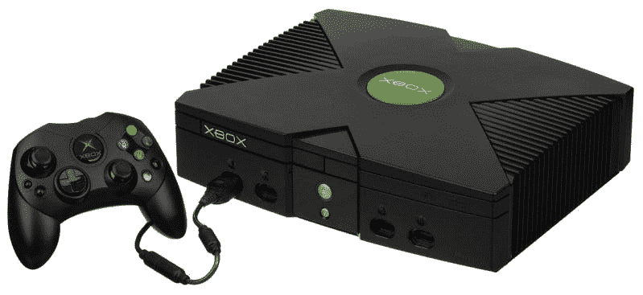
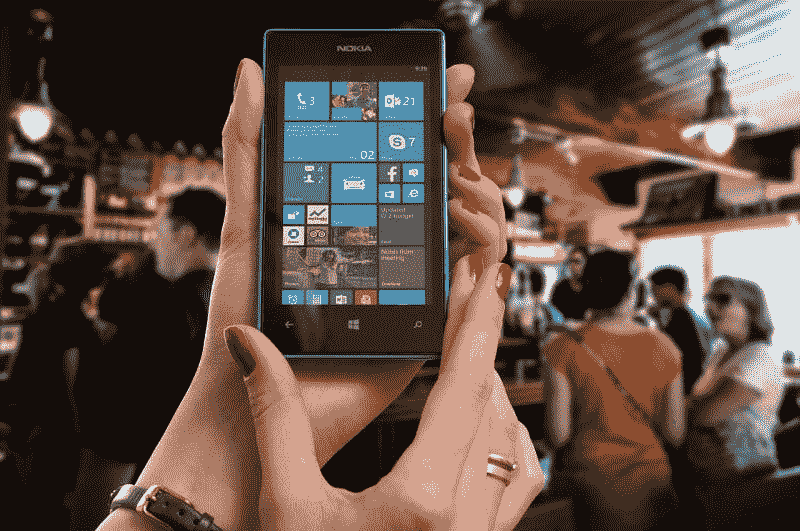
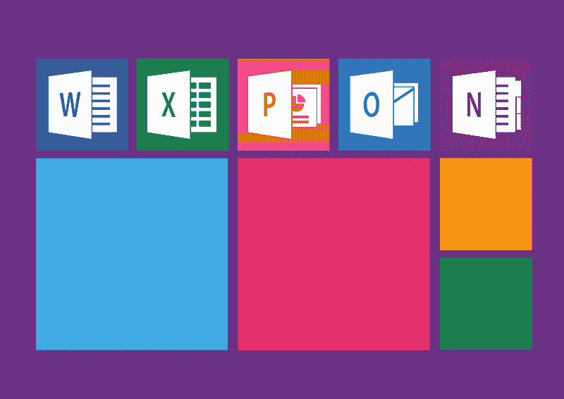

# 微软的赚钱机器又来了——市场疯人院

> 原文：<https://medium.datadriveninvestor.com/the-microsoft-money-machine-delivers-again-market-mad-house-51a510fc6d38?source=collection_archive---------10----------------------->

我喜欢**微软(纳斯达克:MSFT)** 股票是有原因的；微软的赚钱机器刚刚提供了另一组伟大的财务数字。

例如，微软在 2019 年 9 月 30 日报告了 226.49 亿美元的季度毛利。这一毛利润比 6 月份的 233.05 亿美元有所下降，但仍很不错。

 [## 算法交易的机器学习|数据驱动的投资者

### 当你的一个朋友在脸书上传你的新海滩照，平台建议给你的脸加上标签，这是…

www.datadriveninvestor.com](https://www.datadriveninvestor.com/2019/01/30/machine-learning-for-stock-market-investing/) 

此外，Stockrow 估计微软上个季度的收入增长率为 13.36%。这一增长率高于上一季度的 12.07%。

总体而言，微软在 2019 年 9 月 30 日报告的季度收入为 330.55 亿美元，低于三个月前的 337.17 亿美元。因此，微软的业务仍在增长并带来收入。

# 微软赚了多少钱？

微软从这些收入中赚了更多的钱。这家软件巨头报告称，2019 年 9 月季度营业收入为 126.86 亿美元，高于 6 月份的 124.05 亿美元。

然而，微软的季度净收入从 2019 年 6 月的 131.87 亿美元降至 2019 年 9 月的 106.78 亿美元。由此可见，微软的收入虽高但并不稳定。

我认为这给了微软很高的安全边际，使它成为一只高收入和成长股。安全边际很高，因为微软产生了大量现金。

例如，微软报告称，2019 年 9 月 30 日的季度运营现金流为 138.18 亿美元。相反，现金流从 2019 年 6 月的 166.08 亿美元下降。

与此同时，微软在 2019 年 9 月 30 日录得 104.33 亿美元的季度自由现金流。该季度自由现金流低于 2019 年 6 月 30 日的 120.57 亿美元。

尽管现金流下降，微软的钱柜里仍有大量现金。我认为这相当于高安全边际，因为我把现金等同于安全。

# 微软有 1366.36 亿美元现金！！

令人难以置信的是，微软在 2019 年 9 月 30 日拥有 1366.36 亿美元的现金和等价物。

此外，微软的现金和等价物从 2019 年 6 月 30 日的 1338.19 亿美元增长。因此，微软是一家现金极其充裕的公司，如果塞特亚·纳德拉愿意，它可以进行一些大型收购。

值得注意的是，微软正利用这些现金来扩大其云容量。例如，微软于 2019 年 10 月 21 日收购了文件迁移应用程序 Mover，以加速文件向微软 365 的迁移，[的一篇新闻稿透露](https://blogs.microsoft.com/blog/2019/10/21/microsoft-acquires-mover-to-simplify-and-speed-file-migration-to-microsoft-365/)。

# 微软如何使用它的现金

微软声称 Mover 支持从 Dropbox、box、Egnyte、Google Drive 和其他存储解决方案迁移到 OneDrive、Azure Cloud 和 Sharepoint。因此，Mover 可以帮助微软从文件存储中赚钱。

因此，Mover 可以通过让文件和应用程序更容易地移动到 Azure cloud 来为微软云解决方案创造更多的客户。此外，你可以通过微软 365 捆绑包访问 Mover，其中包括 Office 365， *TechCrunch* [报道](https://techcrunch.com/2019/10/21/microsoft-acquires-mover-to-help-with-microsoft-365-cloud-migration/)。

可以预见，Mover for Distribution 现在可以在 Microsoft AppSource 中使用了。解释一下，AppSource 是微软对**苹果(纳斯达克股票代码:AAPL)** 应用商店的回答。微软[声称](https://appsource.microsoft.com/en-us/product/web-apps/mover.mover-distribution-1?src=retail&tab=Overview) Mover for Distribution 每天可以移动高达 70tb 的数据。澄清一下，1 TB 等于 1，024 GB 的数据。

因此，微软用它的现金来发展它的平台，通过增加功能来赚更多的钱。我认为这使得微软成为一家成熟的增长型公司，具有很高的安全边际。

# 微软红利增长

最棒的是，**微软(纳斯达克股票代码:MSFT)** 提供不断增长的股息。微软计划于 2019 年 11 月 20 日支付 51₵季度股息。

这一股息高于 46₵2019 年 8 月 14 日支付的股息。此外，Dividend.com 报告称，微软已经实现了 15 年的股息增长。

具体来说，2019 年 10 月 30 日，微软股东获得了 1.41%的股息收益率，年化股息为 2.04 美元，股息支付率为 42.95%。因此，微软是一只很棒的分红股票，我认为市场先生在 2019 年 10 月 30 日的定价是 143.68 美元。

# 微软是总包装股票

我认为微软是一只一揽子股票，提供了大多数投资者需要的一切。

解释一下，我认为微软是一个好的股息股，一个好的收益股，一个好的成长股，一个价值投资。我称**微软(纳斯达克股票代码:MSFT)** 为价值投资，因为市场先生经常忽视和低估它。因此，我认为微软在 2019 年 10 月 30 日的 143.68 美元有点被低估了。

然而，我认为微软是一只好的成长股，因为它的巧妙扩张，也是一只好的收益股，因为它有股息。最后，由于拥有 1366.36 亿美元的现金和等价物，微软拥有很高的安全边际。

因此，我给微软贴上了提供所有方面的一揽子股票的标签。如果你想要一支安全、赚钱、有增长潜力、高股息的股票，你需要研究一下微软。

*原载于 2019 年 10 月 30 日*[*【https://marketmadhouse.com】*](https://marketmadhouse.com/the-microsoft-money-machine-delivers-again/)*。*