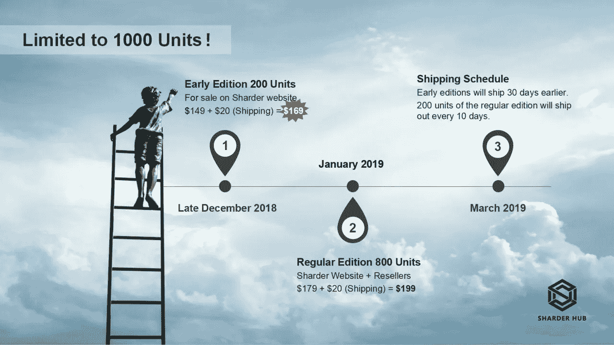
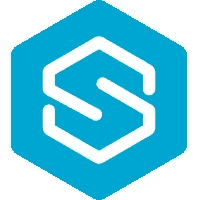
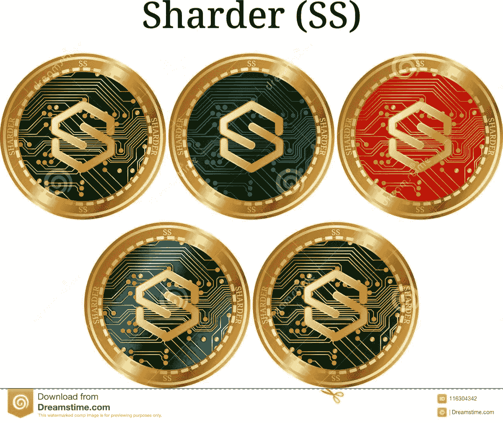

# 碎片的里程碑:协议在 2018 年取得的成就

> 原文：<https://medium.datadriveninvestor.com/the-milestones-of-the-shard-the-protocols-achievements-in-2018-e26b63a1d586?source=collection_archive---------16----------------------->

**One Of The Focal Achievements Of The Protocol: The Release Of The Sharder Hub And The Successful Testing Of The Mainnet In Q4 2018**

**简介:进步和雄心的重要性**

2018 年的大熊市教会了我们关于空间内加密货币项目的各种不同的教训；这些重要的经验之一是，进步和技术发展是项目成功的关键因素。Sharder 协议理解这一理念，并在 2018 年内实现了许多里程碑，包括更新网站，招募各种管理员和团队成员参与协议工作，与 GT Investments 和 Chemmai/Sharder Partnership 建立伙伴关系，以及将 Bean Cloud 作为杭州互联网法院的司法节点；超过 280，000 份认证数据文档在 Bean Cloud 中注册，Bean Cloud 是生态系统中的主要 Sharder d 'apps 之一。在 2018 年最后一个季度，Sharder Protocol 测试了他们名为 Sharder Hub 的采矿硬件设备，这是一种微型节点采矿器，使个人能够押注他们的 Sharder 并赚取 Sharder Token，在不久的将来，其他面向存储的加密货币将成为 TBD，并将很快向社区发布。2018 年的大熊市没有阻止关于扩张、合作伙伴关系、mainnet 成功测试的 Sharder 协议，mainnet 将于今年与 Sharder Hub 和 Box 一起推出，以及居住在世界各地的团队成员的整体招募，包括中国、美国、荷兰、伦敦和印度。在这篇文章中，当我们以新的前景和发展开始新的一年时，我们有责任深入研究 Sharder 协议在 2018 年取得的巨大进展！

**2018 年:伙伴关系和网络年:路线图和白皮书**

**The Sharder Protocol Has Garnered Many Partnerships Over The Course Of 2018**

2018 年充满了令人失望的惊喜，因为许多项目试图在加密货币历史上最糟糕的熊市之一(按美元评估最糟糕的熊市)中获得合法性、资金和合作伙伴关系，但都失败了；这并没有阻止 Sharder 协议扩展和构思各种伙伴关系和网络，从而巩固和延续了 Sharder 协议的整体进步。Sharder 协议在 2018 年巩固了许多合作伙伴关系，最值得注意的是 GT Investments、Chemmai/Sharder 合作伙伴关系以及 Bean Cloud 被用作杭州互联网法院官方司法节点之一的成就。GT Investments 是一家俄罗斯营销公司，它与 Sharder 合作，在俄罗斯这个地球上最大的国家和世界上人口最多的国家之一推广该协议。2018 年底，Sharder 与 Chemmai 在多个层面上建立了战略合作伙伴关系，开始但不限于产品广告和平台测试，然后是产品开发和钱包上市，最后在未来继续利用跨链和数据存储。Sharder Protocol 在 2018 年第四季度宣布，Bean Cloud 是杭州互联网法院的官方司法节点，杭州互联网法院是中国最近成立的一个司法法院，已处理了 10，000 多起与互联网查询有关的案件。很明显,《Sharder 议定书》继续在多条战线上扩展，在全世界建立了伙伴关系并巩固了联网机会。

**The Sharder Protocol Is Ready To Embark On Its Journey Into 2019**

Sharder Protocol 在 2018 年 3 月构思了他们的技术白皮书，同时，Sharder 团队创建了他们的路线图，设立了全年实现的里程碑。2018 年，Sharder 协议完善并完成了他们对 Sharder 链测试网的研发:Sharder 生态系统的脊梁。Bean Cloud 同时创建于 2018 年，现在，Bean Cloud 拥有超过 428，000 份数据副本，这些副本已在 d'app 内部存储和验证；更不用说利用 Bean Cloud 已经签署了超过 1450 份电子合同。大约有 350 名用户正在使用 Bean Cloud 作为服务，为敏感文档、数据存储等提供司法公证需求！正如 Sharder 团队所说的“一天一步，千里之外”，伟大的事情需要时间来发展，Sharder 正在一天一天地实现其愿景，协议将完成其千里之旅！在 2018 年期间，Sharder 团队开发了他们的 block browser，并构想了一个名为 Task Hall 的社区概念:一个社区驱动的项目，团队可以为社区创建奖金，作为回报，可以获得 Sharder Token 形式的奖励。在 2018 年期间，Sharder 团队还完成了对 Sharder Hub 的研发:Sharder 的微节点采矿机，使个人能够对其 Sharder 下注，并在 Sharder Token 或其他面向存储的 TBD 令牌中采矿时获得奖励。在我们社区的帮助下，社区治理框架已经完成，Sharder 理事会也正在发展中！截至 2018 年底，Sharder Protocol 已经实现了白皮书中概述的 75%以上，并继续在研发方面取得进展，同时获得了 GT Investments 等机构和杭州互联网法院等司法企业的营销。

**2019:新的开始，永不结束**

**2019 Is A Crucial Year For Various Developments Within The Sharder Ecosystem! More Details Are To Come!**

2019 年将是加密货币历史上实施和验证的一年。Sharder 协议已经完成了 2019 年的路线图，可以在[www.sharder.org](http://www.sharder.org)上找到；2019 年将是 Sharder 专注于 Sharder 测试网络开放测试的一年，Sharder Mainnet 的推出将使 Sharder 令牌成为自己的原生令牌，摆脱以太坊区块链的掌控。我们的分散式应用和区块链本身有能力扩展到高达 1000 TPS，这是区块链领域的一个重要里程碑。2019 年也将是 Sharder 存储网络商业化和货币化的催化剂，Bean Cloud 去中心化应用的整体改善和扩展以及利用 Sharder 技术的付费消费者的扩大。随着 Sharder 生态系统的增长和获得更多的曝光，人们可以推断 Sharder Token 将在整个生态系统中得到更广泛的使用:因为 Token 是整个生态系统的锚定货币。

**The Anchoring Token Of The Ecosystem!**

区块链和加密货币技术只有十年的历史，而 Sharder 还在蹒跚学步。就像一个蹒跚学步的孩子成长为一个有生产力的成年人，能够用两条腿站立，在这个世界上克服所有的困难和障碍，Sharder 协议将实现同样的事情。Sharder 团队希望向社区发出特别的呼喊，感谢他们在美元评估加密货币历史上最糟糕的熊市中表现出的激情、爱心、承诺、坚韧、耐心和决心。在 2018 年的大熊市中发布的这样一个年轻的项目继续向前推进，这确实是一个杰出的壮举；它显示了 Sharder 团队的决心和不变的信念，以实现其愿景，成为 21 世纪的首选分布式数据存储解决方案。我们的目标是在我们的协议的基础上建立一个完整的生态系统，Sharder 团队不会停止努力，直到实现这一目标。

**结论:2019，希望与进步之年**

**A Year Of Progress; A Year Of Hope**

当负面情绪扼杀了我们热爱的市场和行业时，进步是一个难以实现的壮举；由于缺乏资金，项目正在死亡，许多项目团队和社区的信念和决心继续愚蠢和动摇；对于 Sharder 协议，情况并非如此。2019 年的路线图现已完成，我们关注着各种不同事物的发展，包括 Sharder 会议！Sharder 会议将是在阿姆斯特丹举行的区块链会议，讨论区块链技术的商业应用，尤其是 Sharder 协议的各种商业应用。Sharder 移动网站已与 Sharder 主网站一起更新，Sharder Hub 的第二阶段销售正在进行中！Sharder Protocol 的团队正在不断取得成功；当我们在进步、有效性和成长中定义成功时。Sharder Nation 不会停止，直到我们实现了一个成熟生态系统的宏伟愿景，满足了消费者对众多商业应用的需求，包括但不限于数据存储、司法公证和有效性、电子合同签名、通过使用 One-Fair 购买和出售数据、Sharder 生态系统中正在开发的另一个应用等等！我们将坚持不懈，我们将取得成功！#Shardernation。

*有兴趣了解加密货币和区块链技术吗？报名参加我在 Udemy 上的课程吧！*[*https://www . udemy . com/cryptocurrency-investment-a-初学者-指南/学习/v4/*](https://www.udemy.com/cryptocurrency-investment-a-beginners-guide/learn/v4/)

*免责声明:加密货币投资需要大量的风险，不要投资超过你能承受的损失！我不是金融顾问，也不对你的任何交易负责。我是 Sharder Token 的投资者，本文中的信息代表我自己的想法和观点。在投资任何东西之前，你都要做好自己的研究，这是义不容辞的责任！*