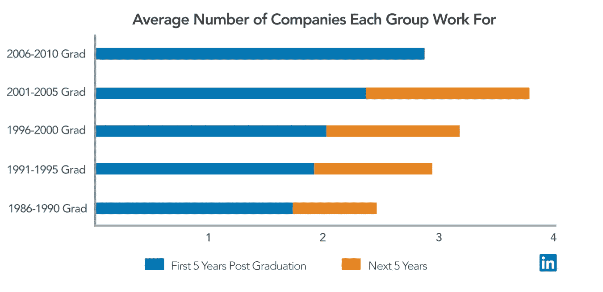
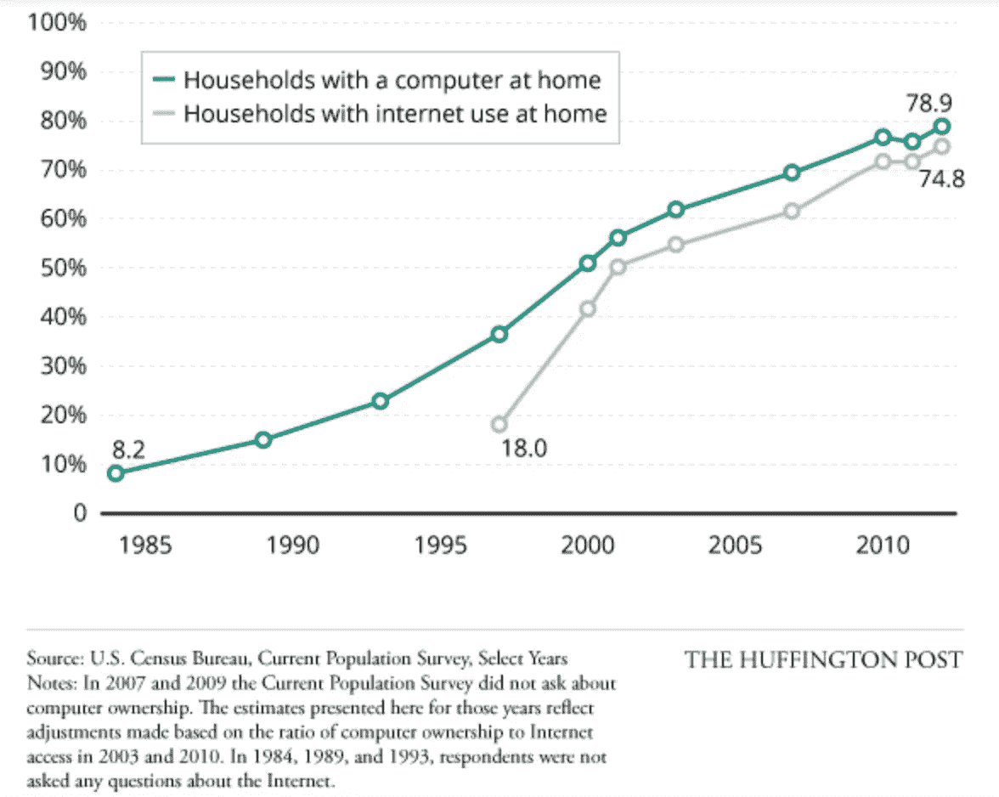

# 千禧年运动。

> 原文：<https://medium.datadriveninvestor.com/the-millennial-movement-b0b6296bf395?source=collection_archive---------8----------------------->

有一种关于千禧一代的说法已经成为整个一代人的定义:他们雄心勃勃，但缺乏专注和纪律。许多经济学家、心理学家和政府代理人试图理解为什么这一特殊群体与前几代人如此不同。这场辩论持续至今，没有明确的答案，但一个令人担忧的话题被反复提起:千禧一代的职业道德很差。

现在，没有硬性的定义，但一般来说，千禧一代被定义为 1981 年至 1996 年出生的人。2019 年，最年轻的千禧一代是 22 岁，最年长的大约是 38 岁。仅基于这些年龄范围，可以有把握地假设大多数千禧一代目前都有工作。

因此，无论愿意与否，雇主都被迫与千禧一代打交道——如果由他们中的许多人决定，他们会选择后者。为什么？很简单:千禧一代素有“跳槽”的名声，雇主不喜欢这一点是可以理解的。在 LinkedIn 进行的一项[研究](https://blog.linkedin.com/2016/04/12/will-this-year_s-college-grads-job-hop-more-than-previous-grads)中，确定了 ***“与前几代人相比，人们在大学毕业后的前 5 年里工作的公司数量几乎翻了一番”*** 。下图展示了该研究对各代人工作转换的发现:

[LinkedIn Study- 2016](https://blog.linkedin.com/2016/04/12/will-this-year_s-college-grads-job-hop-more-than-previous-grads)

在阅读图表时，你可以看到 2000 年以前毕业的人在大学毕业后的前 5 年里可能会换两次工作，而在接下来的 5 年里换工作的次数很少。然而，在 2001 年，大学毕业后的前 5 年里，换工作的人数有了明显的增加，在接下来的 5 年里，换工作的人数甚至更多。2001 年(及以后)毕业的人似乎换工作更快，并且在他们职业生涯的剩余时间里继续这种“跳槽”行为。

问得最多的问题是，为什么千禧一代如此频繁地感到有必要换工作，以及为什么这种趋势会贯穿他们的整个职业生涯。此外，这一群体让研究人员困惑于他们所做的工作转换的类型。千禧一代不只是“跳槽”,他们从一个行业跳到另一个行业。经济学家正试图理解他们缺乏一致性。任何人能得出的唯一合乎逻辑的结论是，千禧一代只是不专注，而且普遍懒惰。

*打哈欠。*这不仅不是一个好答案(因为没有事实支持这种说法)，而且是对错误问题的回答。与其想办法让千禧一代“安定下来”，符合职业自满的“标准”——不如试着理解这新一代和上一代的区别。如果问这个问题，可以用统计数据来回答，而不是令人厌倦的“千禧一代缺乏纪律性”的刻板印象。**所以我提出这个问题:2001 年发生了什么？**

如果你回忆一下上面的图表，你会记得“跳槽”的增加在 2001 年加速，并且从未下降。这让我想起了 2001 年发生的事情，是什么导致了如此巨大的变化。参考下面美国人口普查局的图表，特别关注 2001 年。

2001 年，互联网覆盖了超过 50%的家庭，成为主流。现在，回想一下，我们最年长的千禧一代在 2019 年是 38 岁。2001 年那个人多大？对-他们已经 20 岁了。这个人在大学毕业前有 2 年时间探索万维网。所以现在，在 2003 年，他们 22 岁，开始寻找他们的第一份工作。互联网一年比一年快，越来越先进，他们知道如何使用它。突然间，他们可以访问像 Monster.com 的(于 2000 年发布)这样的招聘网站，并且可以看到世界另一端的人们在做什么，这要归功于社交网络这个新事物([Myspace.com 的](https://myspace.com/)于 2003 年发布)。

**为什么是 2001 年？机遇在 2001 年爆发——这就是为什么**。每一批新的千禧一代在他们的生活中越来越早地接触到互联网。我们最年轻的千禧一代在大学毕业之前，应该已经能够搜索万维网大约 15 年了。

没有任何一代人有能力在进入职业生涯之前探索数百万个行业、主题和知识，但千禧一代做到了。随着整整一代人了解到他们可以获得的机会，他们在拓展自己潜力的同时也在磨练自己的兴趣。千禧一代是第一批理解无限生活可能是什么样子的人。他们不满足于现状是一个奇迹吗？

这是最大的收获:互联网给每个人提供了机会。我要告诉你一个小秘密——它不会消失。我们不应该试图改变千禧一代的心态(以及未来几代人的态度)，而是应该致力于改变这个体系。如果我们继续把“工作标准”强加给后代，我们将会打一场长期的硬仗。我们不会回到过去的样子——旧的价值观与新的价值观不一致。这可能是一场战争，也可能是一场革命，但无论如何，变化正在发生:**你希望站在历史的哪一边？**

## 来自 DDI 的相关故事:

 [## 数据科学和软件工程哪个更有前途？-数据驱动型投资者

### 大约一个月前，当我坐在咖啡馆里为一个客户开发网站时，我发现了这个女人…

www.datadriveninvestor.com](https://www.datadriveninvestor.com/2019/01/23/which-is-more-promising-data-science-or-software-engineering/)  [## 成为数据科学家所需的 8 项技能——数据驱动型投资者

### 数字吓不倒你？没有什么比一张漂亮的 excel 表更令人满意的了？你会说几种语言…

www.datadriveninvestor.com](https://www.datadriveninvestor.com/2019/02/07/8-skills-you-need-to-become-a-data-scientist/)