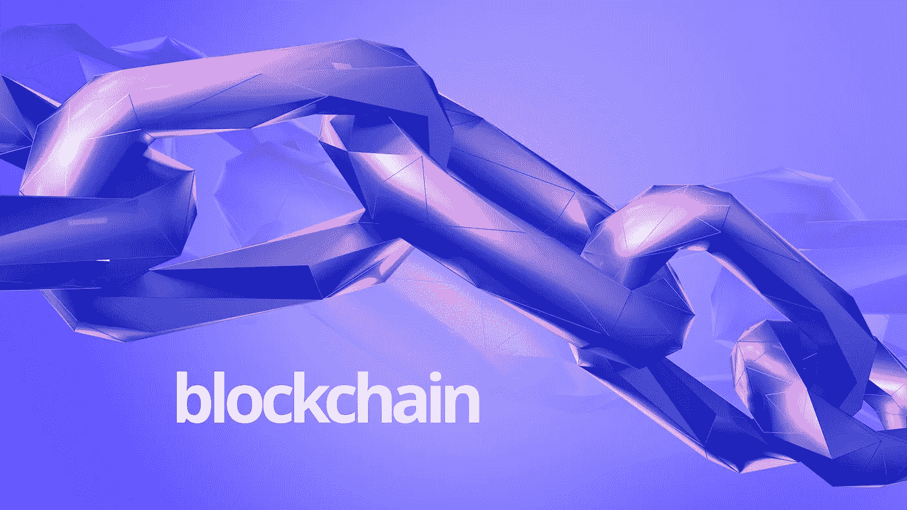
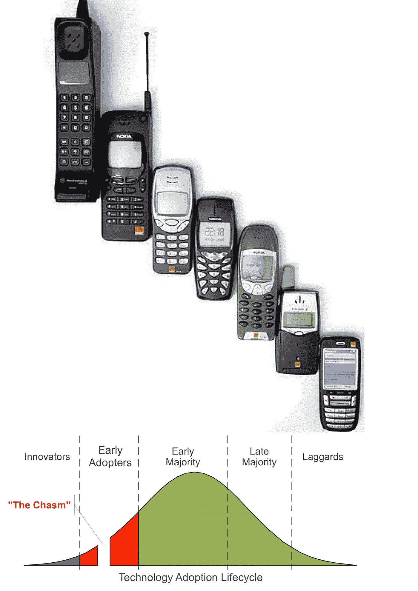

# 手机和区块链。

> 原文：<https://medium.datadriveninvestor.com/the-mobile-phone-and-the-blockchain-3b1fe47fc59e?source=collection_archive---------29----------------------->

当手机出现在市场上时，它是当时个人电脑解决方案的可怕替代品。没有人能够想象在一个砖头大小的物体上使用 Word 和 Excel，更不用说 AR & VR 了，它甚至不会让你看起来很光滑。但 GPRS、即时通讯以及最显著的无形方面“移动性”等功能彻底改变了这个行业，现在我们无法想象一个没有我们设备的世界。

区块链就是这种情况，对于目前的解决方案来说，这不是一个很好的替代方案。它难以理解、难以编码、难以实现并且采用率低。但是区块链带来的无形方面是“信任”,这种信任不是集中在一个权力机构之下。现在，我们可以在任何地方创造货币、文件、票据和更多的东西。但是，区块链成为一个家喻户晓的概念还需要几年时间。

区块链将如何成为一个家喻户晓的概念？一个 5 岁的孩子不关心手机或区块链的内部运作。他们只想玩愤怒的小鸟。类似地，一个工作的专业人士并不太关心食品和杂货交付应用的内部工作，他们关心的是食品被送到他们家门口。

大规模采用来自于不干扰消费者日常工作的分销。为了建立分销渠道，你需要在不同的阶段使用不同的催化剂。比特币是为早期的区块链采纳者准备的，他们是想向 5 岁的孩子解释区块链是什么的书呆子。现在轮到大规模采用的早期和晚期多数了。我们需要拭目以待，看看什么会催化大多数人。

将在 2019 年推动区块链空间的行业和项目将是金融、保险和零售行业，诸如 [Filecoin](https://filecoin.io/) 、 [Protocol Labs](https://protocol.ai/) 、 [Origin](https://www.originprotocol.com/en) 和 [PROPS](https://propsproject.com/) 等项目有可能成为目前备选方案的主流选项。

**参考:**

[为什么区块链很难？](https://medium.com/@jimmysong/why-blockchain-is-hard-60416ea4c5c)

[通过建造一个来学习区块链](https://hackernoon.com/learn-blockchains-by-building-one-117428612f46)

[区块链不仅是蹩脚的技术，也是对未来的糟糕展望](https://medium.com/@kaistinchcombe/decentralized-and-trustless-crypto-paradise-is-actually-a-medieval-hellhole-c1ca122efdec)