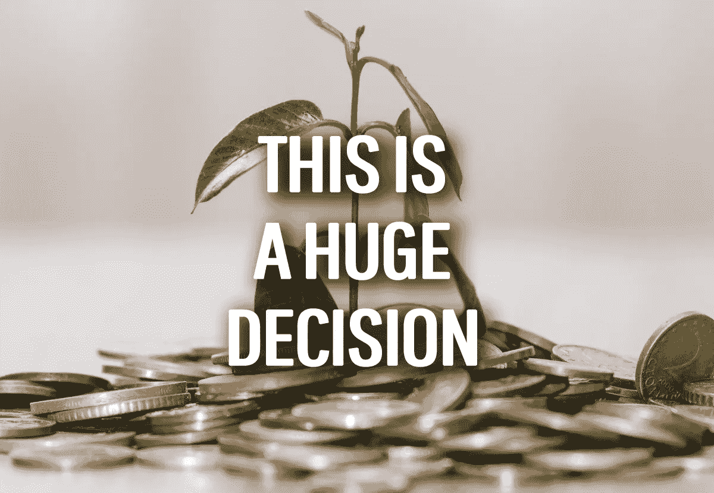
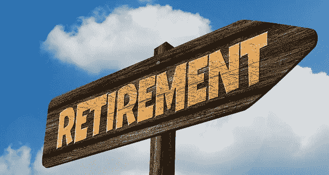
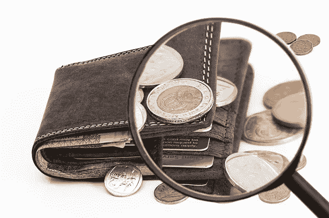

# 恐惧的时刻:做出明智的投资

> 原文：<https://medium.datadriveninvestor.com/the-moment-of-fear-making-informed-investments-5db10ffb7a81?source=collection_archive---------16----------------------->

股票市场昨天下跌了将近 3%。难怪我会情不自禁地发现投资是一种充满压力和焦虑的经历。

无论如何不要误解我，我喜欢回报。无论是月租进来的时候，还是分红如雨落下的时候。这就是回报，这真是太棒了。

 [## 算法交易的机器学习|数据驱动的投资者

### 当你的一个朋友在脸书上传你的新海滩照，平台建议给你的脸加上标签，这是…

www.datadriveninvestor.com](https://www.datadriveninvestor.com/2019/01/30/machine-learning-for-stock-market-investing/) 

在那之前的东西令人紧张，有时令人不快。

谢天谢地，我们已经摆脱了购买投资性房地产的困境。我怀疑我们会再买一个，两个就够了。但是股票投资仍然是我们非常关注的事情，而且在我们退休之前的几年内还会继续关注。

也许这是我最初对股票投资的[恐惧的残余。我在很大程度上已经摆脱了对失去一切的恐惧，我已经学会了看透一时的起伏。(尽管如果你设法忽略之前或之后的下跌，上涨的感觉仍然很好)。](https://hishermoneyguide.com/changing-thoughts-on-shares/)

这些天我最害怕的投资就是投资和投钱的那一刻。投资在理论上很有趣，但在实践中，它可能会令人伤脑筋。

归根结底，恐惧是件好事。恐惧从根本上说是一种生存机制。这是对一种情况的本能反应，让我们小心谨慎，三思而后行。在[犯了一些财务错误](https://hishermoneyguide.com/three-biggest-money-regrets-in-my-life/)之后，我已经变得不那么热心了，希望这意味着我正在做出更好的投资。

然而，这并不意味着我在购买股票时点击*确认*的那一刻不再令人畏惧。我的经验也告诉我，我不会每次都做对。

我们现在做的决定将会影响我们的余生，这可能是很可怕的。

This is what’s at stake.

# 投资有什么可怕的？

投资是一件好事——它是为你的未来投资。它积累了你的收入和资本(又名:你的财富)。随着时间的推移，你的投资随着你不断增加而积累，然后复利的力量开始发挥作用——它实际上开始照顾自己。

如果你计划完全经济独立，这意味着你有一份被动收入。如果你的目标是早点退休(或者继续工作，然后更舒服地退休)，这些投资可以帮助你照顾好自己。到目前为止，一切顺利吧？

这里有几个假设，投资增长是最大的假设。人们目前是交易所交易基金(ETF)的忠实粉丝。但是，如果你在 1989 年投资 10 万美元于一只日本 ETF，结果会怎样？在他们的市场崩溃后，你的资本基础(没有股息)仍然只有大约 56，000 美元，[大约 30 年后](https://www.macrotrends.net/2593/nikkei-225-index-historical-chart-data)。

一个*极端*的例子？有，但是没有。

直到 2019 年 7 月，澳大利亚的 ASX 才创下新高，距离上一次峰值已过去了近 12 年。多亏了 GFC。然而，由于澳大利亚的高股息水平，2007 年 11 月投资的 10 万美元现在将价值 20 万美元左右。这比银行里的钱要好。

但自 GFC 以来，我们一直生活在一个奇怪的金融时代。世界上大多数地方的平均利率都处于历史最低水平，天还没有塌下来。但地平线上有乌云，声称 2020/2021 年会出现衰退和更糟糕的情况。另一个类似 GFC 的事件是可能的，世界各国政府和金融监管机构的反应比 2008 年更糟糕。

实际上，他们已经把所有的利率杠杆都拉了出来，政府债务与 2008 年之前相比大幅上升。这是一个担忧。但是没有什么是一成不变的。

当我刚开始工作并为住房存款存钱时，经常有人声称房地产市场即将崩盘。房地产价格下跌 40%的头条新闻四处传播。当时，我会高兴地欢迎这样的下降。但是如果我没有买房子，我还在等待房价下跌。

我的观点是，投资伴随着风险，但有时它们不仅仅是风险——它们是对我们金钱和财富的真正威胁。你应该得到通知，保持警惕，但希望不要处于持续的警觉状态，否则，你将*永远不会*行动。

你确实需要意识到你的行为的重要性，因为它们会对你的财务未来产生惊人的影响(不管是好是坏)。

Finding yourself in a scary place.

# 本周的恐惧时刻

几周前，我们刚刚在股票上投入了一大笔钱——3 万美元。那是我和艾莉加起来大约三个月的工作。相当于六个月的工作时间。

如果一切都出错了呢？如果资本价值下降了呢？股息下降怎么办？

三万美元可不是小数目。人们被杀害，其他人做了各种各样不可描述的事情，但代价比这少得多。所以，当你丢下这种硬币时，那实际上是一件相当大的事情，而且是相当大的一笔赌注。

我们并不太在意资本价值——我们最关注的是股息。

但是想到如果你等一两个星期，如果价格下跌，你就可以得到更多的股票，这总是令人讨厌的。这些更多的股票将产生更大的股息。或者，如果你的投资在购买后升值了，总会有另一笔投资升值更多。

那就是你踢自己的时候。(如果你想看到上涨，下跌是更便宜的再投资股票的机会。)

然而，我们的财务目标是永远不触及我们投资的资本价值。相反，我们会在一个完美的世界里靠分红过活。在我们的案例中，更多的担忧来自于股息的下降。

在我们的[提前退休预算帖子](https://hishermoneyguide.com/our-high-income-early-retirement-budget)中，我们概述了我们未来的生活方式和生活开支。我们谈到了如果市场崩溃，我们如何做好准备。但是如果股息长期持续下降呢？如果我们现在购买的股份在 15 年后陷入困境，我们的年股息从今天的 15 万美元下降到大约 7.5 万美元，会怎么样？如果不是一两年的短期下跌，而是持续几十年或者一辈子的长期下跌呢？

不太可能，但远非不可能。

更糟糕的情况呢。

如果控股因某种原因不复存在呢？一家公司破产了——或者管理这些资产(无论是 ETF 还是上市投资公司)的公司管理不善。就 ETF 和 lic 而言，你实际上并不拥有构成指数或投资组合的公司。你在一个实体中拥有一个代表单个公司股权的单位。

没有什么是没有风险的。

# 处理风险

既然我们认识到了风险，我们该如何管理它呢？

第一步是考虑你的投资期限。你有短期、中期或长期的关注点吗？我们的是完全长期的。在一个理想的世界里，我们不会出售我们的任何投资——永远不会。

知道你打算投资多长时间将会告诉你需要寻找的其他东西，因为下一步是研究投资。

试着理解眼前的威胁和弱点是什么——以及它们的优势和机会。如果你仔细调查，有些投资实际上是很容易的。但是有时候，表面上看起来像是一项重大投资的事情应该谨慎对待(或者完全避免！)当你仔细观察它们的时候。

所以，调查一下一家公司的竞争实力(或者争夺投资产品/可比较的房地产，等等——取决于你打算做什么投资)。这项投资面临的大趋势是什么？颠覆即将到来吗？

如果你打算购买单个公司的股票，看看它们的业绩记录。他们是否经常达到、超过或未能达到他们的预测结果？

公司领导班子是买股还是卖股？这可以表明他们是否对公司有信心——或者没有！

下一步是查看公司的财务结果。那是一个完全不同的话题，你可以[了解如何去做](https://www.investopedia.com/articles/basics/06/financialreporting.asp)。

做一点调查会让你对自己的投资决策更有信心，并有望给你带来更好的长期回报。

# 为了安全而分散投资，并理解风险的真正本质

下一件大事是分散你的风险，因为一次性的个人投资*可能*有风险。但如果你将投资分散到不同的行业、地区和资产类别，风险就会分散。

另外，通过做一些研究，要明白表面上的风险分散可能是一张虚假的安全毯。

例如，如果你投资一只澳大利亚 ASX200 ETF，大约 60%的价值被锁定在该交易所排名前 20 的公司。在这 20 强中，许多公司实际上都参与了银行业务(按市值计算，ASX200 指数中超过 20%的股票被四大银行锁定！).因此，在这种情况下，依靠投资 ASX200 ETF(或许多主要的低收入国家)实际上会让你明显暴露在金融领域的冲击之下。

因此，单独一项投资——无论其性质如何——*并不是*多元化。但是你越多元化，你就越有信心每一项投资都不那么重要。这应该会平息你的投资恐惧——我知道这有助于我应对。

然而，尽管最好的意图是研究和多样化，最终一些风险是你无法控制的——也是投资无法控制的。在我们的[道德投资文章](https://hishermoneyguide.com/the-ethical-dilemma-of-investing)中，我们谈到了社会许可证的变化，以及监管环境如何变化。

澳大利亚市场上还有一句老话，当美国打喷嚏时，澳大利亚就会感冒。如今，在中国问题上，情况也是如此。因此，想象一下，当其中一个国家(或两个国家)卷入贸易争端等问题时，市场可能会发生冲突。不可抗力(或不可避免的事件)可能在任何时间、任何地点发生。

最好的运行，最充分研究的投资可以通过没有自己或投资的错误:无论是今天，明天，在轨道上的很长一段时间。或者可能根本不会发生，一切都很顺利。

这就是生活！

How much risk do you tolerate?

# 市场中的时间

所以每个人都被炒作和担心(对不起！)，记住我之前说的:有些威胁永远不会发生。

有句话说得好，“时间在市场中，而不是把握市场时机。”

如果我的钱下个月回来，我明天损失 5%也没关系。是啊，我本来可以赚更多的钱，但我还是在一个好地方。我不是一个日内交易者，我寻求短期回报来支付我的生活费用。

我明白，我的许多投资恐惧都是围绕着如何充分利用我的钱而来的。但通过尽我所能研究我的选择，并有一个长期的关注，我能够在很大程度上把那些投资的恐惧放在一边。

更广泛的观点是，只投资你愿意失去的东西，并且只在你对相关风险感到放心的时候投资。所以，就像你在购买一处房产一样，尽可能地做好你的尽职调查。

也就是说，这些都不能消除我在购买股票时仍然存在的那一瞬间的恐惧、害怕和焦虑。但是如果我能合理解释这种恐惧，我就能[控制它](https://hishermoneyguide.com/tag/control)，并充分利用它来改善我的长期投资。

干杯，

亚历克斯

PS:当你做一个重大投资决定，是时候进行投资购买时，你的神经会紧张吗？

*原载于 2019 年 8 月 15 日*[*https://hishermoneyguide.com*](https://hishermoneyguide.com/the-moment-of-fear-making-informed-investments/)*。*