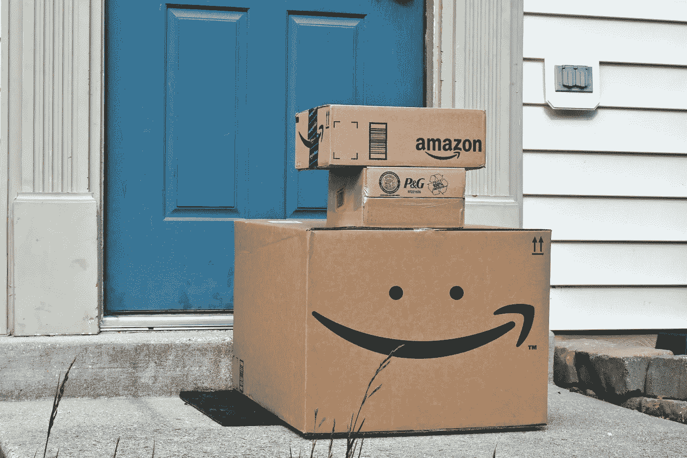
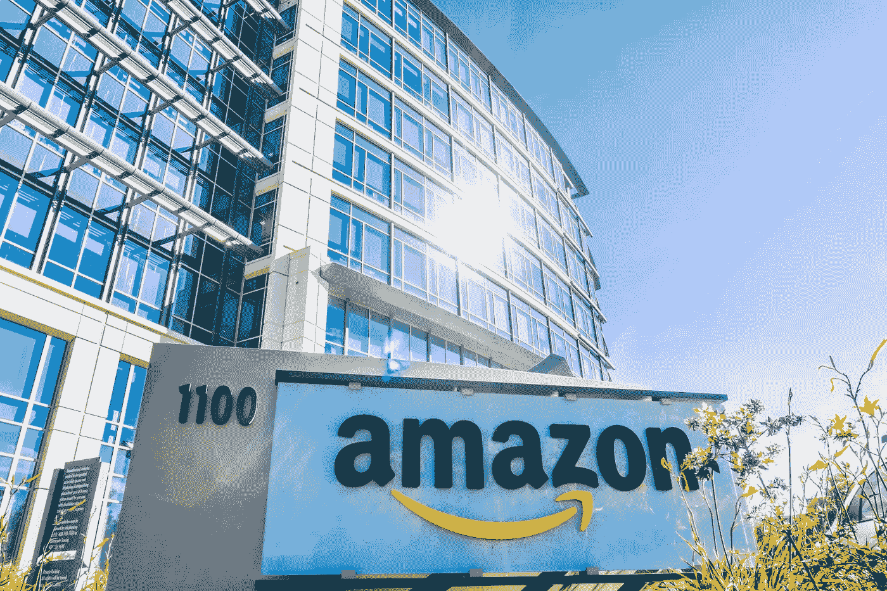

# 分手的道德风险

> 原文：<https://medium.datadriveninvestor.com/the-moral-hazard-of-break-up-d6cf082bc31d?source=collection_archive---------4----------------------->

## 任何建议我们拆分亚马逊的人都没有考虑到消费者

最近，越来越多的人在讨论拆分一些主宰我们生活的大型科技公司的想法:比如亚马逊和谷歌。

然而，从最近的文章和政治声明来看，围绕亚马逊的对话似乎是最有激情的。

 [## 准备在 2019 年改变世界的技术-数据驱动的投资者

### 很难想象一项技术会像去年的区块链一样受到如此多的关注，但是……

www.datadriveninvestor.com](https://www.datadriveninvestor.com/2019/01/17/the-technologies-poised-to-change-the-world-in-2019/) 

对于这些非常热情、通常是下意识的、草率的评论，让我提出一个警告:拆分亚马逊不太可能产生这些人所希望的效果。实际上并不清楚真正的担忧是什么，因此，这些反应很可能是无纪律的追求，并会失败。

## 让我们一起考虑一下。

我们应该问自己的第一个问题是:到底是谁在要求亚马逊分手，为什么？是什么激励因素影响了这些人？(激励是关键)。

接下来的重点是心理学。正如右翼反移民教条建立在恐惧和无法与外来者竞争的基础上一样，许多基于不公平竞争或反竞争行为指责大型科技公司的人实际上是低生产率的人。他们知道自己无法竞争，他们只是软弱的个体，缺乏面对现实、管理生活和事业的能力。我们成功的极限是我们自己。因此，要想赢，要想出类拔萃，我们必须从内部改变。不能诚实和做出正确的选择不是成功的因素。

**抱怨和责备比承认问题出在自己身上更容易。**

最直言不讳的人是政治家和企业主。政客们想要选票，他们会追随任何成为头条新闻的报道。记叙文不需要任何证据或严格的分析，很容易销售，因为它们依靠的是情感，而不是事实。

要求政府保护的经理人和所谓的企业家是做不到的人，应该被忽略。(我在以前的文章中已经详细讨论过这个问题)。我没有听到消费者团体呼吁拆分亚马逊。

我希望听到更多来自工会和亚马逊员工和合作伙伴的声音。这是发现第一手真相的地方。

我们应该问的下一个问题是:亚马逊在损害消费者吗？当我们考虑参与任何公司的运营时，消费者应该是首要关注的问题。如果不是，那么你可能是出于错误的原因。

从历史上看，当公司明显损害消费者、抑制竞争、收取垄断价格和/或从事不道德行为时，就会被解散。也就是说，损害是直接针对消费者的。

在我们继续之前，我们应该问问自己“损害消费者”是什么意思。“伤害”对我来说是一个有趣的词，因为它的意思会随着时间的推移而变化，可以是直接的，也可以是间接的。例如，想一想人身攻击和财产攻击之间的区别。我可以打你——直接的身体伤害。我也可以用砖头砸你的窗户。这不会伤害你的身体，但它是有害的，因为房子是你的财产。随着时间的推移，我们对伤害的定义发生了变化。因此，这可能对如何解释法律产生重大影响。

通常，当人们想到“对消费者的伤害”时，他们会认为人们为某种产品支付了太多的钱，或者他们的选择或权利受到了限制。垄断和寡头垄断企业榨取消费者剩余，导致价格上涨、选择减少和权利减少。

市场随着竞争而“正常化”，当更多的人和公司试图销售时，随之而来的选择和容量的增加(竞争)降低了价格并提高了质量。这意味着消费者有剩余收入可以花在其他地方。

唯一的例外是当我们包括专利的时候。专利是一种在一段时间内授予的垄断权，它承认所做的风险、工作和投资。专利和其他知识产权是另一种激励形式。

例如，像亚马逊这样的公司，这很有趣，因为消费者不会因为传统的伤害和反竞争行为而受到伤害。消费者通过亚马逊获得了更多的选择，因为亚马逊不是唯一一家销售商品的公司，他们也不是唯一一家制造他们所销售商品的公司。这是真正的开源。他们在卖别人的产品。他们允许竞争公司使用他们的店面和基础设施进行销售，因为这刺激了竞争，并确保亚马逊的管理者忠于亚马逊的创始原则和核心价值观。

重要的是要问“伤害会在哪里发生？”另一个可能的答案是劳动力市场。

劳动力市场实践中的伤害可以通过立法来解决，好的工会可以真正发挥作用。因此，规范雇佣行为比仅仅解散公司更好，因为他们偏爱的雇佣行为与我们社会的价值观相冲突。

**规模在这里是一个重要的考虑因素，因为行为会随着规模和专注度而改变。**

仅在美国，亚马逊就雇佣了 54.1 万名员工。这是一个巨大的数字，使他们排在第二位。然而，与沃尔玛的 230 万员工相比，他们目前的规模算不了什么。集中度是下一个要考虑的方面，这不仅是地方性的，也是全国性的。从国家层面来说，我认为员工没有选择，不得不在亚马逊工作并因此受到伤害的说法是不可信的。然而，在地方一级，大雇主可以通过压低工资、限制条款或同意不窃取彼此的员工(正如许多硅谷公司所做的那样)来造成伤害。这些做法会造成伤害，只会让雇主受益。我理解亚马逊的许多做法让许多人感到不安，但亚马逊真的专注于过边缘生活。测试什么是可能的，制造紧张局势。界限和紧张是创新发生的地方。

这会产生紧张感，但是没有这些紧张感，就没有学习，也没有优秀。亚马逊及其同行是由超级专注、超级自律的人管理的，他们对自己有非常高的标准，他们不会要求别人做他们不会要求自己做的任何事情。市场将最终监管这些做法，并定义什么是可接受的，什么是不可接受的。然而，在地方一级，集中可能是一个重要的考虑因素。如果亚马逊是一个贫困城镇的主要或唯一雇主，那么是的，存在不良行为的风险，因为激励措施对亚马逊有利，因为人们没有其他工作机会。

因此，亚马逊最近将最低工资提高到每小时 15 美元，不太可能是对负面宣传的回应，而更有可能是为了给竞争对手施加成本压力。我不知道亚马逊给员工什么福利，但我可以说，每小时 15 美元大约是你在美国较贫困的州生活所需要的(假设一周 36 到 40 小时)。我的一家工厂位于纽约州北部，我们的起薪是 15 美元(纽约州的最低工资是 11.80 美元)。我们提供全额的 401K 退休金，和你在蓝筹股公司期望的一样的医疗福利，还有五周的带薪假期。我们这样做不仅是因为公平对待员工、让他们能够生活和养家糊口很重要，还因为这是一项好业务。这意味着我们可以选择和保留我们想要的人。

亚马逊在公众形象方面的积极影响被以下好处所抵消:它能够选择员工，并通过创造激励措施吸引它想要的劳动力来给竞争对手施加成本压力，从而有助于确保不仅成本上升，而且竞争对手在招聘方面存在逆向选择问题，并获得次优。

其他一些问题可能是，“他们正在损害中小型企业吗？”他们是否在哄抬希望使用亚马逊基础设施的公司的价格？他们与合作伙伴合作的条款是否公平合理？亚马逊对他们的服务收费过高吗？

所有这些都可以通过监管来解决。我不会回答这些问题，因为我不知道答案，但随意的观察是，在亚马逊上销售的第三方公司的数量正在增长，其收入也在增长。我还没有在媒体上看到有关不良或不当做法的噪音，因为双方都有强烈的合作动机，因为它们对双方都有利。

## 是的，有很多来自各个阶层的商业人士说我们应该拆分亚马逊。但是让我们来看看那些企业。

他们中的一些人根本没有能力或胜任。对他们来说，说“解散亚马逊”比审视自己的业务并做出必要的决定来应对变化可能带来的威胁更容易。这和有人抱怨中国不公平，或者某某国家/公司/组织需要监管没什么区别。这些人只是在否认他们无法竞争、无法胜任工作的事实。你认为中国会拆散阿里巴巴吗？面对现实，面对事实，竞争。

如果你读了吉姆·科林的书*选择伟大*和*为什么伟大的失败*，你会发现失败的企业中有一群人不愿面对现实，他们对个人利益更感兴趣，并被傲慢所诱惑。这些类型的人在今天的许多公司都存在，他们只是为自己而存在。他们把自己的个人利益放在组织利益之前，他们为自己分配更多的公司资源。成功是关于面对残酷的事实，纪律的文化，集中精力，走出去，每天不失败地达到你的目标。

> 管理失败的一个典型例子是领导层和其他人之间的薪酬差距越来越大。

那些为自己而存在并利用他们的权力为自己分配更多资源的人对竞争或谋生没有兴趣，他们在那里是为了榨取和胁迫。他们利用可用的资源游说、抱怨和施加影响，这只会确保他们的领导任期不会受到尴尬事情(如竞争)的阻碍，然后他们会转向下一个受害者，或退休去高尔夫球场。美国特别倾向于这种管理风格，导致美国失去在汽车制造、电子、航运、航空等领域的领导地位。

**大型科技公司也会走同样的路，因为文化吞噬战略，而人不会改变。**

从经济学上讲，垄断行为通常很容易衡量和观察，我们看到它就知道了。打破垄断可能会带来挑战，(这不是任何人特别期待的事情)，但如果执行得好，它不仅会给消费者带来价值，也会给股东带来价值。例如，标准石油公司的解体导致了股价的上涨，并增加了所有股东的价值，因为新成立的公司(埃克森、雪佛龙、阿莫科、美孚等)作为独立公司比作为标准石油公司合在一起更有价值。

这凸显了企业变大后会发生的另一个关键因素:交叉补贴。这意味着一个业务单位向另一个业务单位提供或充当补贴，并激励低效率。然而，经理和股东很容易被垄断或企业集团的诱惑所诱惑，尽管事实上证据表明这不符合股东的利益。

> 人们喜欢权力。

提醒自己今天的成功不能保证明天的成功是有益的。上世纪下半叶，埃姆斯百货公司是美国第四大零售商，经常受到我们今天指责亚马逊的同样指责:扼杀竞争，将小城镇零售商挤出市场。但我们没有拆散他们。最终，他们变得傲慢，失去了重心，把自己赶出了公司。

具有讽刺意味的是，沃尔玛在埃姆斯之后不久就进入了这个市场，只是做了同样的事情，只是做得更好:向收入低于平均水平的人出售日常用品。因为他们坚持自己的价值观，他们仍然在这里，仍然希望通过建立这些价值观来发展。萨姆·沃尔顿的价值观。他们直接与亚马逊竞争，这对他们来说很艰难，但他们正在做，而且做得很好。他们面对现实，继续生活。

问题是:谁能预知未来？谁能预测几年后市场领导者会发生什么？对领导力、管理和文化的仔细审视会告诉我们更多，但并不是所有我们需要知道的都是可以观察到的，公司可以恢复并重生。

现在，我并不接近亚马逊，也不详细关注他们的业务往来。作为一名消费者，我很难理解目前我是如何受到伤害的。很容易看到我享受的所有福利。但是，我是一个白人中产阶级专业人士，不应该回答这些问题。我所关心的，也是我认为大多数科技巨头真正需要解决的，是他们的税务问题。来到一个国家，从基础设施、劳动力市场和消费者基础中获益，却不纳税，这并不明智，也不是好生意。这叫在你家门口拉屎。

对我来说，我觉得我应该问自己:作为一个消费者，我对更便宜的价格和更多选择的渴望是否在伤害他人？利用税法补贴对一国资源的开采所造成的损害。这种类型的开采确实伤害了消费者，因为它增加了他们的税收负担。

应该指出的是，在大多数现代国家，税收和就业问题是受管制的。尽管通常(也是最重要的)市场是不良就业行为和税收问题的被低估的监管者。这些市场可以通过自由媒体和社交媒体重整旗鼓。

为了实现增长目标，亚马逊依赖于劳动力——包括白领和蓝领。糟糕的实践让你很难得到你需要的东西，不管你付多少钱，尤其是当你像亚马逊一样大的时候。这是一个关键的市场激励。

如果你拆分亚马逊，不知道你能做什么，也不知道会有什么结果。每个人都知道他们认为会发生什么，或者他们希望会发生什么，但是没有人真正知道。

你不能一夜之间建立一个替代业务，然后让它成为亚马逊 Mk2。亚马逊拥有自己庞大的基础设施和软件。它们不仅仅是我们许多人使用和熟悉的市场。

即使你能以某种方式成功拆分整个公司，也必须遵循现有实体的路线。亚马逊 Prime、亚马逊云、亚马逊零售和其他业务都有独立的公司。首先，你如何决定哪些分手？多小才算够小？第二，所有这些实体已经使用相同的平台、相同的数据、相同的基础设施。它仍然是同一家公司，只是在名称上有所不同。拆分科技公司不同于拆分石油业务或铁路业务，在这些业务中，每家公司都有自己的设备和设施，并且在很大程度上彼此独立运营。整个亚马逊都运行在相同的软件、相同的架构上。请注意意想不到的后果法则。

没有一个国家能够管理好基础设施，除非它非常富有，非常小，而且管理得很好，例如新加坡。在过去的几年里，随着事情的发展，甚至新加坡也面临着挑战。政府经营的基础设施总是倾向于一场灾难。是的，你可以防止垄断，但是在管理、创新和维护的标准上有一个明显的权衡。你真的想让管理亚马逊和互联网的人负责美国的公路、机场和铁路基础设施吗？

那些呼吁拆分这些公司的人不理解这些公司在全球经济中扮演的角色。这种对话大多是狭隘的政治活动。世界比美国大，忘记这一点，低估亚马逊在世界贸易中的重要性，以及这种好处是双向的，是相当短视的。

所有这些对话的问题，无论是在政府还是在媒体上，都不是围绕消费者展开的。它们围绕着相关人员的自身利益。这应该是一个危险信号。我个人的观点是，这个问题是一个典型的社会成本问题。这些问题集中在外部性、交易成本和权利分配上。如果一个群体，比如劳工，没有足够的权利分配给他们，这将扭曲成本，并导致有利于亚马逊公司。法院或政府可以重新分配权利，从而平衡市场，调整交易成本。这同样适用于亚马逊的合作伙伴。就像链接文章中的例子一样，亚马逊、亚马逊的员工和亚马逊的合作伙伴都提供有价值的服务(和产品)，因此放火烧油井将是相当愚蠢的，并导致一系列新的外部性需要管理。

中美之间的众多差异之一是，中国人更喜欢长远的眼光。正是这种观点和他们在谈判中对经济学的应用帮助他们建立了自己的汽车、电子、软件、国防和医疗部门。现在，中国有华为，没有任何其他国家有任何公司接近华为。《金融时报》最近的一篇[文章](https://www.ft.com/content/18d3823a-65f2-11e9-9adc-98bf1d35a056?accessToken=zwAAAWpvzccwkc8Y04I6ZfIR6dOa3Ji_HTWgVg.MEYCIQD17L4gIuzFeP3rkazkoEFdkH_3_QWH6TzsZeI9QZNp1wIhALemvc189QB2eUz1Y_tY7gAmyG4VeRTuGeUFVVAJjRaL&sharetype=gift?token=73b7eb05-d1c4-4bed-9c69-8d8afbb9109a)对此进行了探讨，简而言之，文章称“[在美国]电信业内部人士指责政府和行业在 20 世纪 90 年代的决策阻碍了创新。”美国政府和公司一再过度关注保护自己的权力和地位，用“普通公民”作为理由，而不是创新和进步。他们实际上把电子产品的主导权交给了亚洲。这不仅仅是消费电子产品、玩具、服装等，而是我们通信的基础和它所需要的基础设施！它对经济的重要性不亚于银行业——支付、储蓄和投资的能力。

你会把包括美联储在内的整个银行业交给另一个国家吗？

至关重要的是，政府应设定长期目标，并管理有助于实现这些预期结果的激励措施。通过关注短期和舒适，政府在每个层面上都鼓励失败，包括州一级。我想我可以自信地说，大多数美国人对唯一拥有 5G 部署硬件的公司是中国感到不高兴。我也很自信地说，大多数美国人会很不舒服地意识到他们的短期利润目标和糟糕的立法支撑了这次失败。

仔细想想你想要什么。鉴于我们人类往往不会改变，历史会重演，你真的想把大型技术交给另一个国家吗？你真的想创造激励机制，让世界上最有才华、最勤奋的人离开美国，让他们获得成功所需的资本跟随他们吗？

那么，我们真的需要拆分大型科技公司吗？还是我们需要考虑其他的事情？我们想继续放弃我们的领导地位吗？还是我们更愿意在现有的基础上发展我们的核心价值观，扩大我们的网络和伙伴关系，共同变得更强大？

**我们真的需要分手吗，还是说我们应该好好看看镜子里的自己，面对事实，改变自己？**

作为 Datum Alloys 的创始人兼首席执行官，Ben 是技术领域的专业创新者和思想领袖，致力于为行业需求寻求直接的解决方案。

如果你喜欢这篇文章，请点击“喜欢”按钮，并在下面留下任何问题或评论。

查看我的 [LinkedIn](https://www.linkedin.com/in/pbnscott/) 了解更多。