# 最常见的漏洞

> 原文：<https://medium.datadriveninvestor.com/the-most-common-vulnerability-of-all-a9131a454585?source=collection_archive---------0----------------------->

## 重新思考电子邮件的隐私和安全性

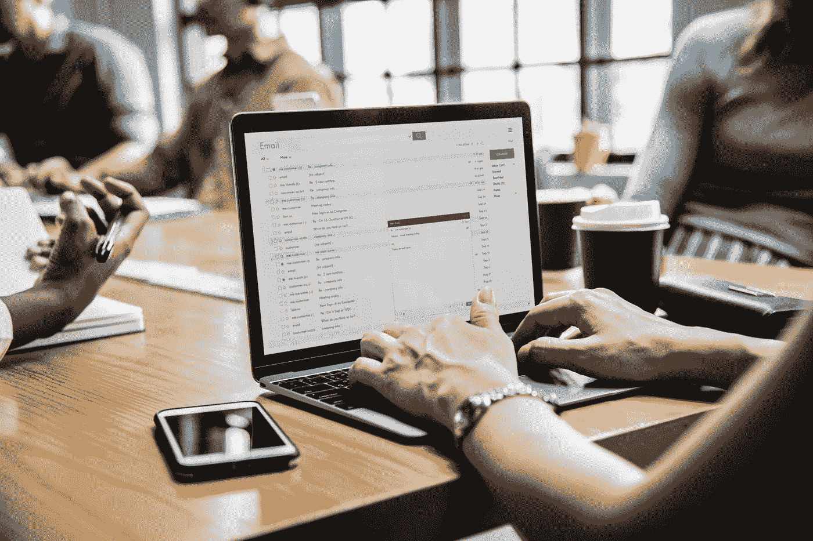

我在网络安全领域认识的大多数人都正确地关注根深蒂固的问题:服务器虚拟化和容器化、软件沙箱，以及帮助培训员工避免社会工程黑客。但是有一项技术我们都在继续使用，但自 20 世纪 60 年代以来，它从未真正发生过变化:电子邮件。

[电子邮件诞生于互联网](http://bit.ly/HistoryOfEmail)之前，至今已有近五十年的历史。该技术旨在为有限的、已知数量的用户提供一种在共享的 Unix 主机上相互通信的方式。为此，电子邮件是理想的选择。然而，因为它诞生在一个很少有人能接触到电脑的时代，安全的概念并不是电子邮件底层技术的优先考虑。安全套接字层(或 SSL)——第一个用来帮助电子邮件通信安全的协议之一——是由网景公司的工程师在 20 世纪 90 年代中期开发的[，在电子邮件诞生整整三十年后*。*](http://bit.ly/HistoryOfSSL)

*但是，尽管有了更新的信息技术，如短信、社交媒体、Slack 甚至视频聊天，电子邮件不仅仍然很强大，实际上还在蓬勃发展。2017 年[平均每天发送 2960 亿封邮件*。这些数字令人难以置信。企业和个人以几乎惊人的速度使用电子邮件。我在耐克工作的那段时间(2014 年至 2016 年)，我认识的大多数员工都生活在他们的电子邮件收件箱中:这是一个无止境的洞，任何光线都无法从中逃脱——甚至比 Slack 更糟糕。好吧，这有点戏剧性，但你明白我的意思。我们大多数人继续依赖电子邮件，因为它最初是被设计出来的，这简直是奇迹，而且——我作为你的朋友这么说——非常值得怀疑，因为:*](https://www.lifewire.com/how-many-emails-are-sent-every-day-1171210)*

> **电子邮件不太安全，不太隐私，也不太方便。此外，因为大多数人保留并使用多个电子邮件地址，这是一个非常难以管理的解决方案。**

**让我们来看看电子邮件最明显的漏洞，并提供一些解决方案来帮助减少或消除它们。**

# **漏洞:单因素登录**

> **“如果你花在咖啡上的钱比花在 IT 安全上的钱还多，你就会被黑。更何况，你*活该*被黑。”—白宫网络安全顾问理查德·克拉克**

**默认情况下，只需要用户名和密码就可以访问几乎所有的电子邮件。就是这样！只需要一个安全挑战就可以访问您的数据被称为使用单因素身份认证。现在问问你自己:如果一个恶意的黑客获得了你的凭证会发生什么？通过这种访问可以获得哪些法律、医疗或金融信息？更糟糕的是，这种访问会对你、你的朋友、你的家人和你的商业伙伴造成什么损害？问问马特·霍南(Mat Honan):他是《连线》(WIRED)等出版物的知名作家，2012 年他被黑客攻击，他的 Gmail、Twitter 和 iCloud 账户都被劫持、诽谤，然后彻底销毁。所以，你知道:这对 Mat 来说很糟糕，但它几乎是 100%可以预防的。让我们深入了解一下…**

## **诀窍是:**

**了解一下*恶意黑客如何获取你的证书是很重要的。三种最常见的方法包括:***

1.  **中间人(或 MITM)攻击**
2.  **使用键盘记录软件。**
3.  **使用老式的社会工程。**

**MITM 攻击，顾名思义，[在你不知情的情况下介入你和你想要的目标之间的第三方](http://en.wikipedia.org/wiki/Man-in-the-middle_attack)。实现这一点的一个方法是在免费的 Wi-Fi 热点上。恶意黑客可能会连接到免费的 Wi-Fi 网络，然后将他的笔记本电脑配置为具有相同网络名称的公共 Wi-Fi 热点*。连接到这个虚假网络的不知情的用户会受到黑客可能使用的任何工具的攻击。Wireshark 是一款众所周知的工具，用于仔细检查所有传输的数据(也称为“数据包嗅探”)，然后可以用来帮助捕获用户传递到任何网站的凭据。对于那些喜欢漂亮图片的人来说，下面是 MITM 攻击的样子:***

**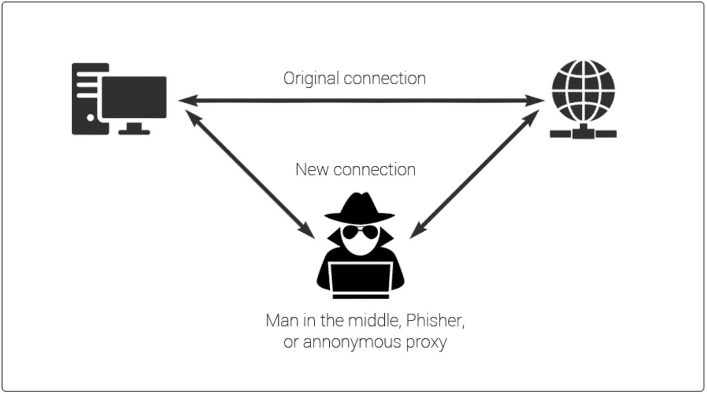**

**按键记录软件，顾名思义，是一种恶意软件，一旦安装在目标计算机上，就可以捕获或记录输入的每一次按键。如果你输入你的用户名和密码，那么你应该假设这也会被远程传给黑客。苹果电脑的用户不应该仅仅因为他们使用 Mac 就认为他们可以免受这种漏洞的攻击:键盘记录器适用于所有操作系统，包括 OSX。键盘记录软件可以由获得物理访问您的计算机的人安装，或者通过利用社会工程的力量来安装。**

**顾名思义，社会工程采用社交的方法来利用另一个人。一个有一点狡猾和策略的恶意黑客有时可以使用社会工程产生强大而危险的结果。钓鱼欺诈——看起来像官方邮件的邮件可能会欺骗用户，让他们以为自己登录了 GMail——就是这样一种方法。冒充 IT 部门的人给公司的不同员工打电话是另一回事。如果一名员工不小心将服务器访问权给了外人，这些简单的欺诈游戏(这正是它们)有时会给公司带来可怕的损失。想想你多久写一次支票，提供你的出生日期或社会安全号码，或者在社交媒体上发布关于你自己的个人信息。现在想想如果一个恶意的黑客获得这些数据会发生什么。耶:*我知道。*现在考虑一下，如果黑客选择使用这些数据来寻找您的其他数据，这些数据可能会提供什么样的杠杆作用。正是这最后一种方法——社会工程——为黑客提供了一些他的个人信息，然后他们利用这些信息来攻击他。**

## **缓解措施:**

****实现两个或多个因素的认证。** [正如我在之前的文章](https://medium.com/s/the-firewall/episode-3-multifactor-authentication-b25e9e1d2c18)中所讨论的，帮助防止单因素认证的最简单的方法之一是要求每个人，包括你，通过*多个安全检查点*来访问你的电子邮件。虽然这为您的登录过程增加了额外的 5-10 秒时间，但它可能会为您节省因恶意攻击而损失的几周甚至几个月的损失控制时间。使用多因素认证背后的基本原理是合理的:如果你的电子邮件凭据被盗，任何恶意黑客仍然会被迫提供第二次(或第三次)挑战来访问你的电子邮件。由于身份认证的第二和第三因素通常需要一个只有你携带的硬件，例如智能手机或 USB 加密狗，许多恶意黑客可以被挫败。幸运的是，最流行的网络邮件服务提供了双因素认证和[帮助页面来学习如何激活它们](http://bit.ly/Enable2FactorAuth)。**

****专业提示:**为了更好地利用多因素认证，我强烈推荐在你的 iOS 和 Android 设备上使用免费的应用程序“ [Authy](http://bit.ly/AuthyApp) ”。它比谷歌自己的 Authenticator 应用程序最大的优势是，它允许在新款 iPhones 上进行 TouchID 确认，存储数据的加密备份，并允许在许多设备上共享你的双因素认证(或 2FA)代码。这使得它成为可能使用不同 iOS 和 Android 设备来生成挑战代码的个人、家庭或小企业的理想工具。**

**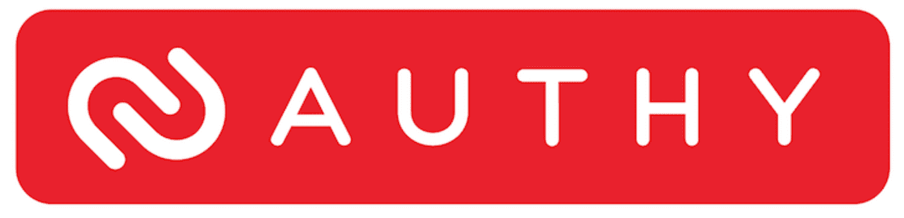**

## **实施所需的时间:**

**如果你不熟悉 2FA，我会花一个小时的时间下载 [Authy](http://bit.ly/AuthyApp) ，在你的智能设备上安装应用程序，然后一步一步地链接你的网络邮件(和其他敏感)账户。Authy 甚至提供了[简单易懂的指南](https://authy.com/guides/)来指导如何设置双因素认证。因此，我现在不仅仅在电子邮件上使用 Authy:我还在 [Dropbox](https://authy.com/guides/dropbox/) 、 [Twitter](https://authy.com/guides/twitter/) 、[亚马逊](https://authy.com/guides/amazon/)、&、[脸书](https://authy.com/guides/facebook/)账户上使用它，因为我绝对不希望这些账户被黑。**

# **漏洞:通过明文发送数据**

> **“硬件很容易保护:把它锁在房间里，锁在桌子上，或者买一个备用的。信息带来了更多的问题。它可以存在于不止一个地方；几秒钟内就能穿越半个地球。并在你不知情的情况下被偷走。”—布鲁斯·施奈尔**

**如果我们假设我们在网上工作时总是处于危险之中(事实也的确如此！)，那么发邮件是一个非常冒险的命题，的确如此。这主要是因为——默认情况下——电子邮件是以明文形式发送的，这种格式是不加密的。这使得为您的 ISP 或公司网络工作的好奇或恶意的个人很容易阅读您的邮件内容。它还可以查看和捕获您的电子邮件地址，这样无论是谁拦截了邮件，都知道是谁发送的。**

## **诀窍是:**

**捕获以明文形式发送的电子邮件的最常见方法是利用我前面提到的工具:Wireshark。Wireshark 是一个众所周知的应用程序，专门从事数据包嗅探，这听起来很脏，但实际上是一种强大的数字窥探方法。与您位于同一计算机网络(例如，咖啡店或酒店的 Wifi 热点)的用户可以运行 Wireshark 并监控该 WiFi 网络上的所有流量，包括 web 和电子邮件协议。为了说明数据包嗅探器是什么样子的，这里是我在网上找到的几张截图，用来说明发送带保护和不带保护的相同电子邮件的例子。图 1 显示了以明文发送的电子邮件；图 2 显示了一封使用 SSL/TLS(一种标准的电子邮件加密协议)发送的电子邮件。**

**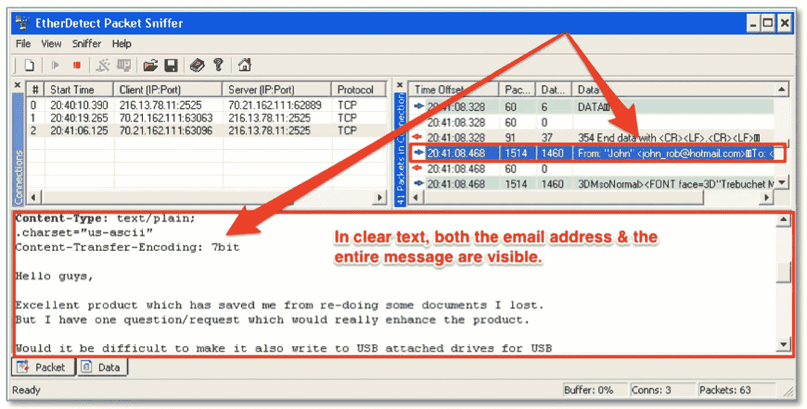**

**Image #1: Emails sent in clear text can reveal both the email and the actual message in a packet-sniffer.**

**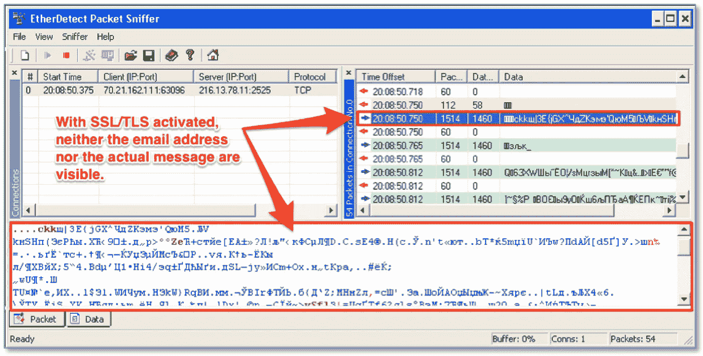**

**Image #2: Emails sent using SSL/TLS are encrypted, protecting both the email address and the actual message in a packet-sniffer.**

**一个简短但重要的补充:重要的是要记住*你以明文传输的任何东西都可能被数据包嗅探器*看到并捕获。这包括电子邮件和登录不安全的网站。在 2013 年的一个值得注意的故事中，[用户从他们的 iOS 设备登录 Tumblr 时，意外地被路由到网站的不安全](https://www.theregister.co.uk/2013/07/17/tumblr_ios_uncryption/)(或 http)版本，而不是安全(或 https)版本。因此，调查人员发现，他们可以使用 Wireshark 查看在同一个 WiFi 网络上登录 Tumblr 的任何人的用户名和密码，如下所示:**

**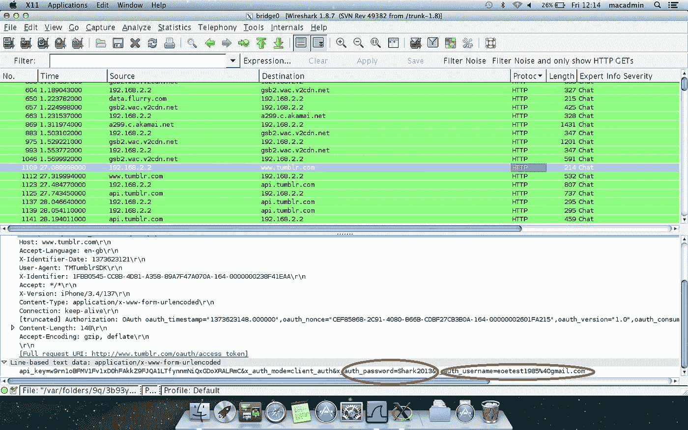**

## **缓解措施:**

****购买并使用商用 VPN。**企业已经使用虚拟专用网络(或 VPN)多年，因为该软件可以确保所有网络数据都被加密。个人也可以购买和使用 VPN 服务，通常大约 60-70 美元/年。如果你买得起的话，这是一个强大的工具。原因是:即使你和一个潜在的黑客在同一个公共 WiFi 网络上，你的数据也会被 VPN 加密，因此几乎无法访问。[我写了大量的](https://www.themacdweeb.com/blog/2017/6/20/why-you-need-a-vpn-service-how-to-pick-the-right-one)关于[如何挑选最好的 VPN 服务](https://www.themacdweeb.com/blog/2017/6/20/why-you-need-a-vpn-service-how-to-pick-the-right-one)来保护你的数据和隐私。只有一小群 VPN 提供商在两方面努力保护你。出于这个原因，我是以下五个 VPN 项目的粉丝:**

*   **[NordVPN](https://go.nordvpn.net/SHMV) (在巴拿马)**
*   **[仙人掌 VPN](http://bit.ly/VPN-Cactus) (摩尔多瓦)**
*   **[我的私人网络](http://bit.ly/VPN-MPN)(在香港)**
*   **[Boleh VPN](https://mypartner.bolehvpn.net/idevaffiliate.php?id=216) (在塞舌尔)**
*   **[IBVPN](http://bit.ly/VPN-IB) (在直布罗陀)**

**将 HTTPS Everywhere 扩展添加到您的网络浏览器中。在电子前沿基金会(EFF)和 Tor 项目的支持下，这款神奇的免费软件有助于迫使您的浏览器只浏览安全网站。[点击此处获取免费扩展](https://www.eff.org/https-everywhere)，并开始在 Chrome、Firefox 和 Opera 浏览器上使用。Safari 用户，你在这方面运气不好。[EFF 解释说 Safari 不在覆盖范围内](https://www.eff.org/https-everywhere/faq#will-there-be-a-version-of-https-everywhere-for-ie-safari-or-some-other-browser)是因为苹果对 Safari 代码的限制。**

## **实施所需的时间:**

**下载、启用和配置好的 VPN 软件应该只需要 15-30 分钟的时间。下载并启用 HTTPS 无处不在浏览器扩展需要 2-5 分钟。老实说，我想不出比这两项更好的投资了。**

# **漏洞:传输，单因素接收和永恒的电子邮件**

> **"如果隐私是非法的，只有不法之徒才会有隐私."—菲利普·齐默尔曼**

**我把最后这些漏洞归为一类是有原因的:因为它们都质疑和破坏了关于电子邮件的古老的、未被质疑的概念。**

**概念 1:电子邮件需要将您的信息从 A 点传输到 b 点。对于那些认为发送加密数据不够安全的人来说，假设我们重新设计了电子邮件的这一核心功能来停止数据传输？这提出了一个显而易见的问题:如果没有数据传输，那么我们的电子邮件怎么会被发送出去呢？简单的回答是:他们不会被派遣。**

**概念 2:即使我们在电子邮件帐户上实施了多因素认证，我们也不能强迫我们的电子邮件收件人也这样做。如果我们不能 100%确定我们的所有收件人都在保护我们的数据，那么我们也不能 100%确定我们的数据是安全的。但是，如果我们可以强制我们的收件人拥有并使用多因素身份验证，会怎么样呢？**

**概念 3:我们无法控制我们的信息在其他人的服务器上能保存多久。有了谷歌、雅虎和微软等免费网络邮件提供商提供的大量空间，几乎没有必要扔掉电子邮件。因此，即使我们努力从自己的服务器上删除所有敏感信息，我们也不能强迫其他人也这样做。或者我们可以吗？但是，如果我们能够首先防止敏感信息存储在其他服务器上，那会怎么样呢？**

## **缓解措施:**

****发送链接而不是消息**。 [SendInc](https://www.sendinc.com) 重新思考了发送电子邮件的概念，代之以发送邮件链接。简而言之，该公司将你的信息保存在其安全的亚马逊服务器上，然后将带有公钥的链接发送给你的预定收件人。收件人会看到您的个人电子邮件，他们会认为这是您的电子邮件，并且在打开电子邮件时，会看到一个明亮的橙色链接供他们点击:**

**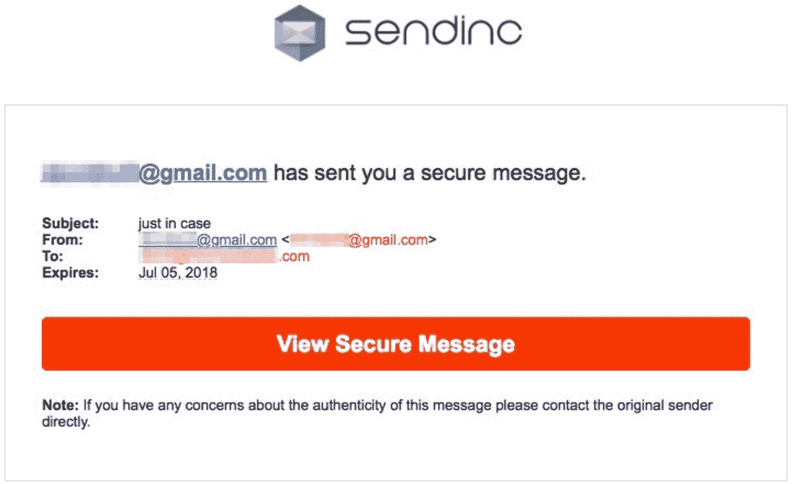**

**点击该链接，他们会看到位于 SendInc 服务器上的安全信息。免费版有一些很棒的技术，而付费版允许你添加更强大的功能，如自定义消息过期(你可以多快让你的电子邮件过期！)，消息收回(可以取消发送一条消息！！！)以及针对需要跟踪此类事件的个人和公司的邮件审计。**

****强制收件人使用密码才能查看电子邮件。InfoEncrypt 是一个非常聪明的 100%免费的服务，可以让你发送不经过他们服务器的加密邮件。尽管它利用 AES-128 位 SSL 加密(不是最强的安全措施),但它们也要求您创建一个密码来加密和解密您的消息。将这个密码提供给你的预定收件人(当然，通过除电子邮件之外的其他方法),你就有了一个体面的、易于使用的方法来对你的收件人进行双重认证。去他们的网站，输入你的信息，提供加密/解密的密码，你电脑上的软件会加密你的信息，用你的密码保护它。你现在可以通过任何正常的方法(电子邮件，文本等)发送这封加密的邮件，并且知道窥探的眼睛将无法解密你的笔记。你所需要做的就是把密码给你的收件人(使用一些不同的通讯方式),让他们查看和阅读给他们的信息。神奇！****

**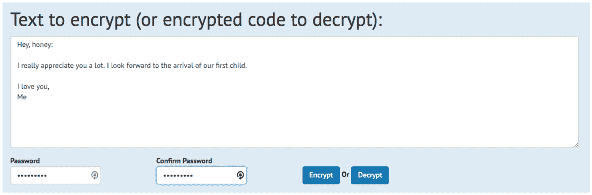****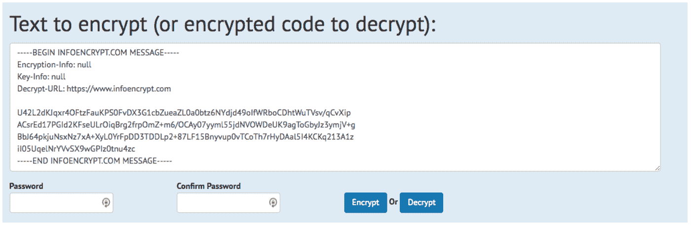**

****结合发送链接、强制使用密码和过期信息。**我高度推荐 [ProtonMail](https://protonmail.ch/) 作为终极电子邮件解决方案是有原因的。该系统由欧洲核子研究中心和麻省理工学院的科学家设计，被认为是国家安全局的证据；总部设在瑞士的服务器上，保存在岩石下 1000 米的安全地下室中，它在一个物理堡垒中，受比美国严格得多的隐私法管辖；提供突破性的安全功能的免费层，没有理由不使用 ProtonMail。有人告诉我，它还能给你做早餐，给你按摩背部，但我还没有看到这些功能起作用。🙂**

**最初，ProtonMail 看起来就像任何其他的网络邮件界面。但是一旦你登录，你会遇到第二个挑战，一个解密你账户的密码。如果您包括使用 Authy 的双因素身份验证(您应该这样做)，那就是三因素:相当安全。**

**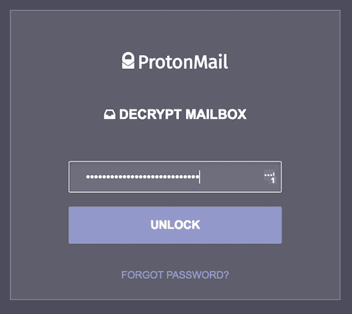**

**登录后，ProtonMail 就像其他网络邮件服务一样易于导航和使用。但是一旦到了撰写信息的时候，比较就结束了。发送保护您隐私的邮件是 ProtonMail 的优势所在。默认情况下，一个 ProtonMail 用户发送给另一个用户的邮件是加密的。 [*不过，你也可以给 ProtonMail 系统之外的任何人加密消息。*](https://protonmail.com/support/knowledge-base/encrypt-for-outside-users/) 这个函数的工作方式类似于 InfoEncrypt，但是更加无缝，因为它内置在系统中。您仍然需要为您的邮件选择一个加密/解密密码，但是 ProtonMail 允许您在发送通知时包含该密码的提示！非常方便！收件人不会收到你的电子邮件，而是一个在 ProtonMail 的服务器上查看该邮件的链接，对没有密码的所有人都进行了加密。**

**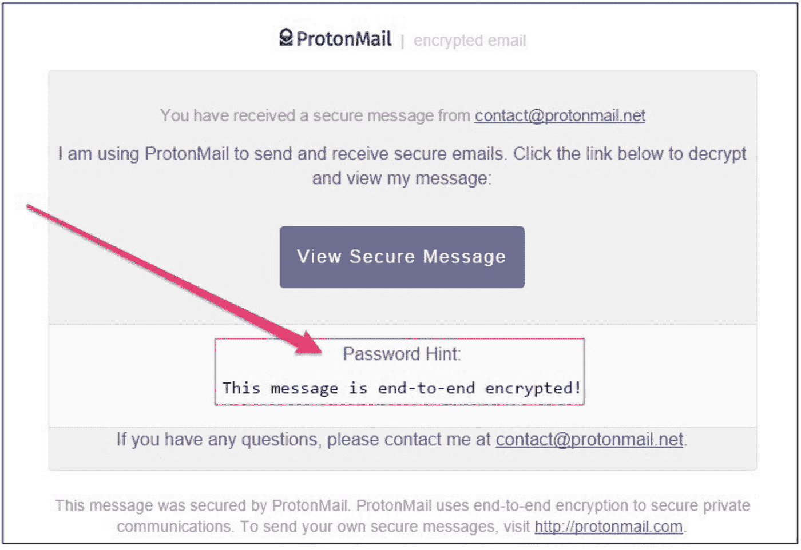**

**最后， [ProtonMail 允许你设置消息的过期时间](https://protonmail.com/support/knowledge-base/expiration/)。此工具确保只有目标用户可以查看您希望只有他们才能看到的消息。默认情况下，ProtonMail 邮件不会过期。如果你选择使用这个神奇的工具，你可以设置的最长有效期是四周。我个人将敏感消息设置为 2 小时或更少。偶尔，有人会错过这个机会。这对我来说很好:当涉及到非常敏感的通信时，我宁愿安全而不是抱歉，所以我总是愿意重新发送。值得安心。**

# **漏洞:仅使用一个电子邮件地址**

> **"建立一个声誉需要 20 年，而几分钟的网络事件就能毁掉它."― [夏羽纳波](https://www.goodreads.com/author/show/17178817.Stephane_Nappo)**

**现代生活和商业的需求要求我们拥有不同功能的多个电子邮件地址。我个人为我的每项业务保留不同的电子邮件地址。然而，我也有*个人*电子邮件需求:**

*   **我属于各种拥有门户网站的团体和组织，这些团体和组织需要一个电子邮件地址来注册和登录。**
*   **我订阅了各种时事通讯和服务，需要一个有效的电子邮件地址——一个可以确认的地址——才能注册。**
*   **我在网上购买商品和服务。我购买的每一家新商店都需要一个有效的电子邮件地址来注册，然后我才能获得购物权限。**

**在早期，我只有一个电子邮件地址，我会把它发给任何需要它的人、公司或服务。我很快发现我的收件箱里塞满了来自律师和广告商的垃圾邮件。电子邮件的无处不在和流行迫使我重新思考我如何使用这项技术，着眼于我的隐私和安全。我最初的策略既费时又不方便:我创建了一堆免费定制的电子邮件地址来满足我的所有需求。拥有那么多邮箱账号和密码都失败了。惨了。相反，我需要一个新工具——如果有的话——来更好地管理大量的电子邮件地址。更重要的是，我的解决方案需要便宜或免费，易于使用，非常方便。**

## **缓解措施:**

****利用可定制的电子邮件别名功能。**我在为[做研究时发现了](https://screwthecablecompany.us7.list-manage.com/track/click?u=6ad42ead8280e393e6b88eda5&id=2e75bd2222&e=b6afca109e)[33 邮件](http://33mail.com/m5Nbaq3)，这是我的另一篇关于限制个人资料的文章。免费服务似乎正好提供了我在电子邮件策略解决方案中寻找的东西:无限制、免费、可定制的电子邮件地址；一个简单易用的界面，可以自动转发给我每封邮件；以及立即阻止垃圾邮件的能力。33mail 的工作原理是给你一个基本的电子邮件地址，你可以随意定制。如果你的 33 邮箱用户名是“非常重要的人”，这将成为你的定制电子邮件别名:_____________@VeryImportantPerson.33mail.com。把你喜欢的任何东西放在@符号前，它就会进入你的 33 邮箱账户，并自动转发给你。简单！**

**该公司的高级服务(每月 1 美元)不提供广告，使用我自己定制的域名，以及更高的每月数据上限。**

**提示:当你注册任何在线服务时，提供一个定制的 33mail.com 电子邮件地址。我建议你根据服务的名称或与你互动的人的名称来创建每个电子邮件地址。例如:**

*   **如果你注册了网飞，请使用以下电子邮件地址:“网飞@非常重要的人. 33mail.com”**
*   **对于新浪微博，使用“Sina Weibo @ very important person . 33 mail . com”作为您的注册电子邮件地址。**
*   **如果你注册了家居装饰网站 Houzz，就用…实际上就是不要注册 Houzz。他们给你发了太多的垃圾邮件:相信我。**

**33mail 会自动将您创建的每个别名的每封电子邮件转发到您在注册过程中提供的个人电子邮件帐户。下面是一封典型的 33 封邮件的样子:**

**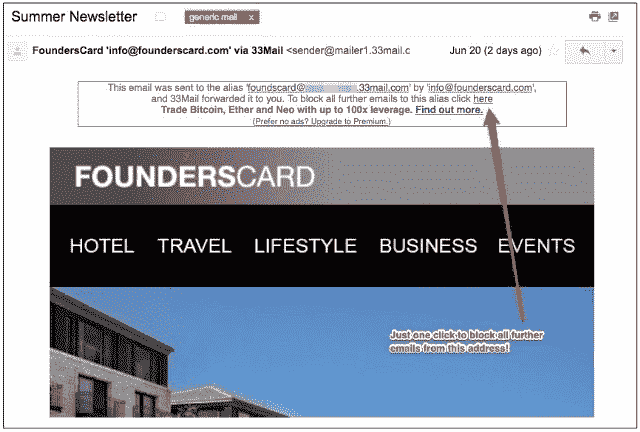**

**33 电子邮件在每封邮件的顶部都包含所有相关的自动转发信息，便于识别。在每一个盒子里面，都有另一个特殊的工具:**一个阻止来自那个特定别名的所有电子邮件**的链接。只需点击一次链接，所有发送到该地址的电子邮件都会被阻止！33mail 甚至会给你发一封确认邮件，让你知道已经完成了。我制作了一个简短的视频来演示这是如何工作的，使用的是你上图看到的电子邮件:**

**[使用 33mail 作为解决方案](http://33mail.com/m5Nbaq3)消除了很多麻烦:我只是继续在我的个人邮箱里接收邮件，而不需要向 33mail 以外的任何人提供那个地址。更棒的是，我可以像回复任何其他“普通”邮件一样，回复任何一封自动转发的 33 封邮件。我的回复通过 33mail 的服务器，删除了与我实际电子邮件地址相关的任何邮件头信息(称为 MX 记录)。*只要记住:在点击发送之前，删除你邮件中的任何信息，包括免费服务层的所有 33 个邮件自动退订链接！***

**对于大多数临时用户来说，免费的基本层已经足够了，但我非常喜欢这项服务，所以我注册了 1 美元/月的付费层。朋友们，不管你选择哪一层，都不要给出你的个人电子邮件地址。相反，注册并开始使用 [33mail](https://screwthecablecompany.us7.list-manage.com/track/click?u=6ad42ead8280e393e6b88eda5&id=dd7a6f4742&e=b6afca109e) 来获得更多隐私和安全。**

**朋友们，这就是第一期的内容。我希望你已经有了一些新的工具，可以用来继续保护你的隐私和数据。简单回顾一下，以下工具可以帮助您解决最常见的电子邮件和数据通信问题:**

*   **通过使用 iOS 或 Android 设备上的免费 Authy 应用程序来管理您的授权码，实现两个或更多因素的身份验证。**
*   **购买并使用商业 VPN 来帮助加密你所有的互联网数据，包括电子邮件和网上冲浪。**
*   **为 Chrome、Firefox 或 Opera 安装免费的 HTTPS Everywhere 浏览器扩展。**
*   **免费使用 [SendInc](https://www.sendinc.com) 发送链接到您的电子邮件，而不是实际的电子邮件。**
*   **免费使用 [InfoEncrypt](https://www.infoencrypt.com) 对你可以在任何普通电子邮件程序中发送的电子邮件进行加密和密码保护。**
*   **免费使用 [ProtonMail](https://protonmail.ch/) 来组合发送链接，在一个强大的工具中强制使用密码来查看您的电子邮件和过期信息。**
*   **通过使用免费的 [33mail](http://33mail.com/m5Nbaq3) 服务来创建无限的、可定制的电子邮件别名，利用可定制电子邮件别名的力量。**

**如果你有一个你正在使用的很棒的工具，**请留下评论**，这样我们可以一起分享！在那之前…**

**安全冲浪！**

***原载于 2018 年 7 月 10 日*[*www.datadriveninvestor.com*](http://www.datadriveninvestor.com/2018/07/10/the-most-common-vulnerability-of-all-2/)*。***