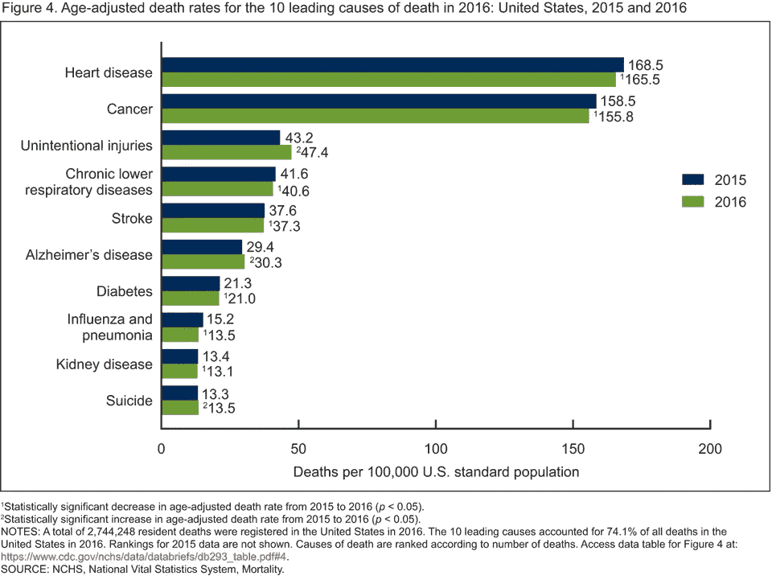
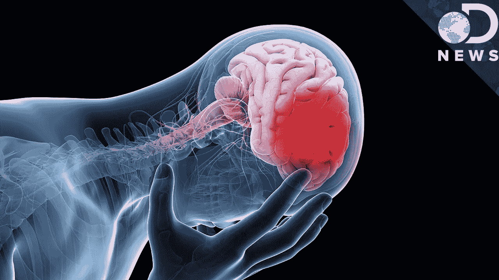
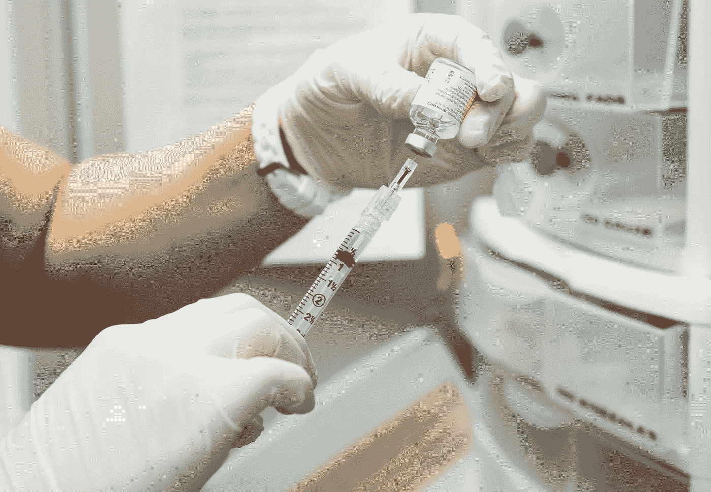

# 美国死亡人数最多的国家

> 原文：<https://medium.datadriveninvestor.com/the-most-death-of-the-us-f3c0b79362d3?source=collection_archive---------34----------------------->

## *美国主要死亡原因:原因和预防*

# 心脏病

心脏病是死亡的主要原因，平均每年导致 63.5 万人死亡，其中 23.1%是由吸烟、不健康的饮食和不健康的体重以及缺乏锻炼引起的。

# 巨蟹星座

癌症是你体内细胞快速且不受控制生长的结果。正常细胞以可控的方式繁殖和分裂。造成 21.7%的死亡，598，000 人死亡，原因是肥胖、家族史、慢性炎症、过度暴露于阳光、酒精和老年。

# 意外伤害

意外伤害每年导致 161，000 人死亡，占死亡人数的 5.9%，最常见的是 1-44 岁的人。这包括汽车事故，可以通过注意周围环境并采取一切适当的预防措施来防止事故或伤害。

# 慢性下呼吸道疾病

慢性下呼吸道疾病每年导致 154，000 人死亡，占所有死亡人数的 5.6%最常见的是 65 岁以上的老人和哮喘患者。烟草使用和二手烟暴露是这些疾病发展的主要因素。戒烟。限制你接触别人的烟来降低你的风险。

# 中风

在每年 142，000 例死亡中，中风占 5.18%，常见于糖尿病、高血压、心脏病和吸烟者。当流向大脑的血液被切断时就会发生。如果没有富氧血液流向你的大脑，你的脑细胞会在几分钟内开始死亡。可以通过保持健康的体重、锻炼和控制血糖来预防。

# 阿尔茨海默病

阿尔茨海默病占 4.23%，每年导致 11.6 万人死亡。杀死 65 岁以上的女性最多，与家族史有关。T2 老年痴呆症 T3 的病因尚不清楚，但研究人员和医生认为，一个人的基因、生活方式和环境的结合会随着时间的推移影响大脑。

# 糖尿病

糖尿病占美国总人口的 2.9%，每年有 8 万人患糖尿病。有疾病家族史或特定 gee 类型的人可能在 2-7 岁时发病。二型糖尿病在 45 岁以上和有糖尿病病史的人群中很常见。如果你有家族病史，定期检查血糖。

# 流感和肺炎

在美国，流感和肺炎每年导致 51，537 人死亡，死亡率为 1.88%。最常见于儿童和老人，以及孕妇。[流感](https://www.healthline.com/health/cold-flu/flu)(流感)是一种传染性极强的病毒感染。这在冬季很常见。肺炎是肺部感染或炎症。

# 肾脏疾病

肾脏疾病每年导致 5 万人死亡，占每年死亡人数的 1.8%。常见于那些吸烟、超重或有家族肾衰竭/疾病史的人。可以通过锻炼和戒烟戒酒来预防。

# 自杀

自杀每年夺走 44，965 条生命，占美国死亡人数的 1.6%。这在脑损伤患者中很常见，对于抑郁症患者以及滥用药物和酒精的男性也是如此。故意自残是一个人自己的行为造成的死亡。“自杀预防旨在帮助人们找到一种治疗方法，鼓励他们结束自杀想法，并开始寻找更健康的方式来应对。”

感谢您阅读这篇短文，

***过得愉快，***

**别忘了跟着，**

**留个拍手，还是 50，**

***和一如既往的***

*坚持学习。*

***欧文·桑顿***

***引文；***

[https://www . health line . com/health/leading-causes-of-death #败血症](https://www.healthline.com/health/leading-causes-of-death#septicemia)

[https://www.healthline.com/health/mental-health-resources](https://www.healthline.com/health/mental-health-resources)

[https://suicidepreventionlifeline.org/](https://suicidepreventionlifeline.org/)