# 您需要知道的最有效的产品路线图类型

> 原文：<https://medium.datadriveninvestor.com/the-most-effective-product-roadmap-types-you-need-to-know-b47a923902e7?source=collection_archive---------1----------------------->

如果没有产品路线图来简化流程并使整个团队保持在正确的轨道上，任何产品都无法正确完成——它可以是为特定受众定制的，具有特定类型的信息或不同的要点和方法。

路线图可能包括一个或多个产品，这取决于产品的类型，每个产品经理都会选择最佳变化。有[数以千计的自定义路线图类型](https://roadmunk.com/guides/roadmap-templates/)，但我将只为你分类最常见的。

上一次，我已经介绍了[什么是产品路线图](https://medium.com/datadriveninvestor/how-to-create-a-product-roadmap-for-a-mobile-app-3e850bdd52cf)，也简单提到了 Brian Lawley 在他的书 [*专家产品开发*](https://280group.com/products/books/expert-product-management/) —战略&市场路线图、愿景路线图、技术路线图、平台路线图等中的分类。

 [## 数据科学和软件工程哪个更有前途？数据驱动的投资者

### 大约一个月前，当我坐在咖啡馆里为一个客户开发网站时，我发现了这个女人…

www.datadriveninvestor.com](https://www.datadriveninvestor.com/2019/01/23/which-is-more-promising-data-science-or-software-engineering/) 

然而，[产品路线图的范围要广得多](https://roadmunk.com/guides/business-roadmap-examples/) —它们可以按受众、行业、形式和目的进行分类。

看一下常见产品路线图:

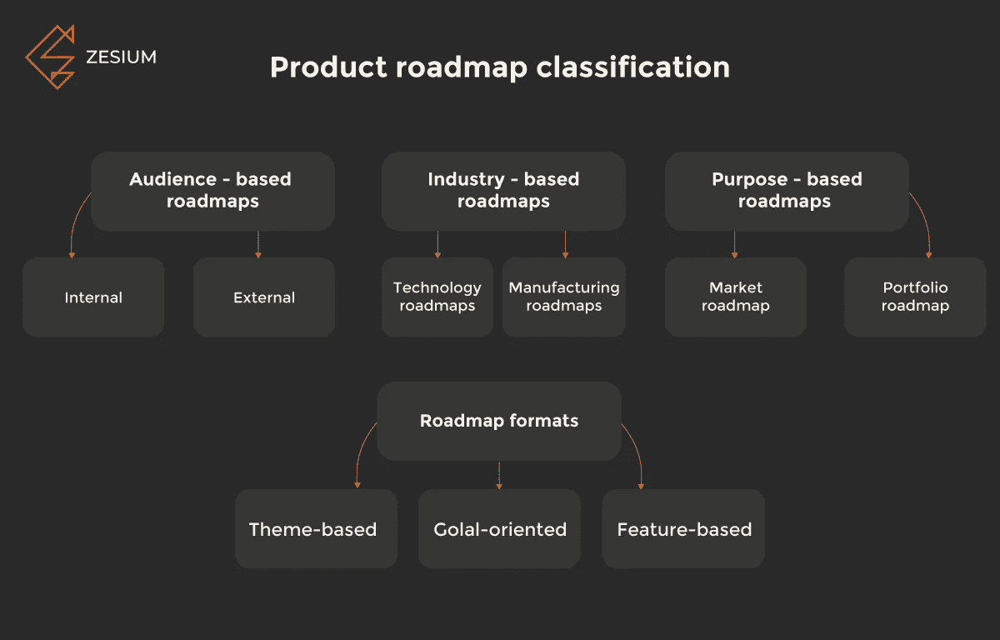

Source: zesium.com

让我们看一下每种类型的产品路线图:

## **基于受众的路线图**

路线图通常会与不同的人或受众分享，以协调所有生产参与者的观点。

不同的团队用不同的“眼睛”看待事物，为了简化参与项目的不同团队之间的沟通，产品经理必须创建多个路线图，从不同的角度展示相同的信息。

这种类型的路线图将促进关于必要功能和战略的对话，从而使内部团队了解客户需求。

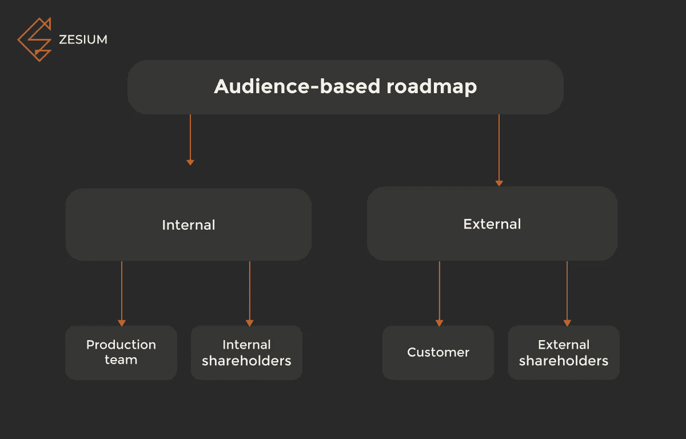

Source: zesium.com

上图概述了内部和外部的受众(群体)。

**内部受众**代表您的生产和管理团队。

管理团队通常由股东(*你公司的管理层)*组成，他们对产品的详细愿景以及战略目标感兴趣。解决方案是战略路线图，它显示了有关客户增长、竞争对手分析、产品新市场进入和客户满意度的详细信息。

生产团队可能很棘手，有时需要根据他们的具体需求定制路线图。例如，您的工程(技术)团队会发现 ***技术路线图*** 是最合适的—它专注于技术细节，概述截止日期，它基于功能，并列出注册表单、第三方服务集成、搜索栏等功能。它还包括高层次的信息，如目标，但请记住，您的工程团队不应该过于关注愿景，而是开发过程和需求。

然而，另一个团队，如销售团队，不应该关注技术特性，而应该主要关注产品特性及其对用户的好处——销售团队的路线图应该主要关注产品价值。例如，一个好的选择是 ***基于主题的格式*** ，因为它可以图形化地显示每个特性的目标。

**外部受众**及其路线图不会分享任何有关内部流程的特定细节，它们应该在视觉上清晰、简洁、易于理解，并分享大量有关客户利益的信息。

这些路线图通常提出了粗略的时间框架和功能发布的进度。

## **基于行业的路线图**

为特定行业的要求而创建的路线图通常具有独特的内容，并遵循合适的格式，因为它们可用于各种行业。

Source: zesium.com

常见的行业路线图很少，我们来列举一下:

**技术(IT)路线图**通常是为了定义技术需求而创建的——它们决定了特定技术的用途，并有助于分配它们所依赖的资源。

**制造路线图**指的是实际制造实物产品——顾名思义，[这些路线图](https://www.onepager.com/solutions/manufacturing.html)有助于控制制造，并设定具体交付或发布的实际日期。

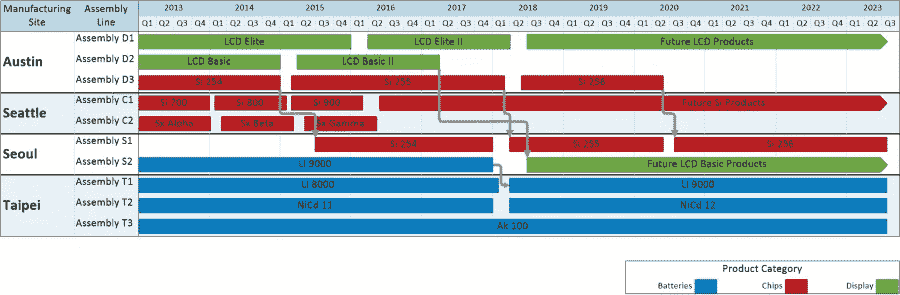

Source: onepager.com

## **基于目标的路线图**

路线图的主要目的是在参与者之间交流战略和愿景，但也有更多的选择。

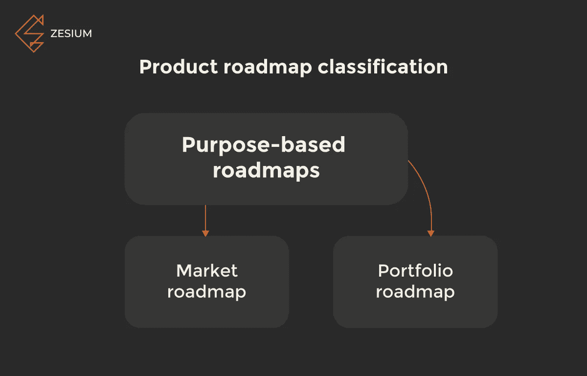

Source: zesium.com

[**组合路线图**](https://www.productplan.com/roadmap-template-examples/) 是为了高管和产品经理之间沟通战略而创建的。跟踪每种产品的增长情况总是至关重要的，如果你的公司有多种产品，你应该检查这些产品如何相互关联，以实现你的业务目标。

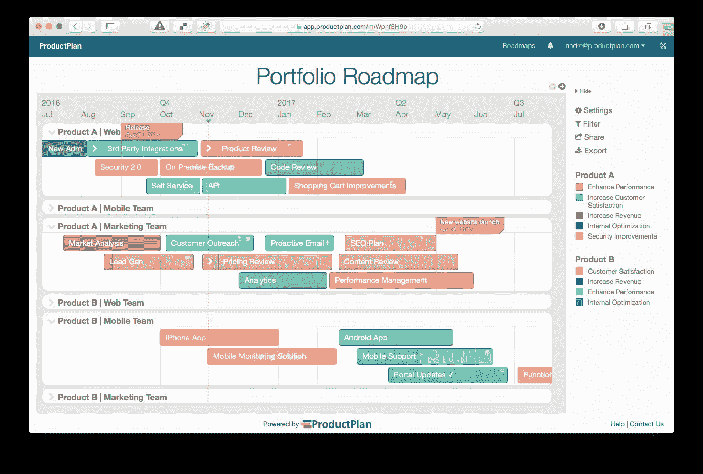

Source: productplan.com

**如果你计划在多个市场推出产品，通常会用到市场路线图**——通常由营销团队和内部股东[制定营销策略。由于这些路线图必须抓住快速的市场变化，因此被认为是最具活力的。](https://www.productplan.com/example-marketing-roadmaps/)

例如，如果一项技术进步引起了重大变化，它将要求战略修改，这必须记录在路线图中。

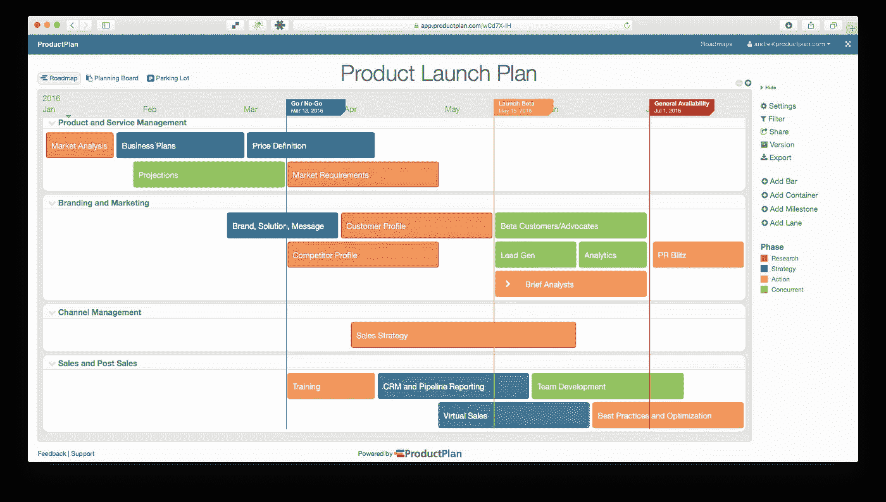

Source: productplan.com

# **产品路线图格式**

产品路线图的类型决定了[格式](https://roadmunk.com/guides/marketing-roadmap-examples/)——它决定了内容的类型和创建内容的关键组件。

最常见的格式是基于目标、基于主题和基于特征的格式。

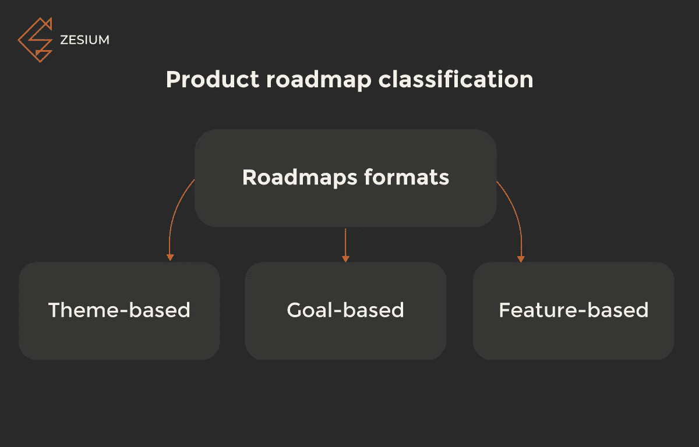

Source: zesium.com

让我们逐一检查:

## **基于目标的格式**

目标定义了每个特性背后的原因。例如，目标可以是'*简化注册流程'*或'*提高用户参与度*等。

基于目标的格式有助于组织所有信息，并用清晰的语言进行解释。通过这样做，您将保持您的路线图的顶层，并使您的战略易于理解。

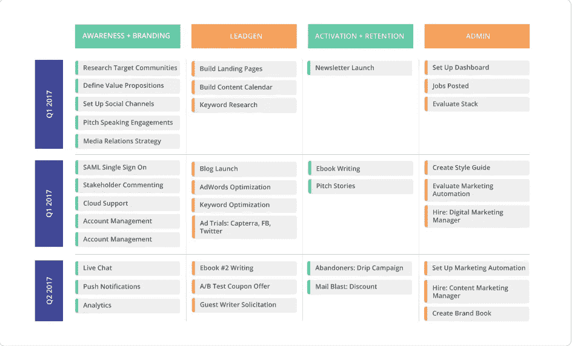

Source: roadmunk.com

## **基于主题的格式**

基于主题的格式类似于基于目标的格式——目标和主题都倾向于回答*‘为什么’*的问题，然而基于主题的格式通常一次包含几个目标。

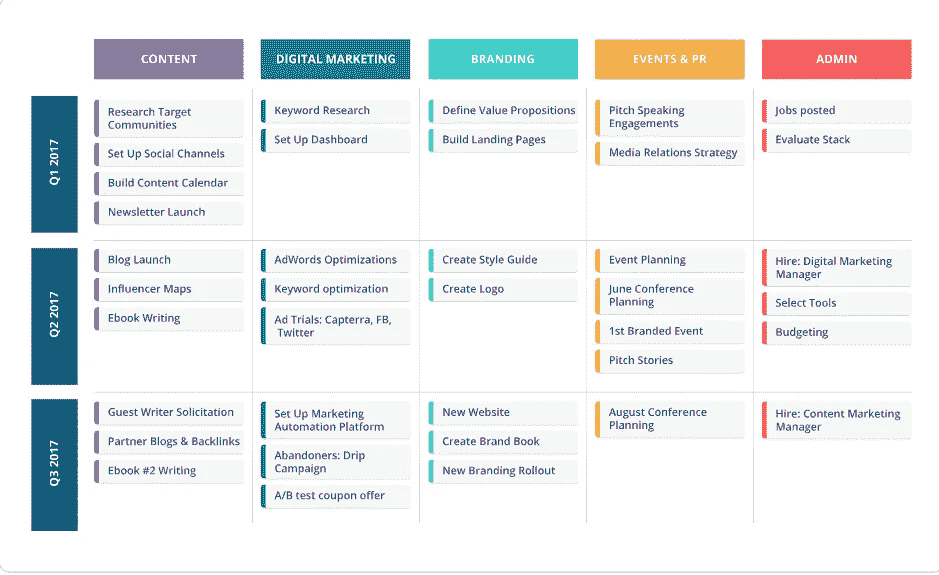

Source: roadmunk.com

## **基于特征的格式**

基于特性的格式使用产品特性作为路线图的中心点，通常非常详细。然而，一个特性并不是一个稳定的单元，因为技术创新和用户需求经常会导致特性的变化。

这种类型的路线图没有指定高层次的细节，理解和维护起来可能有点困难。

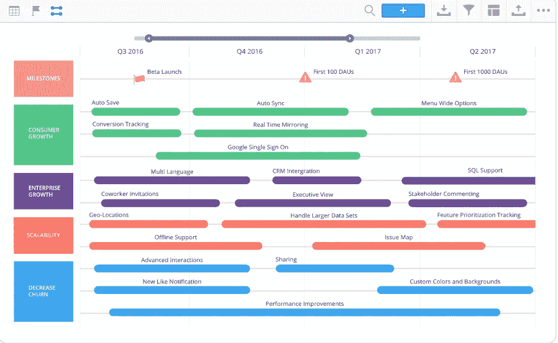

Source: roadmunk.com

# **路线图模板和示例**

如果你没有时间或者不知道如何创建自己的路线图模板，不要担心，因为有许多有价值的工具可以帮助你。

以下是最受欢迎的一个:

[Roadmunk](https://roadmunk.com/) —最受欢迎的路线图工具之一，具有不同的路线图“视图”,因此适用于不同的相关团队(开发人员、营销团队等)。)他们给 **14 天试用期**以及一批[免费模板](https://roadmunk.com/roadmap-templates)。

[啊哈！](https://www.aha.io/)——一款路线图软件，拥有令人印象深刻的与各种应用程序的集成列表，如吉拉、Slack、Zendesk、Confluence、Trello 和[。他们还给予**30 天的免费试用期**而不需要信用卡号码。](https://www.aha.io/product/integrations)

[ProductPlan](https://www.productplan.com/) —也是一款流行软件，提供[大量流行的路线图模板](https://www.productplan.com/resources/roadmap-templates/)。你可以在 30 天的试用期内免费试用。

[开放项目](https://www.openproject.org/) —敏捷/Scrum 团队的开源软件。他们领先的开源项目管理软件是免费的(正如他们所说的“永远免费”)，你可以查看他们的[其他定价计划](https://www.openproject.org/pricing/)看看什么对你最合适。他们给你 14 天的免费试用期。

[路线图规划器](https://www.roadmap-planner.io/)—Linux 的开源工具。他们根据您的具体需求，为个人、企业和客户提供不同的套餐方案。路线图计划者提供了 14 天的免费试用，你可以尝试一下，看看它如何满足你的需求。

[Vengage](https://venngage.com/)—*易于使用的*网站，用于为网站、演示、广告等制作时尚内容。有各种各样的项目模板(信息图，海报，社交媒体图像等)。)然而，他们也提供了一些用于产品路线图的[模板，以及如何更轻松地创建它们的技巧。虽然没有上面的软件那么详细，但对参与者来说可能是个不错的改变。](https://venngage.com/blog/inspiration-marketing-product-roadmap-templates/)

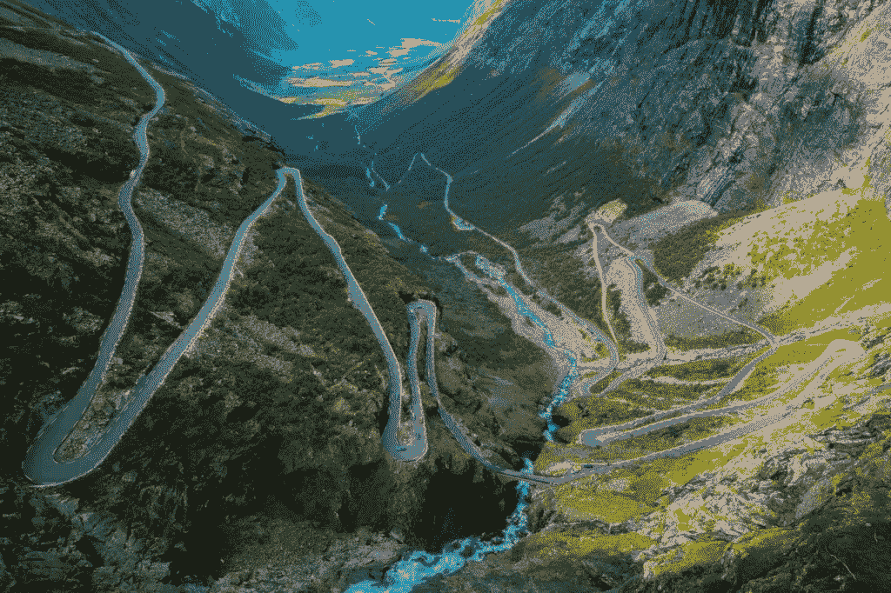

由于产品路线图应该只提供关键点，尽量避免在路线图中添加太多详细信息，最好使用[支持文档](https://www.altexsoft.com/blog/business/technical-documentation-in-software-development-types-best-practices-and-tools/)来伴随路线图。

**发布计划** —与概述产品交付进度的产品路线图相反，发布计划为将要发布的特定功能设定了严格而精确的日期。

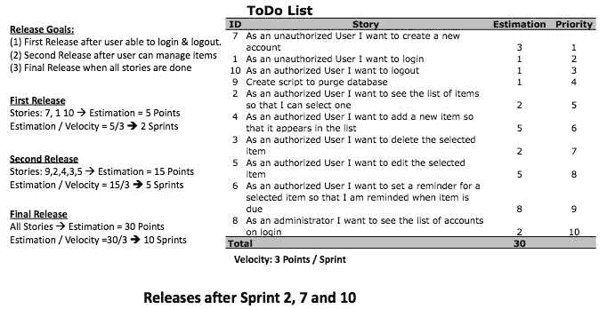

Source: scrum-institute.org

**产品积压**——用于 Scrum，提供了一个高层需求和特性的列表——它们由用户故事组成，代表了定义开发过程的待办事项列表。

Source: scrum-institute.org

**技术路线图**通常在开发数字产品时作为一个单独的文档使用——它展示了用于实现业务目标的技术和技术辅助手段。

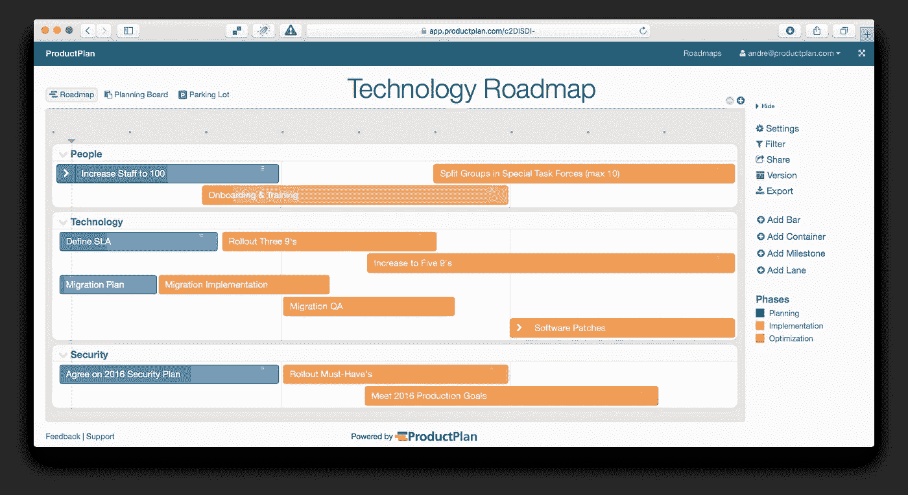

Source: productplan.com

# **最后一句话**

每个产品对你的业务和投资回报率都很重要——如果你不仔细计划开发和维护过程，它肯定会在某个时候变得很糟糕。这就是路线图出现的地方——对于任何产品开发团队来说，这都是一个必不可少的文档。

虽然路线图是一个耗时的过程，但模板和基于云的应用程序可以让它变得容易得多。

一个好主意是查看不同路线图类型的示例，看看哪一个最适合您的需求。

> 您的需求将为您提供应该使用哪种路线图的答案。

*原载于 2019 年 11 月 27 日*[*http://zes ium . com/the-most-effective-product-roadmap-types-you-need-to-know/*](http://zesium.com/the-most-effective-product-roadmap-types-you-need-to-know/)*。*

点击下面的链接，安排与 [**马娅·达契奇**](https://app.ddichat.com/experts/maja-dakic) 的 DDIChat 会议。

 [## 马贾达基奇-迪迪恰特

### 技术行业(软件、移动应用、物联网、人工智能等)的资深作家。)以及在…

app.ddichat.com](https://app.ddichat.com/experts/maja-dakic)