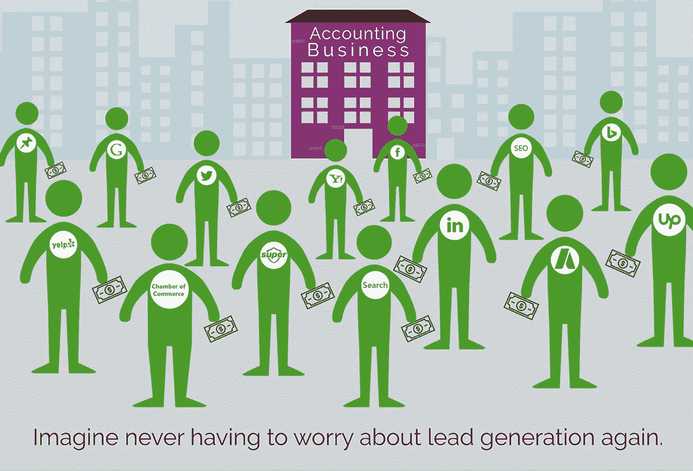

# 选择会计师事务所时要考虑的最重要的事情

> 原文：<https://medium.datadriveninvestor.com/the-most-important-things-to-think-about-when-choosing-an-accounting-firm-c7af320b554c?source=collection_archive---------6----------------------->

无论你的企业目前处于什么行业，确保你的账目得到妥善管理是绝对必要的。如果没有[适当的会计实践](https://medium.com/@KahunaAccounting/how-to-fix-your-accounting-mess-e9d64a2d89e5)，随着时间的推移，你的企业将不可避免地面临各种财务、运营和法律风险。最好的会计师不仅能保证你的账目准确并符合法律规定，还能帮你节省一大笔钱。

不出所料，每年都有无数企业做出大胆的选择，将会计服务外包出去。然而，有这么多不同的独立会计师、在线会计师或实体会计师事务所可供你选择，很难知道你应该从哪里开始搜索。

 [## 波动迫使数据驱动的投资者冷静

### 自然界中很少有东西是直线行进的，尤其是经济。当投资者和消费者希望平静时…

www.datadriveninvestor.com](https://www.datadriveninvestor.com/2019/03/25/volatility-compels-calm-amid-the-storm/) 

在本文中，我们将讨论您在选择新的 [**外包会计师事务所**](https://fullyaccountable.com/) 时需要考虑的最重要的事情。通过花时间去了解这个行业，熟悉你的选择，客观地权衡每个选择的利弊，你最终会做好准备，为你的企业做出正确的决定。

## ***与自己的企业合作的经历***

在美国(和其他地方)似乎有数不清的不同种类的企业，自然，一个企业面临的独特的财务问题不一定与另一个企业面临的问题相同。虽然每个企业都可能需要跟踪他们的开支、支付员工工资和纳税，但管理这些任务的方式往往是非常独特的。

如果你正在考虑聘请一位外部会计师来管理你的账目和税收，那么找一位在与你自己的企业类似的其他企业有丰富工作经验的人通常是有意义的。这样，你的会计师就可以从以前的经验中吸取教训，提高工作效率，而不是从零开始学习让你与众不同的系统和特征。

● *企业规模:*你会希望从寻找与类似规模的企业合作的人开始。这可能是由您的月收入、您目前拥有的员工数量或者您的企业目前运营的地点数量决定的。小企业和大企业将有截然不同的会计需求。

● *行业:*尽管许多会计师事务所能够胜任各种不同行业的业务，但你还是希望确保你的会计师熟悉让你的行业独一无二的许多东西。例如，如果你是一家旅游公司，你可能会考虑[雇佣一名熟悉先进先出(FIFO)库存系统的会计](https://medium.com/the-nonprofit-revolution/how-to-know-if-its-time-to-hire-an-accountant-66ec307ce114)——与后进先出(LIFO)相反。

● *复杂:*除了规模和行业，有些业务不可避免地比其他业务复杂得多。如果你的企业有多个分支机构，各种不同类型的员工，多国经营，或其他使其更加复杂的特点，这些都是你的外包会计师也应该熟悉的东西。

一名会计师在与你的公司类似的企业中工作的经验越多，他们就越有可能驾驭法规并发现节约的机会。

## ***平衡成本与责任***

在寻找外包会计师时，恰当地平衡雇佣他们的成本和你要他们完成的任务数量也是至关重要的。自然，更昂贵的会计师事务所(如“四大”)将能够以更大的规模运营和执行，但对于大多数中小企业来说，这些成本和能力可能根本没有必要。

通常情况下，即使是最小的会计师事务所也会由至少一名能够处理你的纳税申报表、各种财务报表(资产负债表、损益表)和其他年度义务的注册会计师组成。你可能还想找一个能分析你的开支、发现节约机会和管理你的工资单的人。最好的会计服务——由每天勤奋地与数字打交道的人组成——不只是简单地“给你开账单”,而是会向你提供每项服务成本的详细信息。

## ***寻找能回答你问题的人***

每年都要找一个新的会计师是你不可避免要避免的事情。幸运的是，目前在美国大约有 100 万名会计师 ，他们中的许多人可能能够帮助你的企业轻松管理账目。为了尽量减少你担心簿记员的时间，你应该确定找一个和你有化学反应并能有效回答你问题的人。

●你平衡我们账目的一般方法是什么？你准备我们的纳税申报表的方法是什么？

●你在记账时有没有经常使用的软件或自动化流程？

●你有什么样的与我们类似的企业合作的经历？

●根据你目前对我们公司的了解，你认为你能*帮助我们更有效地运营*？

●有工资单经验吗？库存管理经验？财务报告经验？

虽然这只是你可能会问的问题的基本列表，但是花时间去问这些问题将不可避免地帮助你找到正确的方向。目前最好的会计公司应该熟悉这类问题，并且会很乐意回答。此外，你还应该找一个无论是通过电话、网络还是面对面，你都可以在任何必要的时候轻松沟通的人。

## ***寻找价值观一致的公司***

最后，在比较不同的会计师事务所时，寻找一家与你的价值观一致的事务所是很重要的。与普遍的看法相反，实际上有大量的系统哲学和主观决策参与到会计流程中。虽然大多数公司会根据你的喜好调整他们的会计方法，但通常来说，确保你们从一起记账的那一刻起就在同一页上仍然是一个好主意。

为了更好地了解你和未来的会计师相处的经历，你应该从访问他们的网站开始，看看他们对自己有什么看法。此外，向你的商业伙伴寻求参考，阅读各种在线评论也是非常有益的。这两种方法都应该有所保留(人们通常更倾向于写不好的经历，而不是好的经历)，但它们肯定是你开始搜索的绝佳方法。

## ***结论***

显然，当你雇佣一名会计师时，有很多事情需要考虑。通过花时间寻找一个熟悉让你的企业独一无二的许多变量的人，你将更有可能在第一次尝试时就找到一个合适的会计师。此外，从长远来看，努力研究和理解整个会计行业是非常有益的。