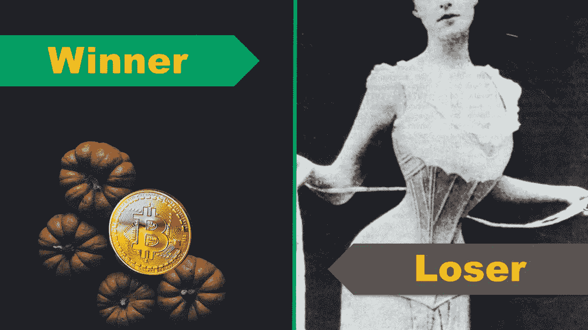

# 本周最有趣的股市故事；密码和紧身胸衣！

> 原文：<https://medium.datadriveninvestor.com/the-most-interesting-stock-market-stories-of-the-week-crypto-and-corset-184fd25f6315?source=collection_archive---------23----------------------->

上周在美国是短暂的一周。但短暂的一周并没有抑制股市令人兴奋的故事。[这篇关于加密货币如何搅乱感恩节对话的文章](https://www.cnbc.com/2018/11/21/why-you-may-want-to-leave-bitcoin-off-the-thanksgiving-dinner-table.html)是我们休息日的一篇好文章。它还与本周最有趣的股市故事密切相关:

赢家:Overstock.com(股票代码:OSTK)，涨幅超过 23%！

记得 Overstock.com 吗？大约一年前，当该公司的首席执行官帕特里克·伯恩(Patrick Byrne)宣布他是加密货币未来的忠实信徒时，我们谈到了这个问题。这只股票进行了一次往返月球的旅行。一切都很平静，直到黑色星期五。帕特里克重申了他的计划，即摆脱电子商务业务，并将公司的所有现金转向创建加密货币交易平台。他大胆地说，他不在乎公司每月损失 100 万美元，他有一个匿名的电子商务买家。在美国，我们喜欢大胆和疯狂，股票上涨超过 23%。

[现在访问 Overstock.com 的股票卡](https://stockcard.io/OSTK)

**输家:L Brands(股票代码:LB)，跌幅超过 17%！**

千禧一代正在扼杀许多标志性品牌。他们最近的受害者是维多利亚的秘密。该公司一直在对其商店进行大量投资，但没有看到太多的兴趣。多年来，穿着俯卧撑胸罩的性感天使一直吸引着年轻女性(和男性)的注意力，但这一代人不再热衷于此。运动休闲类的兴起正在让 L 个品牌付出代价。女人更喜欢舒适！L Brands 的产品让人们想起维多利亚时代剥夺女性氧气的旧紧身胸衣。现在，年轻的孩子更喜欢呼吸，我想！

[现在访问 L Brands 的库存卡](https://stockcard.io/LB)

本期就到这里！如果你觉得这篇文章有帮助，别忘了鼓掌并分享给你的朋友！下周我们将看到另一版最激动人心的股票市场故事！