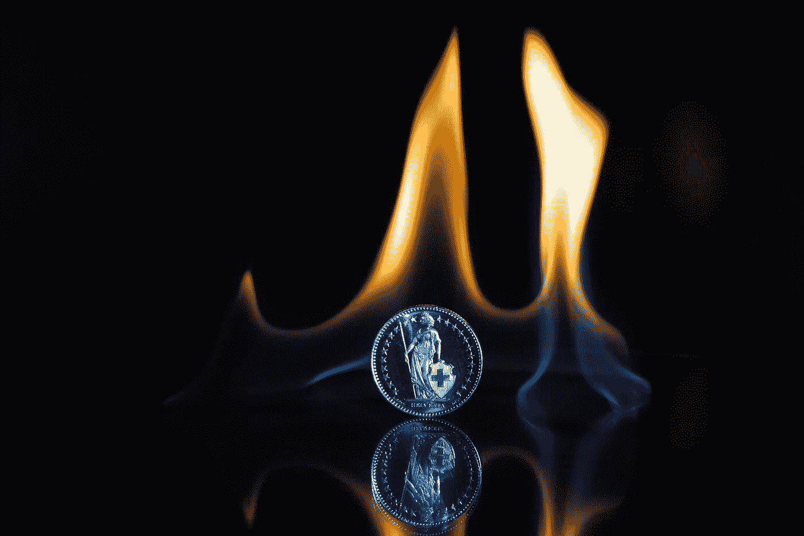

# Stablecoin 中最具革命性的概念

> 原文：<https://medium.datadriveninvestor.com/the-most-revolutionary-concept-in-stablecoin-is-on-page-18-9f0bcc139b81?source=collection_archive---------7----------------------->

Stablecoin 中最具革命性的概念在第 18 页。

那么[第 18 页](http://www.basis.io/basis_whitepaper_en.pdf)上有什么呢？在[基础](http://www.basis.io)的(测试版)白皮书第 18 页，陈述如下:

如果[基差](http://www.basis.io)开始在全球交易量中占据相当大的份额，我们可以假设，一些商品将开始以首先以基差计价的价格出售。在这样一个世界中，Basis 协议可以更新为独立于任何当地货币的挂钩——最有可能的是，Basis 可以与一篮子商品的 Basis 计价价格挂钩。

用简单的英语来说，这意味着 Basis 将脱离美元(或其他法定货币)并试图模仿消费者价格指数。为什么这很重要？这很重要，因为通货膨胀会侵蚀你的钱的价值。在美国，情况还不算太糟，每年大约 2-3%，但在恶性通货膨胀国家，你的钱一年内会贬值 10%-90%(想想委内瑞拉和阿根廷)。但即使是美元，随着时间的推移，通货膨胀也会让你的钱贬值。2008 年的 100 美元今天的购买力是 85.86 美元，10 年间大约损失 14%。通过将 Basis 与通货膨胀指数或一篮子消费品挂钩，Basis 将为用户提供真正的经济价值。

这种情况会发生在稳定币上吗？对此发表评论还为时过早。然而，我对 Basis 感到兴奋，因为这是我读过的第一本专门讨论稳定货币背景下通货膨胀的白皮书。

披露:我目前与 Basis 或任何投资 Basis 的风险投资公司没有财务关系。

