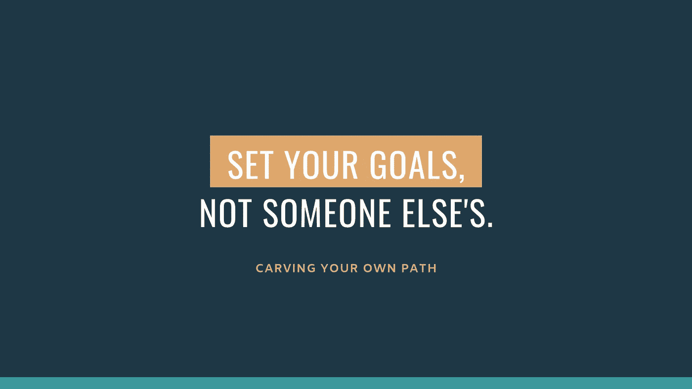

# 最成功的失败方式

> 原文：<https://medium.datadriveninvestor.com/the-most-successful-way-to-fail-8d5ff7f202ae?source=collection_archive---------18----------------------->

“woman jumping in front of white concrete establishment” by [Anthony Ginsbrook](https://unsplash.com/@aginsbrook?utm_source=medium&utm_medium=referral) on [Unsplash](https://unsplash.com?utm_source=medium&utm_medium=referral)

几年前，我是一名高中生，有一长串的目标。想想时间过得多快，简直是疯了。

我目光炯炯，对未来充满期待，心中充满了无法抑制的崇高期望。

我生长在一个热爱篮球的家庭，追随他们的脚步对我来说并不难。我所有的兄弟都曾在球场上享受过黄金时间。对这项运动的热情自然而然就来了。

我也已经想好了:

以优异的 GPA 从高中毕业，进入享有全额体育奖学金的著名学院或大学，像斯蒂芬·库里那样投篮，在 NBA 挣数百万美元。

很简单，对吧？

然而，在毕业前不久，我很快发现事情并不总是按照计划进行。

并没有像我一直想象的那样有大量的工作机会。没有球探充斥看台，伪装成球迷，看着我的一举一动。

我不知道该如何看待生活。我的成绩很好，我很有头脑，但在那之前的一切似乎都是浪费。

四年的心血、汗水和泪水付之东流。

在我看来，我失败了。一直以来，我都忽略了一个更大的图景，那就是那些直盯着它的眼睛直到它崩溃的人是如何定义失败的。

对我们大多数人来说，有很多人是我们崇拜的。那些成功典范的人让我们基于他们所做的一切来消灭我们的追求。

但这真的是我们最好的生活方式吗？追求别人的梦想？

想想看:有些能力是你拥有而别人没有的。有些路是你注定要走的，因为这是你的选择。这不是一件坏事。

当我们意识到我们最满意的是我们设定的独一无二的目标时，我们会开始更频繁地仔细考虑内在的东西。这样做最终会给我们带来最高层次的快乐。

> 追求一个不是你自己的梦想的失败不会带来真正的价值。

还记得我说过我有计划去 NBA 挣几百万吗？我很快意识到这不是我想做的事情。相反，这一直是我哥哥的愿望。

小时候，他总是告诉我他多么想在成千上万的球迷面前打职业篮球，他们欢呼庆祝他是多么的出色。

我们的谈话经常与篮球有关。所以，很自然地，我也受到了影响。

但是未能进入联盟并没有让我想要更加努力，去寻找另一个选择。相反，它激发了我真正喜欢做的事情。

# 专注于重要的事情。

我喜欢写作。

我喜欢将单词组合在一起的艺术，这种方式可以传达情感，加强我们的理解，并讲述一个故事。

这就是成功失败发挥作用的地方。

当我们做能带给我们真正满足感的事情时，短缺就成了一次学习经历，而不是一次实验。我们不会放弃我们喜欢的东西，因为没有其他的替代品，没有其他的方法来吸引我们同样的感觉。

相反，我们重新站起来，掸掉身上的灰尘，一遍又一遍地做这件事，直到做对为止。我们不断学习的动力永远不会消失，因为我们终于找到了自己的使命。

也许我是在胡说八道。或者也许你能感同身受。也许你也发现了生活中满足感背后的潜在因素，并且懒得回头看。

无论哪种方式，我们都不是被设计来模仿其他人，希望获得真正的快乐。不，我们注定要在我们热爱的事情上失败，以不同的方式失败，以改进的方式失败。

因为这种失败会带来成功。

> 如果你喜欢你读到的东西，给它几下掌声。下次见，我的朋友们。
> 
> **感谢阅读！**