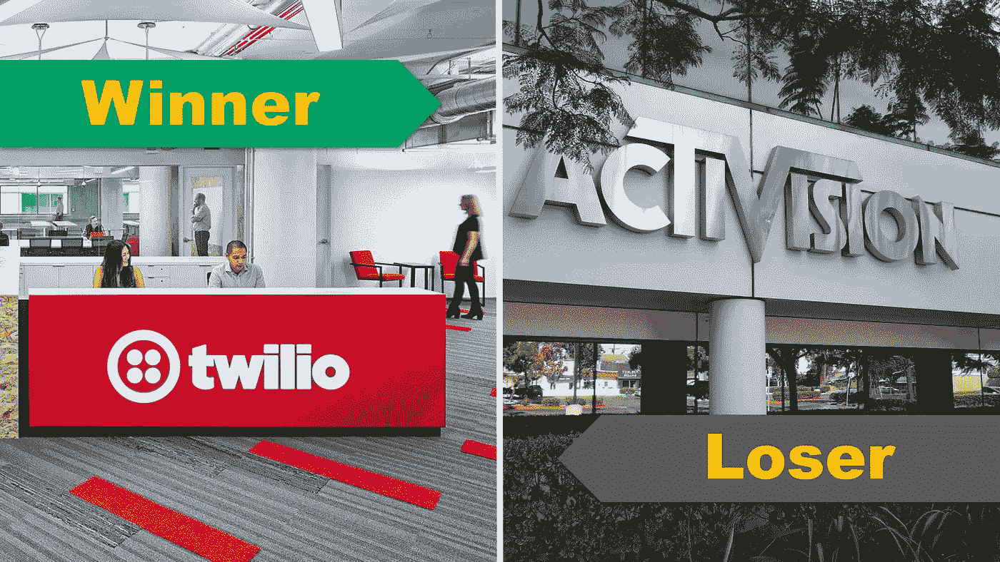

# 股市最令人惊讶的赢家和输家

> 原文：<https://medium.datadriveninvestor.com/the-most-surprising-winner-and-loser-of-the-stock-market-7c24832c7f49?source=collection_archive---------46----------------------->

季度收益报告仍在全力进行。本周我们有不少惊喜。这两只股票最让我们吃惊:

# 获胜者:Twilio(股票代码:TWLO)

几年前，我看 Twilio 的投资人演示稿的时候，差点哭了！愿景的清晰和公司对愿景的高度关注是如此罕见。该股本周的表现就是这种清晰和专注的体现。股价上涨超过 30%。不仅收入和客户数量在增长，每位客户的平均支出也增长了 140%。然而，事情并不都是美好的。像一个真正的硅谷海报儿童，该公司还没有盈利！

**看看** [朱婷的股票卡](https://stockcard.io/TWLO) **现在。**

# 输家:动视暴雪(股票代码:ATVI)

无论你如何看待娱乐和视频游戏行业的未来，毫无疑问，直到本周，ATVI 等游戏类股票一直处于连胜状态。《使命召唤》等多部热门游戏的所有者和制作人已经变成了输家。虽然收入增加，但该公司为接下来的几个季度描绘了一个不太完美的形象，股市投资者和分析师释放了他们的愤怒，并在一周内使股价下跌了 15%以上。

**看看** [动视现在的股票卡](https://stockcard.io/TWLO) **。**

# 其他值得注意的股票:

我们的股票卡高级会员正忙于发现新的投资理念和提交新的股票卡申请。在本周收到的所有请求中，有一家公司引起了我们的注意。慧俪轻体公司(股票代码:WTW)。关于该公司的一个有趣的事实是，奥普拉·温弗瑞拥有该公司 10%的股份，自从她加入该公司以来，股票和公司都出现了转机。记住，只是股票卡溢价请求，不代表我们投资了公司！

**现在看看** [慧俪轻体卡](https://stockcard.io/WTW) **。**

发现有帮助的别忘了鼓掌分享！

