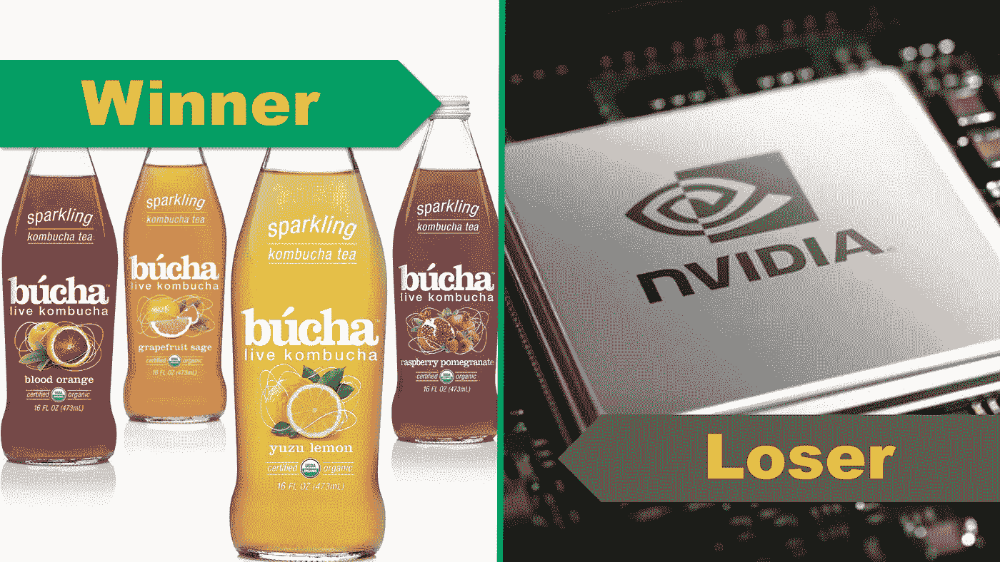

# 本周最令人惊讶的赢家和输家；新时代饮料 vs 英伟达

> 原文：<https://medium.datadriveninvestor.com/the-most-surprising-winner-and-loser-of-the-week-new-age-beverages-vs-nvidia-43f0193b618a?source=collection_archive---------46----------------------->

具有讽刺意味的是，本周的赢家和输家都受到股市泡沫的摆布。一个已经破裂，另一个刚刚开始成形:

获胜者:新时代饮料公司(股票代码:NBEV)

股票市场的最新热潮是什么？如果你的答案是“大麻”，你是正确的。今天的赢家是一家小型健康饮料公司，销售即饮茶和康普茶。这股热潮是关于该公司即将推出的注入大麻二酚的饮料，股票市场正在吞噬这支股票。然而，该公司最近的季度收益描绘了一幅不同的画面。该公司的季度收入下降，每股亏损扩大。谁也不知道新时代饮料公司能在多大程度上不负众望，但毫无疑问，该股正进入一个没有业绩支撑的高估区间。

**看看** [**新时代饮料的库存卡**](https://stockcard.io/NBEV) **现在。**

**输家:英伟达公司(股票代码:NVDA)**

Nvidia 的股票经历了糟糕的一周！周四下跌 14.37%，周五再次下跌近 20%。所有这些加起来，该公司的股价今年迄今下跌了 17.5%。发生了什么事？加密货币泡沫破裂！所有业务部门都在两位数增长，除了游戏 GPU 的销售，这是加密货币矿商在今年大部分时间里的宠儿。公司管理层继续生产他们新的高容量游戏芯片。虽然对芯片的需求下降，但价格下降的速度并不像预期的那样快。因此，英伟达拥有大量库存，但销售速度却没有应有的快。该公司运营良好，一直处于领先地位。但这样的过剩库存需要关注。很容易将 Nvidia 的不幸归咎于加密货币矿工。然而，管理层和矿工一样负有责任。该公司可能不会很快从这种过剩库存中恢复过来，但毫无疑问，股价正在进入被低估的区间。

**看看** [**现在 NVIDA 的股票卡**](https://stockcard.io/NVDA) **。**

本期就到这里！各位，周末快乐！如果你觉得有帮助，别忘了鼓掌并分享给周围的人！

