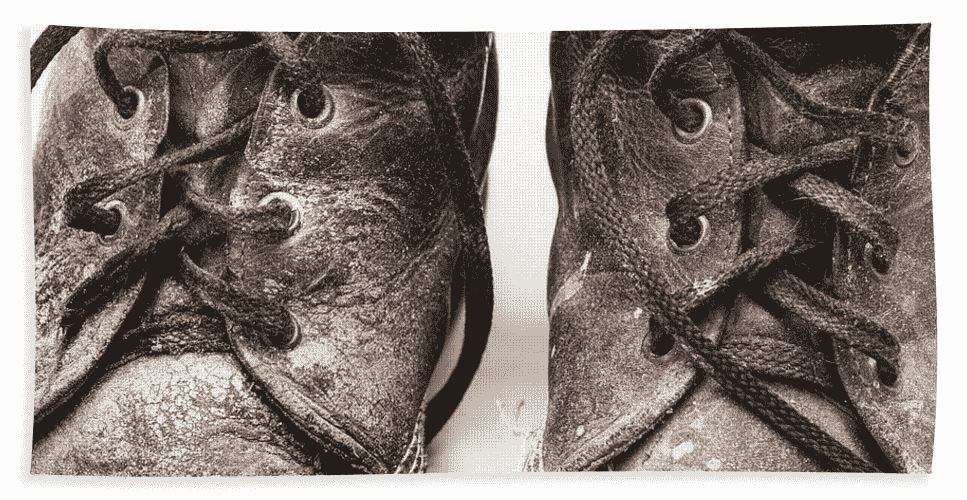

# 员工最有价值的品质

> 原文：<https://medium.datadriveninvestor.com/the-most-valuable-attribute-of-an-employee-61969cb2aa8f?source=collection_archive---------0----------------------->

我是作为一名雇员、一名前任经理、父亲和丈夫写这篇文章的。这只是我的看法；我相信这是可以讨论的。有一种品质比其他任何品质都突出。面试时很难发现；然而，一旦你找到具有这种品质的人，你就会欣然接受！我想看看你对此的看法，以及你的观点有何不同。

**不是智力！**

在过去的 25 年多时间里，我有幸与许多聪明人一起工作。我有幸成为一些非常聪明的孩子的父亲。我和许多受过高等教育的聪明人一起工作过。当然，这些人有能力进行工程、设计、制定战略等等。他们能写，能说，能清晰地表达想法。智力很重要；然而，这还不够。

**这不是创造力！**

我和许多平面艺术家和设计师合作过。我对任何人的绘画、写作或表演天赋感到惊讶。有创造力的人给我们的生活增添了如此多的色彩，给功利主义的世界带来了情感体验。创造力非常重要，但这还不够。

**这不是外交！**

能够在各种情况下找到共同点，这种能力只赋予了少数人。在不友好的水域进行谈判的能力使我们能够达成交易，并找到解决复杂问题和争端的办法。这个属性也是不够的。

**不是谦逊！**

鉴于巨大的成就或成功，保持开放的心态和真诚的善良是非常重要的。善良有时会与软弱混淆；这是一种耻辱。事实是一个人不谦虚就不会伟大。谦逊是真正聪明头脑的一个特征，然而这还不够。

**美不美！**

我很有偏见。我儿子是一个非常健康的年轻人！他走进一个房间，点燃了它。他天生一表人才，笑容灿烂，非常迷人。我经常告诉他，他的外表会让他通过许多门，但要留在里面，你必须带着尊严、荣誉和正直。我一直在纠正他的说话习惯，告诉他当你张开嘴的时候，真正的美就出来了。光漂亮是不够的！

**忠诚？**

没有。也不是忠诚。忠诚很重要。这意味着你会继续参加比赛，尽管你可能不会赢。忠诚是每天晚上回家，在好的时候，更重要的是在坏的时候都在家里。当情况变得艰难时，忠诚就会受到考验。这是一个人非常重要和非常宝贵的品质，然而忠诚不是！

它不是激情、正直、诚实或宪法！这个清单还在继续。他们都紧随其后。

好吧，你已经吃饱了！不要误解我的意思，上面提到的特质是至关重要的。我可以不停地谈论人类的不同品质，所有这些品质都与这一属性非常接近。

使我们变得有价值的一件事！

什么比结果更重要？没有这一个特征就没有结果！什么使你易于管理？你可以非常聪明，有创造力，忠诚，谦逊，而且看起来很愉快！但是如果你没有这一点，你就没有你认为的那么特别！努力和职业道德是我们与众不同的地方。如果你不每天起床并穿上工作靴，那么你的智力、创造力和谦逊将永远不会为人所知。另一个好处是，它可以免费学习，并且可以养成习惯！人们喜欢它。

这是所有关于艰苦的工作和努力！

不相信我？托马斯·A·爱迪生曾经说过:

"天才是百分之一的灵感加上百分之九十九的汗水。"

我每天都尽我所能告诉我的儿子:“你可能不是房间里最聪明的人，但要努力成为最努力的人。”

穿上工作靴，让受过良好教育的聪明头脑投入工作吧！

# 哦！把它们弄脏！

最初由约翰·图玛发布在 linkedIn 上