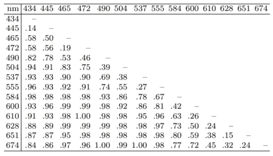
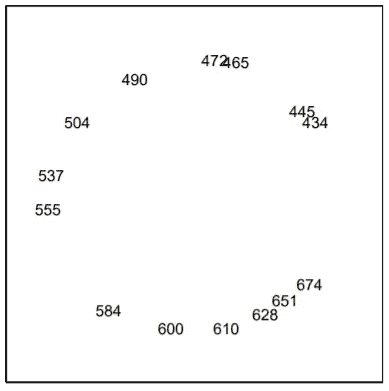
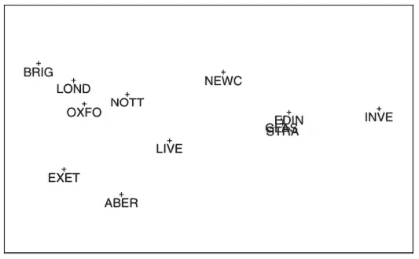
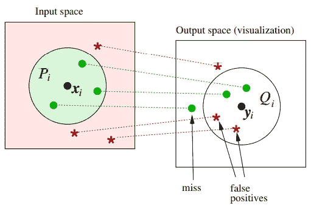

# 多维标度(MDS)降维算法

> 原文：<https://medium.datadriveninvestor.com/the-multidimensional-scaling-mds-algorithm-for-dimensionality-reduction-9211f7fa5345?source=collection_archive---------0----------------------->

Photo by [Aditya Chinchure](https://unsplash.com/@adityachinchure?utm_source=medium&utm_medium=referral) on [Unsplash](https://unsplash.com?utm_source=medium&utm_medium=referral)

# 介绍

在本文中，我们将从总体上讨论降维，以及它对大型数据源(例如大数据)，并讨论各个领域(教育、心理学、金融等)的研究中使用的最古老的降维技术之一，用于在低维空间中表示数据——**多维缩放算法**。

# **随着数据越来越大，需要更低的代表性**

随着数据驱动技术的使用，大量的非常高维(具有大量特征)或非结构化的数据不断产生并以比过去低得多的成本存储[1]。随着人们、行业和研究工作变得越来越受数据驱动，对数据解释和分析的需求也越来越大。因此，越来越多的组织投资开发利用数据的产品，以满足他们的监控、实验、数据分析、模拟以及其他知识和业务需求。

 [## 金融中的机器学习|数据驱动的投资者

### 在我们讲述一些机器学习金融应用之前，我们先来了解一下什么是机器学习。机器…

www.datadriveninvestor.com](https://www.datadriveninvestor.com/2019/02/08/machine-learning-in-finance/) 

现实世界数据增加的问题来自于如何用**来表示**它们的方法。通过表示它们，我们意味着选择顶部的描述性特征作为数据本身的表示。由于真实世界的数据通常是非结构化的，并且有时收集的数据量非常大，因此提取数据的特征或属性进行分析和研究对所有使用数据作为主要来源燃料的研究人员和行业来说都是一个巨大而复杂的挑战。因此，就统计精度而言，降维和变量选择在分析高维数据中起着举足轻重的作用。

# 简而言之，降维

**降维**或**降维**是通过获得一组主变量来减少所考虑的随机变量数量的过程【2】。

降维程序的目的是**以低 *k* 维分量子空间**的形式总结原始 *p* 维数据空间。为了实现这一目标，统计和数学理论提供了许多方法，如主成分分析(PCA)，线性判别分析(LDA)，因子分析等。

# MDS 算法

**多维标度**，也称为主坐标分析(PCoA)、Torgerson 标度或 Torgerson-Gower 标度，是一种源于心理测量学的统计技术。用于多维标度(MDS)的数据在对象对之间是不同的。

MDS 的主要目的是**将这些相异点** **表示为低维空间**中的点之间的距离，使得这些距离尽可能**地对应于相异点**。

# 香草还是古典 MDS

经典的非修订版 MDS 起源于 20 世纪 30 年代，当时 Young 和 Householder [5]展示了如何从欧几里得空间中的点之间的距离矩阵开始，可以找到这些点的坐标，从而保持距离不变。然而，存在许多非欧几里德距离测量，其被限制在非常具体的研究问题[5]。最终，托格森利用**缩放**的技术让这个主题变得流行起来。因此，产生了多维标度作为高维数据的降维和可视化技术。多维缩放的经典版本的算法描述如下:

TABLE I. THE CLASSICAL MULTIDIMENSIONAL SCALING ALGORITHM

如算法所示，可以找到至多 *n-1* 维的欧几里得空间，使得空间中的距离等于原始相异度。通常，该过程中使用的矩阵 *B* 的秩为 *n-1* ，因此在该空间中需要完整的 *n-1* 维，因此在数据的降维方面收效甚微。

此外，Gower [7]第一个清楚地陈述了经典缩放技术的公式和重要性，并从这种选择第一个 *p* “主坐标”的配置中，他创造了“主坐标分析”(PCA)的名称。**主坐标分析现在与经典多维标度**同义，术语公制标度也是如此。然而，度量缩放包含不止这一种技术。

矩阵 *B* 的谱分解， *n-1* 维欧氏空间中的点之间的距离由下面的等式给出。

Decomposition equation for matrix B

因此，如果许多特征值“*小*”，那么它们对距离平方 *d2rs* 的贡献可以忽略。如果只有 *p* 本征值被保留(相对于投影维度的目标数量)为相当大，那么对于第一个 *p* 本征值形成的并且具有被截断到第一个 *p* 元素的 *xr* 的 *p* 维欧几里德空间可以用于表示较低维度中的对象以供解释。

除此之外，在经典缩放中，**负特征值(及其特征向量)被简单地忽略为误差**。希望**、**、 *p* 会小，最好是 2 或 3，以便于图形表示**、**【8】。

# **MDS 的数据**

用于 MDS 分析的数据通常被称为“**近似度**”。相似性表示数据中元素的总体相似性(或不相似性)。MDS 将寻找元素的空间配置，使得元素之间的**距离尽可能接近地匹配它们的邻近度**。数据通常被排列成一个正方形矩阵——邻近矩阵。有两种主要的方法来导出近似度:**直接方法和**间接方法。

对于直接方法，受试者可能会给每一对物体分配一个数值的相似性或不相似性值，或者提供这些物体对的相似性或不相似性的排序。这两种方法都是收集邻近数据的直接方法。

用于邻近数据的间接方法不需要受试者直接给邻近矩阵的元素分配数值。相反，邻近矩阵本身是从其他措施[9]中得出的。这方面的一个例子是来自混淆矩阵或相关矩阵的数据。

然而，与单变量统计方法不同，**MDS 分析的结果更依赖于事先做出的决策**。根据 Wickelmaier [9]的说法，数据收集阶段应该意识到，要求相似性而不是相异度评级可能会影响结果。例如，相似性判断不能简单地被视为相异性判断的“逆”。此外，必须分别在直接和间接方法以及对称和非对称数据收集方法之间做出决定。

# 使用 MDS 的示例

多维标度分析的目的通过一两个例子就可以很容易地表达出来。Ekman [4]在心理学领域的一个例子是收集数据来研究对 14 种不同颜色的感知。每一对颜色都被一个回答者从“不相似”到“相同”来判断。所获得的分数可以以这样的方式进行缩放，即相同的颜色用 0 表示，完全不同的颜色用 1 表示。下表列出了 31 名受访者的这些相异分数的平均值。

TABLE II. DISSIMILARITIES OF COLORS WITH WAVELENGTHS

从波长 434 开始，颜色范围从蓝紫色、蓝色、绿色、黄色到红色。在这个例子中，不同之处是对称的。同样，波长为 490 和 584 的颜色的相同程度等于颜色 584 和 490 的相同程度。因此，只显示表格中数据的下三角部分就足够了。此外，MDS 对对角线不感兴趣，因为物体与自身的距离必然为零。

Figure 1\. Transformed two-dimensional matrix from Table I data

如定义中所述，MDS 试图在图**中表示表 I 中的差异，以使其更易于解释，更易于分析相关性等**。图 1 给出了这样一个二维的 MDS 地图。这些颜色用它们的波长来表示，用圆形来表示。应该根据所描绘的点间距离来解释该展平的地图。

**注意，由于距离在旋转下不会改变，所以图的旋转不会影响解释。**

类似地，解的平移(即所有坐标每维移动一个固定值)也不会改变距离，一个或两个轴的反射也不会改变距离。

Figure 2\. Generated map of British cities using MDS

Cox 和 Cox[10]的另一个例子使用了一些英国城市之间的道路距离。举例来说，12 个英国城市之间的公路旅行时间经历了经典的多维标度。上面的图 2 显示了由该技术产生的点的配置。在代表城市的点的位置和在英国的地理地图中看到的相同城市的位置之间有惊人的相似性，当然除了图 2 中的城市看起来是关于一条线反映的，并且从通常在地图集中呈现的地理地图旋转。

# **MDS 能被用作一种可视化技术吗？**

据说，根据经验很容易观察到，许多流形学习方法(如 MDS)并不适合数据可视化。原因是它们被设计成如果数据的固有维度是 *d* ，则寻找一个 *d* 维流形。为了可视化，显示器需要有 *d* = 2 或*d*= 3；也就是说，维度可能需要减少到超出数据的固有维度。

根据 Kaski 和 Jaakko [10]的研究，众所周知,**高维数据集通常不能在低维空间**中被忠实地表示，例如具有 *d* = 2 的平面。**因此一个可视化方法需要选择产生什么样的错误**。选择自然应该取决于形象化的目标；事实证明，在一个特定但普遍的目标下，选择可以表达为一个有趣的权衡，如下所示。

Figure 3\. Two kinds of errors when projecting to a lower-dimensional space

根据 Kaski 的说法，当任务是可视化哪些数据点是相似的时，可视化可能会有两种错误，如上图所示，它可能会错过一些相似性(它可能会将相似的点放得很远，作为假阴性)，或者它可能会将不同的数据点放得很近，作为假阳性。

# MDS 应该应用在哪里？

根据 Young [8]的观点，多维标度可以应用(和误用)于非常广泛的数据类型。从技术上讲，如果数据矩阵的元素表明由数据矩阵的行和列表示的对象或事件之间的关系的强度或程度，则一些原始数据或转换数据的任何矩阵都是通过某种类型的多维标度方法进行分析的候选。我们称这种数据为“关系”数据，例如相关性、距离、邻近性、相似性、多等级量表、偏好矩阵等。

已经为所有类型的关系数据矩阵设计了多维标度方法，包括对称和非对称矩阵、矩形和正方形矩阵、具有或不具有缺失元素的矩阵、相等和不相等复制的数据矩阵、双向和多向矩阵以及其他类型的矩阵。

# 参考资料:

[1]冯建青，方，韩(2014).大数据分析的挑战，《国家科学评论》，第 1 卷，第 2 期，第 293–314 页，[https://doi.org/10.1093/nsr/nwt032](https://doi.org/10.1093/nsr/nwt032)

[2]s . t .罗威斯；索尔·l . k .(2000 年)。“通过局部线性嵌入进行非线性降维”。科学。290 (5500): 2323–2326.bib code:2000 sci…290.2323 r . citeserx 10 . 1 . 1 . 111 . 3313。PMID 11125150。

[3]博格和格罗宁，P. J. (2010 年)。现代多维标度:理论与应用。纽约州纽约市:斯普林格纽约。

[4]埃克曼，G. (1954 年)。色觉的维度。心理学杂志，38，467–474 页

[5] Young，g .和 Householder，A.S. (1938)根据一组点的相互距离对它们进行讨论。心理测量学，3，19–22。

[6]博格等人和格罗宁出版社(1997 年)。现代多维标度:理论与应用。纽约:斯普林格。

[7] Gower，J.C. (1966)多元分析中潜根和向量方法的一些距离性质。Biometrika，53，325–338。

[8]杨，F. W. (2017)。多维标度:历史、理论和应用。心理出版社。

[9]维克勒梅尔，F. (2003 年)。MDS 简介。

[10] Kaski，s .，& Jaakko，P. (2011 年 2 月 17 日)。数据可视化的降维。数据可视化的降维，28(2)。doi:10.1109/MSP . 940003

[11]t . f .考克斯和 M. A .考克斯(1994 年)。多维标度。伦敦:查普曼律师事务所。