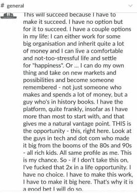
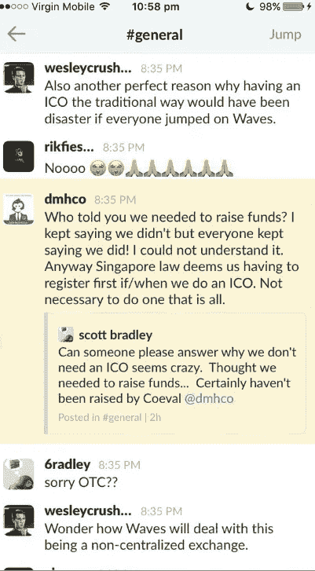
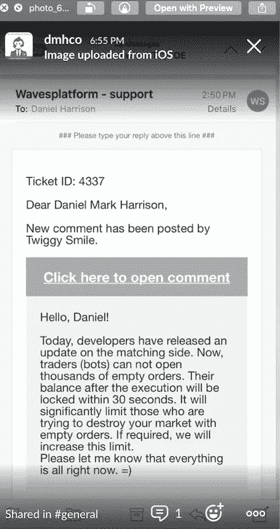

# 神秘的猴子

> 原文：<https://medium.datadriveninvestor.com/the-mysterious-monkey-24ed4b3158b5?source=collection_archive---------4----------------------->

## 猴都 ICO 背后的真实故事

2017 年 12 月 19 日，两件事情像闪电一样同时出现，这两件事情显然都将成为一长串持久巧合中的第一件，这些巧合将为他们所笼罩的诉讼蒙上阴影。

就在比特币开始从 12 月 17 日达到的历史高点下跌时，仅在两天前，犹太人的光明节假期前一天的一个周末结束时，西尔弗·米勒律师事务所选择对丹尼尔·马克·哈里森和猴子资本提起民事集体诉讼。

这起诉讼在比特币媒体上大肆宣扬，就像新产品上市时的公关方式一样，指控“数百甚至数千名”投资者可能被骗走了高达 6000 万美元的资金，目前的原告群体已经包括了远远超过 1500 万美元的加密货币损失。最初的诉讼甚至附有一张图表，显示这些原告如何有资格成为超过 500 万美元的索赔人，这是在佛罗里达州联邦地区法院进行集体诉讼所必需的金额。

战略上选择这个日期，是为了从媒体那里获得对最大可能潜在损失的最具穿透力的回应，这个日期是该律所在比特币达到历史高点后第一个可以实际提交投诉的日期。人们不得不对这种不可思议的市场时机感到惊讶，如果这不是直接来自内部人士卡特尔的结果，那么对于一群起诉要求归还比特币的原告来说，这似乎是非常偶然的，因为他们在今年早些时候在俄罗斯的一个去中心化交易所输掉了赌博。

此外，有人观察到，其中一名原告直接从丹尼尔·哈里森(Daniel Harrison)那里以 10 万美元的价格购买了价值 100 万美元的同名加密货币，但他显然从未出售过，即使他的朋友正在大量抛售。事实上，在成百上千的潜在原告中，只有 6 个人最终成为了自愿的原告，这是这个疯狂曲调中另一个奇怪的曲折。最终，1500 万美元被逐步降低，直到所有原告都认为实际上只有 120 万美元。

事实上，早在那年 8 月 12 日，就有人抱怨要在 Twitter 上发起集体诉讼，就在同一天，一家黄金投资网站的所有者向所有猴子资本发起了公开战争。这是*就在*之前，同期的代币价格被大幅压低。

不久后，其中一名原告在几周前威胁丹尼尔·哈里森(Daniel Harrison)说，当他被要求出示比特币的证据时，他用一颗子弹击中了他的头部。这个人威胁地建议哈里森暂时不要接近“任何机场”。

这只是开始。事实证明，不少于 3 名来自主要出版物的记者似乎像传播弥赛亚第二次降临的消息一样，执意传播西尔弗·米勒的福音。

From day 1 I maintained “this has to work”

事实上，抢劫确实发生了——但不是由猴子资本组织的。而是有人抢了猴都 1,000 ETH。7 月 24 日，一家名为数字开发者基金的 ICO 与猴子资本达成了一项协议。这笔交易是，Monkey Capital 将预付 1,000 ETH，这些 ETH 将在 8 月 8 日至 9 月 9 日之间换回 2,000 COE，除非同期总价值低于 ETH 总价值。正是在这两个日期之间，同期的价值被摧毁，价值下降了 96%。然而，在 8 月 8 日和 8 月 24 日，2,000 COE 的总价值确实超过了 1,000 ETH 的总价值。但那时 DDF 早已离去。

当我问节目的播客，他为什么要推荐所有人卖出时，他用一句简单的话回答道:

"我的老板现在认为这个项目是一个骗局。"就这样。

猴都 ICO 于 2017 年 7 月 1 日首发。是 CoinSchedule.com 网站让它变得无所不知。CoinSchedule.com 由一对加密人 Alex 和 Maj 管理。Alex 是一名巴西企业家，Maj 是一名在英国出生的印度程序员，为该网站编写代码。亚历克斯和海浪人群走得很近；Maj 是一名程序员，在搬回伦敦之前，他住在西班牙南部(当 ICO 热潮到来，CoinSchedule 的需求接管时)。

两个人都是好人，如果在后来恶化的关系中有谁有错，那就是我自己。我们同意，只需象征性的上市费和一定比例的融资，CoinSchedule 就会在网站首页的某个显著位置展示猴子资本 ICO。他们实际上所做的远远超出了《使命召唤》:Maj 在一组程序员的陪同下，完全从头开始设计网站，甚至选择了一个标志——现在臭名昭著的猴子望着地平线，中心是一个环，这是它的尾巴。

Trying to re-emphaize the point; an ICO is not just for fundraising!

在接下来的几个月里，当我听说人们是如何看到这个标志，并对这只猴子产生了一种“本能的呼唤”时，我会非常着迷。它教会了我一条营销法则——光学就是一切。想到最吸引客户的东西是最后一分钟的附加产品，这甚至与我自己或我当时召集的任何管理团队都没有任何关系，我就明白了光学的重要性。到目前为止，我认为我们队里还没有像梅杰这样有才华的人，当那个时刻到来时，他的离开对我们是一个巨大的打击。当我和亚历克斯的关系恶化到无法合作的程度时，他提出继续做自由职业者。回想起来，我认为没有留住他是我们犯下的最昂贵的错误。CoinSchedule 后来的成功至少是他的，也是大股东亚历克斯的。

在夜以继日地工作了大约一周来完善演示之后，CoinSchedule 制作了一个新的白金列表部分，其中将展示他们的优质 ico。那时只有金、银和铜。在 Monkey 启动的那个决定性的日子里，我不仅完成了这个项目，还完成了接下来的一整年，并最终陷入了一场毫无根据的民事诉讼，以及随之而来的流言蜚语，这些流言蜚语充斥着我从第一次尝试(最终也完成了)以来努力完成的每一次创业。对于 Alex 和 Maj 来说，这一年变得对他们更有利，带来了数百万美元的收入。

事实上，起初这种关系是密切的，甚至是潜在的扩展。我们谈到了我与他们一起工作，扩大 CoinSchedule 的职权范围，并驱逐其他潜在的 ICOs 我鼓励他们积极提高价格，因为我说他们目前收取的费用远远达不到他们所提供服务的价值。

我有时会想，如果我当时继续销售数百个 ico，而不是坚持用 Monkey 来回报我们的初始投资者(他们中的大多数人都是带着战利品离开的)，我今年会有数百万美元的盈余，而不是赤字。尽管如此，亚历克斯和梅杰为他们的钱拼命工作，理所当然地值得区块链的成功故事。直到今天，我对我们在 2017 年非常不同的命运没有一点怨恨，尽管我承担了所有的批评，因为我不仅没有屈服于这些活动，而且事实上这些活动在法律上或实践上都与我无关。

这个组合在 CoinSchedule 工作得如此之好，是因为这两个人完全不同的个性和技能。Maj 更和蔼可亲，也更外向，他是一个隐藏的营销天才，就像他是一个软件开发人员一样:他有一双眼睛，可以发现千载难逢的机会，并将其转化为视觉效果，这是我所合作过的任何其他前端程序员都没有的。亚历克斯对秘密场景的理解和他自己一样深刻和复杂。是他从这些人每天收到的 20 多个潜在客户名单中挑选了 DMH 公司，也是他真正领导了 ICO 的营销工作，将时间、注意力和宝贵的资源投入到了这家企业中。从这个角度来看，我应该感谢他，因为他让猴子资本在很大程度上取得了成功。但像大多数营销天才一样，他也有妄想症(主要是关于骗局)，而且他的整体性格有些令人不快。他喜怒无常，内向，对最轻微的批评都很敏感，随着时间的推移，他会变得更难共事。“那天晚上我确信你是个骗子，”他在我们第三次通话时告诉我，当时他刚刚投入了大量技术资源来开发我们的网站。“然后我意识到你根本不是，我就放心了。”

"如果你认为我是一个骗局，你为什么选择我们作为你的上市网站？"我问道。

“我那时没回来。但是那晚我做了。但现在我知道你又不是骗局了。”

“是什么改变了你的想法？”

“你是个公众人物，不可能是个骗局。骗子不会用真名，”他告诉我。Alex 也是我见过的对密码市场的时代精神有着最直觉的第六感的人之一。“如果你这样做，无论如何都会被称为骗局。有些人会说你是骗局，而且很长一段时间。你必须坚持下去，向他们展示你不是一个骗局。这是至关重要的，”在我们的另一次深夜 Skype 通话中，他告诉我。这将被证明是一个异常精确的建议。

我从来没有发现 Waves 和 CoinSchedule 是如何联系在一起的，但这是通过 Alex，他在大约两年前通过协助它自己的 ICO 与这个项目联系在一起的。从那以后，CoinSchedule 和 Waves 结成了强大的纽带。Waves 将 CoinSchedule 作为进行 ico 的首选目的地；事实上，这就是我两个月前在分散平台上玩的时候第一次遇到他们的原因。事实证明，这是一个足够令人高兴的巧合，因为在 6 月 21 日，我创建了两项资产；供应 10 万只的 Coeval (COE)和供应 10 亿只的 Monkey (MNY)。最初，这家合资企业将被命名为 DMH 公司，是我两年前在新加坡、香港和泰国曼谷成立的家族理财室的一个分支。

然而，亚历克斯和梅杰认为，DMH 公司的品牌虽然稳固，但对 ICO 市场来说不够有吸引力。大约一年前，我与另一位科技企业家马尔切洛·加西亚·卡西尔(Marcello Garcia-Casil)成立了一家名为 Monkey Capital 的公司，他现在经营着风投支持的区块链艺术品风险投资公司 Maecenas，当时经营着一家名为 DX Markets 的公司。

Marcello 和我各持有该公司 50%的股份(我们至今仍持有该股份),并表示我们将在未来的某个时间投入一些区块链项目，并在新加坡留下另一名受薪董事来管理公司。

这些要点在后来的诉讼中被掩盖了，诉讼指控我进行“空壳游戏”，将个人现金流存入和取出公司，这些公司被用作我的个人存钱罐。事实远非如此:我们投资了 Monkey Capital Pte。有限公司，认为没有更多的。

提到 Monkey Capital 作为 ICO 名称只是因为 Alex 和 Maj 考虑了该风险投资的其他潜在名称，其中一个是 Coeval Capital，这是我的首选，因为几年前我在 2015 年在亚太地区举行的一系列关于区块链的演讲中提出了价值同期的概念。

我向他们暗示，猴都是那种可能会吸引 ICO-ers 的名字。这两个人立刻变得热情起来，不到 10 分钟，猴子资本的 ICO 就要被叫去了。更妙的是，猴子资本与 MNY——即将推向市场的象征——联手了。

MNY ICO 的名字选定后，我立即打电话给马塞罗。“我们打算叫它猴子资本，”我说。

“这对公司意味着什么？”马塞罗心烦意乱地问道。我们已经有一段时间没有谈论过这个项目了，到那时为止，这个项目已经越来越没有任何进展了。

“嗯，我想这意味着猴子会受益——如果仅仅是因为拥有这个名字的商标，”我回答道。

“这家公司拥有商标吗？它处于休眠状态。”

“我们可以找一辆，”我轻率地回答。

“嗯，听起来至少像一个大 ICO！祝你好运！”

与此同时，我们启动了营销计划，这将成为最大的 ICO，但实际上从未发生。

A confession from Waves that someone was up to no good

“我爱你，”他通过即时通讯软件写道。“我控制不住地…爱你。”这些话来自 crypto 最大的参与者之一，是一个令人震惊的——事实证明，转瞬即逝的——联盟宣言。

堂吉诃德是我招募的猴子资本项目的第一个顾问。我在 CoinSpeaker.com 写了一篇关于 Doncoin 的补充文章，当时我是那里的主编，之后，唐吉诃德最忠实的助手之一从法国给我发来一条信息，感谢我的免费推广。作为回应，我要求采访 crypto“第三种货币”的领导人，这在 crypto 社区是众所周知的。几经周折后，我要求的虚拟会议召开了，我问他是否愿意成为这个项目的顾问。

唐吉诃德和我一开始一见如故。我想有一种感觉，我们都从对方身上看到了对方所缺乏的风度和性格。他是技术性的，我是创造性的；他被剪辑的地方，我是张扬的；他出身卑微，而我不是；他以结构为导向，而我则专注于销售。

My personal COE repurchases came to almost $200k one day

这种明显的对立吸引肯定是促成猴子资本最初成功的原因之一。我们会花上几个小时甚至几个工作日的时间，有时还会通过即时通讯来交流推出 ICO 的预期计划。正是在其中的一次会面中，堂吉诃德宣布了他对我的爱。这是由当时我们彼此分享的某种知识上的亲密关系引起的；同志们，这看起来是最大的事情，因为…嗯，*波*，实际上，平台的 ICO 将推出。

大约在同一时间，我收到了一个著名播客节目主持人的邀请。“在阅读了您的白皮书后，我很高兴地告诉您，这个 ICO 已经成为我们推荐的年度最佳 ICO，”他激动地通过电子邮件告诉我。当晚要求采访我，我答应了。

随之而来的是全力支持。“这次对丹尼尔·哈里森的采访将成为我们 16 年来最重要的采访，”这位唱片骑师抱怨道。人们的兴趣达到了顶峰。

在接下来的三周里，随着同期的报价进入市场——并被迅速抢购——他至少有四次让我上他的播客，每次都夸张地夸大同期。COE，按照货币的三个字母符号，是 Marcelo 和我在 ICO 之前赠送给一些幸运内部人士的货币。“我不想说抵押房子和购买同期…但是，我的意思是，抵押房子，买同期！”在一集里，他告诉听众，让我非常害怕。“实际上没有必要买超过几百美元的东西，”我纠正了一个震惊的播客主持人。“因为会涨这么多。”

In those heady days, COE comprised 78% of the entire Waves DEX, trading more volume than even Waves itself.

的确如此。从 0.001 BTC 开始，当时 BTC 大约是 2000 美元左右，它在几天内迅速上涨到这个价格的 100 倍。从那以后，没有多少喘息的机会:COE 飙升至 1000 美元以上，最终攀升至 0.54 BTC，这是当时一枚代币的最高价格。不久之后，Waves 指数日交易量的 78%来自同期交易。这是一个惊人的成就，我自然开始考虑如何利用我个人保留的那部分 COE 来建立未来的企业。不久，一个机会以数字开发者基金的形式出现了。当时我一点也不知道，但这个骗局的到来标志着我迄今为止短暂的成功统治结束的开始。

数字开发者基金是 ICO 骗局的典型例子。ICO 的首席执行官迈克尔·马拉乔维(Michael Marachovi)给我写了一份单向协议，他通过双方的接触(结果也同样糟糕)承诺如下:我们将向他的 ICO 投资 1000 ETH，并根据 8 月 8 日至 9 月 9 日期间 2000 COE 高于 1000 ETH 的成本，然后他将把 1000 ETH 换回 2000 COE，这 2000 COE 本应包括投资(但鉴于这是一个 Waves token，不符合我们签署协议并支付 1,000 ETH 的那天，COE 的市场完全崩溃，再也没有上涨。尽管如此，2,000 COE 确实两次在净市值上击败了 1,000 ETH 一次是在 8 月 8 日，另一次是在 8 月 23 日。尽管我要求对交易采取行动——以及随后的类似要求——DDF 几乎消失不见了。

还有更多。非常非常多。问题比比皆是:西尔弗·米勒是如何如此完美地把握市场时机，在比特币达到历史高点的那一刻提起诉讼的？DDF 是如何如此幸运地达成一笔交易，以至于在他们需要换回 1,000 ETH 的同一时期，这笔资产下跌了 96%？为什么本应该是一个表面上中立的记者，公开介绍自己来自英国《每日邮报》，使用《每日邮报》的电子邮件，最终却在伦敦《泰晤士报》 的 [*上发表了一篇关于我的热门文章？*](https://www.thetimes.co.uk/article/daniel-harrison-accused-of-30m-crypto-fraud-cn6b0hgrm)

CoinDesk.com 是数字货币集团(Digital Currency Group)旗下的网站，控制着比特币相关市场的大部分，西尔弗·米勒(Silver Miller)是该网站的明星专栏作家。为什么这家网站拒绝发表我在公开报道大卫·米勒(David Miller)时给他们的相同字数的引用？

为什么一名自称来自 theinformation.com(一家受人尊敬的调查性新闻刊物)的记者，在面对这方面的证据时，对“比特币媒体的付费游戏”不感兴趣，反而对去年 12 月猴子资本社区一名成员的自杀更感兴趣(毕竟，这与公共关系的“付费游戏”主题有什么关系？)

为什么有些人坐拥 90 万美元的资本利得，却不拿出他们刚刚投资的 10 万美元来弥补他们最初的头寸呢？

猴子资本的故事引发了许多问题；也许假以时日，其中一些问题会得到解答。然而现在，请把这当作我试图埋葬夏天过去的幽灵。

市场崩溃是谁的错？这个问题很难回答。也许最难回答的是事实。这都是我们的错。当然，我应该更加努力。我不应该做出如此冲动的决定，因为在当时的压力下我很难不这么做。其他人的做法应该更有分寸和理性。DDF 应该更有道德，毫无疑问，西尔弗·米勒法律应该比他们更负责任。

但这就是颠覆的本质。它甚至会扰乱最令人兴奋的场景，并在接下来的一天带来乌云。这也提供了一个有先见之明的教训——向前看。继续走。在泥堤上跋涉。另一边有更绿的草。还有大量的猴子在树上晒太阳，迎接明天更加灿烂的日子。