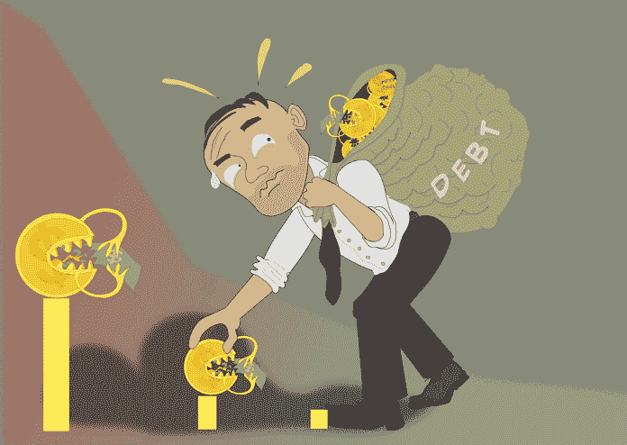

# 复利的奥秘

> 原文：<https://medium.datadriveninvestor.com/the-mystery-that-is-compound-interest-7dc451d8542b?source=collection_archive---------14----------------------->

Photo by [rupixen.com](https://unsplash.com/@rupixen?utm_source=medium&utm_medium=referral) on [Unsplash](https://unsplash.com?utm_source=medium&utm_medium=referral)

在我的文章《为什么我们需要教授个人理财》中，我已经提到了复利的危害。尤其是，当似乎没有人理解它是如何运作的，以及它失控的速度有多快。这就是为什么我决定写这篇文章，希望我们可以获得更多的洞察力，澄清一些困惑，消除一些关于利率和复利的误解。

大多数形式的债务都是有代价的。这种成本通常被称为利息。利息是你付给借钱给你的人的钱。你为他们的服务支付利息，如果贷款不安全(当你不支付时，他们不能拿走你的东西)，利息也可以反映出贷方的安全。由于这个原因，无担保贷款的利息往往很高。

 [## 更好的预算，打造更大的|数据驱动型投资者

### 即使是专家也承认它们并不完美。从 1 到 10 的范围内，安东尼·科普曼和德尔…

www.datadriveninvestor.com](https://www.datadriveninvestor.com/2018/11/08/budget-better-to-build-bigger/) 

然而，事实证明许多人不明白利息是如何起作用的。他们不明白它对债务是如何起作用的，也不明白它对储蓄和投资是如何起作用的。一次性利息支付[大多数人都能理解，但当我们开始计算复利时，大多数人就不理会了。但是，事情最终开始变得有趣起来，是有了复利…](https://www.datadriveninvestor.com/glossary/payment/)

# 债务复利

我开始在我的文章中概述复利是如何起作用的，这篇文章是关于[再次向小学和初中年龄的孩子教授个人理财](https://www.moneyonthemind.org/post/we-need-to-start-teaching-personal-finance-in-education-now)。我在那里讨论的债务形式有抵押贷款、个人银行贷款、信用卡债务、同行贷款和发薪日贷款。信用卡和发薪日贷款造就了最有趣的复利故事:

## 发薪日贷款

先说我的“最爱”:发薪日贷款。鲨鱼借钱给孔雀鱼。想想那些穿着闪亮西装，头发向后梳，戴着金链、金戒指，抽着细烟，试图说“他们会帮你解决问题”的人。

然后再想。这些类型的不当行为(因为这就是它们)已经被实际的企业所接管。我不会指名道姓，但确实有贷款公司(尽管它们经常被关闭)是在为孔雀鱼祈祷的鲨鱼。

他们的广告可能出现在任何地方，承诺你很快就能拿到 400 英镑，让你在*时不再有风险*。就像朋友一样。但是这些交易对你来说不是朋友。让我解释一下这些贷款的债务和复利是如何运作的:你开始只借了一小笔钱(发薪日贷款往往不会很大)，所以你认为你应该是相对安全的。不对。

尽管我们只是在谈论小额资金的利率，但利率确实很高。并且经常需要按天或按周支付，而不是按月或按年支付。这就是他们抓你的地方。

想象一下这样一个场景:你取出 500 美元，将在 5 周内偿还，利率为 10%(我想这个利率隐藏在小字里)。第一天的利息是 50 美元，第二天到第七天也是如此。在第 7 天，你还偿还了第一期贷款，也就是 100 美元。总的来说，第一周你已经花费了 100 美元的还款+350 美元的利息，总计 450 美元。仅在第一周内，你就几乎还清了所有借款，其中大部分不是还款，而是利息。

考虑到我们还有 4 周的时间，你最终要支付的金额会比最初的金额多得多。这就是复利所能造成的损害。尤其是按天收费的话…

## 信用卡债务

现在不是每个人都落入发薪日贷款的陷阱。许多人确实看穿了他们，或者已经被警告要提防他们(你现在已经被警告了)。但是有一样东西经常不被警告，不，甚至被广泛接受，那就是信用卡。拥有这种类型的消费者债务几乎已经完全正常化了。所以让我们更深入地看看这个。

Picture provided by Data Driven Investor

信用卡非常方便。你现在可以花钱，那些你现在没有但以后可能会有的钱。通常，人们在月底或月初工资收入时付清信用卡账单。

然而，有时人们根本没有还清债务。想象一下你没有还清信用卡债务。想象一下，你取出 5000 美元，你的信用卡年利率(年化利率，只是利息的意思)是 23%。是的，那是高的，但是那是一个标准比率。你每年将面临 5000 英镑 23%的费用，因为它是按年计算的。然而，每个月仍然可以支付利息。你可以只取 23%的 1/12，也就是 2%左右(为了方便)。如果你继续贷款一整年，利息是 1150 英镑。不在还款，只在利息。按月计算，你每月支付 0.02 x 5000 英镑，也就是“仅仅”100 英镑，来享受负债的乐趣。这由你来决定是否值得。

如果你真的偿还了你的信用卡债务，对你有好处！如果每个月都全额还的话，完全不收。然而，大多数人不会偿还全部金额，他们要么偿还一定比例的债务，比如 10%(所以在这个例子中你要偿还 500 美元)，要么只偿还最低还款额。最低还款额是一个非常低的百分比，但它确保你知道信用卡债务，并有能力还清。这能让你的信用卡免于拖欠。然而，这是一个相当昂贵的习惯。

如果你只偿还最低还款额，一笔 5000 英镑的债务大约是 20 美元，那么还清这笔债务需要很长时间。并且每个月都会继续收取 APR 的月部分。第一年你的还款总额将是 12 x 20，即 480 英镑。这还不到总债务的 10%。别忘了你还在支付利息！第一笔利息支付将是(5000–20)x 0.02，第二笔将是(4980–20)x 0.02，依此类推。为了能借到 5000 英镑，一年内还得支付 1000 英镑，这还是很接近的。

不相信我？谷歌一下！有很多例子可以解释为什么最低还款额是一个坏主意:“任何有信用卡余额的人都知道，只支付最低还款额会花掉你很多钱，但却一无所获。如果你的信用卡余额为 5000 美元，利率为 18.9%，每月最低还款额为 200 美元，那么你需要 11 年零 5 个月才能还清全部余额。”这个例子来自 [Investopedia](https://www.investopedia.com/financial-edge/0712/why-making-minimum-payments-gets-you-nowhere.aspx) 。在超过 11 年的时间里偿还你的债务是一段很长的时间。而支付超过 11 年的债务利息会让时间变得更长(你知道我的意思)。

现在，一些银行和信用卡机构可能会欺骗你，让你享受上半年的免息，但正常利率会在半年后生效。而且还是会很贵。所以一定要记住这一点！

# 储蓄和投资的复利

不过也不全是坏事。我本来想把这篇文章叫做“复利之恶”但这不公平。因为复利也可以用来行善。这也是为什么你应该尽早开始储蓄和投资的最大争论之一。最好是昨天。

## 储蓄

好吧，我会尽量缩短这一部分，因为坦率地说，储蓄账户的利息(银行支付给你让他们保管你的钱(以及借给别人的能力……)的钱)目前低得令人难以置信。但是，让我们想象一下更好的时光，储蓄账户可以给你带来每月 2%的收益。

假设你第一年有 1000 美元的存款。现在，每个月你得到 2%的利息。大多数人犯的错误是做 1000 x (0.02 x 12)，结果是 240。这只是计算利息，如果你想要总数，你只需在上面加上 1000。但复利不是这样运作的。在第一个月，你得到 1000 的 0.02，也就是 20，但是在第二个月，你得到 1020 的 0.02，等等。最后你有 1000 x (1.02)，最后是 1268，24。

现在你可能会想，268，24 和 240 之间的差别不是特别大，但这是以 1000 的一次性存款计算的。如果你连续 40 年每年都这样做，将会有相当大的不同…

Picture provided by Data Driven Investor

即使将 1000 英镑存入储蓄账户 40 年而不增加任何支出，也会产生 1000 x (1.02)⁴⁸⁰，等于 13.430，20。对于 1000 的起点来说还不错！

很难看出 2%的利息能把你带到哪里，但如果你把它放得足够长，钱就会增长。

现在，我不得不再次提到这一点:如今储蓄账户几乎不会产生任何收益(如果他们每年支付 0.5%的利率，你就很幸运了)，在通货膨胀率为每年 2%的情况下，为长期存钱会降低其价值(但请为未雨绸缪基金和短期目标也这样做！！！).

因此，当着眼于长期时，大多数人会把钱投入投资，尤其是股市。让我们看看复利是如何起作用的:

## 投资

投资可能是有风险的，但与储蓄不同，你的钱不一定会贬值(当把储蓄率与通货膨胀率相比时)。

许多人对市场的表现做出了许多断言。一些人说他们可以获得 10%的年回报率，另一些人翻了翻白眼，声称市场的表现一开始就没有超过 6%。无论你取哪个百分比(是的，10%是乐观的)，它们都比储蓄率高出不少。

假设股票市场的平均年回报率在中间，8%。如果你 10 年前投资了 1000 英镑。你一点也没有往里面添加，也没有从里面拿走。你的股票现在值 1000 x 1.08 ⁰，也就是 2158.93。

当然，如果你在大约 10 年前投资 2000 英镑，你的股票现在将值 2000×1.08⁰，也就是 4317.85 英镑。所以你投资越多，你的钱就会越多。

当然，没有人说你只能投资一次。一些人也每年追加投资。假设你每年投资 1000 英镑，从 10 年前的 2000 英镑开始。这个计算看起来有点长，但它的要点是:

2000 x 1.08⁰+1000 x1.08⁹+1000 x1.08⁸+1000 x1.08⁷+1000 x1.08⁶+1000 x1.08⁵+1000 x1.08⁴+1000 x 1.08+1000 x 1.08+1000 x 1.08 = 4317.85+1999.00+1850.93+1713.82+1586.87+1468

这对你来说是一大笔钱！

## 注意事项

现在，这里有一些谨慎的故事:我在这里描述的投资类型是投资指数基金。这些基金倾向于控制整个市场。你可以投资个股或某种类型的投资组合(最著名的是由烟草、酒精和武器股票组成的副投资组合)。但是，要成功做到这一点，就要了解市场

股票市场的另一个问题是，你真的应该只做长期投资，当你进入和退出时，你需要一点运气。不要在市场处于顶峰(或者繁荣、泡沫或牛市)时投资，也不要在市场处于低谷(危机或熊市)时卖出。至于其他，如果你打算长期呆在这里，那就有钱赚了。但是像撞车这样的事情确实会发生。这就是为什么你应该只投资你实际拥有的钱(而不是来自贷款或信用卡债务的钱),如果你真的不知道你在做什么，你应该得到建议！

所以，你有它。用债务和收益来解释复利。有钱会损失，也有钱会赚。只要确保你完全明白你正在做什么。

如果有疑问，就把计算器拿出来！

莫尔·范·登·阿克是华威商学院行为科学专业的博士生。她研究了不同的支付方式，尤其是非接触式和移动支付方式，对我们管理个人财务的影响。在她的“空闲”时间里，她写了一些关于个人理财、行为科学、行为金融和博士生生活的文章，这些都发表在《金钱在头脑》上。通过 DDI，她撰写了关于个人和行为金融的文章，以确保学术界的知识流入主流，并能帮助尽可能多的人！

*原载于 2019 年 12 月 19 日*[*【https://www.datadriveninvestor.com】*](https://www.datadriveninvestor.com/2019/12/19/compound-interest/)*。*