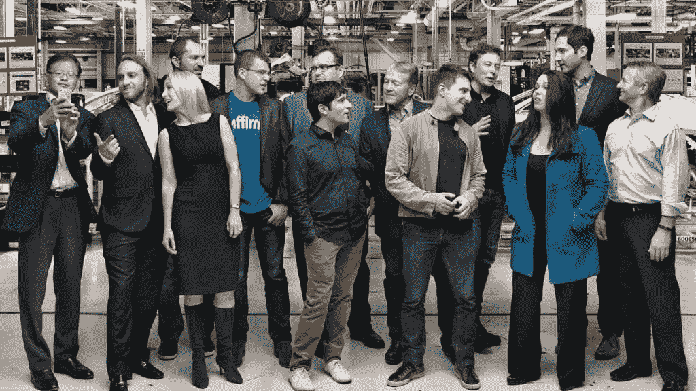

# 私募股权的神秘世界第一卷:风险投资基础简介

> 原文：<https://medium.datadriveninvestor.com/the-mystical-world-of-private-equity-vol-i-a-brief-dive-into-venture-capital-basics-d8103f3295f5?source=collection_archive---------9----------------------->

## 揭示竞争部门并理解其在社会中的作用

想象一下，在旧金山这样的大都市，在一个充满活力和不断变化的赌场附近，你是一个有资本、受过良好教育、有关系的人。浮华的豪赌客和琐碎的投机者用他们的绣花巴塔哥尼亚背心包围着你，告诉你网络时代的古老民间故事。也许，他们怀念奢侈的富矿？你是新来的，正在适应新环境。香槟瓶塞在一端砰砰作响，而悲伤的泪水在另一端流淌。一小部分人的奖金让大多数人相形见绌。权力法则正在运行，他们的胜利令人羡慕。他们要么在喷药和祈祷，要么有很高的信念。风险投资家的角色可以被认为没有什么不同。作为一个资产类别投资者，他们也在寻找高风险/高回报的机会，这些机会通常得到机构资金(成熟的捐赠基金、养老基金、高净值个人、家族理财室等)的支持。代表有限合伙人或有限合伙人]在赢家通吃的市场领域[好吧，几个赢家！].

从你用来阅读社交洞察的浏览器，到你安装在智能手机上的送餐应用，它们背后的公司都有风险投资支持，并面向大型市场(对发烧友来说，可寻址的市场总规模超过 10 亿美元)。没有企业家，专利技术带来的人类进步可能变得不可行。没有风险投资，创业生态系统可能没有充足的资本、投资组合服务(营销、招聘、销售等)和上市之路；实际上，这可能会让它寿终正寝[我不可能忘记提到注入标识的 ai rpods——那是一份真正的礼物]。

**Source: Sequoia Capital — The good ol’ entrepreneurs they’ve backed (yes, that includes Elon in the last row)**

展望未来，推动社会从生物技术到消费互联网等行业向前发展，同时产生巨大回报，这是风险资本家思维过程的关键。在 2-20 模式(2%的管理费和 20%的套利或利润分成)的激励下，风投一直在寻找下一个独角兽，努力为早期创业者寻找、评估和构建潜在的条款清单。风险本身是相当广泛的，始于种子阶段，止于后期阶段[C/D 系列及以后]，投资规模随着范围的扩大而增加。对于一个仅投资美国 GDP 0.4%的资产类别来说，简单来说，自 1974 年以来的结果是显著的——“42%的上市公司是风险投资支持的，占总市值的 63%。这些公司占总就业人数的 35%，占 R&D 总支出的 85%。尽管如此，为了吸引古怪的人接受你的资本和随后的创业援助(这是一条双向道路)，风险资本家必须有效地表明他们的价值。正如 Akerlof 等人生动地描述了在“柠檬市场”中通过信号传递减少不对称信息和强调质量确定性的重要性，风险资本家必须效仿[他们的才华没有被忽视，他们获得了 2001 年诺贝尔经济学奖]。

 [## 想知道领导是谁？请他决定。数据驱动的投资者

### 一个有效的领导者能为组织提供的最有价值的东西之一是决策能力…

www.datadriveninvestor.com](https://www.datadriveninvestor.com/2019/01/25/want-to-know-who-the-leader-is-ask-him-to-decide/) 

现在，要展示成功的风范，风投公司必须拥有出色的业绩记录，这需要时间、耐心和毅力。如果他们向(个人或财团)投资的初创企业最终获得了 100 倍的回报，那么品牌资产和支持杰出企业家的声誉就在发展之中。需要几个本垒打。本质上，良性反馈循环是“可转移财产”的结果[风险投资者支持亚马逊和谷歌，所以他们必须是聪明的——这些公司正在蓬勃发展——我，一家大型公司的未来建设者需要这些投资者——等等转动轮子……](ku por，32 岁)。由于这种循环，交易流受到了积极的影响。利润丰厚且神秘的行业似乎对少数精选的个人关闭了，尽管事情正在慢慢演变。Equal Ventures 的普通合伙人理查德·科尔比(Richard Kerby)在 2018 年进行了一项风险投资种族细分研究，结果令人惊讶(共有 1500 名参与者):40%的风险投资人上过哈佛或斯坦福，58%是白人男性，女性总比例为 18%(科尔比)。谈论多样性——很难找到。一些公司已经意识到他们在食物链中的顶级层次，并试图通过设定标准变得更加进步(并回到 21 世纪)。我祝他们在艰难的过程中好运。

作为一个企业家的旅程是痛苦的，可能会导致严重的不必要的痛苦。不幸的是，身为女性会降低你筹集资金的几率。2018 年，企业家筹集的 1300 亿美元中，只有 2.2%分配给了这群雄心勃勃的人(欣奇克利夫)。我们再次朝着正确的方向大步前进。然而，它的速度慢得可怜，新的公司和组织正在崛起，以迎合特定的群体，如这个[Bravo All Raise]。目光如炬的创始人用来吸引风险资本家投资他们的“热门创业公司”的行话并不新奇。克里斯托弗·哥伦布也必须说服卡斯蒂利亚的伊莎贝拉一世提供资金和船只。我们都知道故事是如何展开的。有时候，人们会想，为什么次等的小型摩托车初创公司获得了资金来推动其全球扩张，而致力于维持环境长寿的初创公司却没有(显然，每个公司都有自己的不可知论和利基)。风险投资公司一再面临提供回报和筹集更多资金(更多管理费)的压力，导致他们改变风险偏好，进而改变投资策略。然而，一些人抵制了这种诱惑，而另一些人则相信变革的形成咒语。风投当然也有自己的问题，但它是一个特殊的地方，所以有这么多好奇的人想要一窥它的幕后。

现在就说这么多— Shray J。

[分享社会见解](https://socialinsights.substack.com/?utm_source=substack&utm_medium=email&utm_content=share&action=share)

**附注**要了解更多关于私募股权或风险投资的信息，欢迎访问[密西根 PEVC](http://www.michiganpevc.com/) 。可以在“学习”选项卡下找到免费资源。节日快乐:)

**作品引用**

《柠檬市场:质量不确定性和市场机制》*《经济学季刊*》，第 84 卷，第 3 期，1970 年，第 488-500 页。 *JSTOR* ，[www.jstor.org/stable/1879431.](http://www.jstor.org/stable/1879431.)

欣克里夫艾玛。“2018 年，所有女性创始人加起来比朱尔少了 100 亿美元。”*财富*《财富》，2019 年 1 月 30 日，fortune.com/2019/01/28/funding-female-founders-2018/.

理查德.科比。“你在哪里上学？”*中*，值得关注——日志博客，2019 年 1 月 28 日，Blog . use Journal . com/where-do-you-go-to-school-bde 54d 846188。

斯科特·库波尔/里斯·埃里克。*沙丘之路的秘密:风险投资及如何获得*。美国企鹅集团，2019。