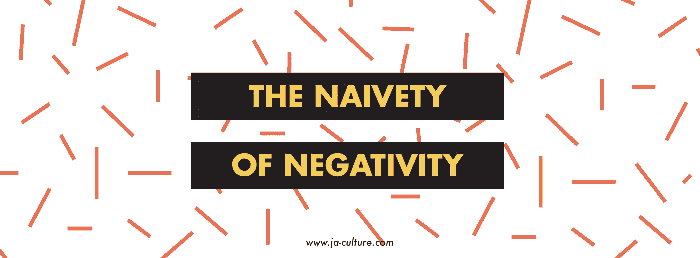

# 消极的天真

> 原文：<https://medium.datadriveninvestor.com/the-naivety-of-negativity-89c84701c6e7?source=collection_archive---------11----------------------->

面对南非目前面临的社会经济挑战，努力保持乐观？首先，我要说的是，对我来说，通读不计其数的报告并不容易，这些报告考虑了我们“新兴”市场的当前就业统计数据和销售数据。

但是，如果你厌倦了阅读负面情绪，并已经考虑结束这篇文章，JA 想给你提供一个不同的观点。没错，我们并不否认这样一个事实，那就是我们可能都在盯着一把粗糙锯短的猎枪的短端，我们的手指共同扣在扳机上，上面用醒目的口红和木炭混合写着“财务自由”的字样。

所以根据我们的情况，我想直接问你:

> "你个人会做些什么来改变这一切？"

在当地被标上“百年纪念”、“衰退”、“征用”和“合法化”等词汇的一年里，你会发现自己沉浸在一种复杂的情绪中，这取决于你个人的一粒尘埃落在人类整个历史、现在和未来的光谱中的哪个位置。没错——你的大名很容易被遗忘——所以为什么要在乎这些呢？一点虚无主义不会有什么结果，正因为如此，我们决定关注积极的一面。

> 有一个目标，有一个目的地——到达那里。

第二个问题:我们如何开始考虑我们能以何种方式为改变做出贡献，而不在这个过程中大发雷霆和集体失控？答案是:我们来看看为什么在微观工作场所和宏观经济中避免消极情绪很重要。

# 我为什么要积极？

有一点是肯定的，由于无数南非人在面对一些逃避高等法院的不可否认的有害后果时无知地微笑，积极性受到了不好的指责。因此，首要任务应该是传达积极的信息。

> "积极就像一个好笑话，只有当你理解它时，才能成功地产生影响."

如果积极情绪比国际诈骗团伙更快地掠过你的脑海，那么笑点将不可避免地是——你，你自己。

对所有潜在的股东和投资者来说，你知道什么是不利因素。因此，让我们转而去理解我们的乐观主义应该从何而来，而不是在一大群消息不灵通的末日论者中羞怯地微笑。

让我们从**当地经济**中的两个例子开始，这是任何头脑敏锐和**创新的投资者都必须考虑的。**

# 1.规章制度

[Sanlam Private Health 的首席执行官 danil kri El](https://l.facebook.com/l.php?u=https%3A%2F%2Fwww.linkedin.com%2Fin%2Fdani%25C3%25ABl-kriel%3ForiginalSubdomain%3Dza&h=AT0YnrB6s7gcB_pDJFbX5a1OszNkxCq45-8jIyino5Ukpgff7plyQJDxAJO6eyq8LBa5mU6Q7dtgIrkR60fLS5QgV8TbeC1UJy4rDHL1-zNRrvSQKrnmpW3UiQ16SO_SQyZU2lCd)谈到了我国在影响我们财务未来的国际评级方面的地位。丹尼尔指出，我们的法律框架、会计制度和公司治理使我们跻身投资者应该甜言蜜语的十大国家之列。此外，根据世界经济论坛(World Economic Forum)的数据，由于“我们的审计和报告标准以及股票交易所监管的优势”，我们处于价值链的顶端，在国际上排名第一。谢谢丹尼尔，这是不容错过的！

# 2.工业

> 工业——的确可以为这种变化无常的野兽制造一副马鞍。

让我们去掉旧的糖衣。在吸引国际投资者如何找到我们的牧场方面，次理想的治理确实发挥了作用。然而，随着 2018 年 2 月事件后政治气候更加倾向于“希望”，有几个额外的因素似乎可以抑制不情愿的趋势，并有可能推动我们的经济克服过去“不那么令人愉快”的负面影响。

其中一个公认的因素是，在培训可持续发展企业的劳动力方面，许多南非企业已经看到了这种趋势的好处，而不是坐在为一个存活率半衰期很短的行业做准备的行业中的一大部分技术人员旁边。

一个这样的例子是在[的年轻人](https://l.facebook.com/l.php?u=https%3A%2F%2Fyounglings.squarespace.com%2F&h=AT1EeXofsuYthvT_yXYrjYNXbEZjrBFXwh5e5vuEVLgue3J9zDQTO-C4fGGw_RhshkjVExnK60bqO6GRbFZAsvEJzf49eVz90-kjKH_VLqWg6NSJgJmH1jkSmQ_Fzj755OpzV9Xi)的人们。该团队已经将他们的时间和未来的想法投入到一个可持续的、积极的培训计划中，为一代非常受欢迎的软件开发人员提供培训。更重要的是，他们不会对危险的、过于乐观的市场预期讨价还价。它们也非常符合贝克·麦坚时的积极观点，即工业化是通过认识到为青年创造就业机会的无与伦比的价值来实现的。

> “工业增长必须考虑到技术进步、数字化趋势、去碳化议程和自动化。”—[贝克·麦坚时商业技术](https://l.facebook.com/l.php?u=https%3A%2F%2Fbusinesstech.co.za%2Fnews%2Fbusiness%2F270511%2Fsouth-africa-has-many-positive-developments-that-bode-well-says-baker-mckenzie%2F&h=AT2Ds3mUGXvLbFnfQgfsnNwkjhuDDpgMGfZnsmEoBQVF-G2nbvJc6HHgoiwIivlY89eWGK3Q-QXPwJvDgf-i3naFHBzH-IrLZ-K_2XqShmrqwVyVpjfEjubinwojiagajNYRB0Ci)

# 为什么所有这些都很重要？

如果你认为自己非常熟悉经济趋势和统计数据，那么你可能知道南非经常被称为非洲大陆三大驱动力国家之一。没错，我们是操场上有一点影响力的受欢迎的孩子。我们有潜力创造一整波积极的商业战略，反过来，这可能会爆发为整个地区更大的指数增长和发展。

带着前面提到的乐观、合理和务实的态度，我们回到最初的基本想法:南非面临一些独特的不确定性。短期内不会有神奇的公式将我们的国家转变成一个投资乌托邦。然而，如果你愿意鼓励并积极参与，你可以获得额外的奖励。

为了成为这个国家所呈现的机遇的一部分，你会说“是”并承诺一种心甘情愿的精神，有时还会承担可能的风险吗？还是会说“不”，选择在消极中保持天真？

我们知道我们的答案是什么。

获取您的修复并关注我们:
*活动页面:*h[ttps://www . ja-culture . com/powerof ja](https://www.ja-culture.com/powerofja)
*脸书*:[facebook.com/ja.culture.co](https://facebook.com/ja.culture.co)
*推特*:[twitter.com/Ja_Culture](https://l.facebook.com/l.php?u=https%3A%2F%2Ftwitter.com%2FJa_Culture&h=AT0-ohIYqUW6GNOFYStDwikOWcvmFyFAKpuBb6jihycAliD-TFDmLZtvQa_erP-Mq1mHgfWaAT5HG_cfe8J2nk2Zk54NGLOVyK3UeAGoxGMtCnC02s9oUvElAgSS4odJ6dzXjoId)
*媒体*:[medium.com/JA_Culture](https://l.facebook.com/l.php?u=https%3A%2F%2Fmedium.com%2FJA_Culture&h=AT0WbGek1mWoTmbDXJhaJfS6mvArRkLMd6fCMcs2S5Y9UaQ5bB4hrPT_OdaaHQvIe4OOcrPe65C67qaS4OL4jZ-GNzHzsyNbVg3qS0ojAG3mAGGzOXlekhjFfLnBDVdbBre0tzHN)
*LinkedIn*:[linkedin.com/company/ja-culture/](https://l.facebook.com/l.php?u=http%3A%2F%2Flinkedin.com%2Fcompany%2Fja-culture%2F&h=AT2JJdXxfVfy_5mmBQklTrd2csT9PASOTS2yrr-NtRF0P3prQu1iFZjnUVQ2e1h5HJUam68B-wE2Jb3OsCE1h0IXCRiv4SWskv6glWyEceeG-B-khogz5ViPn79WZCKMFUvirfIF)

To positive sentiment and promising investments.

亲切问候
约翰·布朗霍斯特
联合创始人&导演
[www.ja-culture.com](http://www.ja-culture.com/)