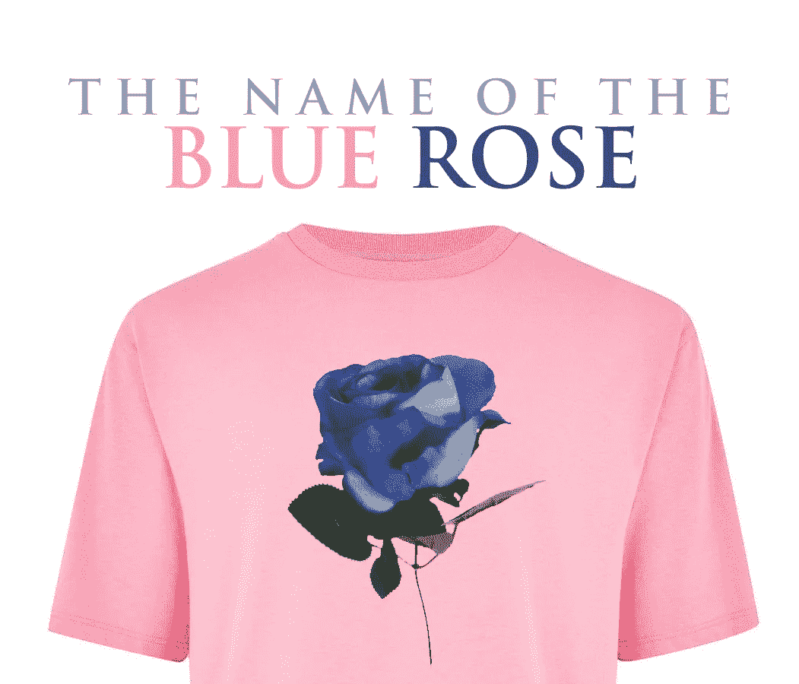

# 蓝玫瑰的名字

> 原文：<https://medium.datadriveninvestor.com/the-name-of-the-blue-rose-ca360444d76c?source=collection_archive---------24----------------------->

> "不知道只是无知，但知道却什么也不说的人是罪犯." **—伯德·布莱克特**

是的，没有蓝玫瑰。世界各地发现的罕见物种是基因操纵的结果。这些奇花异草只有通过这种方式，通过发明才得以存在。我不知道原因；也许是对蓝色的迷恋或者病态的好奇。

1986 年，导演琼·杰奎斯·安诺德将作家兼哲学家安伯托·艾柯的畅销书《玫瑰之名》搬上了银幕。这部电影讲述了肖恩·康纳利饰演的方济各会修士威廉·德·巴斯克维尔的故事。他和他忠实的徒弟阿德索·德·梅尔克(克里斯汀·史莱特，当时只有 15 岁)必须揭露在一个偏远的意大利修道院发生的一系列谋杀案。这引发了方济各会和多米尼加人之间巨大的意识形态之争。

故事发生在 1327 年，在黑暗时代，教会的权力达到了顶峰。该修道院拥有大量的藏书，并拥有罕见的副本，是当时世界上最令人垂涎的。威廉，一个对科学和知识有着根深蒂固的爱好者，未经允许进入图书馆，甚至没有嘲笑它(修道院院长强调了最后一个细节)，意识到死亡和那个地方之间可能有联系。很多人都知道这部电影和这本书，所以我不会在这里花太多的剧透线。我只需要这些图像来阐明文章的论点。

今天我们拥有不可思议的力量。许多人没有意识到这一点，但互联网刚刚出现。不久前，我们绝对没有什么是天然的。试着想象一下你没有万维网的生活。很难，对吧？当信号消失时，我们会绝望地逃跑。我们没有方向，不知道该做什么。似乎网络和氧气一样重要。

我们有一种不可抗拒的联系需求。这使我们离开自己的家乡去了解整个世界。此外，好像这还不够，我们需要分享每一个细节，即使它们不是真的。我们用这种方式告诉和展示我们对现实的看法，在现实中我们总是很好，我们配得上所有可能的特权。作为凡人，我们无法抗拒虚拟世界的诱惑。一切都可以出版。

意识形态把人们联系在一起。

## 人物、日期和地点都在变化，但需要一种意识形态来让人们顺从，并有一张清晰的地图来指引他们的脚步，这种需要从未被废弃。即使是现在，在 21 世纪，当所有的信息来源都在我们的掌握之中时，我们更愿意问我们应该做什么。此外，有很多人愿意出售他们能够改变世界的更新版本的意识形态。

经济被认为是一个国家最大的问题，但是所有的目光都集中在政府出版的教科书上。谁控制了教给孩子们的东西，青少年就控制了整个系统。这一庞大的年轻人群体，渴望知识和市场机会，渴望改变他们贫穷的现实，往往会吞下他们所上学校提供的几乎所有东西。一旦“训练有素”，致力于一个操纵他们意见的系统的规则，他们将很难使用健康的批评来解除阻止他们作为自主生命繁荣的束缚。

总的来说，我们的学校并不注重培养学生成为企业家，成为独立的思考者，在老师的细心支持下，自由地提出自己的想法并付诸实践。遵守规则，做测试，尊重手册，完成预定的目标，不偏离计划是正常的。然而，谁能保证这将有助于未来的公民在生活中取得一些成功？

卡尔·萨根(Carl Sagan)曾经说过，历史上充满了这样的人，他们因为恐惧、无知或对权力的贪婪，“摧毁了事实上属于我们所有人的不可估量的价值的知识。”所有的知识都储存在修道院正中央的一座高塔里，灌输给威廉去想象藏在那个地方的许多奇迹。由于被当局禁止进入图书馆，他不得不想办法去那里，当然，这违反了规定。当凶手意识到自己即将被抓时，他宁愿烧掉所有的书，抹去他的犯罪痕迹，即使代价如此之高。

## 查尔斯·达尔文说，无知比知识更能产生信任。对他来说，那些知之甚少的人，而不是那些知之甚多的人，那些断言这个或那个问题永远不会被科学解决的人。让人们保持无知，创造神话和歪门邪道来解释世界的现实，是有史以来发明的最有效的灌输形式。蓝玫瑰是人类的发明，就像每四年蜂拥而至的意识形态一样。

我们发明了任何能让我们控制局面的装置。

玫瑰的名字只是虚构的。而且反映了一个世纪又一个世纪、一个又一个政府不断重复的现实。即使在生活中最简单的情况下，我们也想把我们的个人意识形态、我们的价值观和道德准则、我们口袋伦理的更新版本强加于人。当一对夫妇分开时，每个人都有自己的故事版本，当然，他们都没有扮演坏人的角色。“前任”总是不好的。前任管理层总是给现任政府留下被诅咒的遗产。我们想要强加于人，我们使用我们所拥有的力量。如果只是社会评论，随便。然而，如果是总统笔，那就更好了。权力就是不能离开我们想要它去的地方。

我的敌人没有掌权。毕竟，我们生活在一个民主国家。我想。如果你赢了，那么让我们一起来。如果你做对了，恭喜你！然而，如果你没有，让我们来解决它。我心目中的英雄也不是死于服药过量，原因很简单，世界上没有英雄。他们试图灌输给我们的另一个谬论。有许多人死于服药过量，但也许是因为那些未回答的问题充斥着我们所有人的现实。缺乏确定性让我们窒息，让羊群来回移动，就像一群没有女王的昆虫。

## 为什么我们看搞笑视频会笑得那么厉害，尤其是在周日晚上？也许是因为我们讨厌回到周一早上等待我们的严酷现实中去。更容易看到人们跌跌撞撞，试图忘记糟糕的周末，想象视频中那个破碎的人的痛苦可能比我更大。这看似缓解了情绪上的痛苦，尽管实际上并没有真正的好效果。

无知的颜色不是粉色，甚至不是蓝色。无知是人类的发明，就像蓝玫瑰一样。不像花，它没有颜色。你的透明是你最好的伪装。越半透明越好。因此，我们可以认为它不存在。这为那些学习创造和强加意识形态的人提供了无限的力量。他们只说必要的话，足以保持人们精神的平静。

在电影中，这个可怜的女孩被一个和尚虐待以换取食物，几乎不说话，几乎不穿衣服，甚至没有名字或身份。对任何国家的穷人来说都是一个完美的寓言。她的聪明才智被用来为所有的暴力辩护。她的无知为她的饥饿付出了代价，没有权利和尊严。电影结束时没有透露她的名字。对于看过这部电影的人来说，这是一个反思的机会，或者也许这是那些生活在似乎永远不会结束的战争中的人的悲惨现实。

This is my new book, spare some time to know more about creativity.

最后，威廉揭示了隐藏在古老石墙后面的“邪恶”，证明了一个热爱科学和善于利用知识的人的坚持是值得他做出所有牺牲的。一种自由的知识，没有障碍。激发创造之美的东西，总是质疑，并在社会中产生真正的变化。一个健康的知识，有能力唤醒每个人的创造力，不管他们的喜好。一种赋予我们身份的知识，一个让我们成为真正人类的真实姓名；自由地做出我们自己的选择。