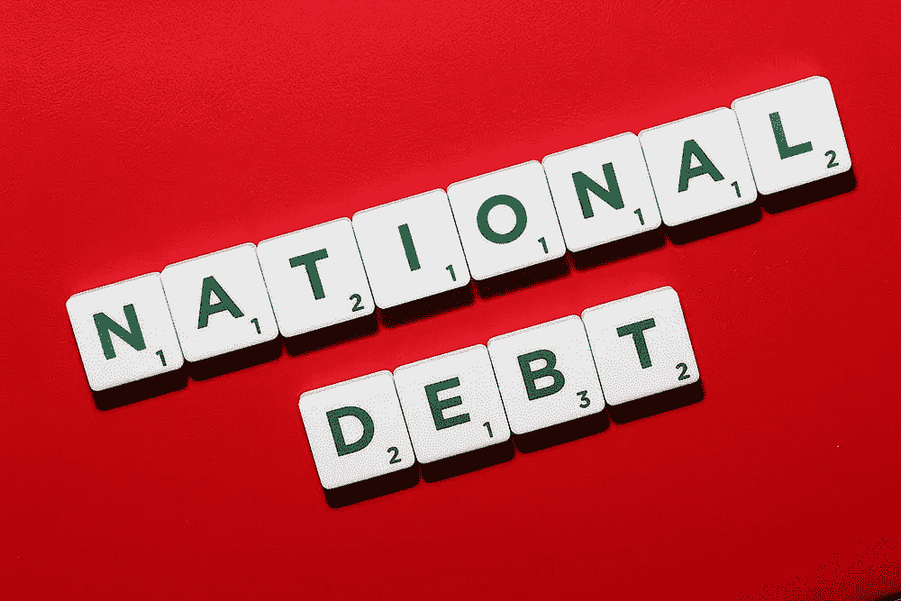
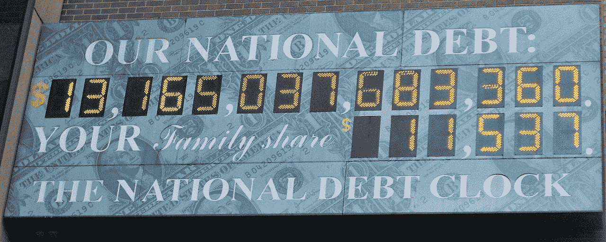
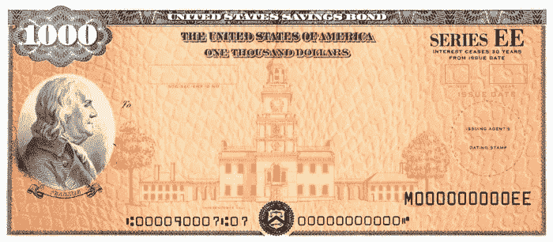
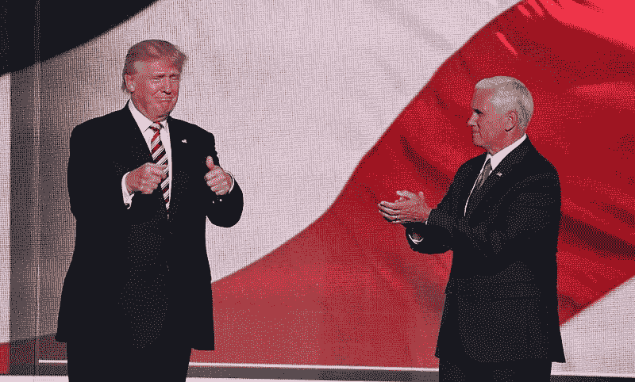
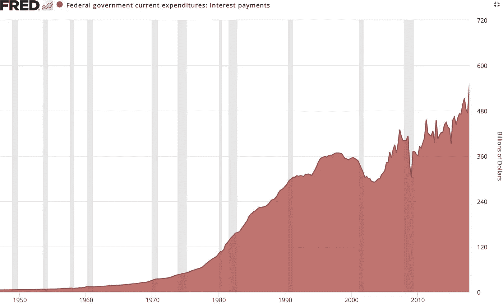
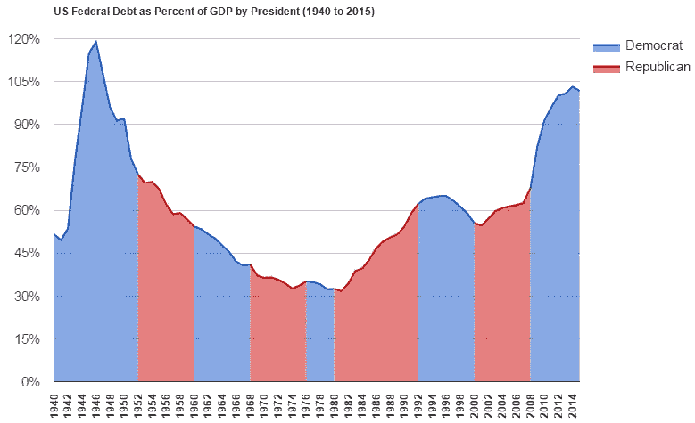
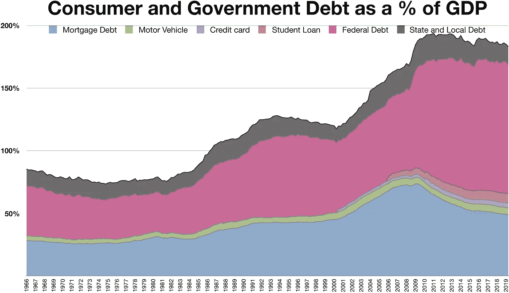

# 国债暴涨，无人问津

> 原文：<https://medium.datadriveninvestor.com/the-national-debt-is-skyrocketing-and-no-one-is-talking-about-it-454d7bdcbb3?source=collection_archive---------0----------------------->

[Source](https://www.flickr.com/photos/cafecredit/27673034866)

没有人在谈论国债，这是一个问题。国债是一种模糊的数字抽象，听起来有些令人不快，但并不特别紧迫。曾几何时，美国领导人对不举债的好处表达了坚定的信念。

但这一信条在过去的 100 年里早已烟消云散。很少有人停下来想一想，我们当初为什么坚持财政纪律，以及我们目前拒绝财政纪律对美国的财政未来意味着什么。

[Source](https://commons.wikimedia.org/wiki/File:National_Debt_Clock_by_Matthew_Bisanz.JPG). Don’t be fooled: This picture was taken in 2010 when the national debt stood at a comparatively modest $13 trillion.

在曼哈顿，传说中的债务钟安装在成千上万路人可以看到的地方。日复一日，它忠实地记录着我们国家积累的数万亿美元的债务。不祥的是，在构成我们当前 23 万亿美元债务负担的 14 位数字下面，用活泼的字体列出了*“你的家庭份额”*——每个美国家庭分摊的国债估计数。你可能会问，你的家庭份额是多少？哦，你知道，就几十万美元。

但是对于每天流过这些数字的人群来说，*它们有什么意义吗*？也许债务的想法会引起人们本能的不安反应，但很难想象国债对人们有什么意义。毕竟到底是什么？它对我们有什么影响？因此，一个更具体的问题可能是，*应该对人们有意义吗？*

答案是肯定的。政府对债务问题的拒绝绝对重要，因为这不仅为国家树立了一个不健康的先例，而且最终将危及美国的金融健康

# 那么为什么没有人谈论它呢？

这里有一个很大的问题:没有人再对国家债务生气，正是因为没有人觉得对它有什么特别的责任！在政治阶层内部，避免债务的*美德*已经基本消失，避免债务的*逻辑*也是如此。有趣的是，债务已经获得了道德中立性，同时还有继续忽视债务的动机。

[Source](https://commons.wikimedia.org/wiki/File:EE_Savings_Bond.jpg)

债务在阴影中积累，很容易在全国范围内被遗忘。毕竟，它感觉不太真实——它只是一个看似无关紧要的数字。当然，债务并不是虚幻的——它以国债的形式存在，在外国、美国公民、甚至我们自己的政府手中流通，当需求开始下滑时，政府就会把它们抢走。多方便啊！

所以，没有人谈论国债，因为它感觉像一个没有直接影响的抽象概念。它有点像天空中的一朵云，人们错误地认为它永远不会带来倾盆大雨。但是这个问题也没有得到解决，因为政府机构中没有让当选官员关心这个问题的动机。

 [## 为什么包容性财富指数比 GDP 更能衡量社会进步？|数据驱动…

### 你不需要成为一个经济奇才或金融大师就能知道 GDP 的定义。即使你从未拿过 ECON 奖…

www.datadriveninvestor.com](https://www.datadriveninvestor.com/2019/03/08/why-inclusive-wealth-index-is-a-better-measure-of-societal-progress-than-gdp/) 

国会议员并没有让选民对国债指手画脚。(为什么会这样呢？部分原因是我们也不觉得对国债有什么特别的责任！就我们而言，我们不是铲山的人！)在现代美国政治中，更常见的是政客们游说*增加*福利，而不是*限制*福利。这也是为什么没人谈论债务的部分原因。

人们已经习惯了联邦政府的开支。因此，毫不奇怪，他们对财政约束这个遥远的概念嗤之以鼻。(一个有点粗糙、简单的推测可能是，我们已经开始喜欢*事物*超过我们喜欢坚持*价值观*的满足感。)

因此，随着时间的推移，随着对预算和最低债务价值的信念减弱，一种令人讨厌的政府入不敷出的模式开始实施。它创造了一种不可持续的习惯，那就是消费超出了我们的合理支付能力。

> 问题是双重的:公民对政府债务采取了一种更为矛盾的道德立场(此外还对债务的各种后果一无所知)，否定了政治家在华盛顿为他们游说的必要性。但是同样重要的是，政府本身已经基本上放弃了任何解决这个问题的计划。

[Source](https://commons.wikimedia.org/wiki/File:Donald_Trump_and_Mike_Pence_RNC_July_2016.jpg)

特朗普总统在 2016 年的竞选活动中召集了观众，雄心勃勃地宣布对当时 19 万亿美元的债务进行讨伐。但是从来没有这样的攻击。它的计划被看起来更令人信服的关注和项目冲掉了。国债本身几乎不为人知，这也于事无补。它很容易被推到幕后。*也许，解决债务问题的紧迫性毕竟有点虚？*

特朗普对债务的不屑一顾凸显了我们当前困境的一个痛苦现实:两党都失败了(而且毫无兴趣！)在解决国家债务问题上，这足以表明，不管下次谁入主白宫，这种自掘坟墓的模式都将继续下去。

虽然奥巴马在其总统任期内几乎将国债增加了一倍，并受到共和党人的严厉谴责，但这种谴责主要是口头上的，几乎没有转化为扭转或停止债务机器的实际行动。

这种所谓的“两党失败”是一个令人清醒的现实。除了对我们自己的处境不甚了解之外，它还潜在地揭示了我们缺乏勇气。

# 为什么国债对我们很重要？

原因有很多。排名不分先后。。。

[Source](https://commons.wikimedia.org/wiki/File:Federal_interest_payments.jpg)

1.  美国每年为国债支付数千亿美元的利息:这是一个经常被遗忘的提醒，即政府不能像流行的说法那样简单地“凭空创造货币”。他们受制于折磨我们所有人的同样令人厌倦的债务规则。在 2019 财年，预计债务的净利息支付将达到[3935 亿美元](https://www.pewresearch.org/fact-tank/2019/07/24/facts-about-the-national-debt/)。从长远来看，这大约是所有联邦支出的 8.7%。这笔钱没有用于传统的高尚而富有成效的追求，如修建道路或改善教育，这些都是我们想象中的美好事物。相反，它除了弥补我们国家入不敷出的恶习之外，什么也没做。这些巨额利息支付经常不被注意，因为它们有点政治上的尴尬，没人愿意谈论它们。但是，不仅仅是成本不好，事实上，这些支付挤走了对我们国家未来的其他投资也是有害的。
2.  **如果出现衰退，我们的处境会很糟糕:**衰退对国家来说很艰难，因为通缩压力会推高国债融资成本。不言而喻，对于一个面临经济衰退的国家来说，已经背负巨额债务负担并不是一个有利的处境。这减少了他们所谓的“财政空间”，或者他们对抗衰退的能力。现有的巨额债务负担也可能导致复苏乏力。
3.  风险更高的资产可能接踵而至，导致经济失衡:当国家负债累累时，它们通常会寻求维持一个“宽松货币”的环境。这一点特别有吸引力的原因之一是，低利率的氛围意味着债务成本更低。例如，央行可以通过保持低利率来抑制债务价格。然而，这种效应会延伸到更广泛的经济领域，并对投资界产生重大影响。投资者可能会对债券的低回报感到不满，转而寻找回报更高的资产类别。人为引发的某些投资的涌入会导致资产膨胀，导致经济失衡，这可能是危险的。
4.  **子孙后代将肩负重任:**我们以前肯定听过这句话。近来，政治言论变得尖锐起来，恳求控制我们的金融轻率行为，哪怕只是为了拯救我们自己，以免破坏子孙后代的生计。这是一个有价值的评论，因为我们的国债利息支付肯定会增加，因为 a)最终利率会从历史低水平上升，最重要的是，b)债务水平本身逻辑上不可避免的增加。

[Source](https://www.flickr.com/photos/61056899@N06/5751301741)

5.**你让政客承担责任的能力下降了:**如果你没有预算约束剂来约束你的民选官员，你还有什么？预算纪律在历史上有助于让政治家专注于重要的事情。它迫使他们屈从于外部权威，并阻止他们通过向选民挥舞更多的联邦美元来获取政治上的支持。事实上，我们已经让我们的国家债务上升到了应有的高度，这意味着我们早就把这种问责方式扔出了窗外。

6.你们纳税人的钱被浪费了！这个很明显。我们的大量联邦支出都是过度的，而且效率低下。如果维持现状，没有人对华盛顿为这个或那个涌出的巨额资金睁一只眼闭一只眼，事情就会一如既往。刻面将继续运转，债务库将继续扩大。如果没有人质疑国债的规模，那么他们肯定不会质疑这些债务到底是从哪里来的，不是吗？

[Source](https://commons.wikimedia.org/wiki/File:US_Federal_Debt_as_Percent_of_GDP_by_President_(1940_to_2015).png)

7.**经济增长放缓:**庞大的主权债务负担不仅仅是被动地出现在政府的资产负债表上。它们积极抑制经济扩张，因此会对收入增长产生抑制作用。出于公共政策目的，经常被拿出来的一个指标是债务与 GDP 的比率。直截了当地说，人们普遍认为高于 100%的比率很糟糕。如果你感到惊讶，截至 2019 年 9 月，我们目前的比率为 [103%](https://fred.stlouisfed.org/series/GFDEGDQ188S) 。[研究](https://www.crfb.org/blogs/90-percent-debt-gdp-threshold-and-cbo%E2%80%99s-new-debt-estimates)一直显示，即使是 90%的比率也能让一个经济体的增长减少 30%。也就是说，高债务-GDP 比率对一个经济体有如此大的抑制作用，以至于它可以吸走高达三分之一的 GDP。这是巨大的！这里的教训是？债务拖累了增长。句号。请记住，这是一个我们并不经常看到的拖累。它构成了这种“神秘的”磁力，阻碍了经济扩张，并积极抵制刺激计划。(具有讽刺意味的是，刺激计划只会增加债务。债务是隐藏在我们许多经济困境背后的真正问题，它的影响融入了更广泛的经济领域，最初并不明显。

8.**国家安全受到威胁:**在美国发现自己深陷其中的整个债务失控实验中，有一个被忽视的风险。这是美国是否会发现他们在世界舞台上的特权地位受到债务负担的威胁。想想一个显而易见的事实，负债使人处于弱势地位。有时，持有这些债务的是外国。我们一直认为我们的经济实力是理所当然的，但是当其他国家退出美国债务市场或者我们无法支付我们所欠的债务时，会发生什么呢？

# 只有两条出路，我们哪条都不想要

[source](https://www.geograph.org.uk/photo/4035849)

美国霸权无法回避最古老、最顽固的金融现实:你必须为你消费的东西买单。正是这种古老的平衡法则、正义法则、投入产出逻辑法则，支撑着人类生活中最基本的准则:*种瓜得瓜，种豆得豆。*

如果美国选择正面解决国债问题，他们有两个选择:a)减少支出，b)增加税收。毕竟，这是事物的自然规律。但这两者在政治上都非常不受欢迎，因此可笑的是，它们都没有被触及。所以我们继续借钱，这在短期内要容易得多——你只需要批准一些政府官员去做这件事，而不是让你的选民乱七八糟地参与进来，同意减少或增加被没收的钱。祝你好运。

不幸的是，你不可能永远负债累累，还指望能全身而退。没有什么是永恒的，最终，清算会来敲门。

# 美国豁免权的幻觉

对于美国即将面临债务灾难的观点，一个流行的辩护是，这种情况以前从未发生过，美国在全球舞台上过于主导和重要。

这个，恐怕要说，根本不是理性思考。将过去*发生的事情复制粘贴到未来*的*中，这是一个有缺陷的想法。尽管这是我们人类特有的一种心理倾向，但这并不能成为信仰的有效基础。也就是说，我们的霸权并非无懈可击。*

虽然美国在世界格局中确实扮演着重要角色，但我们也不能幸免于被淘汰出局。不假思索的傲慢不是成功的秘诀。事实是，随着债务的增加，我们的总体脆弱性也在增加。负债不会被洗掉，即使它们被屏蔽在公众的视线之外。

# 债务驱动的经济

[source](https://en.m.wikipedia.org/wiki/File:Consumer_and_Government_Debt_as_a_%25_of_GDP.png)

没有人谈论国债的事实实际上是一个更大、更根深蒂固的问题现实的一部分。现代美国经济将经济增长的惊人比例归功于债务本身。如今，公司债务、政府债务、学生债务、汽车债务、信用卡债务——凡是你能想到的——都处于历史高位。最肮脏的秘密是，为了生存，美国已经沉迷于债务。

《市场观察》撰稿人斯文·亨利克[精彩地抨击了债务驱动型经济中尚未解决的结构性问题:](https://www.marketwatch.com/story/stock-market-investors-its-time-to-hear-the-ugly-truth-2019-01-05)

> “央行的存在是为了防止过度的后果成为现实，并给政客们提供避免解决结构性问题的许可。通过阻止这些市场力量在每一个问题迹象出现时发挥作用，这个罐子会被踢得越来越远。每一次连续的复苏都让这种幻觉继续存在，但在怪兽回归之前，“适应”需要越来越低的利率。与此同时，债务不断膨胀，而每次复苏产生的有机增长越来越少，财富不平等性越来越大。这是系统产生的结果。这是丑陋的事实。但你不会从美联储那里听到这些。”

# 那么这一切揭示了什么？

严峻的事实是，美国真的没有任何意图在短期内为债务制定行动计划。财政保守主义的优点不仅在下滑，而且与之相关的激励也早已消失。

美国擅长很多事情，但不幸的是，它有点太擅长在国家信用卡上积累数万亿美元。认为我们可以无忧无虑地做生意，逃避后果，这是一个致命的错误。

此外，两党在解决债务问题上的失败不仅暴露了我们的债务问题在结构上是多么的根深蒂固，也暴露了它的不可持续性。巨额债务对个人没有好处，因此显而易见，它们对经济或国家也不会健康。

通常，人们选择不谈的正是他们害怕触及的东西。深深意识到自己造成的混乱，政府官员采取了闭上眼睛的策略，试图让党继续下去。但派对总会结束，真相总会大白。

> *但是把罐子踢到马路那头，你为什么不呢？*

> “奴役一个民族有两种方式。一个是剑。另一种是靠负债。”约翰·亚当斯