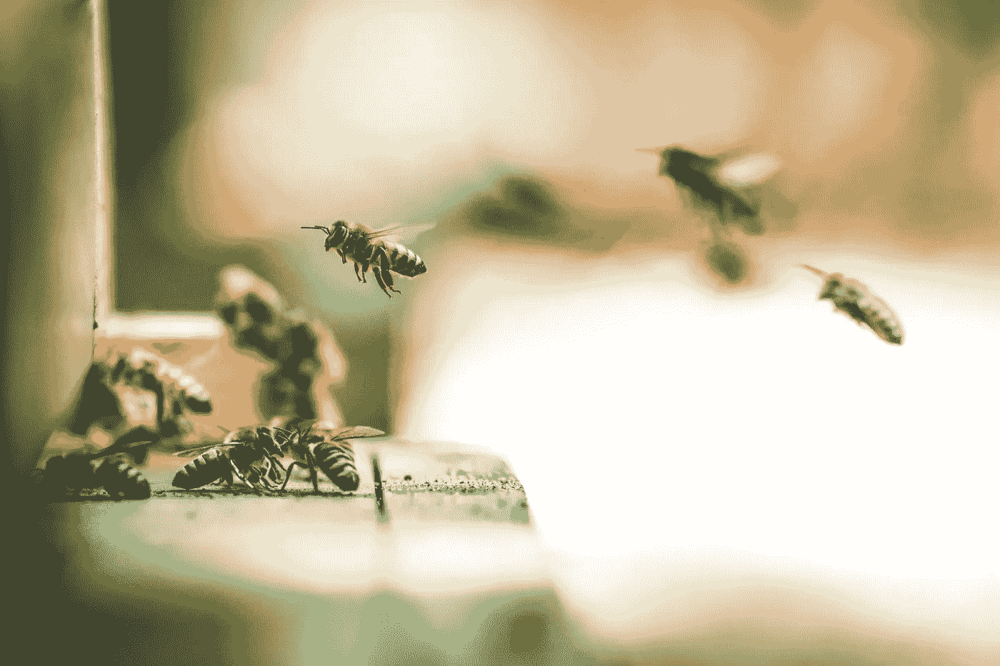

# 自然界有助于设计智能系统

> 原文：<https://medium.datadriveninvestor.com/the-natural-world-helps-design-intelligent-systems-b51d941eb0b1?source=collection_archive---------13----------------------->

Photo by Eric Ward on Unsplash

从本质上来说，生物体是使用硬件和软件的组合来处理信息的复杂系统。随着时间的推移，人们明白了这一点，并开始利用自然系统作为高效解决方案的灵感。

根据赫曼米勒设计、勘探和开发副总裁 Franco Lodato 的说法，自然是一个“数据库”,可以帮助你了解设计机会。如果我们倾听大自然告诉我们的，我们就能做出更好的决定，建造更可持续的建筑，创造出在我们需要的时间和地点发挥作用的系统，这一切合二为一，赋予大自然解决人类问题的方法。大自然是一个由像我们人类这样的生命体构成的生态系统。

 [## 挑战你对人工智能和社会看法的 4 本书|数据驱动的投资者

### 深度学习、像人类一样思考的机器人、人工智能、神经网络——这些技术引发了…

www.datadriveninvestor.com](https://www.datadriveninvestor.com/2019/02/28/4-books-on-ai/) 

人工智能(AI)旨在设计和构建能够在复杂环境和诸多不确定性下进行推理、感知和决策的计算系统。人工智能和自然之间的联系有助于创造先进的[技术](https://disruptionhub.com/technology-inspired-nature/)。理解动画世界中任何形式的智能背后的过程将重塑[商业](https://www.greenbiz.com/article/10-amazing-uses-biomimicry-business)和工业过程。

人工智能与生物学、神经科学或认知科学密切相关。科学家和实践者从自然界借用了许多关于计算的想法。人工智能算法和某些情况下的整个领域都来自生物系统。例如，神经网络使用来自大脑架构的元素。此外，我们有受自然进化、蚁群或免疫系统启发的优化算法。因此，人工智能和自然界有许多相似之处。

大自然高效地创造并运行着它的系统。自然过程和自然的“解决问题的方法”散发出独创性、精确性和难以置信的资源利用。难怪当其他一切都失败或当我们需要一个优秀的解决方案时，我们总是会回到他们身边。自然界是人类已知的适应性最强的复杂系统。进化为我们提供了无数系统执行各种类型计算的例子。我们利用其中的一些想法，创造了可与自然系统相媲美的人工系统，比如受蚁群(ACO)启发的优化算法。这种类型的概率模型对于寻找在运营管理中遇到的情况的最佳解决方案是有用的，例如最短路径问题、资源分配中的组合学问题、多目标优化问题。例如，海运系统依靠蚁群算法进行路线规划和避免碰撞[1]。此外，ACO 为无线传感器网络中的路由产生了许多有效的设计[2]。大自然是设计超越人类能力并展现出意想不到的效率水平的系统的绝佳灵感来源。

自然界一直在设计智能系统。化学网络、细胞、我们的大脑或我们的社会都是适应性和自治系统的例子。放眼望去，自然界到处都是复杂适应系统的例子。然而，大自然有一个显著的优势:时间。这些系统中的大多数都是多年进化的结果。几年的时间，他们从一种配置到下一种配置，直到找到解决任务的最佳方法。公平地说，有时约束会阻止自然系统找到最佳解决方案。这些情况会产生灾难性的后果，例如一个物种的灭绝或大量人口的死亡。技术没有数百万年来完善解决方案的奢侈，我们也承受不起灾难。尽管存在差异，自然和技术不应该相互排斥。我们应该密切关注自然界。首先找出一个生物系统是否已经解决了这个问题。如果有，那么就没有必要重新发明轮子，提取基本原理和方法，并把它们转移到我们试图解决的问题上。自然是灵感的源泉，而技术是创造的引擎。

人工智能的发展与生物和自然界有关。我们受自然界中发现的系统的启发，开发了许多算法和系统。例如进化算法、人工神经网络计算免疫系统、生物机器人、群体智能或基于群体、蜂巢或羊群的优化算法。这些想法改变了我们开发新技术和解决问题的方式。生物启发的解决方案受益于这样一个事实，即大自然已经提炼了许多步骤，使它们尽可能高效。因此，我们将通过结合工程和自然的微调解决方案来开发颠覆性技术。

参考

[1] Lazarowskaa，A，2014，“基于蚁群优化的导航决策支持系统”，《过程计算机科学》，第 35 卷，第 1013-1022 页，2018 年 7 月 4 日查看，可从 https://www . Science direct . com/Science/article/pii/s 1877050914011521 获得

[2] Okdem，S & Karaboga，D，2009，“使用蚁群优化(ACO)路由器芯片在无线传感器网络中进行路由”，传感器，第 9 卷，第 909–921 页