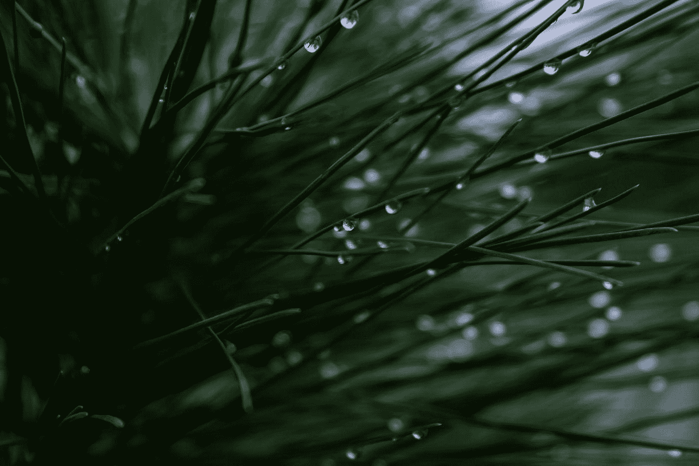

# 幸福的本质

> 原文：<https://medium.datadriveninvestor.com/the-nature-of-eudaimonia-cd06d79e4b62?source=collection_archive---------5----------------------->

## “在内心深处，在生命的分子中心，树木和我们本质上是一样的”——卡尔·萨根

Photo by [Micah Hallahan](https://unsplash.com/@micah_hallahan?utm_source=medium&utm_medium=referral) on [Unsplash](https://unsplash.com?utm_source=medium&utm_medium=referral)

> "我对生活的全部要求是，它应该是持续的、无止境的快乐."― **罗曼·佩恩**

幸福的概念起源于希腊人(通常归功于亚里士多德),包括一种拥有良好内在精神的状态，或者处于健康、幸福和繁荣的状态。它也通常被认为是在道德背景下，指的是导致个人幸福和满足的适当行为。它赋予这种幸福概念内在的价值，甚至提倡一种生活方式，这种生活方式带有一种道德哲学，就好像它是一个指南针，指引冒险者走向这种理想的欣快状态。

这是一个很好的论点，真的，它假设源于我们行为、判断和我们周围事物的善转化为满足的实际状态。

不过，我想更进一步，加入 Eric Fromm 提出的概念 Biophilia(我们对活泼的追求和对自然的心理偏好)。为了更深入地定义它，这个想法假设人类拥有一种与生俱来的寻求与自然联系的倾向，因为他们被所有有生命和活力的事物所吸引——波峰上的阳光闪烁、松树的摇摆、呼啸的风；有机体和微生物在生命周期中各得其所。

 [## 哲学、象形文字和技术——数据驱动的投资者

### 在发现罗塞塔石碑之前，象形文字已经被视为信息，即使它们的语义…

www.datadriveninvestor.com](https://www.datadriveninvestor.com/2018/10/16/philosophy-hieroglyphics-and-technology/) 

本质上，我的论点看起来是这样的:让自己沉浸在大自然的影响中是我们实践幸福主义的一种方式；有一种内在的幸福力量，这种力量来自于我们在荒野中的存在，来自于我们追求活力的自然倾向。虽然这听起来像是在一辆时髦的嬉皮士公共汽车的窗外兜售的东西，但它肯定也是由缺乏想象力的科学外衣支持的东西。研究植物和树木的无数影响的草药医生肯定会同意，我们在很大程度上受到这些植物或树木排放物的影响；空气生物学家也会很快指出自然界中空气传播的生物海洋，它们可能对我们的心理生理状态有影响。最近的研究还表明，嗜生物性是真实存在的，让自己置身于绿色植物中对我们的整体健康有着重大影响——相当于增加我们的寿命(这项研究将在后面引用)。

那么，这一切背后到底是什么？

> “自然不是参观的地方。它是家”——加里·斯奈德

我不是科学家，如果我说从植物中释放出的大量不可估量的植物化学物质是改善我们各自生理机能的可靠途径，那会误导我。所以我不得不采取和大多数科学家和研究人员一样的方法——专注于对这些益处的*认知*。

不要误解我的意思——工厂排放物对健康的益处是存在的，在制药企业影响的强大阴影下可以找到。像α-蒎烯这样的萜烯被认为对大脑有巨大的好处，很久以前就已经证明树木可以改善空气质量，抵消碳排放；在空气净化领域，这是一个显而易见的事情。尽管如此，因为我们看污染的空气不像看污染的水那样，所以我们不会太注意在我们肺里打转的东西。

但是科学家们有理由对声称树木和植物可以通过空气传播给我们带来具体好处的说法保持警惕，因此他们采取了一种非常不自信的方法来研究野外对我们实际生理的影响。虽然，如上所述，当涉及到感知和身心反应时，他们不太害怕展示我们的思想在做什么。

人们普遍认为，简单的植物意象可以减轻焦虑反应，放松心情——这就是为什么许多建筑蓝图都在寻求融入绿色空间；为什么牙医诊所(无论如何是好的诊所)挂满了描绘树木和森林的照片和艺术品；为什么日本人从 80 年代开始洗森林浴？

这也是为什么我在骑完山地车或在树林里跑完步后会感到完全放松和充满活力；为什么人们将自然视为宁静的绿洲或圣地，以及为什么许多人对探索现象解释的研究如此感兴趣，如之前简要提及的马克·伯曼的研究。

伯曼研究了多伦多植被的绿色效应，评估了大型城市中心社区绿地的健康因素。根据全面的绿色空间指标和健康记录，总体研究结果表明，居住在更高密度树木中的居民报告了“明显更高的健康感知”和“明显更少的心脏代谢状况”。

除此之外的研究表明，置身于绿色空间可以通过多种方式带来生理和心理上的益处，当然包括自我感知。当然，有明显的观点——就生活方式而言，更绿色的郊区通常有更绿色的居民——尽管如此，[生理学证据也变得显而易见](https://www.researchgate.net/publication/331364905_Initial_Evidence_of_the_Relationships_between_the_Human_Postmortem_Microbiome_and_Neighborhood_Blight_and_Greening_Efforts)，并将在即将发布的帖子中探讨。

> "在生命的分子中心，树木和我们本质上是一样的."—卡尔·萨根

尽管生理上的影响模糊不清，但自然的心理影响是非常清楚的——在这次讨论中，我们的感知是巨大的。正如埃里克·弗洛姆揭示了我们追求活力的倾向，我们将所有的拼图拼在一起，揭示了支撑一切的重要信息:**大自然是一个非常有利于我们幸福的环境**。

可以这样想:如果我们周围都是善良、冷静和快乐的人，我们无疑会在自己身上反映出这些特征——无论如何，在相当大的程度上。如果我们把自己包围在混乱和无序中，我们会发展以适应对那种环境的理想反应。那么，如果说我们被欣欣向荣的生活*、*荒野的活力和无数的活力和存在的漩涡、形式和循环所包围，我们会受益于超越当前科学测量的我们自己，这是不是太牵强了？

对我来说，无论如何，我不需要阅读一项又一项的研究来了解我的生理或心理的变化(尽管我似乎无论如何都会这样做，因为这种确认很容易品味)。我感觉到了。远远超过了运动带来的内啡肽；远离安慰剂效应或自欺欺人。[骑山地自行车穿越沼泽](https://medium.com/@mmworonko/happiness-isnt-everything-d85d1124587a)或[穿雪鞋爬山](https://theascent.pub/tracks-in-snow-limits-in-sky-f787c09f2b86)我做这些不是为了保持健康、远离尘嚣、获得宁静、测试自己的极限、寻求刺激。然而，它有点像——如果它被归在幸福的保护伞下。

要成为一个完全充满生机和活力的环境——当与无生命的混凝土、塑料和人造环境并列时，这对我们有好处。在一个允许安静的自我发现和尊重生活的复杂性的环境中，而不是在一个充满碳排放、汽车喇叭交响乐和汽笛奏鸣曲的环境中，这必须给大脑带来超越假设观察计算的好处。

这绝对不是说我们应该抛弃一切，让自己生活在森林中，因为远离自然的世界有它自己的一系列无可比拟的好处。相反，这只是说，下次我们发现自己在荒野中，我们应该花一点时间，真正地呼吸，让我们自己完全沉浸在幸福的时刻。

[**读下去:生物效应**](https://medium.com/datadriveninvestor/the-biophilia-effect-cd8525dbf845)

Nature Deficiency Disorder — The Newest Threat