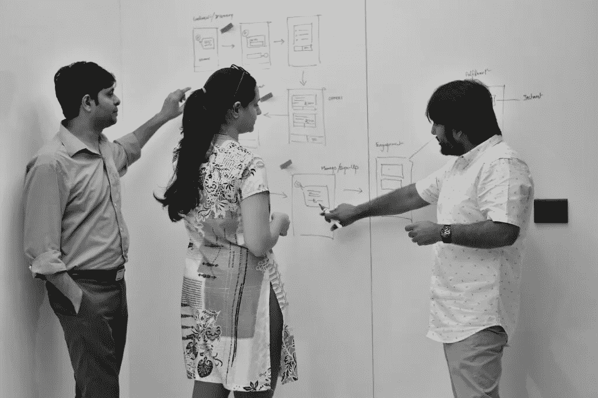

# 创新的需要和 GDD 的倡议

> 原文：<https://medium.datadriveninvestor.com/the-need-for-innovation-and-gdds-initiatives-f049d629dabb?source=collection_archive---------27----------------------->

创新是释放新价值的变化。它挑战传统观念，打破陈规，带来全新的视角。新的思维导致问题的解决和更高的效率。

Photo by [Kendall Ruth](https://unsplash.com/photos/AijuW-HlE30?utm_source=unsplash&utm_medium=referral&utm_content=creditCopyText) on [Unsplash](https://unsplash.com/search/photos/innovation?utm_source=unsplash&utm_medium=referral&utm_content=creditCopyText)

在 GDD，我们相信有两个关键原因激发了我们对创新的需求。这两者是**——生存和繁荣。**

**为了生存——**

**1。竞争日益激烈**

所有行业的竞争都呈指数级增长，每个企业都努力为自己创造一个利基市场。应对竞争的一种方式是模仿和跟随，另一种方式是带来新的想法和征服市场。为了在消费者的心中和家中占有一席之地，你的产品/服务应该是创新的和原创的。

2.**提高消费者预期**

由于全球化，今天的消费者见多识广，有各种选择。他们的期望很高，并且他们的要求经常变化。

如果你不创新，你就无法长期满足客户的期望。你必须预测市场的变化和未来的市场趋势，甚至在你的消费者意识到他们需要解决方案之前就创造出解决方案。

3.**日益全球化**

世界已经成为一个全球中心，世界各地的企业都有全球接入。无论是个人、小企业还是跨国公司，互联网将供应商、设计师、制造商和消费者连接在一个每天都在增长的紧密网络中。例如，像小米这样的公司在成立 5 年内就将其市场扩展到了中国以外，并成为印度第一大智能手机品牌。

不断变化的全球市场是你生存的机会，即使你无法接触到 500 公里半径内的消费者。

**茁壮成长—**

**1。业务增长**

在这个创意工业时代，不断创新和加速变革是成功的关键。创新带来新鲜感，这是增长的关键。无论企业规模如何，开创性的想法是任何品牌成长的支柱。具有创新意识的业务增长是品牌需要关注的。

你可以是一家初创企业，有独创性和创造性的想法，可以帮助你的业务增长。财富 500 强公司也是如此。这可能是一个巨大的公司，但如果它能够创新，它甚至可以占据更多的市场份额。创新型公司很容易成长。

**2。先进技术**

新技术变得越来越便宜，现在人们很容易获得。创造性地使用最新技术，通过创新开发新技术，对于应对行业挑战至关重要。

如果一个公司没有充分利用技术，而它的竞争对手却在这样做，那么这个组织就在限制它的寿命。

它需要高度的准备，以推出甚至没有想象过的技术和战略来利用它的优势。当你的团队齐心协力并主要依靠创新时，所有这些都可以做到。

**3。改变工作文化**

劳动力变得越来越社会化和移动化。社交媒体技术的使用是当今商业文化的重要组成部分。越来越多的工具可用于促进学习、交流和协作。年轻的工人和消费者已经掌握了这些工具，他们也有望使用这些工具。一个主要的挑战是雇用和吸引这些专业人员群体。但是，对于掌握成功诀窍的雇主来说，回报将是巨大的。

能够吸引、联系和保持多样性的公司可以影响他们的员工，促进思想和观念的交流。这反过来又会带来有效的商业模式和更高的员工参与度。

在 GDD，我们理解创新的价值。我们致力于制造增值产品，满足不断变化的客户需求。团队承担风险，我们鼓励我们的客户超越标准路线图，创造出简单性和创新性平衡的产品。我们在设计思维和战略产品设计方面的能力不仅支持客户的想法，而且将它提升到一个新的水平，以便我们构思和产生新的想法。

Me & my team at GDD Studio

在过去的几年里，我们深入研究了各种商业领域，如物流、教育、医疗保健，最近还研究了保险。这是最近的一个项目，我们与跨地理位置的团队远程合作，设计了一个移动应用程序，通过用户体验设计和增强现实、人工智能和机器学习等更新的技术来颠覆保险行业。我们还调查了一些方面，比如印度的保险服务是如何以非常传统的方式依赖于经纪人和代理人来消费的。用户大多依赖保险公司代表或代理人/经纪人对索赔过程的行为。我们重新想象了场景，并使用聊天机器人、使用无人机的快速自动索赔、基于人工智能的欺诈管理等概念创造了围绕新技术的体验。

这只是 GDD 将创意与最新技术结合起来的一个例子。我们与全球专家合作并了解消费者期望的新方式已经产生了积极的效果。我们不断努力为我们的客户创新，并帮助他们发展他们的业务多元化，以在这些变化的时代生存和发展。

*GDD 是一家专注于战略&品牌、工业设计和体验设计(UX/UI)的产品设计工作室。
www.gdd.design*