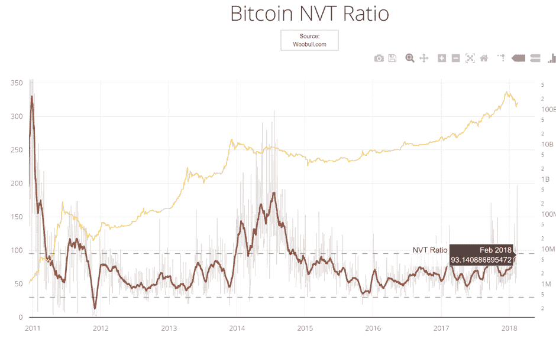
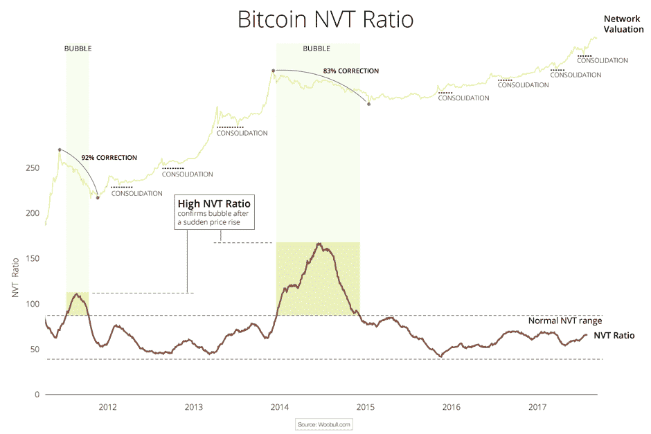

# 网络价值与交易(NVT)比率:加密货币估值的突破

> 原文：<https://medium.datadriveninvestor.com/the-network-value-to-transactions-nvt-ratio-a-breakthrough-for-cryptocurrency-valuation-b46313a0f9e?source=collection_archive---------1----------------------->

"价格是你付出的，价值是你得到的."沃伦·巴菲特。

尽管我们目前正处于一次重大的市场调整中，但过去几年加密货币的价格和市值都出现了大幅飙升。在比特币的引领下，这些革命性数字资产的市场经历了前所未有的增长，这反过来又为加密复合体带来了往往是狂热的宣传。

但是比起仅仅是价格和市值的标题数字，投资者总是更关心*的估值*。目前的价格是否反映了比特币等的实际价值*和*？比特币和/或整个加密市场存在泡沫吗？2017 年末的 2 万美元比特币是不是太贵了，或者只是通往 5 万美元甚至 10 万美元的路上的一个路标？

换句话说，比特币是被高估了还是被低估了？什么应该算便宜，什么算贵？这些是加密投资者现在提出的相关问题，我们需要一个有效的评估工具来回答。

虽然在股票领域，我们可以使用市盈率等指标来衡量一只股票的估值，市盈率是指一家公司的股价与该公司赚了多少钱(或每股收益)的关系，但对加密货币进行估值则有点棘手。这些资产与公司利润或收益没有任何联系。但是不要害怕…

主要由于加密数据研究分析师威利·吴(Willy Woo)的努力，最近出现了一种估值方法，人们现在称之为“加密市盈率”。被称为**网络价值交易比(或 NVT 比)**，其目的是检测某种加密货币是否被高估或低估。它通过量化**一项加密资产**(*分子*)相对于**其交易活动**(*分母*)的网络价值来做到这一点。

加密货币的网络价值由市值(等于价格乘以现有流通硬币的供应量)来表示。但鉴于加密货币没有相关的收益，P/E 型分析就变得多余了。相反，NVT 分析使用过去 24 小时内在资产区块链上登记的交易的美元价值。

虽然与“收益”不同，但交易活动确实代表了加密资产的需求/效用。类似于股权投资者希望在购买股票之前看到公司有强劲的收益，加密投资者希望确保加密货币在其网络上有大量的交易活动。

方舟投资公司(Ark Invest)的大数据和加密货币分析师克里斯·伯恩斯克(Chris Burniske)与吴(Woo)一起推动了 NVT 概念的发展，他将交易价值参数描述为“比特币的潜在效用，即它转移资金的能力。这是比特币的核心效用，就像公司的核心效用是收益一样。”因此，随着加密货币的效用上升，其价值也应该随之上升。

因此，通过将网络价值(市值，在 [CoinMarketCap](https://coinmarketcap.com/currencies/bitcoin/) 找到)除以交易价值(通过区块链传输的交易量的美元价值，在 [Blockchain.info](https://blockchain.info/charts/estimated-transaction-volume-usd?daysAverageString=7&timespan=all) 找到)，我们得到 NVT。相对于其历史范围，较低的 NVT 意味着一项加密资产的每单位交易量目前估值较低。这可能意味着两种情况之一:要么交易量可能在不久的将来下降(特别是如果当前交易量明显高于其正常范围)，要么资产被低估。相反，高于典型水平的 NVT 可能向投资者发出交易量即将上升的信号，或者资产被高估了。

看看下面吴的 NVT 图表，我们看到比特币的最高 NVT 值出现在这种数字货币的萌芽时期。在早期增长阶段具有高市盈率的股票中也观察到了类似的趋势——在这种情况下，比特币被市场高度估价，主要是基于对其未来潜力的猜测，交易活动尚未跟上:

*[来源:威利·吴(woobull.com)](http://charts.woobull.com/bitcoin-nvt-ratio/)*

比特币的 NVT(红线)目前约为 93。从历史角度来看，这似乎在正常范围之内。因此，NVT 的分析表明，尽管比特币价格最近大幅下跌，但几乎没有证据表明比特币存在泡沫。

但是 NVT 真的可以用来检测泡沫的形成吗？除了早期的峰值，上面的图表只显示了另一个时期，即 2014 年年中，NVT 上涨超过其通常的交易范围。到当年 7 月，这个比例达到了 187 的峰值。根据 [Woo 的分析](http://charts.woobull.com/bitcoin-nvt-ratio/)，这一时期可以被称为泡沫，比特币价格随后大幅下跌 83%。

这一点很重要，因为它强调，在价格大幅反弹后，确定泡沫取决于交易活动是否跟进并支持新的估值。如果是这样的话，那么 NVT 将继续保持低位。但如果交易量无法支撑更高的估值，而是在反弹后下降，NVT 将会爆发。反过来，预计市场将从不可持续的水平崩溃，就像在此期间发生的那样。

到目前为止还不错，对吧？不完全是。计算 NVT 的方法在现阶段仍有疑问，特别是在交易量(分母)方面。具体来说，这些数据是否被准确收集？

因为比特币使用[一个未花掉的交易输出模型(UTXO)](https://www.smithandcrown.com/definition/unspent-transaction-outputs-utxo/) ，这意味着比特币区块链将维护‘花掉的’和‘未花掉的’输出的记录，而不是每个用户的比特币余额。如果爱丽丝想给鲍勃发送 7 BTC，但她的钱包里有 9 BTC，Blockchain.info 将记录两笔交易——发送的 9 BTC 和作为零钱返回的 2 BTC。但是如果 Bob 和 Alice 都是新用户，那么“收件人”地址和“更改”地址都不能被识别。因此，一个挑战出现了 Blockchain.info 如何准确量化任何给定时间段内的变化产出？

CoinMetrics 已经发现了这个问题，该公司[使用不同的方法来计算 NVT](https://coinmetrics.io/faq/) 。CoinMetrics 使用一种专有算法，旨在“消除已知的变更输出的重复计算，并在无法判断时包含它们。这意味着我们的交易价值数肯定会大于“真实价值”，无论它可能是什么。因此，它的 NVT 数据比其他公司的[低很多。](https://coinmetrics.io/nvt/#assets=btc_log=false_roll=1_zoom=1368489600000,1518566400000)

另一个可能出现的问题是，网络容量是链上事务的代表。随着比特币可能实现[闪电网络](https://lightning.network/)，这是一个*链外*扩展解决方案，在计算 NVT 时，那些发生在链外的交易会被准确地计入吗？

希望这种差异可以得到解决，并建立一个批准的方法。尤其是在 NVT 似乎已经吸引了很多兴趣和赞誉，将其作为加密货币的合法估值指标。但值得记住的是，就尝试验证这种方法而言，现在还为时尚早。我们最多可以处理 9 年左右的数据，而且这还只是比特币的数据。最终，从 NVT 价值中评估有意义的推论将需要更多的时间、更多的数据和更多的资产比较。随着优势和劣势的进一步确定，NVT 比率公式本身无疑也将得到修改。

吴自己已经帮助开发了一个这样的修改。他称之为 [NVT 信号](http://woobull.com/nvt-signal-a-new-trading-indicator-to-pick-tops-and-bottoms/)，他将其描述为“网络估值除以流经区块链的交易价值，然后使用移动平均线进行平滑”。[研究员 Dmitry Kalichkin 最近的一篇文章构成了这一分析的基础](https://medium.com/cryptolab/https-medium-com-kalichkin-rethinking-nvt-ratio-2cf810df0ab0)，文章发现使用 90 天移动平均线是长期基本面价值的最佳替代。[作者还指出，这适用于几个最大的加密货币网络](https://twitter.com/Kalichkin/status/960712436184596480)。

显然，仍有许多工作要做。但我们至少应该为正式估值分析的车轮已经启动而感到兴奋。

# 有关系的

评论

*原载于 2018 年 3 月 15 日*[*www.datadriveninvestor.com*](http://www.datadriveninvestor.com/2018/03/15/the-network-value-to-transactions-nvt-ratio-a-breakthrough-for-cryptocurrency-valuation/)*。*