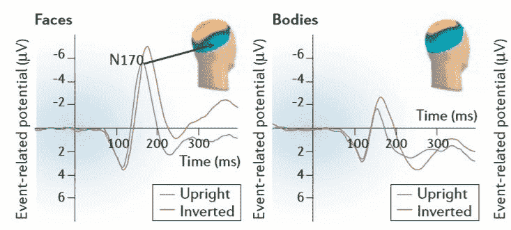
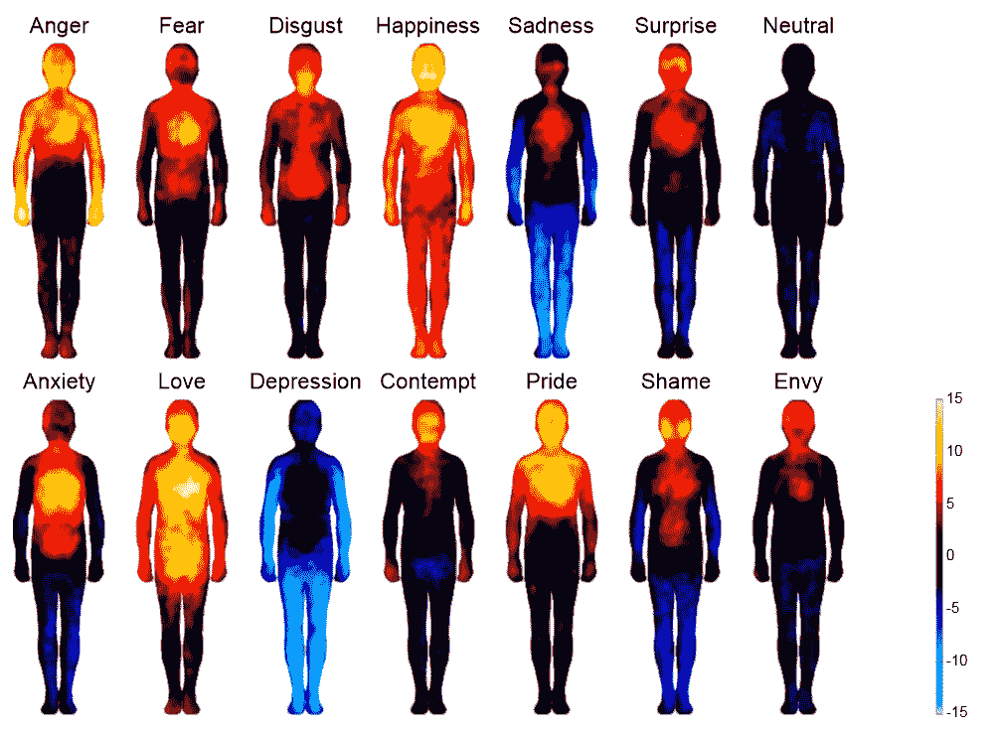
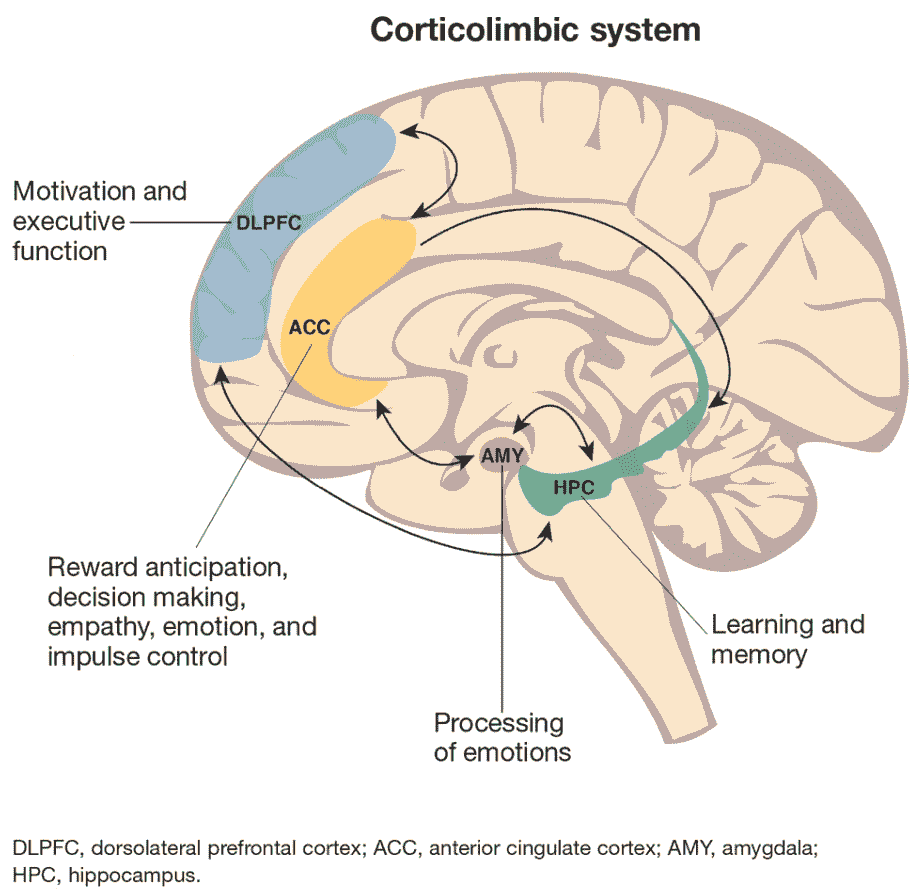
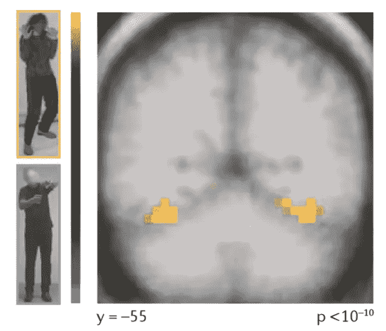

# 通过身体的语言神经科学:身体与情感

> 原文：<https://medium.datadriveninvestor.com/the-neuroscience-of-languages-through-the-body-body-emotion-7fdd339e8dc4?source=collection_archive---------7----------------------->

Olga Kuraeva, dance movements Expressing Raw Emotions

## “肢体语言是一个非常强大的工具。在我们有语言之前，我们就有了肢体语言，显然，你在对话中所理解的 80%是通过肢体语言，而不是话语来理解的

人类有没有可能通过身体在空间中的位置和运动来阅读情感、感受情感并无意识地交流信息？

根据神经科学的观点，是的，而且还不止于此，你对自己和/或他人的感知会影响你行为的构建和对信息的可能解读。

情绪肢体语言是神经科学用来发现情绪和肢体交流的神经生物学基础的术语。它包括全身的情绪表达，包括具体的动作。神经科学的这一领域是最近才出现的，它超越了对面部交流解释的研究。众所周知，面部交流受制于肢体语言(面部属于身体)，尽管在 EEG 设备的 ERP 分析中，神经活动的模式在开始处理时是相似的[1]。

Image extracted from reference [1]. ERP measuring the neural activation when seeing face or body with same response time.

记住[你对现实的所有感知都在你的大脑中](https://medium.com/datadriveninvestor/we-human-machines-hallucinate-our-reality-in-diluted-states-of-consciousness-90a15e94834d)，但这以各种方式反映在身体中。一项概念性研究代表性地描绘了主观环境中的感觉分布是如何赋予某些情绪的:

Image extracted from reference [2]. Intensity of colors are how individuals perceive the state of the body in context of emotion and were informed by painting pixels in a software (the sensations as physiological representations could be vast for each individual such as: facial muscle activation, skin temperature , tearing and etc).

在大脑中，身体解读的解码是复杂的，有几个区域参与，但其中最重要的是杏仁核、额眶皮层和前扣带(ACC)，可以在下图中看到。已经确定的是，有一些区域只对身体解释(不包括面部)做出反应[3]和一些专门针对它的神经元[4]。

Image extracted from reference [5]. Illustrated brain regions.

> *婴儿的头几个月是大脑在先天知识训练中具有加速学习能力的一个紧张的生物学时期。在 3 个月大的婴儿中，他们仍然不能在看东西时识别细节和面部结构，但身体可以，成为潜意识中更根深蒂固的识别和语言知识[6]。*

在下图中，我们看到一个实验，在这个实验中，人们只想象处于恐惧或防御状态的身体。这些类型的研究表明，只有对处于恐惧状态的个体的观察，才会触发观察者与恐惧相关的情绪区域的激活(即使之前没有感觉到)，以保持对危险的可能警觉。这变得非常有趣，因为它告诉我们，只有对他人身体的观察才能够唤起情感，即使是察觉不到的或没有说出来的。

Image extracted from reference [1]. Pixels in yellow to orange demonstrate neural activation in an fMRI device.

这种知识的反响和推断是强有力的。我们可以推测，身体语言会影响你周围的人，所以如果你传达领导和信任，观察你的人不仅会通过你的身体识别这一信息，而且会感觉到它，即使它不是在你不在场的环境之外的他们的生活中。

> 小心你周围的人，情绪在认知上是会传染的。

对这一事件的解释来自于我们大脑中一个叫做镜像的系统。有一些被称为镜像神经元的神经元参与移情、模仿和繁殖过程。镜像对于人类构建各种情绪、基于对他人观察的社会认知能力以及将这种刺激用作对世界本身的学习和感知非常重要[1–7]。

镜像神经元系统很少活动是自闭症患者的特征，正因为如此，他们很难通过面部或身体理解情绪。身体读数的困难也表明了其他精神障碍，如精神分裂症和亨廷顿舞蹈症[1]。

身体交流的能力是如此重要，以至于研究已经开始表明，当有伙伴陪伴时，音乐家的音乐表演(情感和音乐)会得到改善，因为他们在运动的动作中使用另一个作为参考，从而加强了同步性和效率。

> 神经科学认知协会(CNS)的一项研究表明，头部姿势会影响对人格的感知，以及如何表达情感[9]。

所以看到或感觉到你和对方的身体，以及动作，都是应该给予更多关注的感知。无论是在日常生活中还是在项目演示中，你无时无刻不在影响和被影响着。你的情绪一直通过身体散发。当你行动时，讲述一个故事…你的故事…通过运动、存在、位置和行动。

# 参考资料:

[1]走向情绪肢体语言的神经生物学；比阿特丽斯·德·格尔德；复习；自然；2006.

[3]对人体视觉处理有选择性的皮质区域；唐宁，P. E .，江，y .，M. &坎维舍，n .科学；2001.

[4]前运动皮层与运动动作的识别；Rizzolatti，g .，Fadiga，l .，Gallese，v .和 Fogassi，l .；大脑研究中心。大脑研究；1996.

[5]边缘型人格障碍的神经生物学；凯瑟琳·s·皮尔等人；精神病学时报；2016.

[6]人类婴儿和成人身体和面部的结构编码；特奥多拉·格利加 1 和吉斯莱恩·德阿纳-兰贝茨；认知神经科学杂志；麻省理工学院；2005.

[7]从神经元到社会人:镜像神经元系统研究及其社会心理和精神病学意义的简要回顾；玄真哲和李承焕；临床精神药理学神经科学；2018 .

[8]身体摇摆反映了音乐合奏表演中的关节情感表达；Andrew Chang 等人；科学报告；2019.

[9]情绪表达解释了头部姿势对感知个性的影响；大卫·佩雷特；认知神经科学学会(CNS)；2019.

***另一种语言-***

*   [葡萄牙 ](https://www.brainlatam.com/blog/a-neurociencia-das-linguagens-atraves-do-corpo-emocaocorpo-506)

[发表在大脑支持神经科学上的博客](https://www.brainlatam.com/blog/the-neuroscience-of-languages-through-the-body-body-emotion-550)