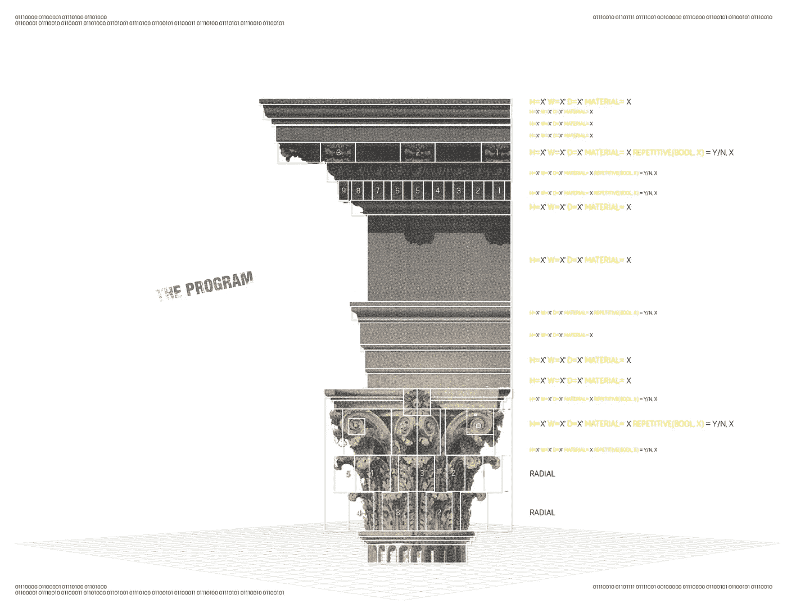
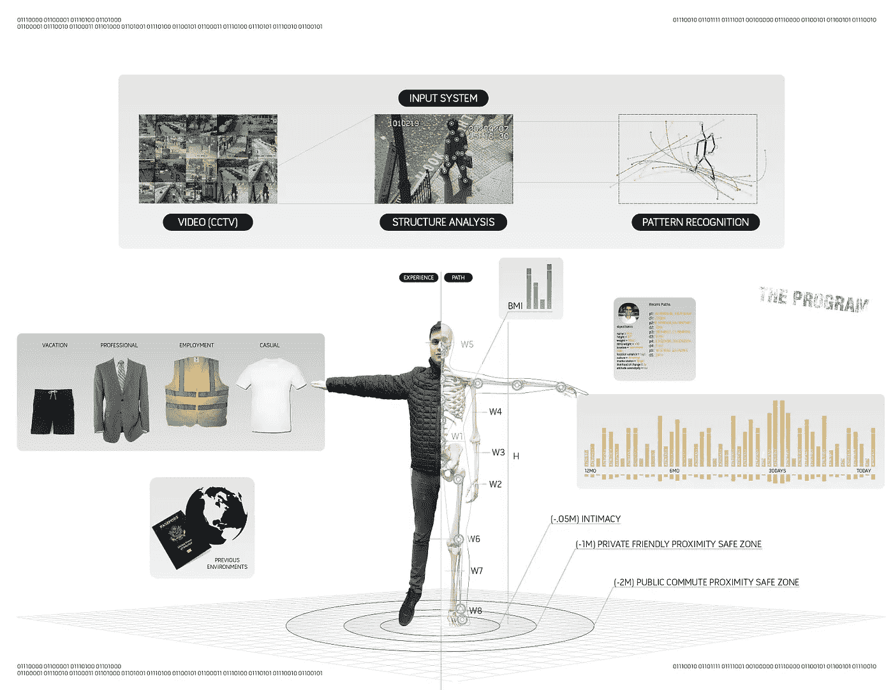
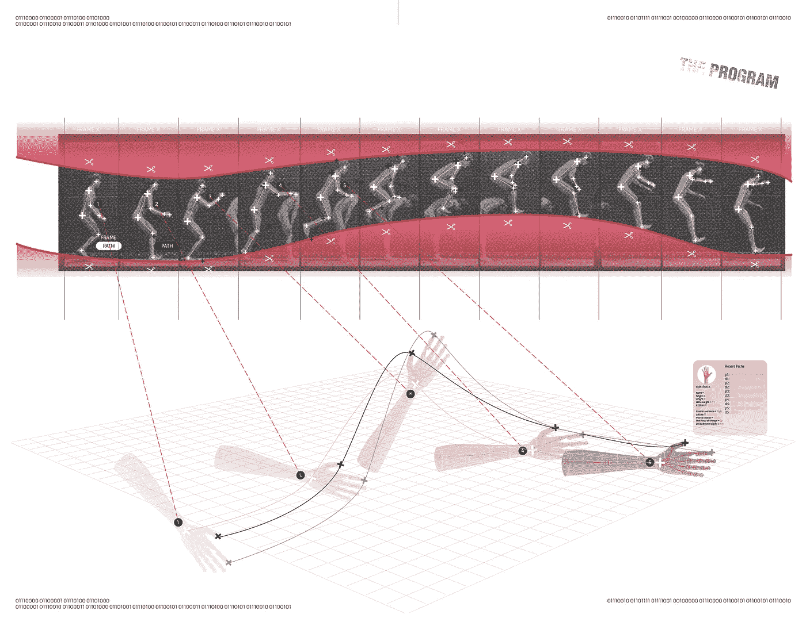
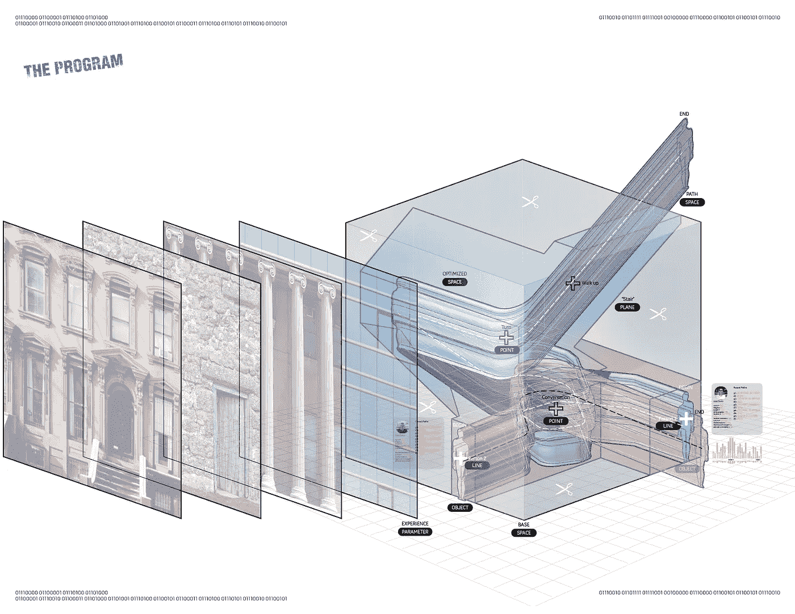
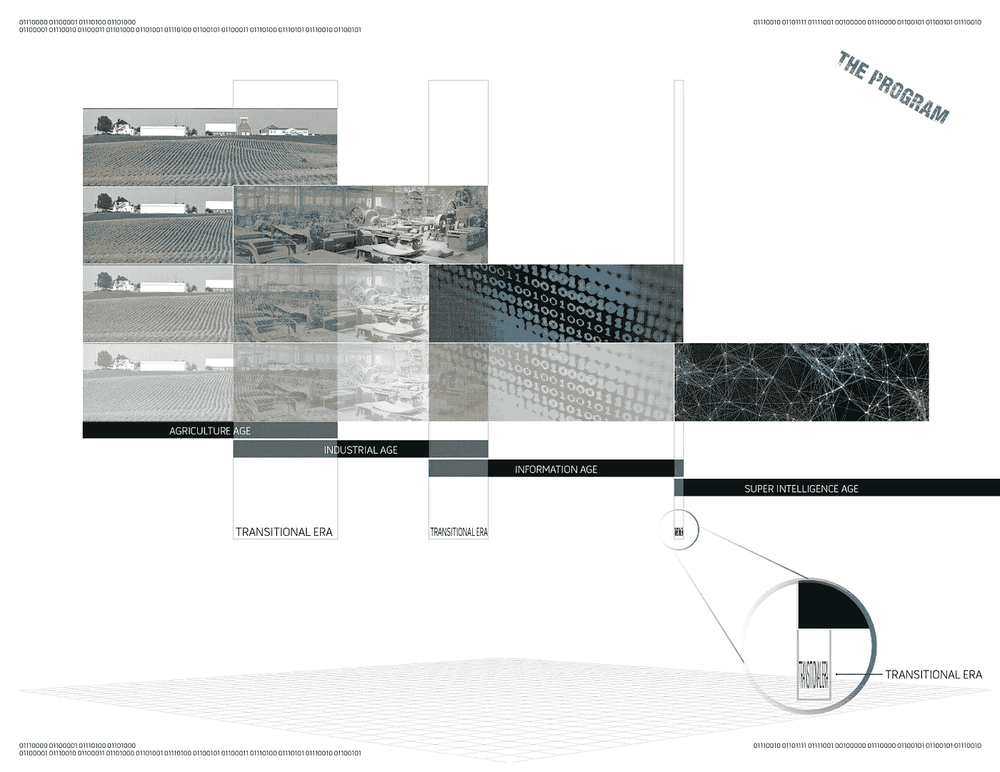

# 新建筑师:当“程序”遇到建筑。

> 原文：<https://medium.datadriveninvestor.com/the-new-architect-when-the-program-meets-architecture-e8bb2f232b4?source=collection_archive---------4----------------------->

今天的技术和架构正以前所未有的速度发展，我和许多其他人认为如此独特的架构已经成熟，可以创新了。随着我们不再绘制每一个细节、平面图和剖面图，而是专注于更大的概念和思考，建筑创作的过程将会发生革命性的变化。就像建筑师放下他们的钢笔和铅笔，拿起鼠标和键盘一样，建筑和我们创造它的方式将随着人工工具填补空白而被重新编程，以闪电般的速度将一张餐巾纸草图转化为建筑文件。

以下想法最初诞生于 2012 年，旨在让建筑更容易被人类理解，但现在，随着人工智能的兴起，它们更适合计算机理解、操纵和开发建筑。

**程序**

“程序”现在还不存在，但随着人工智能的发展，它可能会存在。人工智能已经在这里了，现在你就可以使用它。IBM Watson 现在提供了一个可以编程的 API，可以在任何应用程序上运行，并且可以理解和分析数据。像 Alphabet(谷歌)DeepMind 的 alpha zero(alpha Go 的广义继承者)这样的程序，可以在几个小时内获得指令，并在围棋、象棋和五子棋等游戏中获得超人水平的能力。这种程序理解一系列规则或参数的能力正是为什么像 Elon Musk 这样的聪明人会说，“人工智能比核武器更危险”。这不是开玩笑。这件作品将作为一个警告，提醒我们作为设计师和建筑师要做好准备，要有弹性，要面对一个很多人宁愿忽视的事实，只要还有时间。

人类的创造性输入对于推动建筑中的整体概念和逻辑可能始终是必要的，但重复的任务，如楼层规划、分区、成本分析、结构工程、机械规划和细节分割是优化的早期候选，这将分配建筑师更多的时间专注于他们的艺术愿景，扩展建筑过程的早期阶段，让建筑师有更多的时间思考和迭代。

先前创建的建筑可以作为输入，程序可以开始研究建筑运动的模式。输入被提炼和分解，类似于克里斯托弗·亚历山大 1977 年写的*一种模式语言*，因其对问题、插图和解决方案有条不紊的分解而成为计算机程序员的必读之作。人工智能和计算机视觉软件可以使用相同的过程来分析和重建模式，同时收集一系列外部非架构相关参数，在几分钟内创建新的架构。

如果程序能够分析每一个曾经建造过的建筑，并且能够参考它的地点、材料、程序、资源、分区，然后将这些与文化和社会条件联系起来(最初创建时*和*随着时间的推移它是如何被使用和执行的)，将会发生什么？这个程序可以像黑格尔一样有条不紊地分析(参见*精神现象学*)扫描以前的文明，寻找它们的智慧宝库，并从它们的失败中学习。

我们将拥有难以置信的能力，以惊人的速度绘制和生成新的架构。该项目不仅了解建筑、建筑历史和建筑成果(人们如何使用建筑和对建筑做出反应),还结合了社会学、生理学、生物学、气象学、音乐学和所有其他学科的信息，将创造出前所未有的建筑。事实上，今天的建筑看起来是如此静态，如此令人难以置信，这只能在白(人工智能之前)的时代才能被认为是创造了一种新的建筑运动。

该计划不应被视为当今建筑师的工作杀手，而是通过减少占用建筑师时间和预算的繁重任务来推动建筑思维和发展的工具。我们已经看到了技术的变革以及它在制度和实践中因使用计算机而产生的摩擦。我们已经看到我们的社会作为一个整体随着电力、汽车、电梯、移动设备以及不久的人工智能的进步而转变和适应。该计划凭借其丰富的知识和访问及分析能力，将改变建筑，正如塞德里克·普莱斯的*发电机项目*在 1976-79 年的目标，通过更新和分析其居民，允许优化空间和更有意义的体验。

**如何构建程序**

该计划将建筑分为两个基本的可编程部分，路径和经验。路径建筑，是一种提炼出科学价值的建筑，只处理必要性，而经验建筑只关注建筑的艺术品质和价值。

路径架构代表了一种物理力的固有特征，无论是人类还是非人类，在空间内运动(类似于建筑师所说的活载)。当建筑师设计居住空间的必要性时，我们分析基本参数和指导方针，如占用、流动和人类活动，然后根据建筑师(和客户)的偏好设计空间。

程序将使用路径架构来理解对象及其能力。对象类别(将在下面概述)包括其属性、能力和维度。一旦理解了这一点，程序就可以被教授或学习多种路径变化，如行走、进食、休息或任何其他人类行为。这些路径可以使用当今流行的建模程序进行分解和重建，并输入到系统中。无论是通过手动 3D 建模还是从视频(CCTV 视频、电影、电视)中自动分析的大型数据集，GPS 跟踪程序都将更好地了解居住所需的真实运动和空间。(请注意，我只是在描述人类的居住，但这也适用于非人类的动物和结构力量。)

例如，如果一个人从肩膀到肩膀有 2 英尺宽，并且动作是行走，那么空间必须容纳这个动作。但是如果这个人需要 2.5 英尺的直径来自然旋转，那么这个空间必须在形式(方向)和大小上适应这个动作。结合成千上万的数据文件，我们将能够对人类运动进行最佳编程和最小化建模，从而更好地优化空间。建筑可以更好地鼓励或阻止不同的活动，看看弗兰克·劳埃德·赖特的许多斜屋顶的例子，它们在较低的斜坡下方便地容纳座位。

体验式建筑是一种建筑，它关注的是通过空间的体验和它的艺术价值。材料、空间余量、光线、声音、气味、空气质量以及所有影响感官的参数都可以归类为经验设计。对许多人来说，成功的体验建筑的判断是主观的，因为每个人对事物的体验是不同的(他们的内部“程序”及其输出)，无论它们是否是物理的。食物的味道和它在空间中的位置与设计的关系就像天花板有多高，或者使用了什么材料一样。宏观尺度上的体验式建筑通常被归类为不同的设计运动，如文艺复兴、巴洛克、装饰艺术和现代等。

**节目类型**

克劳德·香农写于 1948 年的论文*一篇关于交流的数学理论*，创立了信息论，论证了只用布尔代数、0 和 1 就可以构建逻辑和数字关系。今天的编程语言已经从二进制输入中分离出几层，提高了编码效率和速度。

C#中的“程序”文本:公共字符串“程序”；

汇编代码中的“程序”文本:01010100 01101000 01100101 00100000 01010000 01110010 01101111 01100111 0110010 0110001 0110001

用汇编代码之类的低级程序编码会非常复杂和耗时，随着时间的推移，聪明的人已经开发出了更高级的程序，如 Python、JavaScript 和面向对象的语言，如 C#。今天，我们看到编程和图形界面的混合，如 Grasshopper (Rhino3D 插件)，但更普遍的是 C#和 Unity3d，其中 3D 对象可以更容易地编程和参数化，并实时显示令人难以置信的逼真图形。像 Autodesk Revit 这样的 BIM 产品已经允许我们在对象而不是线中进行设计，对象可以保存尺寸、材料、成本、制造和物理公差等信息。

代码简化和计算机能力(人工智能加上量子计算)的轨迹只会产生更强大的用户界面和输入模块，将我们的屏幕和我们的思维带出 2D 屏幕，进入第三维空间。

以下内容可用作该计划的蓝图。这些简单的类型将允许在程序中设计可参数化的路径。对象及其特征可以被输入并与点、线、平面和空间的系统交互，该系统可以被编程为空间计算机语言，以快速开发和原型化无限数量的编程解决方案。

**物体**

对象不局限于用户，而是沿着一条路径行进的东西，移动或等待移动的东西。当考虑这些原则时，我们可以将它们应用于所有的活负载对象，无论是人还是非人类。当考虑结构时，我们分析力的运动，当分析视觉时，我们为眼睛设计。

**能力**

程序必须理解对象的能力、限制和约束、愿望和需求。

每个物体都有自己的能力，就像路易斯·康说的，“砖块想变成什么样？”而且程序必须问，“物体会有怎样的体验？”设计将如何邀请、疏远、吸引和避免这个物体的路径和感觉。如前所述，弗兰克·劳埃德·赖特将屋顶做成角度，这样一个人将被迫坐下，从一个新的角度体验。想象一下，如果所有的空间都被给予这种关注，用这样的思想来构建，以完美地优化它的使用。一个人如何进出一个空间，以及他们在进出之间的体验是如何设计的？

**速度**

每个物体都有不同的容量。人的移动速度比汽车慢得多，我们为两者设计了不同的速度。以高速行驶的汽车(~65 英里/小时)无法成功或安全地进行 90 度转弯，但以低于 5 英里/小时的速度行走的人却可以。这在具有大转弯半径的长坡道上是显而易见的。如果交通被重新定义，我们的交通方式有了不同的能力，会怎么样？街道可以有不同的设计，最终我们的城市会更少地被公路和街道所定义，而更多地被密集的城市生活所定义。自动驾驶汽车可以更有效地减少街道空间，允许更多的行人活动，并为该计划提供更多的空间来重新想象以前未使用的空间。

**尺寸**

程序必须理解每个物体都有一定的尺寸或者改变尺寸的能力。H2O 可以采取气体、液体和固体的形式。人类不太易变(从出生到成年)，但两者都有一个应该被考虑的缓慢变化的维度。

物体的维度和空间有什么关系？如果你曾经走过一个天花板很高的空间，你可能会下意识地觉得你压力更小，行动更自由。如果你曾经走过狭窄的走廊，你可能会觉得你需要继续前进。空间设计的原则是，空间可以定义空间内的目的和速度。

**点**

这一点是一种体验，因意图而异。点是发生在 3D 空间内的事件。这样的例子包括入口、出口、门槛、速度变化、方向性变化和体验变化。通过定义明确的点，你可以操纵用户的体验，并在程序中创建事件。

积分并不局限于体验时刻，而是用户行动的时刻。用户是坐着、站着、开始跑步、使用设备或器具，还是顿悟了？

**台词**

线条代表运动，主要是点与点之间的运动。通过空间的运动不受任何角度或线性进动的限制，人们可以沿着运动线垂直、水平或情绪(视觉空间，如视频、图像等)移动。)这样的例子包括但不限于走廊、楼梯、投影和/或电梯。多点多线一起开发，才能创造出更有意义的体验。

**位面**

在实体之前是平面，最终是实体和相邻空间放置的点和线之间的负空间。你的建筑和周围场地之间的距离是多少？看到的是什么，它是一种享受(它的等级和价值等)还是你的建筑是暴露的、隐藏的还是集中的？飞机可以由任何材料制成，但重要的是它创造的形式空间。有了平面，一个人可以通过专注于空间和点是如何通过空间周围的线的运动来创造的来操纵这种体验。

**空间**

这个程序必须明白，每一个设计的空间都包含一个负空间，无论是否充满物质。负空间最终定义了预建设计所围绕的环境，也定义了空间完成后将创建的负空间。

通过改变程序中的简单参数，可以不断地修改在时间空间中创建事件和服务于目的的空间。通过改变一个点(事件)的属性，无论是动作还是位置，空间内的所有其他事件和空间本身都可以刷新和重复。

空间也必须用价值水平来规划，这些价值水平不仅组织预算，还组织与其他类似价值空间的接近度。例如，今天，如果你离开由 Morphosis 设计的纽约库珀联盟的中庭，进入一个设计不太好(或预算不太好)的教室，你可能会明白，中庭对于空间的整体视图来说具有更高的价值。

可以代表预算分配的值将影响经验预算，以告知程序在设计程序层次结构时做出更好的决策。

**空间句法**

程序会理解点和线的组合会导致空格。这些时刻和空间本身的运动同样重要，可以分类和估价。

有了这个项目，通过使用数据和数千次迭代，可以重新访问和改造公共空间。神经网络可以根据一天中的时间、特殊场合和预测的文化规范(有些还不存在)强加并运行数千个人们在一个空间内互动的场景。再加上虚拟门户(虚拟或增强现实查看器)的使用，可以开始快速生成和生产用于人类测试的数字原型。生产建筑实际上也绕过了它最大的限制之一，钱，但是为了工作需要高度的可信度。(这个项目，如果我们还没有加入的话，将使生活在模拟环境中成为可能。)

当物理空间和活动需要重叠时，程序如何将多个活动结合成一个多功能空间。如果编程正确，它可能会访问和分析 DS+R 的 Shed、OMA 的普拉达变形金刚、剧院类型学及其可移动平面和对象等项目，以及其他学科，以便最佳地优化所讨论的空间。分析整个人类历史的历史类型和功能的能力，并允许程序产生多种解决方案。

今天人工智能程序中使用的神经网络产生数千(或数百万)次尝试，并分析每次尝试的结果，以找到最优的解决方案。立方体插图描述了如何分析一个空间内的一个，是的，一个交互作用。物体(本例中的人)如何进出空间，如何移动，停留多长时间，在空间内何处互动最多，他们的体温和心率是多少，他们以什么为生，他们习惯于什么类型的建筑(搜索他们的历史)，他们从哪里来，他们要去哪里？

这些和许多类似的问题可以被问及每一个曾经发生过并被记录的互动(只需分析来自世界各地的闭路电视数据)，并在一个程序中内化和利用，该程序可以运行这些计算数百万次，以帮助我们不仅利用我们固有的创造能力，而且利用数据来最好地设计一个空间。

**建筑师发生了什么**

架构师必须进化成一个新的物种，一个程序员和架构师的混合体，以改进和执行更好的设计，并更好地体验世界上当前和过去的信息。

除了文化和社会模式、分区和市政图书馆、数据图书馆等之外，程序元素的组合可以为建筑提供令人难以置信的快速程序解决方案，这可能需要普通建筑师几天的时间，而不是让建筑师能够分析和修改高度审查的新时代建筑。只要对点、线和平面稍加修改，该程序就可以添加楼层、空间或文化偏好。文化和社会偏好可以简单到为西班牙风格的庭院或曼哈顿的褐砂石门廊添加参数。

开始代表一系列过去运动的元素可以用来组合和创造全新的并置。该程序设计的世界可能是也可能不是我们曾经经历过或想象过的任何东西，因为它比任何普通人类都更能“思考”和分析，并在铲子落地之前很久就进行迭代和测试。

历史已经证明，社会时代的转变，从农业到工业，从工业到信息，把人类作为附带损害抛在后面，并且是底特律和美国许多曾经伟大的制造业强手倒下的原因(见丹尼尔·贝尔的*后工业社会的到来*),把他们带到一种惰性和破产的状态。与以往的转变不同，下一次转变将是迅速的，并将需要采取行动(最早从昨天开始)，以便为一个即将目睹人类历史上人类工作和个人目标最大破坏的世界做好准备和适应。未来的建筑师在信息世界唾手可得的情况下崛起，该计划作为一种工具，将世界的信息带到那些对创造一个更好的(物理)世界感兴趣的人手中，建筑师将准备好，并获得新生。

Roy Peer 是一名建筑师转型的空间程序员，之前曾为 Diller Scofidio 和 Renfro 等建筑师工作。他已经在 VR 和 AR 领域运营了几家初创公司。他现在是 Peer Technologies 的创始人，该公司专注于新的空间增强现实技术。可以通过 [roy@peertechnologies.io](mailto:roy@peertechnologies.io) 联系到他。