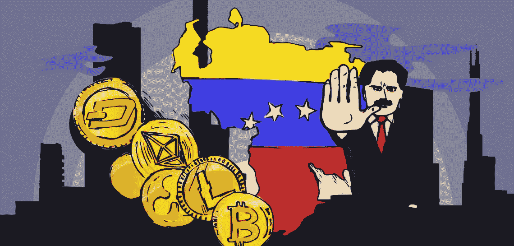
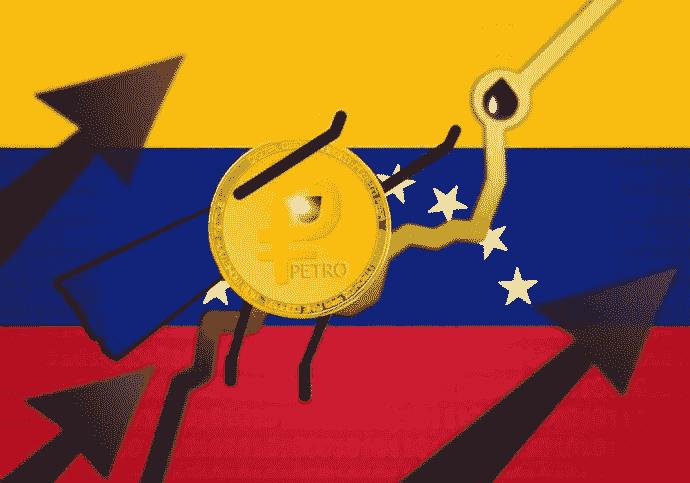

# 委内瑞拉新的加密法律框架生效。

> 原文：<https://medium.datadriveninvestor.com/the-new-crypto-legal-framework-of-venezuela-comes-into-force-18d9414459a5?source=collection_archive---------22----------------------->

委内瑞拉新的加密货币法案已于 1 月 31 日正式生效，为该行业建立了а法律框架。该法令发布在政府官方媒体 Gaceta Official 上。

该文件名为“关于加密资产综合系统的组织法”，包含 63 条。它给出了基本加密术语的定义，简而言之，区块链，像加密资产，密码学，采矿，等等。它引入了主权加密资产的概念。

该法令还规定采矿实体和密码交易所必须有许可证，并对无照经营活动处以罚款。

这项新法案授权 2018 年成立的国家加密安全机构 Sunacrip 检查该国境内所有与加密相关的活动。根据第 11 条，该机构将能够监测交易所，数字矿工，以及任何其他可能有助于调解委内瑞拉加密市场的金融服务。

此外，同一篇文章指出，Sunacrip 将控制委内瑞拉境内所有与加密相关的活动的“创建、发布、转移、商业化和交换”。

此外，第 28 条为加密货币初创公司引入了许多不同的新型许可证，这取决于他们管理的加密资产类型、交易量和其他标准。据报道，Sunacrip 将确定加密货币公司的公共费用，并将考虑所有的许可证申请。

如果违反了许可规则，或者与加密相关的公司没有在 Sunacrip 正确注册，所有者将被处以 1 至 3 年的监禁，并被处以价值 3000 至 6000 美元的主权加密资产罚款。

这项新法令还规定，如果采矿公司不遵守新出台的规则，Sunacrip 将检查甚至没收其设备。

除此之外，该法令中没有提到 2018 年推出的委内瑞拉加密货币 Petro。

**我们，** [Biditex](https://medium.com/@biditex) 团队，每天发布有关其新闻的加密相关文章、每周市场回顾和信息性文章。

*如果您想了解更多，请访问 BIDITEX 页面并提出您的问题，关注我们的* [*推特*](https://twitter.com/biditex_com) *，* [*脸书*](https://www.facebook.com/biditex/) *，* [*中型*](https://medium.com/@biditex) *，* [*电报*](https://t.me/biditex%20%28edited%29) *等。投标变更同***。**