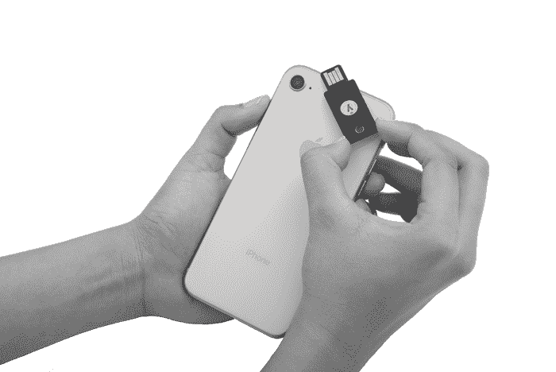
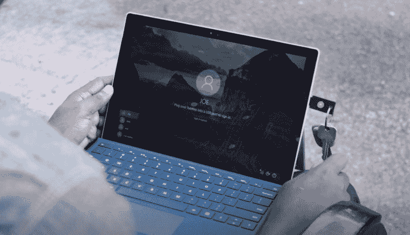
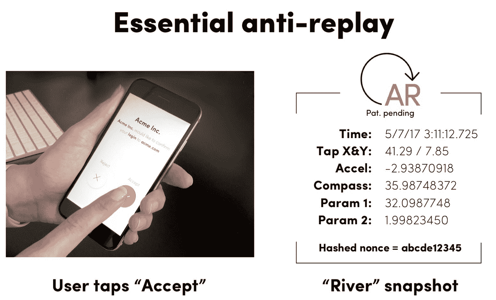
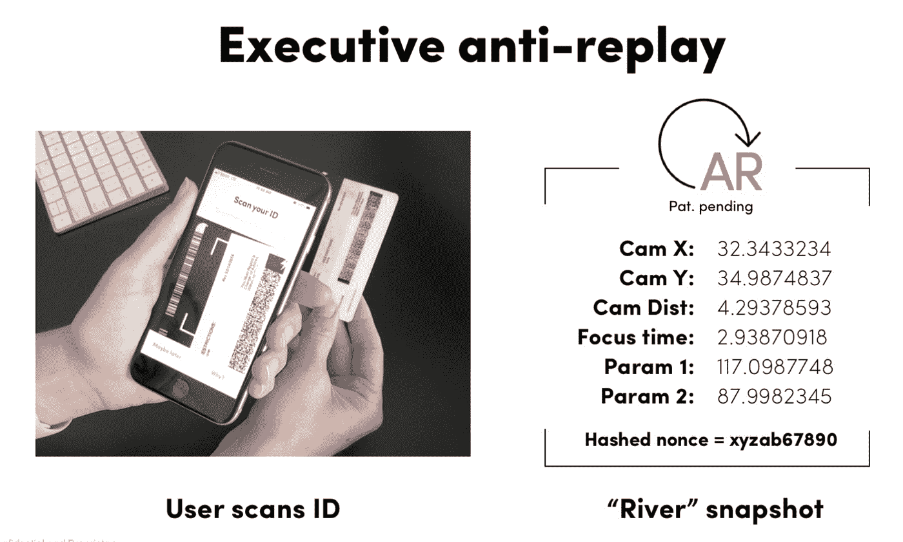

# 无摩擦身份访问管理的新面貌

> 原文：<https://medium.datadriveninvestor.com/the-new-face-of-frictionless-identity-access-management-a85214de2d29?source=collection_archive---------7----------------------->

首先，只有用户名。然后是用户名和密码。然后是多因素认证(MFA ),它需要你知道一些东西，比如用户名和密码；您拥有的东西，例如一次性密码(OTP)生成器令牌；或者你是什么，比如使用你的指纹或视网膜扫描的生物识别技术。现在，无摩擦的身份访问管理(IAM)是“每日一汤”,因为公司努力使 MFA 对最终用户来说更加轻松。我与之交谈过的许多人将 MFA 在企业和 web 应用程序中的缺乏采用归因于它给最终用户带来的大量摩擦。

例如，FIDO 2 协议现在已经由微软在最新的 Windows 10 春季版本中实现，允许用户使用 FIDO 兼容的硬件密钥，如 [Yubikey](https://www.yubico.com/) 和 [NXP](http://www.nxp.com/) 来验证 Windows，而不必键入他们的用户名和密码。

作为我上一篇关于企业中密码的[死亡](https://www.linkedin.com/pulse/dear-password-its-me-you-alissa-valentina-knight/)主题的文章的后续，这篇文章介绍了我为即将发表的 [Aite Group](http://www.aitegroup.com/) 关于企业中的 IAM 的研究论文所研究的新解决方案，该论文将密码作为一种身份验证的形式删除。

其中一些上市的解决方案包括 [Trusona](http://www.trusona.com/) ，它专注于为用户提供无摩擦的工作，同时还使用无密码双因素身份认证来实现身份认证和身份验证，不需要用户 ID 和密码，甚至不需要输入密码。Trusona 甚至通过执行远程政府颁发的身份检查来实现身份验证，例如，允许用户只需拍下他们驾驶执照背面的照片，然后根据政府部门的数据库进行检查，并根据记录进行自拍照片匹配。

有趣的是 Trusona 如何实现反重放技术，当用户按下应用程序中的按钮时，记录用户手指在屏幕上放置的确切坐标。然后对其进行哈希处理和随机数处理，并通过身份验证发送到 Trusona 的服务器。如果 Trusona 服务器再次以完全相同的坐标接收到该认证的第二次“重放”,它将阻止该认证的发生。

更有趣的是，当用户拍摄其 ID 的照片并通过应用程序将其发送到 Trusona 验证服务器时，该应用程序会记录 ID 在相机前放置位置的 X 和 Y 坐标、ID 与相机的距离、相机对焦设置和其他值，然后这些值也会被哈希和 nonced。如果 Trusona 收到使用这些相同参数的另一个身份验证请求，身份验证将被拒绝。Trusona 技术对于实施该技术的管理员来说更是轻而易举，通过调用 [Trusona](https://www.trusona.com/) 云服务器的 SDK 实现轻松集成，避免管理员必须实施任何本地设备或软件安装。

我最近还有幸在我最近的一集《LeetSpeak》中采访了 [StrongKey](http://www.strongkey.com/) 的 Nicole Culver 和 Arshad Noor，我们讨论了他们将 PKI 实施到 web 应用程序中的解决方案，该解决方案还提供静态数据加密、传输中的加密，甚至在他们的设备中提供了硬件安全模块(HSM)选项，用于保护 web 应用程序，还消除了传统的用户名和密码验证。

事实是，随着最近发生的大规模密码泄露事件，如雅虎发生的[10 亿帐户用户名和密码被盗](https://www.nytimes.com/2016/12/14/technology/yahoo-hack.html)事件，在企业的 Active Directory 域中通过密码对员工和 web 应用程序进行身份验证的单一因素身份验证时代正在迅速消失，成为历史。随着不断增长的 IAM 市场中出现了一系列新的解决方案，例如来自 [Okta](http://www.okta.com/) 、 [Trusona](http://www.trusona.com/) 、 [StrongKey](http://www.strongkey.com/) 和 [Duo](http://www.duosecurity.com/) 的解决方案，这些解决方案也支持跨本地和云部署的身份验证，黑客开始追逐剩余的落后者只是时间问题，这些落后者将在下一次入侵中成为头条新闻，因为他们未能跟上这些新解决方案的潮流。

关于艾丽莎·奈特

我是 Aite Group 的高级分析师，通过评估行业趋势、创建细分分类、确定市场规模、准备预测和开发行业模型，对影响金融服务、医疗保健和金融科技行业的网络安全问题进行重点研究。我通过公正、客观和准确的研究和内容开发，为这些行业提供网络安全市场的联合和定制市场研究、竞争情报和咨询服务。根据我对当今影响这些行业的当代网络安全问题的研究，我撰写研究报告和白皮书，并提供咨询服务，包括询问、简报、咨询项目、研究结果演示以及预约演讲，我经常在每年的网络安全会议、研讨会和圆桌会议上发表主题演讲。