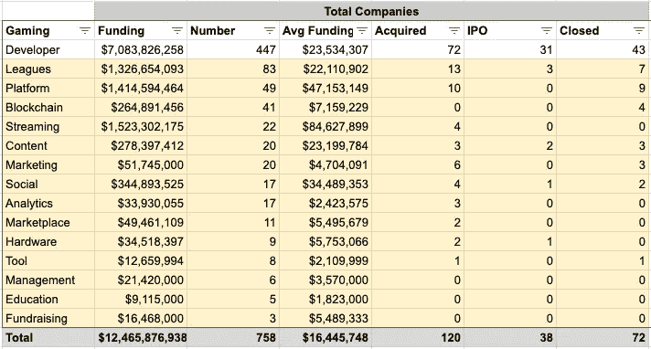
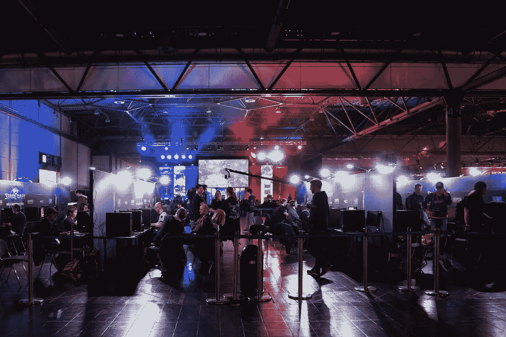

# 新的游戏产业

> 原文：<https://medium.datadriveninvestor.com/the-new-gaming-industry-85be2d3070a0?source=collection_archive---------8----------------------->

既然我们已经对游戏产业有了宏观的了解，对游戏开发者如何发展有了深刻的认识，我想把重点放在游戏生态系统的其他部分。这是一个由电子竞技推动的全新行业。我按照功能、特性和用例来划分更大的类别。较小的类别，我只是试图突出趋势或独特的创业活动。下面是游戏开发者之外的所有这些类别的图表。

# 游戏联盟

这一类别关注的是在任何形式的玩家之间产生竞争的平台或服务。这一类别在许多方面都有所不同，我包括电子竞技团队、梦幻联盟、在线和离线游戏锦标赛以及举办比赛的组织。这些创业公司将引领电子竞技的未来，以及它们的货币化方式。

 [## 值得购买的 4 大人工智能股票及其原因——数据驱动型投资者

### 人工智能(AI)在 2019 年继续进入大众意识。通过应用程序…

www.datadriveninvestor.com](https://www.datadriveninvestor.com/2019/03/06/top-4-artificial-intelligence-stocks-to-buy-and-why/) 

**功能**

本节重点介绍如何促进竞争。大多数联盟都提供现场比赛或数字比赛。比赛范围从一对一到大型锦标赛。许多允许玩家免费竞争，现金或奖品。联赛确保他们是一个值得信赖的第三方来监督有趣但公平的比赛。这一类别的初创公司如何促进竞争的例子:

**1 —针对游戏玩家**

*   [四分卫](https://www.quarterback.gg/)让你为你最喜欢的影响者打球。影响者创建他们的观众可以加入的俱乐部。一个影响者的俱乐部可以与其他影响者的俱乐部竞争。
*   Unikrn 提供赌博服务，允许观众对电子竞技比赛下注。他们也有基于游戏中完成的事件或动作的游戏内竞赛。
*   [Challengeme](https://www.challengeme.gg/) 帮助玩家在几秒钟内设置一个自定义游戏，并挑战影响者。
*   像 [HalaPlay](https://www.halaplay.com/) 、 [Dream11](https://www.dream11.com/) 、 [DraftKings](https://www.draftkings.com/) 、 [Fanduel](https://www.fanduel.com/) 、 [Winview](https://www.winviewgames.com/) 等大多数幻想联盟都允许玩家每天对各种运动和获胜标准下注。
*   [FaceIT](https://www.faceit.com/) 和 [Mogul](https://mogul.gg/) 每天都举办买入费在线锦标赛。

**2 —针对组织者**

*   [FaceIT](https://www.faceit.com/en) 和 [Skillz](https://www.skillz.com/) 为游戏开发者提供了必要的工具来将配对、比赛和联盟整合到他们的游戏中。玩家可以在他们正在玩的游戏中争夺免费、现金或奖品。
*   Smash.gg 帮助大学俱乐部、国家电子竞技组织或支持游戏玩家的品牌创建和管理锦标赛或联赛。
*   [PlayVS](https://www.playvs.com/) 帮助高中建立电竞队，鼓励学生参赛。

**功能**

本节重点介绍联盟提供的额外津贴，以推动球迷参与和更多的比赛。这部分需要大量的服务和社区建设。以下是一些例子:

*   大部分联赛都是基于赛事的。他们举办比赛、锦标赛、聚会或训练营。N3rd St Gamers 举办训练营、聚会、锦标赛等活动。他们还为职业电子竞技玩家创建了美国东部联盟。像古墨这样的初创公司每天都会举办在线锦标赛。
*   许多联盟都在建造自己的竞技场来举办自己的比赛，并为当地人提供一个游戏中心。大多数联盟试图与当地游戏中心合作举办比赛。 [N3rd St Gamers](http://nsg.gg/) 在芝加哥特区和费城建造了竞技场。 [Winstrike](https://winstrike.gg/) 在莫斯科有一个竞技场和休息室，里面有超过 115 台电脑。超级联赛游戏公司实际上与顶级高尔夫球公司合作，在他们的设施内举办比赛。ESforce 在莫斯科开设了一个名为与太竞技场的大型竞技场，拥有 1000 多个座位、休息室等设施。
*   *奖励*:大多数联赛提供现金或其他奖励的组合，由赞助商或球员/观众入场费支持。为了增加参与度，联盟还向观众和玩家提供抽奖奖励。[四分卫](https://www.quarterback.gg/)向顶级玩家发放莱佛士，他们可以赢得皮肤和游戏道具。 [Challengeme](https://www.challengeme.gg/) 每周提供抽奖活动。大多数梦幻联盟提供促销活动，如果玩家输掉赌注，可以退款。
*   *玩家协助*:联盟希望确保玩家能够公平竞争，拥有获胜的所有必要工具，并在他们的平台上保持参与。玩家休息室玩家可以和技能相似的对手进行比赛，并提供各种各样的游戏。斯基尔兹提供玩家忠诚度计划。 [Challengeme](https://www.challengeme.gg/) 帮助玩家在各种训练地图上追踪他们的进度，并查看他们如何随着时间的推移而提高。在这里，你可以看到管理和分析等类别与联盟相融合。
*   *反作弊*:这是联赛最重要的特点之一。作弊尤其是为了现金奖励可能是一个大问题。由于作弊，FaceIT 平均每月禁止 1500 名选手参赛。很多联赛都提供反作弊的解决方案，如果不提供，以后会成为大问题。

**用例**

这一部分集中在消费者联盟试图瞄准的类型。所有联盟都致力于在玩家群体中创造竞争。他们如何赚钱各不相同。以下是几个联盟针对谁的例子:

*   似乎有少数联盟使用他们的平台来发展或招募顶尖的电子竞技玩家。 [N3rd St 游戏玩家](http://nsg.gg/)、 [Winstrike](https://winstrike.gg/) 和 [ESforce](https://esforce.com/) 各自都有自己的电竞战队。有些人甚至在他们的平台上推广他们团队的流。 [Smash.gg](https://smash.gg/) 没有团队但是帮助玩家寻找自由球员。
*   *开发者* : [FaceIT](https://www.faceit.com/en) 和 [Skillz](https://www.skillz.com/) 专注于销售可以整合到开发者游戏中的联盟平台。它们有助于促进开发商游戏中的博彩和现金奖励竞赛。 [Winstrike](https://winstrike.gg/) 和 [ESforce](https://esforce.com/) 建立了营销机构和视频制作工作室，以迎合开发商、品牌和活动组织者的需求。
*   品牌:几乎所有的联赛都在努力让品牌赞助他们的比赛或者给他们的用户非现金奖励。
*   *影响者*:为了建立曝光率，联盟希望影响者在他们的平台上参与或竞争。Skillz 向有影响力的人支付费用，让他们在自己的频道上举办锦标赛。
*   *组织者* : [Smash.gg](https://smash.gg/) 向任何举办比赛或竞赛的人提供活动管理软件。

***有什么重要的？***

这是一个令人兴奋但竞争极其激烈的行业，因为它还很早。秘方是创建一个社区，让玩家和观众不断回来。为了赚钱，联盟专注于赞助/广告、买入费游戏量或“鲸鱼”博彩。专注于购买在线游戏的联盟似乎取得了成功。例如， [Skillz 通过允许开发者创建游戏内赌博锦标赛](https://venturebeat.com/2018/09/18/skillz-hits-400-million-revenue-run-rate-with-mobile-esports-platform/)获得了 4 亿美元的收入。现场锦标赛看起来很难扩大规模，[超级联赛博彩公司报告 2017 年销售额仅为约 20.1 万美元，亏损约 1300 万美元](https://www.sec.gov/Archives/edgar/data/1621672/000165495419000144/slgs1-jan2019.htm)。[最大的赢家是开发商特许经营或提供他们热门图书的媒体权利。团队也为他们的团队带来了巨大的收入。2018 年，团队 SoloMid 的预计收入为 2500 万美元。](https://www.forbes.com/sites/mikeozanian/2018/10/23/the-worlds-most-valuable-esports-companies-1/#765595046a6e)电竞幻想联盟将以各种独特的方式与流媒体平台融合。联赛的未来将继续关注围绕热门开发商头衔的可持续、面向社区的竞赛。你也将开始看到休闲手机游戏竞赛和锦标赛的增加。

**值得关注的顶级游戏联盟初创公司:**

[N3rd 街头游戏玩家](http://nsg.gg/)、 [PlayVS](https://www.playvs.com/) 、[格斗电竞](https://www.gamesindustry.biz/articles/2018-10-17-fighting-esports-group-closes-usd15m-funding-round)、 [Winstrike](https://winstrike.gg/) 、[玩家休息室](https://playerslounge.co/)、[四分卫](https://www.quarterback.gg/)、 [Skillz](https://www.skillz.com/) 、 [Unikrn](https://unikrn.com/) 、 [Smash.gg](https://smash.gg/) 、 [Battlefy](https://battlefy.com/) 、 [FaceIT](https://www.faceit.com/en) 、[挑战电竞](http://challengeme-esports.com/)

# 游戏分析

这一类别专注于为游戏玩家、发行商和开发者构建分析工具的初创公司。

**功能**:

本节将重点介绍初创公司获取和分析数据的独特方式。

**1 —游戏改进**

大多数分析工具都专注于帮助玩家提高他们在热门游戏上的表现。大多数分析工具使用开发者 API 来提取游戏数据。以下是用于分析游戏的其他方法:

*   像 [Blitz](https://blitz.gg/) 和 [Visor](https://www.visor.gg/) 这样的初创公司创造了计算机视觉分析工具。你可以把你的游戏放到他们的平台上，他们会提供实时分析和推荐。
*   [GOSU.ai](https://gosu.ai/) 从游戏回放中提取鼠标运动，以提供反馈并检测作弊行为。他们还创造了一个为游戏提供推荐的机器人。
*   [DOJO Madness](https://dojomadness.com/) 为游戏分析提供桌面和移动应用。

**2 —行业分析**

有几家初创公司在追踪宏观游戏数据。他们的目的是帮助游戏工作室、发行商和电子竞技团队跟踪他们活动的范围和参与度。一个例子是[re table](https://repable.com/)，他跟踪社交和广播统计数据，以提供关于游戏标题、流媒体、团队和锦标赛的见解。

**功能**:

本节重点介绍所提供的分析功能和广度。

**1 —游戏改进**

大多数分析工具提供赛前、赛中和赛后分析，以帮助玩家做出最佳决策来赢得游戏。这可能是一个灰色地带，因为有关于作弊的推后。一些工具实际上提供了在玩游戏时抓骗子的方法。示例分析包括:

*   [Visor](https://www.visor.gg/) 使用覆盖图、视觉警报和音频提示的直观组合，在正确的时间显示可操作的信息，以便玩家可以动态改进
*   GOSU 让玩家在模拟器上训练。他们也有位置，抢劫，空投，武器，瞄准建议。他们提供反作弊解决方案和一个人工智能来确定谁最适合你的团队。
*   L2P 发布最新比赛和冠军的元数据。他们还提供游戏的原始统计数据，并帮助识别玩家的弱点。他们甚至举办自己的锦标赛。
*   DOJO 会追踪对手的倾向，并提供赢得比赛的推荐工具。他们还允许你跟踪你的朋友分析。
*   Mobalytics 不仅提供了广泛的统计数据，还发布了关于游戏策略的信息图表，以帮助玩家做好准备。

**2 —行业分析**

大多数工具要么是帮助确定改进游戏的方法，建立你的玩家档案，要么是了解开发者的游戏在整个生态系统中的影响力。例子包括:

*   [陀螺仪](https://gyroscope.cc/)提供对群组、游戏内动作触发、事件数据、A/B 测试等的分析。目的是帮助游戏开发者提高游戏参与度。
*   [GameAnalytics](https://gameanalytics.com/) 追踪工作室游戏的表现，帮助开发者提高游戏参与度。
*   5Rocks 在被收购之前，为不同类型的游戏提供了详细的用户分析。其目的是支持新游戏的开发和营销。

**用例**

本节重点介绍分析工具的目标消费者。

*   *游戏*:大部分游戏分析工具都是迎合电竞玩家的。无论现在最流行的游戏是什么。示例[遮阳板](https://www.visor.gg/)侧重于看守； [GOSU](https://gosu.ai/) 专注 Dota 2、CS:GO、PUBG [L2P](https://l2p.game/#/en) 专注 Dota 2 和 LOL[道场](https://dojomadness.com/)专注于 Overwatch，CS:GO，LOL，Dota 2。
*   玩家技能:大多数分析工具似乎支持所有技能水平的玩家。还有的迎合职业球队。
*   *人口统计*:这些工具大多集中在最大的电子竞技国家。到目前为止，我看到支持的语言有英语、西班牙语、中文、俄语和亚洲其他一些语言。
*   开发者:我上面提到的一些初创公司迎合游戏开发者和广告商，帮助优化覆盖范围和参与度。

***为什么这很重要？***

随着电子竞技行业的发展，分析对于职业玩家的提高和开发人员构建更具吸引力的游戏来说极其重要。随着电子竞技比赛的现金奖励越来越多，管理作弊玩家和作弊游戏将成为这个行业在游戏改进之外的优先事项。此外，游戏分析是开发商、市场、管理层、联盟和团队都试图提供的功能，以使自己与众不同。你应该会看到新的游戏分析工具从许多角度弹出，但你也会看到这个类别的工具与许多其他类别的合作伙伴。最终你会看到游戏分析工具发展到提供他们自己的联赛、球队、管理工具等等。

**值得关注的顶级游戏分析初创公司:**

[Visor](https://www.visor.gg/) ， [L2P 有限](https://l2p.game/#/en)， [GOSU 数据实验室](https://gosu.ai/)，[道场疯狂](https://dojomadness.com/)，[陀螺仪软件](https://games.gyroscope.cc/)， [Mobalytics](https://mobalytics.gg/) 和 [HEROZ](https://heroz.co.jp/)

# 游戏平台

这一部分着重于游戏基础设施的性能、速度、发行或支付。更多公司可以在[游戏开发者类别](https://www.linkedin.com/pulse/evolution-game-developers-kyle-kling/)中找到。

**1 —分配**

这些初创公司认为现有网络或终端设备没有达到最佳游戏性能。每个人都专注于改善生态系统的不同部分。这里有几个例子:

*   *CDNs&VPN*:像 [Wtfast](https://www.wtfast.com/) 、 [Network Next](https://networknext.com/) 、 [Hast](https://haste.net/) 或 [Gaikai](/ www.gaikai.com/) 这样的创业公司，都专注于通过优化和稳定游戏服务器的连接来改善网络游戏的延迟。这可以通过 VPN 或改善内容网络连接。
*   *流媒体* : [Rainway](https://rainway.com/) 、 [Liquidsky](https://liquidsky.com/) 和 [Parsec](https://parsecgaming.com/) 正在建立游戏流媒体平台，让用户在任何地方的不同设备上玩他们喜欢的游戏。OnLive 曾尝试这样做，但烧完现金后关闭了。AppOnboard 采取了一种不同的方式，他们允许你在下载游戏之前进行演示。
*   *服务器*:这些工具帮助开发者提供游戏，而不必担心后端。[不太可能](https://improbable.io/)和 [Gameye](https://gameye.com/home) 正在帮助开发者建立基于当前玩家负载和历史模式动态扩展的服务器容量。

**2 —开发**

大多数游戏引擎/工具都是由开发者创建的。本节重点介绍帮助开发人员更快、更轻地构建更具沉浸感的游戏的工具。例子包括:

*   设计:这些是用来创造游戏的设计工具。 [DreamCraft](https://www.dreamcraft.com/) 帮助开发者在不编码、不绘图的情况下创作游戏。 [Quixel](https://quixel.com/) 和[absenia](http://www.absentiavr.com/)正在构建 3D 图形编辑器、动画和建模工具包。
*   堆栈:这些产品试图包含开发、优化和分发。[游戏封闭](https://www.gameclosure.com/)技术平台为游戏工作室提供创作、发行、优化、运营 messenger 游戏的工具。

**3 —付款**

这些初创公司为游戏构建支付网关、代币或加密货币。这是区块链创业公司的热门类别。这一类别主要与游戏生态系统之外的支付网关竞争。开发者似乎也在他们自己的游戏中构建了自己的支付工具。这里的初创公司必须让自己与众不同才能竞争。这里有几个例子:

*   Revlo 在被收购之前，帮助广播公司在他们的 Twitch 频道中建立定制货币，这样他们就可以奖励忠实的粉丝。
*   [beta table](https://corp.betable.com/)允许任何开发者在任何平台或设备上合法地在他们的游戏和应用中提供真钱游戏。
*   [Mo9](https://www.mo9.com/) 正在打造先玩后付费平台。这是一种独特的借贷形式。
*   [Ryu 区块链技术](https://ryu.games/)， [Playgame](https://its.playgame.com/) ， [EOT 协议](https://eontoken.io/)， [Gamedex](https://www.gamedex.co/) ， [Alphaslot](https://alphaslot.io/en/) ， [COCOS 区块链](https://www.cocosbcx.io/en/)， [Fuel Games](https://www.fuelgames.io/) ，[金恩](https://enjincoin.io/)都在帮助开发者整合区块链或加密货币作为开发者的支付工具。

**值得关注的顶级游戏平台初创公司:**

[表格](https://corp.betable.com/)、 [Mo9](https://www.mo9.com/) 、[网下](https://networknext.com/)、[梦工厂](https://www.dreamcraft.com/)、[不太可能](https://improbable.io/)、[未来集团](https://www.futureuniverse.com/)、 [Quixel](https://quixel.com/) 、 [Parsec](https://parsecgaming.com/) 、 [WTFast](https://www.wtfast.com/) 、 [LiquidSky 软件](https://liquidsky.com/)、[缺席](http://www.absentiavr.com/)和

# 社交游戏

本节重点介绍帮助游戏玩家相互交流的工具。

**功能**:

这一部分着重于玩家交流的方法。大多数创业公司的目标是提供简单的通信工具，不干扰你跨平台玩游戏。这部分与传统的 CPaaS 和视频解决方案竞争。这些工具是构建社区的核心，开发者、市场和联盟都在试图将这些工具整合到他们的平台中，以提高参与度。

*   *Messenger/Voice* :语音和聊天是大多数社交游戏工具提供的默认功能。 [Discord](https://discordapp.com/) 、 [Evasyst](https://www.evasyst.com/) 、[凯黑科技 Digital](http://www.kaiheikeji.com/) 等等都在为游戏玩家和开发者打造聊天/语音界面。
*   *Video* : [Bunch](https://www.bunch.live/) 和 [Evasyst](https://www.evasyst.com/) 提供了允许玩家通过视频聊天与他们的朋友进行广播、流式播放或游戏的工具。
*   虚拟现实(VR):[Teleporter](https://www.teleporter.tv/)和一些开发者正在创建虚拟现实世界，让游戏玩家可以观看流媒体播放，相互聊天，一起玩游戏。
*   *Feed* : [老越狗](http://www.laoyuegou.com/)正在创建一个社交媒体 Feed，让人们可以八卦博彩业。帕林戈创造了一群群类似于 subreddits 的群落。这部分与游戏内容部分合并。
*   *线下*:这些初创公司专注于亲自创建聚会和比赛。我们看到开发者创造了面对面的活动，但你会发现联盟使用这种策略最多。

**特征**:

本节重点介绍了帮助社交平台建立社区并鼓励使用其通信工具的附加功能。这里有几个例子:

*   整合:社交平台正与尽可能多的开发者合作，在他们的游戏中加入聊天功能。 [Discord](https://discordapp.com/) 和 [Bunch](https://www.bunch.live/) 都试图扩大他们在开发者中的存在，以便游戏玩家可以在游戏中使用他们的社交工具。
*   *平台:*这些社交工具试图跨游戏平台提供。 [Discord](https://discordapp.com/) 适用于桌面和移动设备，而 as [Bunch](https://www.bunch.live/) 只专注于移动设备。
*   社交工具也在为他们的受众建立市场。 [Discord](https://discordapp.com/) 提供游戏订阅和市场。Zengaming 还开发了一个交易皮肤和游戏产品的市场。
*   *身份*:社交工具让用户能够创建自己独特的个人资料。 [Evasyst](https://www.evasyst.com/) 允许用户创建个人资料页面，分享他们喜爱的游戏、玩家来源和游戏风格。 [Popbase](https://www.pop-base.com/) 允许你创建一个虚拟角色。
*   *内容*:许多工具试图在他们的平台上添加内容，以使其更具吸引力。凯黑科技数码公司提供教育帮助玩家训练。Gamewith 提供游戏的新闻和评论。

**使用案例:**

这一部分着重于社交工具是为什么类型的受众而构建的。这就是社交工具在传统 CPaaS 解决方案中的独特之处。

*   休闲游戏:这些是为休闲游戏玩家设计的工具。大多数社交工具都关注这一人群。Evasyst 更进一步，帮助游戏玩家加入朋友的实时游戏，发现新的聚会、团体和玩家。
*   *职业*:这些都是为了结识和组建电竞团队而建立的网络。这与联盟和游戏管理部分非常相似。Kaiheikeji Digital 是一个社交网络，游戏新手可以在这里与职业玩家见面。 [Zengaming](https://www.zengaming.com/) 是一家面向电竞玩家的专业网络。

**值得关注的顶级游戏社交初创公司:**

[不和谐](https://discordapp.com/)、 [Evasyst](https://www.evasyst.com/) 、 [Bunch](https://www.bunch.live/) 、[凯黑科技数字](http://www.kaiheikeji.com/)和[曾加明](https://www.zengaming.com/)

# 游戏流

这个类别主要关注帮助游戏玩家或开发者传播他们游戏的工具。这部分与社会融合在一起。这是游戏玩家的首选内容。

**功能:**

本节重点介绍流媒体工具的广播方法有何不同。有一些开源广播解决方案，最著名的是 [OBS](https://obsproject.com/) 。大多数广播解决方案关注于流的简单性和避免干扰游戏性。以下是一些例子:

*   [Genvid](https://www.genvidtech.com/) 提供了一个 SDK，使开发人员能够创建并向直播观众提供广播。
*   [Mobcrush](https://www.mobcrush.com/) 帮助你流向所有其他平台，如 Twitch 或 Youtube。
*   [Medal](https://medal.tv/) 提供移动和桌面广播解决方案，此外他们还提供免费云存储。
*   [寿](https://shou.tv/)和[初寿](https://chushou.tv/)只专注于移动广播解决方案。

**功能**:

本节重点介绍有助于流媒体平台变得更具吸引力的功能。所有流媒体平台的目标都是成为玩家社区。几乎所有的流媒体平台都在游戏社交类别中提供直播和社交工具。功能包括:

*   影响者:为了建立社区，流媒体工具试图吸引影响者。用户可以购买礼物送给有影响力的人或现场彩带。 [Mobcrush](https://www.mobcrush.com/) 将帮助有影响力的人获得赞助机会。 [Boom.tv](https://boom.tv/landing) 允许你对游戏进行预测，并帮助有影响力的人从他们的观众身上赚钱。
*   *玩家控制:*为了鼓励更多的参与，流媒体工具允许观众控制他们想看的内容和/或控制游戏本身。 [Genvid](https://www.genvidtech.com/) 允许观众在观看电子竞技比赛时显示玩家/游戏信息，控制摄像头视图和游戏元素。 [Znipe.tv](https://beta.znipe.tv/) 提供独家球员视角、带地图的多视点以及追踪同时进行的其他比赛的能力。Twitch 提供人群控制，允许观众帮助或阻碍 streamers 游戏的进行。
*   *广告*:流媒体平台正在将广告整合到他们的平台中。 [Genvid](https://genvidtech.com/) 支持目标广告和营销元素的嵌入。 [Mobcrush](https://www.mobcrush.com/) 帮助流媒体获得赞助，他们在流媒体中添加广告，可以随时触发。
*   *联赛*:一些流媒体平台允许观众在球员身上下注，让球员参加比赛。你会在联赛中看到更多。 [Boom.tv](https://boom.tv/landing) 允许观众对玩家下注，赢取奖品。
*   *流媒体工具*:这些工具帮助流媒体工具改善观众的观看体验。这个类别包括我在上面的玩家控制中提到的工具。其他例子还有， [Plays.tv](https://plays.tv/) 允许流媒体工具标记关键事件，并且必须查看比赛中的场景。[勋章](https://medal.tv/)用热键帮助飘带记录。 [Boom.tv](https://boom.tv/landing) 提供即时回放。
*   *内容*:较大的流媒体平台正在其平台内创建语音和独家内容。 [Twitch](https://www.twitch.tv/) 正在创建一个音乐库。 [Medal](https://medal.tv/) 提供赛后剪辑和社交反馈。类似于传统的体育网络，Mixer 制作他们自己的评论游戏的节目。 [Znipe](https://beta.znipe.tv/) 提供独家比赛和锦标赛数字通行证。

**用例:**

这一类别侧重于流媒体平台的目标用户。流媒体平台开始扩展到非游戏内容，以吸引新的用户群或让游戏玩家在他们的平台上停留更长时间。例子包括:

*   [Panda.tv](https://www.panda.tv/) 和[楚手](https://chushou.tv/)上传娱乐频道。
*   DouyoTV 提供教育、娱乐和新闻。

**值得关注的顶级游戏流媒体初创公司:**

[楚手](https://chushou.tv/)， [Genvid 科技](https://genvidtech.com/)， [Boom.tv](https://boom.tv/landing) ， [Plays.tv](https://plays.tv/) ， [Mobcrush](https://www.mobcrush.com/) ，[龙珠卫视](http://longzhu.com/)。

# 游戏教育

本节涵盖了帮助玩家成为更好的游戏玩家的服务。这一类的创业公司为数不多。大多数教育内容是由社交网络上的流媒体提供的。以下是一些亮点:

*   教育平台主要是面向服务的。
*   一些职业玩家分享建议，类似于大师班的形式。
*   有一些平台提供 P2P 培训建议。
*   大多数教育平台专注于选定的几个游戏——LOL、堡垒之夜、炉石、CS:GO。

**值得关注的顶级游戏教育初创公司:**

[玩家唤醒](https://www.gamersensei.com/)

# 游戏筹款

这一部分涵盖了帮助游戏开发者筹集资金来创建他们的游戏的服务。这个类别对于独立游戏开发者来说很重要。筹款平台的共同趋势是让贡献者参与进来，成为开发过程的一部分。所有的融资平台在开发商可以将他们的项目上市之前都有一个严格的审查过程。这一类别的一些亮点:

*   [图](https://www.fig.co/)为独立开发者创造了 Kickstarter 式的融资方式。如果一个开发商没有达到它的筹资目标，开发商就得不到任何资本。Fig 也开发自己的游戏。
*   [Brightlocker](https://www.brightlocker.com/) 与 Kickstarter 功能相同，但贡献者购买代币来资助游戏。如果没有达到筹款目标，开发商仍然可以继续捐款。Brightlocker 显示游戏开发状态，贡献者可以参与游戏的创建。
*   [Matcherino](https://matcherino.com/) 专注于电子竞技比赛和团队的众筹。他们建立平台，帮助组织者管理对奖池的捐赠或贡献。

**值得关注的顶级游戏融资初创公司:**

[匹配编号](https://matcherino.com/)和[图](https://www.fig.co/)

# 游戏管理

本节重点介绍管理电子竞技团队或比赛的平台。这些工具确保团队同步运作，管理他们的专业存在，他们可以找到最好的球员。这些工具对于即将到来的电竞玩家和现有团队都很重要。这些管理工具正在与联盟融合。管理工具的示例:

*   梦之队帮助球队寻找新球员。自由球员通过技能等级来验证和筛选。他们还帮助球员管理赞助、媒体权利、奖金、工资和转会。他们还提供游戏分析和在自己的游戏服务器上练习的能力。
*   ReadyUp 帮助团队管理他们的花名册、事件、消息、可用性和粉丝页面。他们允许玩家展示他们游戏的成就、统计数据和视频。
*   guided 为团队提供论坛、日历、牵线搭桥和文档共享工具。他们也有助于促进 scrims。
*   [Repable](https://repable.com/) 提供流媒体管理平台，帮助品牌和赞助商跟踪参与度。

**值得关注的顶级游戏管理初创公司:**

[梦之队](https://dreamteam.gg/)、[导游](https://www.guilded.gg/)和[预约](https://repable.com/)

# 游戏营销

本节重点介绍开发商/品牌营销、广告或工具，以推动粉丝参与。对于广告商来说，这似乎是一个艰难的领域，因为一些初创公司明显关闭了，包括 [IGA、Double Fusion](https://www.rapidfire.com/blog/what-happened-to-iga-worldwide-double-fusion/) 和 [MZ 的 Cognant。](https://adexchanger.com/mobile/machine-zone-shuts-down-its-dsp-lays-off-125-employees-including-media-buyers/)尽管如此，广告和赞助推动了游戏销售以外的大部分收入。粉丝参与、营销和广告方案也正在成为联赛的特色。你将会看到更多联盟间的合作或竞争。这一营销类别中的创业公司示例:

*广告:*该品类与传统 DSP、SSP、广告平台竞争。上面提到的一些广告网络已经关闭，因为他们有太多的出版商，没有专注于让出版商高兴。如果你看看 app store 对手机游戏的许多投诉，大多数人报告说太多的广告干扰了他们的游戏。以下是一些游戏广告初创公司:

*   [Adverty](http://www.adverty.com/) 专注于在游戏中植入广告，让游戏变得非常身临其境且无干扰。此外，它们还提供强大的分析功能，帮助广告商了解他们的广告投放是否成功。
*   [Ad2games](https://www.ad2games.com/) 是一家专注于游戏的广告公司，帮助吸引观众、打造网站品牌、电视和本地广告以及欺诈检测。
*   [Loots](https://loots.com/en) 专注于在流媒体播放期间制作视频广告。
*   Yodo1 正在中国创建一个游戏广告平台。此外，他们还帮助开发商在中国推出游戏。

*营销:*这一类别侧重于玩家分析、粉丝参与度和赞助商管理。这个类别将与游戏管理类别相融合。以下是一些营销平台的例子:

*   [法耐](https://www.fanai.io/)正在打造一个电竞赛事管理平台。他们帮助品牌进行受众分析。他们还帮助团队找到合适的赞助商。
*   [Ader](https://www.getader.com/) 专注于将游戏影响者与品牌联系起来。他们在直播、youtube、锦标赛、聊天情绪分析、内容创作等方面提供帮助。
*   Playnomics 在被收购之前，帮助营销人员和开发人员预测玩家的价值和行为，并通过定制的信息立即根据这些见解采取行动。
*   [货币化](https://www.monetizer.com/)帮助开发者根据行为激励向玩家提供奖励。
*   Indiboost 更像是一家公关公司，但他们帮助独立开发者创造压力。他们还帮助广告商和开发商与有影响力的人匹配。

**值得关注的顶级游戏营销初创公司:**

[FanAI](https://www.fanai.io/) 和 [Yodo1](https://www.yodo1.com/en/)

# 游戏市场

本节重点介绍销售游戏相关物品的市场。市场和出版商非常相似。他们试图通过其市场上销售的产品或如何围绕其市场建立社区来实现差异化。这一类别中一些独特的创业公司的例子:

*   Overwolf 创建了一个市场来出售游戏、工具、皮肤、mod 等等。他们的大部分商品都是免费的。似乎他们通过在出售的产品中展示广告来赚钱。为了围绕他们的市场建立一个社区，他们赞助了堡垒之夜挑战赛，并教游戏玩家如何开发应用程序。
*   [Robotcache](https://www.robotcache.com/) 帮助游戏玩家转售数字游戏。他们把市场建在了区块链上。为了建立一个社区，他们允许玩家挖掘硬币。
*   [Green Man Gaming](https://www.greenmangaming.com/) 提供传统 PC、VR 和 Playstation 游戏出售。他们通过博客、论坛和新闻编辑室建立社区。
*   Gameflip 是一个 P2P 市场，玩家可以在这里出售他们的游戏技能。此外，他们还出售游戏、收藏品、配件、游戏机、电影等。
*   Jump Gaming 为独立游戏提供订阅服务。
*   Blacknut 是一项付费游戏服务，你可以在任何设备上玩他们的游戏——电脑、安卓或电视。
*   [Humble](https://www.humblebundle.com/) 允许游戏玩家在购买游戏时支付他们想要的费用。
*   [DMarket](https://dmarket.com/) 和 [Stardust](https://stardust.gg/) 是一个位于区块链的市场，用于将虚拟物品转化为玩家之间可以交易的实物资产。

**值得关注的顶级游戏市场初创公司:**

[过狼](https://www.overwolf.com/)

# 游戏工具

此类别主要关注游戏玩家或流媒体工具，他们可以使用这些工具来提高游戏性能或在游戏中获得更多乐趣。一些例子包括:

*   Athenascope 提供计算机视觉工具，重现你游戏的精彩部分。
*   [Minkonet](https://www.minkonet.com/) 创建 3D 回放解决方案。
*   [混合尺寸](https://mixeddimensions.com/)提供 3D 打印游戏动画。
*   Pwnwin 创建了允许观众投票决定游戏中事件是否发生的扩展。
*   Facemoji 为游戏直播和视频聊天创建头像。

**值得关注的顶级游戏工具初创公司:**

[雅典娜望远镜](https://athenascope.com/)和 [Facemoji](https://facemoji.co/)

# 游戏区块链

区块链初创公司本可以被包括在其他类别中，但我将它们放在一个单独的类别中，只是为了突出它们。区块链初创公司在建立游戏玩家社区和与开发者的关系时，仍然面临所有其他类别面临的同样挑战。除了强调他们的目标行业，我不会详细介绍他们如何区分。

*   [Ryu 区块链技术](https://ryu.games/)、 [Playgame](https://its.playgame.com/) 、 [EOT 协议](https://eontoken.io/)、 [Gamedex](https://www.gamedex.co/) 等等，都是在为游戏开发者创造支付或者交易工具。这将包括在平台类别中。
*   [Stardust](https://stardust.gg/) 、 [Robotcache](https://www.robotcache.com/) 和 [DMarket](https://dmarket.com/) 正在建设市场。
*   [神话游戏](https://mythical.games/)、 [Dapper Labs](https://www.dapperlabs.com/) 、 [Alluminate](https://cryptopets.co/Home/) 和 [Lucid Sight](https://www.lucidsight.com/) 是将区块链融入他们游戏的开发商。
*   [Alphaslot](https://alphaslot.io/en/) 、 [COCOS 区块链](https://www.cocosbcx.io/en/)、[燃料游戏](https://www.fuelgames.io/)、[金恩](https://enjincoin.io/)都是开发者的搭建工具。它们属于平台类别。
*   [Capsl](http://capsl.cc/) 和 [UnikoinGold](https://unikoingold.com/) 是联赛的一部分。
*   分散土地是社会的一部分。
*   [Scorum](http://scorum.com/) 是游戏内容类别的一部分。

**值得关注的顶级游戏区块链初创公司:**

[神话游戏](https://mythical.games/)、 [Dapper Labs](https://www.dapperlabs.com/) 、 [Alphaslot](https://alphaslot.io/) 、 [EOT](https://eontoken.io/) 、 [Gamedex](https://www.gamedex.co/) 、 [Hash World](https://www.hashworld.top/en.html) 、[燃料游戏](https://www.fuelgames.io/)、[不可阻断](https://www.unblockable.com/)、 [chiliZ](https://www.chiliz.com/en/home/) 、 [DMarket](https://dmarket.com/) 、[去中心化](https://decentraland.org/)、 [FunFair Technologies](https://funfair.io/)

**注意**:我在这篇文章中没有包括硬件或内容。如果您对这些类别有任何疑问，请联系我。

# 结论

新的游戏产业令人兴奋。它仍处于起步阶段。有几个成熟的球员，但我认为有很大的空间来看到新的大球员。期待看到更多的比赛，社区，团队，联赛。

感谢您阅读我关于游戏行业的报告。我写这些文章是为了个人发展，也是为了帮助我们的基金做出更好的投资决策。分享它们的目的是鼓励投资者向游戏行业投入更多资金，并帮助游戏创始人想出新的方法来区分他们的平台。希望有帮助。如果有一些语法错误，我道歉。有任何问题，给我发信息。

