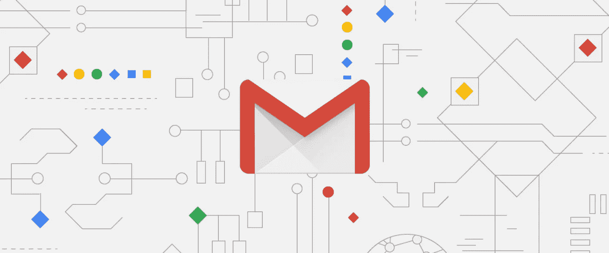
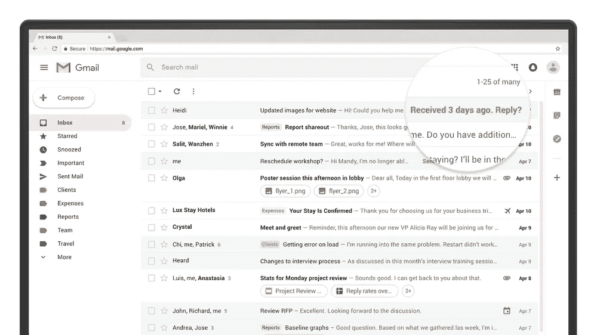
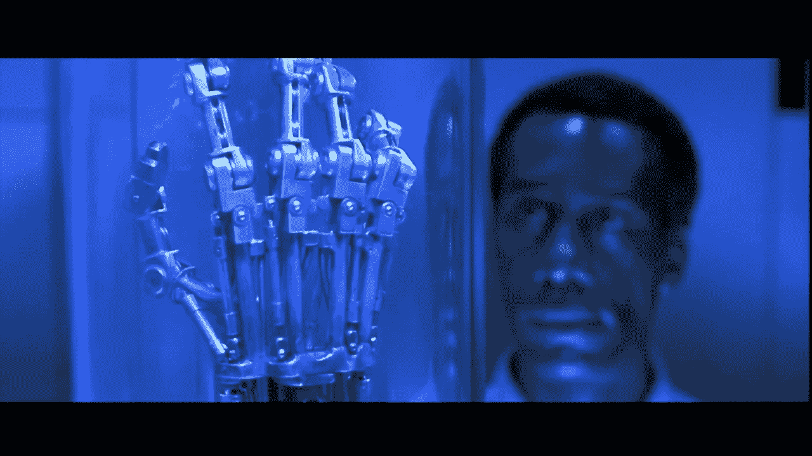

# 新的 Gmail 将预测人工智能引入了我们的收件箱，但智能撰写会让我们变得更笨吗？

> 原文：<https://medium.datadriveninvestor.com/the-new-gmail-introduces-predictive-ai-to-our-inboxes-but-will-smart-compose-make-us-dumber-c2854836a343?source=collection_archive---------5----------------------->

Behold! The Dawn of a New (Gmail) Era

随着地球自转的不可避免性，谷歌的新 Gmail 已经渗透到世界各地的收件箱中。新 Gmail 的设计美学更加全面和友好，但最显著的变化是谷歌使用预测人工智能的方式，这可能从根本上改变我们的交流方式。

三个突出的功能是 Gmail 的暂停邮件、创建邮件回复提醒和智能回复功能。在我看来，[的打盹功能](https://support.google.com/mail/answer/7622010)是一件显而易见的事情。这真的很有帮助，我很惊讶这没有更早的实现。多年来，我已经可以让 SIRI 提醒我一些事情，或者暂停 Outlook 通知。最后，我在 Gmail 中还有一个可靠的邮件跟踪系统，不仅仅依靠可爱的小明星。

同样， [Gmail 回复提醒](https://gsuiteupdates.googleblog.com/2018/05/gmail-remind-respond.html)到目前为止似乎非常有用。提醒就像一个小通知，在几天后弹出，查看你是否愿意回复电子邮件。Gmail 称之为“轻推”。就像电子邮件暂停功能一样，Gmail 轻推给我的感觉是管理收件箱和利用技术让我们的生活变得更轻松的自然进展。

The Gmail “nudge” function appears to be a particularly useful innovation.

Gmail 微推的唯一缺点是，它会让不可避免的“晚回复两个月”邮件变得更难写:“抱歉，这么晚才回复你！我完全失去了这封邮件的踪迹，由于某种原因，我的 Gmail 闪屏功能无法工作！”

你让我编织了一个多么复杂的谎言网。实际上，我可能不得不开始诚实地回应…“对不起，我这么晚才回复你！Gmail 提醒我回复，但说实话，我生活中还有更重要的事情要做！”

最热门的 Gmail 更新功能是[智能回复](https://blog.google/products/gmail/save-time-with-smart-reply-in-gmail/?_ga=2.58031343.491614532.1530557367-682164130.1523471784)和[智能撰写](https://blog.google/products/gmail/subject-write-emails-faster-smart-compose-gmail/)。这些功能虽然还处于初级阶段，但可能会对以后的电子邮件习惯产生重大影响。

Gmail 智能撰写和智能回复的意义在于，它将一些“写作”部分从撰写电子邮件中剔除。它对如何回复人们提出了实时建议(“听起来很棒，谢谢！”)或者会尽量帮你完成你的想法，在“午餐听起来不错……”之后问“你周三能见个面吗？本质上，这是自动纠正的下一个层次，但重点不仅仅是你的话语，而是你的意图。

有些人对这一发展并不感到兴奋。

作者约翰·布兰登以一种有点危言耸听的口吻为[公司](https://www.inc.com/john-brandon/gmail-is-finishing-my-sentences-for-me-were-all-one-step-closer-to-robot-armageddon.html?cid=sf01001)写道，“感觉人工智能已经走得太远了。”一篇 [Buzzfeed 文章](https://www.buzzfeednews.com/article/venessawong/gmail-auto-complete-smart-compose-creepy-amazing)在 Twitter 上发现一些人最初对这一新功能印象深刻，尽管更多人认为它“令人毛骨悚然”

Smart Compose in action. Apparently the Rise of the Machines will occur on Taco Tuesday.

现在，就人工智能目前的状态而言，确实没什么好担心的。预测人工智能对企业来说是一个非常有用的工具。为福布斯杂志撰稿的 Adi Gaskell 表示，有效利用人工智能进行预测性支持对企业来说是一种积极的力量。“通过大幅降低这种预测的成本，”盖斯凯尔写道，“人工智能不仅有望改善现状，还会引发对企业运营方式的反思。”

在 [Phonexa](https://phonexa.com/) ，我们利用人工智能的预测能力来创造更顺畅的[客户关系](https://phonexa.com/how-ai-can-improve-your-calls-and-increase-your-sales/)——利用[语音技术](https://phonexa.com/interactive-voice-response/)从呼叫者那里收集信息，并帮助电话代表管理来电。在这方面，我对预测人工智能的体验是非常积极的，而且没有任何侵入性。

Generic email-writing AI is a long way from “Judgement Day.”

但是谷歌人工智能机器人写电子邮件的想法引发了一些危险信号。与其说它们会导致像《终结者 2:审判日》中那样的自我意识天网末日，倒不如说这可能是迈向不同的反乌托邦的第一步——那是迈克·詹郅在 2006 年喜剧《T2》中想象的白痴政权。

如果人工智能突然将我们每天撰写的所有电子邮件和文本信件从我们的手中拿走，从我们的脑海中消失，会发生什么？当然，一些电子邮件已经成为无意识聊天的惯例，但是如果我们的电子邮件变得真正无意识会发生什么？

Aren’t emails mundane enough without leaning on bots for help?

在他为《快公司》进行的 Gmail 智能撰写的[试驾中，](https://www.fastcompany.com/90172296/i-let-gmails-new-ai-write-my-pointless-emails-for-me)[麦智信](https://www.fastcompany.com/user/mark-wilson)深入研究了这些自动回复的一般后果。他感叹说，人工智能机器人在用词上存在令人沮丧的雷同，并讽刺了由此可能引发的平庸对话:“你好吗？我做得很好。你好吗我做得很好。”

尽管语法不正确，但将所有这些写作交给机器的想法也意味着我们将剥夺自己一天中从事的所有写作。不再让我们的大脑在想出一个不那么普通的签名的简单行为中锻炼可能会导致萎缩，直到我们的大脑变得像*瓦力*中的[无助的人类](https://media.giphy.com/media/YaK75E3f2wkrC/giphy.gif)。

The pen and notebook: not yet historical artifacts.

写作对我们的记忆和精神健康很重要。已经有文献证明用纸和笔做笔记比在电脑上打字更有利于学习。在研究中，做笔记并写下来的学生在实时处理材料方面做得更好，使得以后回忆起来更容易。

至少当我们发电子邮件时，我们还在让大脑在某种程度上工作。打出回复这个简单的行为将我们与其他人联系在一起。我们考虑我们的单词和标点符号会如何影响收件人。

想象一下，如果我们从用纸和笔写字发展到在电脑上打字，再到仅仅点击或多或少概括了我们意图的单词，会发生什么。

如果你认为科技进步不能给写作习惯带来某些戏剧性的影响，那么请三思。今年早些时候，专家指出，由于无处不在的触摸屏技术，学校里的孩子们更难抓住铅笔。想想当这些孩子长大后，开始使用电子邮件提供商为他们撰写散文时会发生什么，这有点令人毛骨悚然。

Fact: only professional calligraphers can write a lowercase “z” in cursive.

此外，写作行为已经被证明对人类有好处。来自[的](https://twitter.com/gregoryciotti/)[帖子](https://www.helpscout.net/blog/benefits-of-writing/)格雷戈里·奇奥蒂分享了写作的一些心理益处，引用研究称，定期写作可以让我们[更快乐](https://www.linkedin.com/pulse/20130528121344-69244073-the-power-of-the-pen-can-writing-make-us-happier-healthier-and-more-productive/)，帮助我们[组织我们的想法](https://www.pickthebrain.com/blog/want-to-get-things-done-write-it-down/)，甚至[在困难时期提供安慰](https://journals.aom.org/doi/abs/10.5465/256708)。

诚然，这些积极的影响来自于比简单地写几封邮件更密集的写作——但是一点一滴都有帮助！

不知道 Gmail 的智能撰写和智能回复是否会受到大多数用户的欢迎，或者其他人(像我一样)是否会发现它同样令人分心和不安……并迅速禁用这些功能。

发送“谢谢”的能力一键回复当然不是世界末日。但是，如果没有其他事情，Gmail 的预测人工智能可以让我们暂停片刻，欣赏我们每天撰写的微通信——并考虑如果我们突然让它们消失会发生什么。