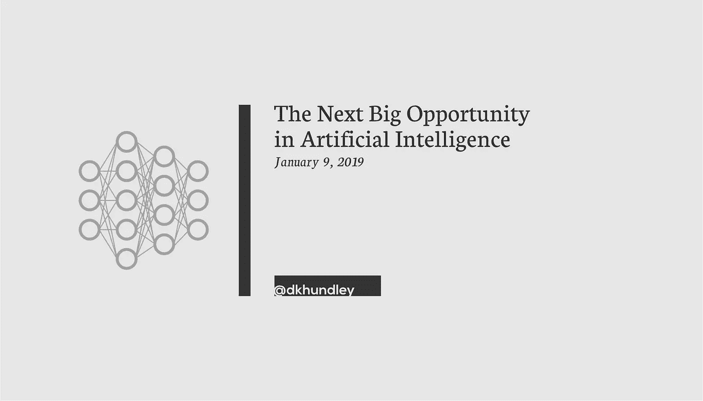
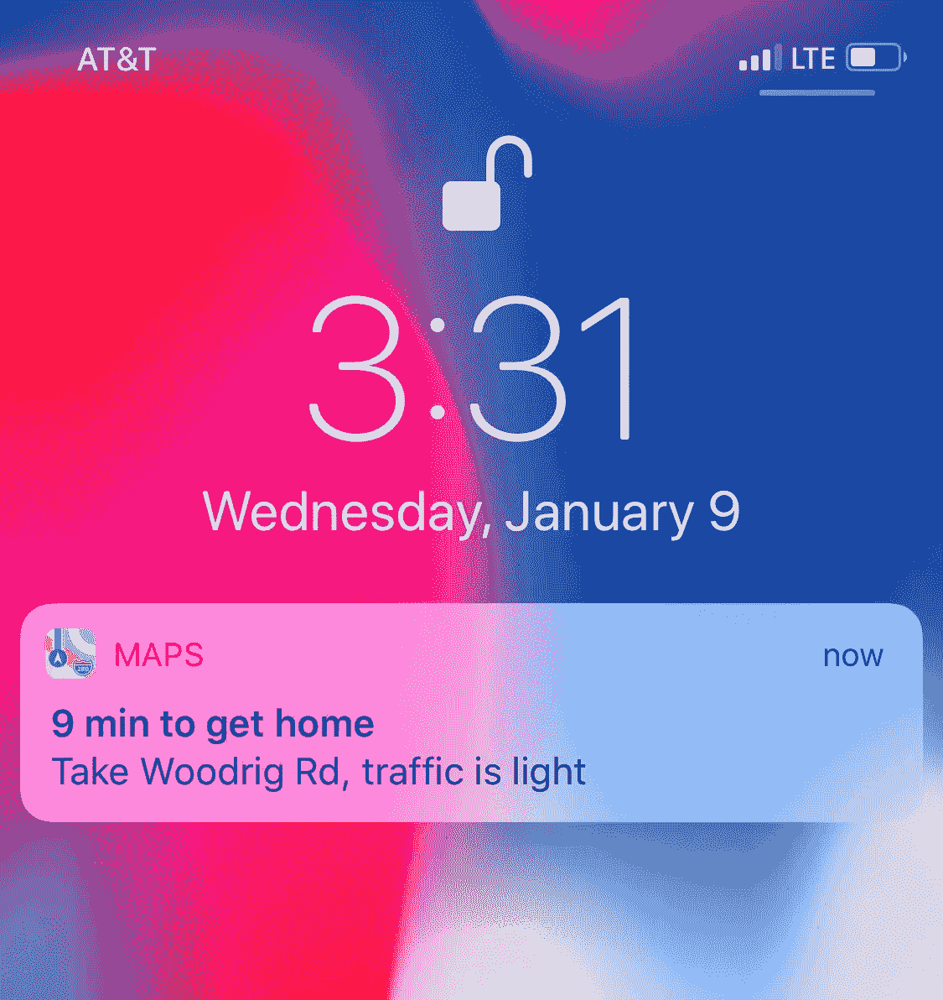

# 人工智能的下一个重大机遇

> 原文：<https://medium.datadriveninvestor.com/the-next-big-opportunity-in-artificial-intelligence-6d4d1f904ce0?source=collection_archive---------37----------------------->

不久前，苹果在 iPhone 上实现了一项功能，根据当前的交通状况，帮助你了解到达你经常去的地方需要多长时间。当我打开汽车时，当我的 iPhone 连接到蓝牙时，我看到一个类似这样的屏幕:

我不是 100%知道底层架构是如何工作的，但我猜测它是一个相对简单的基于机器学习的人工智能(AI)。每次你去一个地方，苹果都会在你的手机上(安全地)缓存这段历史，它会集体记住你在一周的特定时间最常去的地方。例如，在工作日的早上，它会告诉我去工作场所的方向，在周日的早上，它会告诉我去教堂的方向。

(有趣的是……在周四晚上，它会告诉我去我最喜欢的披萨店要花多长时间，那时我知道我必须停止吃太多披萨。)

我对此没有意见，因为虽然我不能 100%地确认一个真正的人没有监视我要去的地方，但是让一大群人手动推送所有这些方向建议是不可行的。我也不相信有人会对我多久去一次墨西哥小吃店感兴趣！

但显然，不是每个人都和我有同样的想法。最近，我的父母问我这个精确的功能，因为它开始出现在他们的手机上，虽然我试图解释它如何可能是由于机器学习，但他们仍然持怀疑态度。由于不了解底层技术，他们无法摆脱这种“盒子里的人”的概念。他们想完全关闭这个功能，害怕被一个真实的人跟踪。请注意，我的父母是最没有理由害怕被跟踪的人。任何人都能从他们身上看到我妈妈对看望孙子孙女的热爱和我爸爸对菜单的喜爱。

他们肯定不孤单。2018 年对 IT 界来说不是一个好年景，特别是在信息安全和人工智能领域。在反对脸书和谷歌的国会听证会之间，所有与俄国有关的事情，以及更多，媒体并没有描绘出一幅美丽的风景。所以对于像我父母这样不了解底层技术的人来说，他们只是偏离了媒体告诉他们的东西。

我讨厌这么说，伙计们，但 2019 年看起来不会好太多。我已经读过一些质疑人工智能的安全性和“令人毛骨悚然的因素”的文章，我打赌我们会在接下来的几个月里看到另一场国会质询。我根本不是一个猜测政治将如何向前发展的人，但这是一个我愿意打赌某种立法将在这里或多或少发生的地方。如果你真的逼我说出我认为真正会发生的事情，我会猜测，公司将被审计他们的算法模型，以分析哪些用户信息会使“秘方”发生。我确实希望国会相对合理，不要强迫公司透露构建人工智能解决方案的基本专有知识。

再说一次，我在黑暗中拍摄一些照片，但我认为这是我们正在建设的目标。谷歌、脸书和其他公司的声誉正处于历史最低点，我们可能只是触及了这些国会听证会的皮毛。马克·扎克伯格(Mark Zuckerberg)最近宣布，他 2019 年的个人目标是“主持一系列关于技术在社会中的未来的公共讨论”，这毫无帮助，老实说，这感觉很像一个有罪的人适时的过度补偿，不管他是否真的有罪。

国会的动作并不快，所以我们至少还有一年(如果不是两年)才会有所行动。也就是说，如果真的发生了什么，公司在此之前应该做些什么？

为了解释这一点，让我们来谈谈慈善:水。

慈善:水是一个由前夜总会发起人斯科特·哈里森创办的非盈利组织。在他的巨著*渴望*中，Harrison 描述了他在发现夜生活世界极度匮乏后，从发起人到非营利世界的旅程。哈里森恰当地指出，他的朋友并不特别喜欢向非营利组织捐款，因为人们真的不知道他们的钱会发生什么。因此,“慈善:水”采用了 100%模式，这意味着常规捐赠者的 100%捐款将直接用于实际成果(也就是打井),而非营利组织的行政资金则由另一组捐赠者提供。

在罗布·贝尔的 *RobCast* 播客中的一次采访中，贝尔问哈里森，他是如何让这些捐助者为非营利组织的行政方面提供资金的。他的回答完全正确:人们不太关心钱会发生什么，只要他们知道他们的钱会花在什么地方。

一句话，信任。

如果你对自己的所作所为开诚布公，人们会更加宽容和理解你的行为。Harrison 指出，对于慈善机构:水，人们实际上很乐意支付行政助理的工资，因为尽管这可能没有建造一口井那么“迷人”,但他们明白行政助理仍然在实现最终愿景方面发挥着作用。

现在，正如非营利组织缺乏信任一样，it 界也缺乏信任。实际上，这对 It 界来说可能更糟。你不会经常听到非营利组织因滥用捐赠基金而受到指责，但我觉得我们几乎每周都会听到一些关于 It 公司滥用用户数据的新消息。

我不想在这里显得冷漠或不人道，但这里有一个巨大的商机。**在一个信任短缺的世界里，一家公司理应公开其人工智能实践。**在意识形态上，你的道德罗盘应该指引你在商业行为上保持道德，但如果我不能迎合你的道德，我可以迎合你的底线。

一家公司可以通过多种方式实现这一点，我在这里分享一个想法。对于您实施的每个人工智能解决方案，您需要提前解释 a)人工智能解决方案将如何使您作为客户受益，以及 b)您的公司将哪些特定数据元素作为解决方案的输入。你不必分享你的“秘方”专有的内部工作原理，所以从知识产权的角度来看没有什么可担心的。

除了这个解释之外，还要为用户提供退出解决方案的机会(例如，说明、切换)。

有些人可能会因为害怕每个人都关闭解决方案而对最后一个问题感到恐惧，但回想一下慈善机构:水模型。这些人完全同意资助行政助理，因为他们对自己的资金去向很坦诚。同样，**我敢打赌，如果你对你的人工智能解决方案透明，有意选择退出的人会少之又少。**

再说一次，我认为立法最终会强制这样做，所以你的公司最好在你还能做的时候利用它创造一个商业机会。它不一定要以我建议的形式出现。嘿，你们是有创造力的人；我相信你能想出一个更好的解决方案。

(再说一遍…我觉得把它当作一个商业机会很奇怪，但如果我们不断听到滥用数据的情况，整个道德争论显然不会有任何进展。)

这篇文章到此结束。我通常不会像这样推测具体的事情，所以我很好奇你是否同意或不同意这些想法。或者你如何在你的人工智能解决方案中调整实现透明度的商业计划。下次再见。