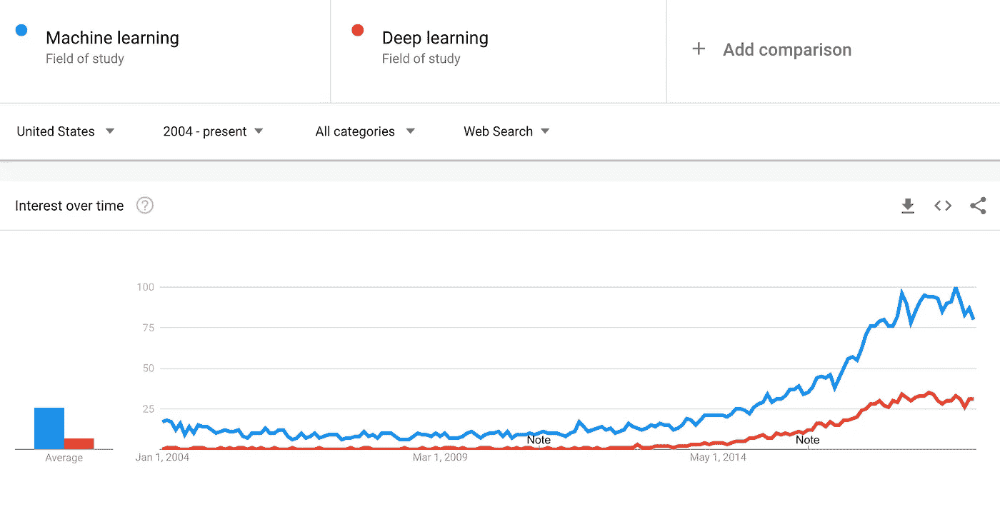

# 下一个大的技术表演将是人工智能牧马人

> 原文：<https://medium.datadriveninvestor.com/the-next-big-tech-gig-will-be-the-ai-wrangler-50cf23293fd?source=collection_archive---------6----------------------->

Photo by [Drew Graham](https://unsplash.com/photos/s4dfrh7hdDU?utm_source=unsplash&utm_medium=referral&utm_content=creditCopyText) on [Unsplash](https://unsplash.com/search/photos/artificial-intelligence?utm_source=unsplash&utm_medium=referral&utm_content=creditCopyText)

如果你在任何类型的公司技术岗位上，而*目前没有*绞尽脑汁考虑人工智能是否能融入你的业务，你会的。随着资本寻找应用技术的方法，人工智能实际上无处不在，新公司的增长意味着人工智能正以越来越有创意的方式出售，因为投资者支持的大批销售人员正摆开架势，将数百个方形钉子钉进圆孔。

每五个项目中就有一个会落地，有人会被指派去关注那些被购买并被批准整合到你的堆栈中的东西。虽然在几年内，可用产品的过剩将巩固成一个有形的市场，但人工智能的灵活性和便携性意味着它将继续灵活地应用于许多领域，确保学习应用程序将在未来许多年里不断出现在以前意想不到的领域。

We’re at peak AI in terms of buzzword usage

所有这些应用人工智能在学习时都需要监控，需要培训(特别是在部署时)，而且(最重要的是)需要与其他新技术一起接受审查。

这个世界需要新的技能和新的角色。最重要的是，这个角色的早期领导者将直接来自被人工智能打乱的工作岗位。随着各种工作岗位的减少或取消，这些新的角色将取代它们的位置(尽管数量可能不如以前)。

这个新角色就是 AI 牧马人。这是他们将要做的。

# **训练**

当从头开始推出一个新的人工智能工具时，大多数解决方案架构师会建议使用训练数据来启动学习过程。人工智能牧马人将在发布时管理这一点——通过法律和安全审查，然后打包训练数据供消费以训练模型，或者设置将数据发送到人工智能工具的协议。如果他们一开始没有使用训练数据，他们将需要建立协议以确保学习到正确的数据。

 [## 今年值得关注的人工智能趋势——数据驱动的投资者

### 预计 2019 年人工智能将取得广泛的重大进展。从谷歌搜索到处理复杂的工作，如…

www.datadriveninvestor.com](https://www.datadriveninvestor.com/2019/02/19/artificial-intelligence-trends-to-watch-this-year/) 

相反，他们需要确定人工智能工具不应该处理什么，这在很多情况下和它应该处理什么一样重要。它不应该做什么，应该设置什么异常，这样它就不会采取特定的行动？然后，他们将需要支持测试模型和运行点，看它是否达到预期的结果。它不会立即得到太多的权利，牧马人将需要提供额外的培训，时间和…

# **微调和质量保证**

人工智能爱好者会告诉你，这些是一劳永逸的工具——让它们运行足够长的时间，它们最终会成为你新的最好的朋友。事实上，就像任何人一样，他们需要定期检查。在角色的宏观层面上，牧马人(可能是牧马人的总监)需要审查人工智能如何对问题的答案进行聚类，以及如何根据过去和未来的指标进行总体表现。在事务级别，人工智能牧马人(比如人工智能牧马人 1 级)将进入特定的交互，询问各个集群，并通常管理工具来微调人工智能。如果一个问题的答案有轻微的错误或者有一些缺失的数据点，L1 牧马人将在交互点调整人工智能。L1 牧马人的全体干部将在成千上万个人工智能行动中分享学习时刻。

这仅仅是牧马人失业的过渡时期吗？不太可能。随着新趋势的出现，事件的发生，以及意外数据的到来，有必要让人工智能在粒度和宏观层面上对这些趋势做出反应。为获得最佳体验而进行的微调和质量保证从未停止。

# **裁判机器人打架**

争吵的“有趣”部分将是弄清楚如何裁判机器人打架。实际上，人工智能工具是在真空中构建的。每一个工具都是为一个离散的问题提供一个离散的解决方案，而不是与其他人工智能交互或考虑其他人工智能。它们是为生态系统建造的，运行在逻辑可以理解的系统上。其他独立运行的人工智能本质上是破坏性的，尤其是因为它们可能会产生反馈循环、转移注意力的结果，或者与其他人工智能的目标背道而驰。

在任何给定的时刻，在一个系统中可能会有几个在运行，并且所有这些都是由不同的实体按照不同的标准构建的。这些工具本质上是黑盒:算法秘方，很少有人能拯救最初的创造者。

在不知道人工智能如何运作的情况下，找到人工智能所产生的问题的解决方案，将是牧马人的工作。他们将建立规则(并监控这些规则)来调解这些机器人的交互。例如:当一个机器人执行一个操作时，它在 15%的时间内触发另一个机器人采取另一个操作，这将垃圾数据引入部门报告。扯皮总监和她的工程副总很生气，看不到趋势。牧马人将不得不寻找一种方法来缓解这个问题，而不失去任何一种工具的价值。

“裁判”这个词在这种情况下非常(非常)贴切。机器人战斗的解决方案不会来自工具内部，而是围绕机器人设计系统和环境，以便它的反应方式要么是对周围其他机器人的补充，要么是受到限制和隔离，以便减少整体干扰。对于致力于类似问题的人工智能来说，解决方案需要被调解并选择一个“胜利者”。

# **为未来做准备**

最初，最好的牧马人将是那些最了解人工智能预期结果的人。他们将来自人工智能将要颠覆的领域。在这一转变之前，未来的鼓吹者应该学习人工智能如何运作的基础知识——特别是它如何学习和分类结果，以及那些统计框架看起来像什么。

在可能的情况下，他们应该获得管理和使用人工智能功能的实际经验。更有可能的是，人工智能已经在一个对他们的业务很重要的核心系统上运行，这意味着有人有机会站出来，负责管理、检查和培训它。

最后:拥抱变化。人工智能只是一长串破坏性进步中的又一项技术，旨在有效降低劳动力成本。在我们作为一个社会赶上并解决在一个低努力环境中维持*每个人*的宏观问题之前，我们将有必要参与并利用这项技术，因为它影响着我们的业务。