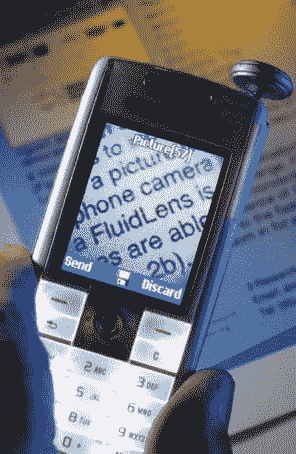
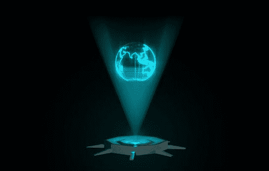

# 液体透镜和变焦系统:光子学的下一件大事就在这里

> 原文：<https://medium.datadriveninvestor.com/the-next-big-thing-in-photonics-is-here-725f31a24f6?source=collection_archive---------6----------------------->

镜头变成液体，迷人的“液体镜头”技术！！这是一项真正的技术突破，它的应用将在许多工业领域引发一场革命。

液体镜头？？

顾名思义，它们是封闭在外围固体薄膜中的充满液体的透镜结构。

*液体透镜*

这些是可调快速聚焦可变焦距液体透镜。自从大约 60 年以来，已经经历了许多可变焦距透镜的原理，液体透镜可以被认为是具有可变焦距的“无限可变”透镜，并且在不使用任何移动部件的情况下控制焦距。

为了生成液体透镜，将两种液体的混合物夹在两片透明塑料或玻璃之间。第二液体需要封装水滴并填充任何自由空间或空隙。

液体的表面轮廓决定了液体透镜系统的焦距，并最终决定了液体透镜如何聚焦光线。换句话说，通过改变液体的表面轮廓，可以调整焦距。这是通过改变液体透镜中水滴的形状和大小来实现的。

如前所述，这种液体透镜可以通过各种原理进行调节，包括

磁学-铁磁流体(响应磁场的流体)用于使用受控磁场来控制曲率。这种技术反应灵敏且准确，但有相当大的时间延迟。

电润湿-在这里，通过在透镜外壳中施加电流来控制曲率，进而控制焦点。然后，液体按照施加的电压排列。这种方法是有效的，但是分散了所开发的焦点的数量。尽管分辨率很好，但我们无法获得一组动态的实时焦点。

声学-通过改变产生的声辐射力来改变透镜的轮廓。这种方法目前正在研究中，还没有看到实际的使用案例。

此外，还有关于流变特性和纳米技术的实验，以寻找一种有效的液体透镜驱动方式。

在所有讨论的技术中，只有电润湿原理在实际应用中最常见。

液体透镜能做的惊人的发人深省的事情

实时变焦:-紧凑的设置，实现清晰的光学变焦，没有任何时间延迟

多维场映射:-用于多层映射和生成无缺陷数据的液体透镜

真实生活全息投影:-液体透镜允许实时变形，因此 3d 点被实时映射，从而产生动态 3d 投影

激光轨迹操作:-可调透镜可以从单个激光束产生各种图案

瞬时 3D 打印:液体透镜和空间光调制可以产生 3D 能量场，该能量场可以投射到感光聚合物中，以获得瞬时 3D 打印。

一副适合所有人的普通眼镜:—液体镜片可以利用神经递质根据我们的神经反应调整焦距。

超高速光通信:液体透镜可以处理多模式网络协议，从而提高通信速度。

医学成像:液体透镜可用于血流监测。

清单不止于此，还有更多类似生物识别、体积显示、激光加工等技术。

虽然，到今天为止，随着兴趣的增长，这项技术还处于萌芽阶段，整个光子学和光学世界将经历从固体透镜到液体透镜的范式转变。