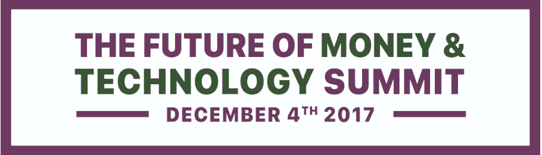
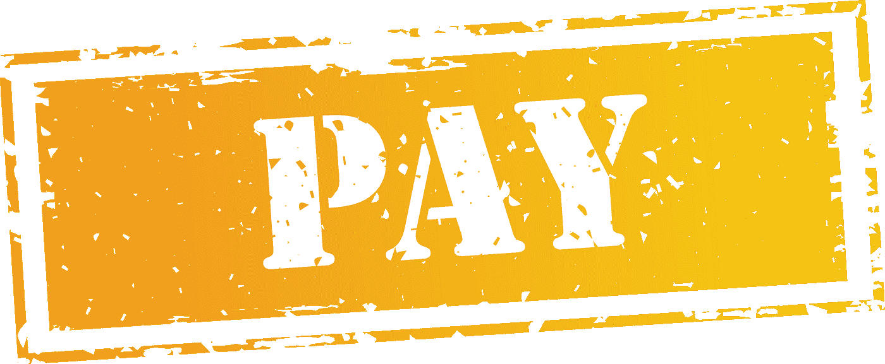
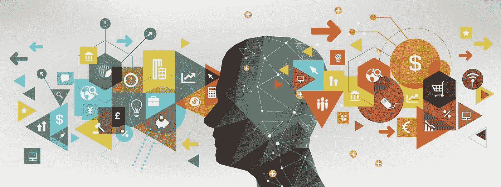
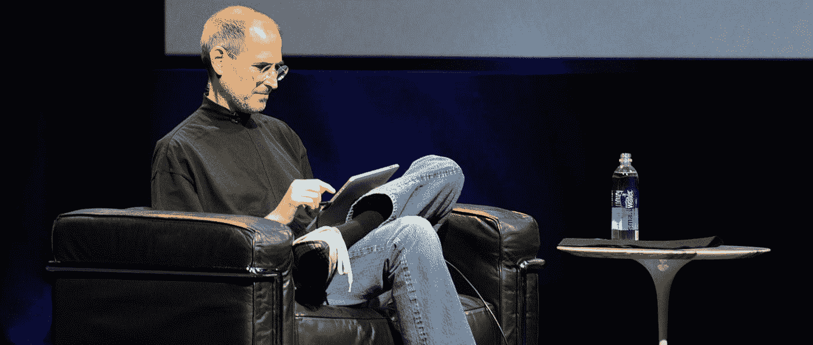
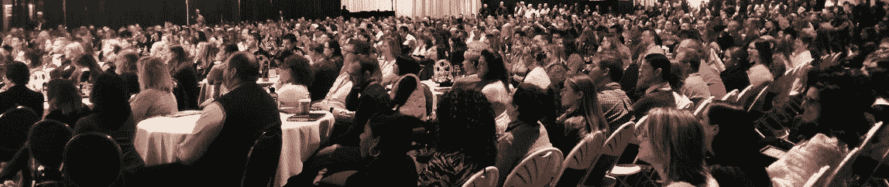

# 支付领域的下一个十年—#支付

> 原文：<https://medium.datadriveninvestor.com/the-next-decade-in-payments-pay-6a4be1782af5?source=collection_archive---------33----------------------->

去年 11 月，我在前往加州旧金山的未来金钱和技术活动之前写了一篇博客。在那篇文章中，我说我会跟进另一篇文章，详述我从这次活动中得到的关键收获——这篇文章就是后续文章。

我很久没去参加会议了，最近也没去巡回演出。通常在这样的活动中，我都在寻找那个顿悟的时刻——一个声音穿过喧嚣，对我说话，就像上帝在告诉我什么。然而，在这次活动中，我没有从我在活动中专心聆听的许多发言者那里得到那个时刻…

尽管会议上挤满了有成就的、有趣的人，他们在从事一些奇妙的项目——我没有从这些高度敏锐的人那里收集到我的时刻。

> 我的顿悟时刻来自事件本身。

我发现的事实是，尽管我试图否认和回避它，尽管我努力试图化解这些烦人的想法和否认我的责任，我有一个召唤。

虽然有很多想法和灵感，但没有一个能在足够深的层次上引起我的共鸣，促使我采取行动。相反，由于会议组织者 Brian Zisk 的随机邀请，会议本身激励我响应自己的号召，组织了一个全新的会议系列，专注于支付行业。

很长一段时间以来，我一直在悄悄地考虑这个想法，但与此同时，我自己也在否认和抵制这个想法。我曾私下和几个参加过我之前的社交移动支付会议的业内朋友讨论过这个问题。我内心很矛盾，但是金钱的未来事件证实了我头脑中的声音。我需要做一个全新的活动，关注未来十年——2020 年及以后——的支付。

所以我在这里写了一篇博客，告诉你我的计划，并付诸行动。正如海军上将大卫·法拉格特在 1864 年莫比尔湾战役中命令的那样，“该死的鱼雷，全速前进！."我抛开所有的疑虑，开始组织一场全新的活动，计划在 2020 年春天举行。

我决定将这个新活动命名为“支付”，以反映我们现代交流方式的当代简约性，并将这个研讨会和博览会简称为“支付”。

我正在以一个全新的概念重新开始，因为我觉得我在以前的活动中关注的社交、移动和支付的融合现在不再是一个新的想法，它现在有点落后于形势了。

当我在 2011 年组织第一次社交移动支付活动时，这个概念是未来的，现在它被接受为现实，并成为我们日常生活中的主要纤维。SMP 会议关注的是一个面向未来，但非常小众的市场，但并不包括整个行业。

这一即将到来的新活动将包罗万象，涉及更广泛的主题，涵盖支付行业的所有组织。我们还将深入探讨在我们过渡到地球上的下一个十年时，影响金融科技发展的辅助技术。金融科技正在给传统金融机构和服务结构带来冲击波。新的能力和新的货币正在颠覆传统上不动且非常保守的行业。

从 2010 年到 2020 年的十年带来了巨大的变化，我们热情地拥抱移动，一刻也不离开我们的智能手机。然而，下一个十年拥有巨大的可能性；向美国承诺的极速 5G 网络、沉浸式环境计算和越来越多的游牧人口将带来一个全新的社会。

回头看看你在 2010 年使用的手机和电脑，并与我们今天的情况进行比较。2010 年，我带着一部黑莓 Curve 3310，有一台运行 Windows 7 的超大台式电脑。当年 1 月，史蒂夫·乔布斯推出了第一款 iPad，3G 网络成为美国的标准。这种对今天的回顾和比较让我们看到了下一个十年将会带来怎样不可思议的变化和指数增长。

组织这样的活动需要相当多的准备时间，所以我现在就开始。我正在组织将于 2020 年春天在佛罗里达州迈阿密举行的会议，

我已经开始为这个必须参加的活动从一些奇妙的目的地征求建议，并将很快宣布演出日期和地点。我想给行业时间来了解和参与这一事件。我扩大了展会的关注范围，将支付市场各个领域的所有参与者都包括在内。

我们不仅会讨论创新，还会解决当前市场上普遍存在的问题。我们将在机构和他们的破坏者之间进行点对点的讨论。在我们讨论未来十年的金融前景时，我们将听到创新者和在职者的发言。如果你或你的组织想参加这次活动，我欢迎你们所有人。我将召集一群人作为组织演讲者、议程、讨论主题以及活动本身的顾问。

我正在寻找演讲者、赞助商和支持者来参加这次活动。我将在即将发布的新闻稿中发出征稿通知，宣布并详细介绍这场演出。我希望每个人都参与到这个活动中来。我们将举办一个颁奖典礼，表彰那些努力让我们的世界变得更美好的最优秀、最聪明的人和公司。

有很多事情要做，但是我分配了大量的时间来完成这些和其他许多目标。如果你想参加这次活动，请随时直接联系我。我期待着了解你的见解，并有你的参与。