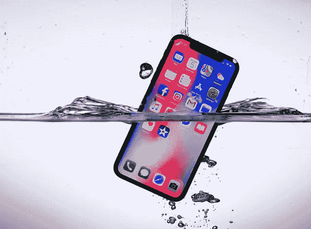

# 下一代 iPhone 可能会失败，但苹果仍将是赢家。

> 原文：<https://medium.datadriveninvestor.com/the-next-iphone-might-flop-but-apple-will-still-be-winning-ac3198dfa2d0?source=collection_archive---------7----------------------->

Source: [Kārlis Dambrāns](https://www.flickr.com/photos/janitors/) via Flickr

iPhone 可能是有史以来最伟大的消费产品。但对苹果来说，重要的是每一部 iPhone 都是 T2 时代最伟大的消费品。

苹果陡峭的销售轨迹不仅建立在 iPhone 本身的受欢迎程度上，还建立在人们对最新热门产品的渴望上。这是史蒂夫·乔布斯剧院的发布会和世界各地苹果商店外狂热的排队之间的金线。

在过去的几年里，这条线已经磨损。智能手机的普及率达到了历史最高水平。新产品中的创新虽然在技术上令人印象深刻，但并没有推动多少用户升级。

这就是为什么蒂姆·库克如此高兴地吹嘘 iPhone X 是 2018 年前两个季度[中](https://qz.com/1267365/apple-earnings-q2-2018-the-iphone-x-is-apples-most-popular-phone/)[最受欢迎的智能手机](http://uk.businessinsider.com/apple-iphone-x-sales-estimated-to-beat-all-smartphones-in-q1-2018-chart-2018-6?r=US&IR=T)。

最受欢迎的，就是那些买了新手机的人。问题是购买新手机的人越来越少。一个消息来源显示，在过去的五年里，iPhone 的销售增长率平均在 12%左右；[2017 年仅为 2%，](https://www.statista.com/statistics/276306/global-apple-iphone-sales-since-fiscal-year-2007/)这一趋势似乎将在今年继续。

## 有旧有新

这就是为什么大约 40%的英国 iPhone 用户和大约三分之一的美国用户拥有 2016 年之前推出的 iPhone。最受欢迎的型号是 iPhone 7，这是一款两年前的产品。在英国，使用 2013 年发布的 iPhone(5S)的人比使用 iPhone 8 的人多。

现在，苹果公司认为，他们庞大的“安装基础”为未来的升级提供了丰富的选择，这很有道理。一旦你使用 iPhone，你就被它迷住了。即使无边框屏幕和 FaceID 不会吸引不太懂技术的人转而使用，电池故障和破裂的屏幕最终也会完成这项工作。

一个学派认为 iPhone 的更新周期已经稳定下来了。人们会在上一部手机使用 2-3 年后继续购买新手机。我们可能看不到去年的巨大增长率，但它仍然是一个稳定、可靠、利润丰厚的行业。

事实上，通过说服我们为他们的顶级设备支付一大笔钱，苹果已经成功地将低增长的一年变成了财务上的一个大灾难。1000 美元的 iPhone X 在 2017 年最后一个季度将售出的 iPhone 平均价格推高了近 200 美元，今年略有回落。

## 从 iPhone 到 iPhone

但是，当围绕 iPhone 的噪音集中在 X 上，其技术奇迹和令人瞠目的价格标签，苹果正在悄悄地建立一个新的手机战略，隐藏在众目睽睽之下。

虽然游戏的目标总是提供市场上最好的手机，但苹果同时也开始做一些激进的事情:出售旧手机。

目前，这家库比蒂诺的巨头正在销售从 iPhone X 到 6S 和 SE 的所有产品。使用他们自己的比较工具，他们邀请客户为 X 多付 500 多英镑，而 6S 却有很多相同的功能。对于更快的芯片，更好的电池寿命和 Animojis 来说，这是一个巨大的溢价。

对于以只销售一款手机而自豪的苹果公司来说，这是一件大事。这意味着他们现在提供全系列的手机，其产品和定价体系允许客户根据自己的需求和愿望进行自我选择。

iPhone 不再是一个产品。这是一个类别。

这是一个生态系统，iOS 软件平台和应用商店与最新的硬件一样重要。大家还是想要 iPhone。他们只是不需要最新版本。

这是苹果大谈其[服务增长](https://qz.com/1267365/apple-earnings-q2-2018-the-iphone-x-is-apples-most-popular-phone/)的原因之一，无论是 iTunes、Apple Pay 还是 App Store。这是他们新的驱动力，将推动该公司向前发展，即使其旗舰产品开始停滞不前。

## 触发器

这就是为什么，在围绕苹果重大产品发布会的所有不可避免的喧嚣中，本周 iPhone 的成败可能并不那么重要。因为它不会成为苹果命运所系的*和*产品，而只是一长串待售 iPhones 中的顶级产品。

是的，蒂姆·库克会竭尽全力说服我们选择旗舰机型。期待 Jony Ive memojis galore。

但是，即使投资者对高昂的价格感到惊讶，或者对升级他们老化的硬件三思而行，苹果的故事可能仍然是一个快乐的故事。只要我们坚持使用 iPhone — *任何一款*iPhone——我们就是苹果大家庭的一员。作为一个南方人，蒂姆·库克知道家庭越大，烧烤越好。